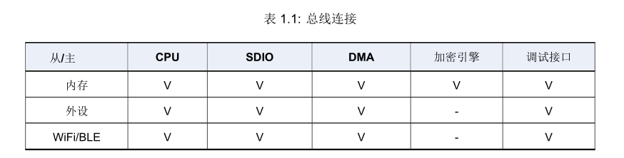
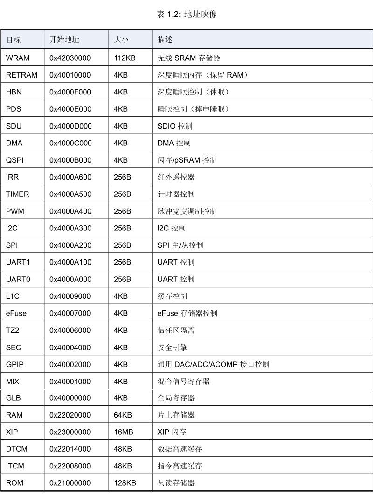
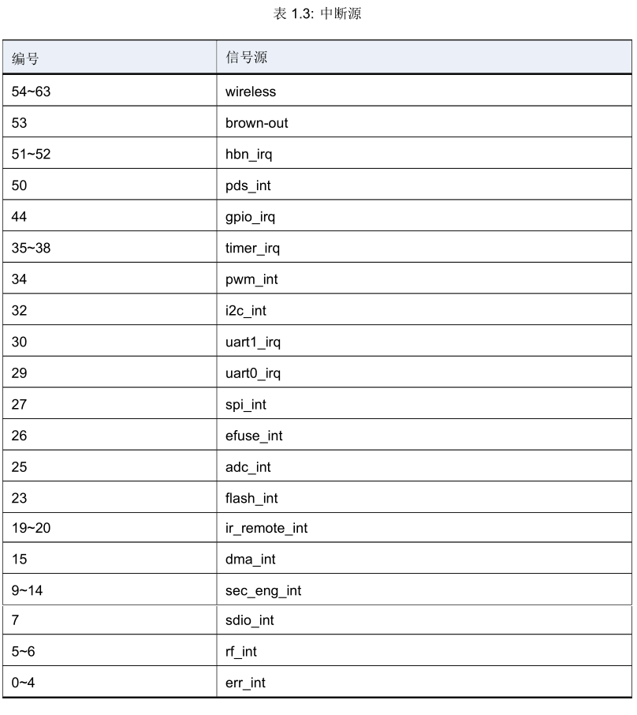
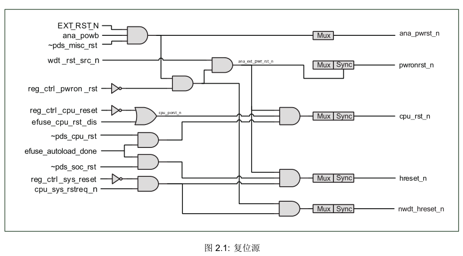
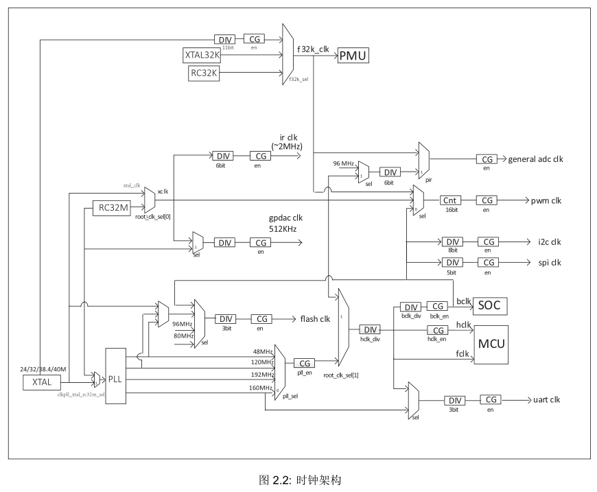

 BL602/BL604参考手册 

 From SZDOIT

## 1. 系统和存储器概述

### 1.1 简介

​		芯片内处理器采用 RISC-V 32-bit 带浮点。搭配高速处理内存系统 (详见 L1C 章节)，达到优质的运算效率。处理器外部为多层 32-bit AHB 架构，具有低功耗、低延迟、高弹性的特性。内存的部分包含高速紧耦合内存以及缓存和系统共享内存。片外存储器支持 Flash 扩充。

### 1.2 主要特征

• RISV-V 32-bit 带浮点

• 多层 32-bit AHB 总线架构

• 96KB 高速内存

• 180KB 系统内存

• 128KB 只读内存

• 片外存储器 Flash

### 1.3 功能描述

​		BL602总线连接与地址访问总结如下。总线主包括CPU,SDIO,DMA,加密引擎,调试接口。总线从包括内存,外设,WiFi/BLE。除了加密引擎只能访问内存外，其余总线主皆可访问所有总线从。

​		地址访问主要以 [27:24] 来区分” 存储” 或” 外设”，可忽略 [31:28]。内存空间是连续的 X2008000~X204BFFF (272KBSRAM)，只读内存 X1000000，深度睡眠内存 X0010000。片外空间是 X3000000 (最大支持 16MB Flash)。外设空间是 X0000000~X000F000。

中断源共 64 个，列举如下，电平或边沿触发由 CPU 配置，可屏蔽使用。

## 2. 复位和时钟

### 2.1 简介

​		芯片内部包含的复位源：硬件重置，看门狗重置，软件复位。芯片内包含多个时钟源：XTAL，PLL，RC。搭配分频等配置送至各模块。

### 2.2 复位源

复位源包含:
• 硬件重置: 通过管脚进行重置
– 管脚最大重置（PAD_EXT_RST = 1-> 0）：所有逻辑都会进行重置，返回初始状态
– 管脚电源重置（CHIP_EN = 0-> 1）：类似电源管理重置
– 电源管理重置：芯片从断电中复电，HBN 逻辑将芯片系统进行重置
• 看门狗重置
– 当看门狗报警触发重置信号号，重置管理单元将在必要准备后，重置芯片系统，看门狗内部逻辑会记录看门狗重置的状态
• 软件复位: 通过软件设置寄存器进行局部或局部复位
– 软件初始重置（reg_ctrl_pwron_rst）：通过软件触发此寄存器的上升沿，进行芯片系统重置
– 软件 CPU 复位（reg_ctrl_cpu_reset）：通过软件触发此寄存器的上升沿，进行 CPU 部分系统复位
– 软件系统复位（reg_ctrl_sys_reset）：通过软件触发此寄存器的上升沿，保留必要的逻辑处理如电源管理单元，进行芯片部分系统复位
– 软件模块复位：根据特定模块的需求，设置软件复位

### 2.3 时钟源

时钟源包含：
• XTAL ：外部晶振时钟，视系统需求频率可选 24、32、38.4、40MHz
• XTAL32K：外部晶振时钟，频率 32KHz
• RC32K ：RC 振荡器时钟，频率 32KHz，提供校准
• RC32M ：RC 振荡器时钟，频率 32MHz，提供校准
• PLL ：锁相回路时钟，内部系统高速时钟，最高频率支持 160MHz
		时钟控制单元将来自振荡器的时钟分配给内核和外围设备。可通过选择系统时钟源，动态分频器，时钟配置，睡眠使用 32KHz 时钟，以达到低功耗时钟管理。

​		外围设备时钟包括: Flash、UART、I2C、SPI、PWM、IR-remote、ADC、DAC

更多详细资料，请查阅：https://pan.baidu.com/s/1FbLGDo58mGEbqCdhmMLDxg 
提取码：doit 

## 支持与服务

| 四博智联资源                                        |                                                              |
| --------------------------------------------------- | ------------------------------------------------------------ |
| 官网                                                | [www.doit.am](http://www.doit.am/)                           |
| 教材                                                | [ESPDuino智慧物联开发宝典](https://item.taobao.com/item.htm?spm=a1z10.3-c.w4002-7420449993.9.Bgp1Ll&id=520583000610) |
| 购买                                                | [官方淘宝店](https://szdoit.taobao.com/)(szdoit.am)          |
| 讨论                                                | [技术论坛](http://bbs.doit.am/forum.php)(bbs.doit.am)        |
| 应用案例集锦                                        |                                                              |
| [Doit玩家云](http://wechat.doit.am)(wechat.doit.am) | [免费TCP公网调试服务](http://tcp.doit.am)(tcp.doit.am)       |
| 官方技术支持QQ群1/2/3群已满                         |                                                              |
| 技术支持群4                                         | 278888904                                                    |
| 技术支持群5                                         | 278888905                                                    |
| 术支持群6                                           | 278888906                                                    |
| 技术支持群7                                         | 278888907                                                    |
| 技术支持群8                                         | 278888908                                                    |
| 技术支持群9                                         | 278888909                                                    |
| 技术支持群10                                        | 278888900                                                    |