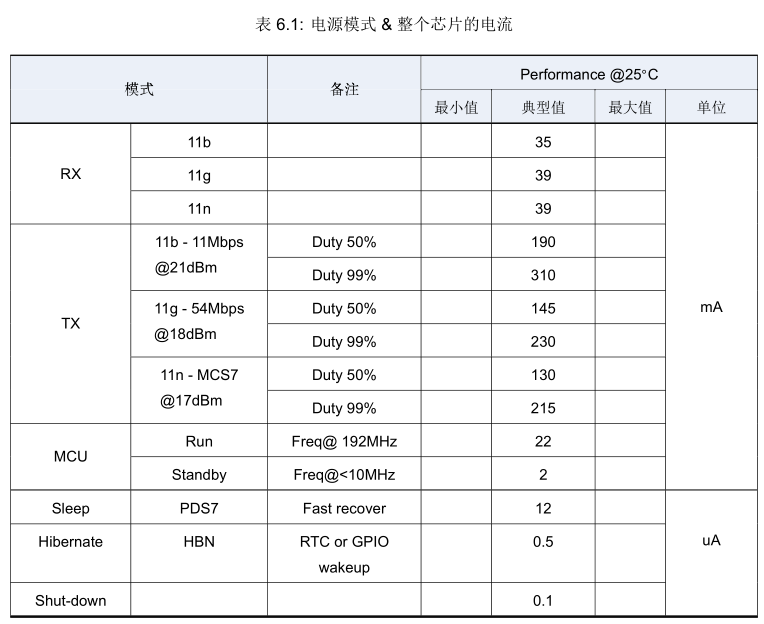

 BL602/BL604数据数据手册 

 From SZDOIT

## 1 概述

BL602/BL604 是一款 Wi-Fi + BLE 组合的芯片组，用于低功耗和高性能应用开发。

无线子系统包含 2.4G 无线电，Wi-Fi 802.11b/g/n 和 BLE 5.0 基带/MAC 设计。微控制器子系统包含一个低功耗的 32位 RISC CPU，高速缓存和存储器。电源管理单元控制低功耗模式。此外，还支持各种安全性能。

外围接口包括 SDIO，SPI，UART，I2C，IR remote，PWM，ADC，DAC，PIR 和 GPIO。

### 1.1 无线

• 2.4GHz 射频收发器

• Wi-Fi802.11 b/g/n

• Bluetooth® 低能耗 5.0

支持 BLE 5.0 通道选择＃ 2

不支持 2M PHY /编码 PHY / ADV 扩展

• Wi-Fi 20MHz 带宽

• Wi-Fi 安全 WPS/WEP/WPA/WPA2 Personal/WPA2 Enterprise/WPA3

• STA，SoftAP 和嗅探器模式

• 支持多个云连接

• BLE 协助实现 Wi-Fi 快速连接

• Wi-Fi 和 BLE 共存

• 集成 balun，PA/LNA

### 1.2 MCU 子系统

• 带 FPU（浮点单元）的 32 位 RISC CPU

• 一级缓存

• 一个 RTC 计时器一年更新

• 两个 32 位通用定时器

• 四个 DMA 通道

• DFS（动态频率缩放）从 1MHz 到 192MHz

• JTAG 开发支持

• XIP QSPI Flash 具有硬件加密支持

### 1.3 内存

• 276KB RAM

• 128KB ROM

• 1Kb eFuse

• 嵌入式 Flash 闪存 (选配)

### 1.4 安全机制

• 安全启动

• 安全调试端口

• QSPI Flash 即时 AES 解密（OTFAD）- AES - 128，CTR 模式

• 支持 AES 128/192/256 位加密引擎

• 支持 SHA-1/224/256

• 真实随机数发生器 (TRNG)

• 公钥加速器 (PKA)

### 1.5 外设

• 一个 SDIO2.0 从

• 一个 SPI 主/从

• 两个 UART

• 一个 I2C 主/从

• 五个 PWM 通道

• 10-bit 通用 DAC

• 12-bit 通用 ADC

• 两个通用模拟比较器（ACOMP）

• PIR（被动红外）检测

• IR 远程硬件加速器

• 16 或 23 个 GPIO

### 1.6 电源管理模式

• 关闭

• 休眠（灵活模式）

• 掉电睡眠（灵活模式）

• 正常运作

### 1.7 时钟架构

• 支持外部晶振频率 24/32/38.4/40/MHz

• 内部 RC 32KHz 振荡器

• 内部 RC 32MHz 振荡器

• 内部系统 PLL

## 2 功能描述

BL602/BL604 主要功能描述如下:

### 2.1 CPU

BL602/BL604 32-bit RISC CPU 包含用于 32 位单精度算术的 FPU（浮点单元），三级流水线（IF，EXE，WB），压缩的 16 位和 32 位指令集，包含 4 个硬件可编程断点的标准 JTAG 调试器端口，包含 64 个中断和 16 个中断级别/优先级的中断控制器，用于低延迟中断处理。时钟频率高达 192MHz，可以动态配置用来更改时钟频率，进入省电模式以实现低功耗。

WiFi/BLE 堆栈和应用程序均在单个 32-bit RISC CPU 上运行，用来实现简单和超低功耗的应用程序。CPU 性能约 1.46DMIPS / MHz；3.1 CoreMark / MHz。

### 2.2 缓存

BL602/BL604 的缓存提高了 CPU 访问外部存储器的效能。高速缓存可以部分或全部配置为 TCM（紧密耦合内存）。

### 2.3 内存

BL602/BL604 存储器包括：片上零延迟 SRAM 存储器，只读存储器，一次写入存储器，嵌入式闪存（可选）。

### 2.4 DMA 控制器

BL602/BL604 DMA（直接存储器访问）控制器具有四个专用通道，用于管理外设和存储器之间的数据传输，以提高CPU /总线效率。DMA 有三种主要的传输类型，内存到内存，内存到外设以及外设到内存三种模式。DMA 还支持 LLI（链接列表项）功能，该链表由一系列链接列表预定义了多个传输，然后硬件会根据每个 LLI 的大小和地址自动完成所有传输。

DMA 支持的外设包括 UART，I2C，SPI，ADC 和 DAC。

### 2.5 总线结构

BL602/BL604 总线连接与地址访问总结如下：

### 2.6 中断

BL602/BL604 支持内部 RTC 时钟唤醒、外部中断唤醒，以达到低功耗睡眠唤醒机制。

CPU 中断控制器支持堆栈或嵌套、可选电平或脉冲、高或低电平有效。

### 2.7 启动选项

BL602/BL604 支持多种启动，可选择从 UART、SDIO、Flash 闪存。

### 2.8 电源管理单元

电源管理单元（PMU）管理整个芯片的电源，可分为运行、空闲、睡眠和休眠电源模式。软件可配置进入睡眠模式时，通过 RTC 定时器或 EINT 来唤醒，以达到低功耗电源管理。

掉电睡眠模式非常灵活，可以使应用配置为最低功耗。

### 2.9 时钟架构

时钟控制单元为核心 MCU 和外围 SOC 设备生成时钟。时钟源可以是 XTAL，PLL 或 RC 振荡器。通过适当的配置（例如 sel，div，en 等）来动态节省功耗。PMU 以 32KHz 时钟运行，使系统在睡眠模式下保持低功耗。

### 2.10 外设

外设包括 SDIO，SPI，UART，I2C，IR 远程，PWM，ADC，DAC，PIR。可以通过灵活的配置将每个外设分配给不同的 GPIO 组。每个 GPIO 都可用作通用输入和输出功能。

## 3 管脚定义QFN32

BL602 32-pin 封装包括固定电源接口 10 个、固定模拟接口 6 个、以及富含弹性的 GPIO 接口 16 个供应用选择。

## 4 管脚定义QFN40

BL604 40-pin 封装包括固定电源接口 10 个、固定模拟接口 6 个、固定外部复位接口 1 个、以及富含弹性的 GPIO 接口 23 个供应用选择。

## 5 射频特性

射频接收和传输模式的特性，如下表所示：

## 6 功耗

每个电源模式的功耗，如下表所示：

## 7 电气特性

### 7.1 绝对最大额定值

### 7.2 运行条件

## 8 参考设计

## 9 封装信息QFN32

## 10 封装信息QFN40

## 11 标志定义

## 12 订购信息

## 更多资源，请关注公众号！

|      |      |
| ---- | ---- |
|      |      |
|      |      |
|      |      |
|      |      |
|      |      |
|      |      |
|      |      |
|      |      |
|      |      |
|      |      |
|      |      |
|      |      |
|      |      |
|      |      |