
 32路舵机控制板使用说明 

 From SZDOIT

## 1  硬件使用

### 1.1 产品外观

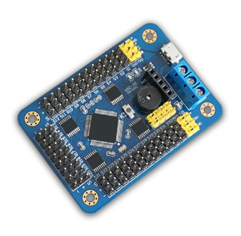

### 1.2 使用说明

​		本模块电源部分是分离设计的，控制板电源和舵机电源是分开供电的，这样不会相互干扰。

​		模块要正常控制舵机，两个电源都要供电才行。

​		供电接在上图中蓝色的接线柱里面（拧松螺丝，将导线放进去，然后拧紧螺丝即可），蓝色接线柱旁边或者背面有标记 VS、GND、VSS，注意不要接错。

a） 控制板芯片电源 VSS
		USB 接口和蓝色端子中的 VSS 和 GND 都可以给控制板供电，两者任选一种即可。（VSS 的供电范围是 6.5-12V）

b） 舵机电源 VS
		舵机的供电情况是根据使用的舵机而定，可以查阅舵机的相关参数，若你不了解，可以使用5V 供电。

​		VS 输入多少付电压，提供给舵机的就是多少付的电压，所以必须严格匹配舵机的电压参数

舵机电源输入接口为蓝色接线端子中的 VS 和 GND。

（控制板电源和舵机电源中的 GND 是共用的）

只要供电电压满足要求，可以用一个电池给 VSS 和 VS 同时供电。

常规舵机的电压参数

MG995、MG996 供电电压为 4.8-6.8V

TR213、TR223、1501MG 供电电压为 4.8-7V

TR227 供电电压 4.8-7.2V

未知舵机，请给 5V 或者 6V 供电（标准舵机 95%都可以用 5V 供电）

如果供电电压超过舵机的范围，有可能造成舵机烧坏，或者烧坏舵机控制板。请用户谨慎操作，查看舵机的相关参数。

舵机电源的其他说明请看倒数第二页。

### 1.3 安装驱动

驱动下载地址：http://dl.torobot.com/down/CH341SER.EXE

下载驱动，然后安装，可以先下载新的驱动，然后安装，如果电脑设备管理器没有正确显示端口号，可以安装老驱动试试。

最新的控制板，安装最新的驱动，显示的设备名称如下，USB-SERIAL CH340（COM11）。

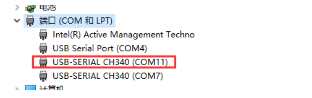

### 1.3  连接舵机

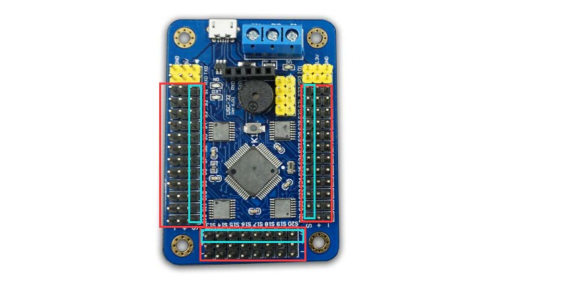

图中红色框的区域是连接舵机的，天蓝色框是信号线接口(连接舵机的时候要注意方向)

连上舵机的时候注意旁边的白色的文字标记，如 S1、S2…..代表舵机的通道，跟电脑软件上是一一对应。

### 1.4 下载和使用软件

下载网址：http://dl.torobot.com/down/ROBOIDE.exe（仅适用于上图中的舵机控制板，不支持其他版本的控制板）

软件下载之后，关于软件的使用部分的说明书，你打开软件之后，点击软件上方的菜单---帮助---帮助。

### 1.5 控制板的其他接口说明

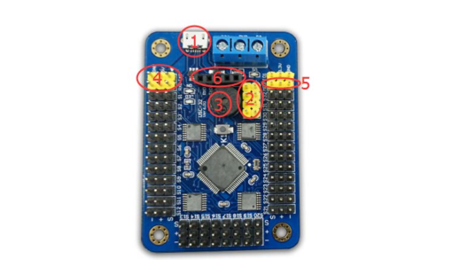

红色圈 1： USB 数据线接口，电脑调试接口
红色圈 2：PS2 手柄接收器接口（具体说明请看 PS2 的说明书）
红色圈 3：蜂鸣器，当舵机 VS 电源供电不足的时候，会报警。
红色圈 4：串口 1，外接单片机接口
红色圈 5：MP3 扩展接口
红色圈 6：串口 2，外接单片机或者外接无线模块接口，（32 路舵机控制板中的6 与 4 是独立的两路串口）

### 1.6 外接单片机开发，或者自己开发上位机软件

​		舵机控制板是一个辅助设备，只能接受命令，或者执行事先设置好的命令，不可能具有思维能力，无法对其编程，只能作为一个驱动板。
​		与外部的通讯协议：串口通讯（TTL 电平）、波特率 9600（默认 9600，可以通过 PC 软件设置其他的波特率）、无校验位、8 位数据位、1 位停止位。

舵机控制板在执行动作组命令的过程中，无法接受除停止命令（#STOP\r\n）之外的任何命令。

如果您设置了脱机命令，那么也是在执行动作组，那么这个过程中舵机控制板也无法接受其他命令。

具体的命令如下：（待完善）

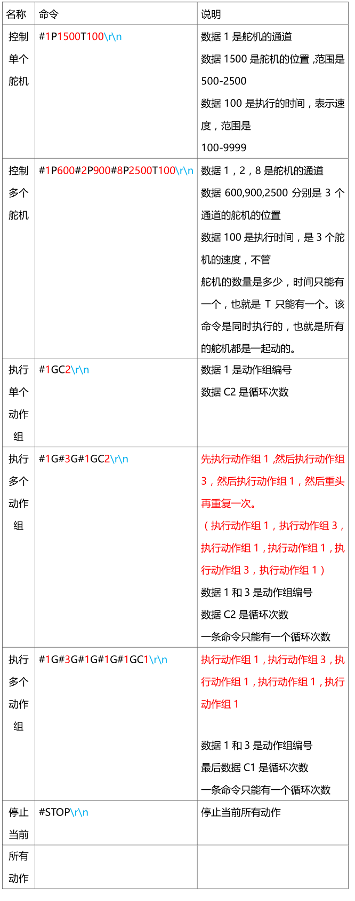

以上命令都有一个共同点，都有\r\n，这个是命令的结束符，必须得有。另外所有命令中都不含空格

如果您需要用串口调试助手来控制舵机控制板，或者您需要自己开发电脑软件，那么请您仔细阅读“如何使用串口调试助手给舵机控制板发指令.pdf” 和 “自己开发电脑软件.pdf”（下载：http://dl.torobot.com/down/ROBOIDE.zip 这个完整的资料包，里面有上述资料。）

### 1.7 与单片机连接

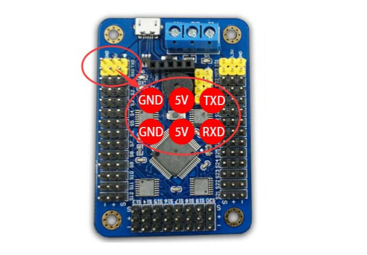

上图中的接口是接单片机的。
跟外部单片机连接只需要接 RXD、TXD、GND 就行了，上图中标记的 5V 是输入脚，不建议做 5V 输出使用（会不稳定，或者容易烧坏控制板）舵机控制板-------外部单片机

RXD-----------------TXD
TXD-----------------RXD
GND----------------GND

### 1.8 舵机控制板相关问题总结

- 舵机控制板的蜂鸣器
  蜂鸣器，只有在舵机控制板刚启动或者舵机未供电或者供电不足的时候才会叫。由于舵机需要很大的电流，如果舵机电源不好，舵机动的瞬间，会引起电源电压就会降低很多，这个时候蜂鸣器就会叫，提示供电不足。
  如果你觉得蜂鸣器很吵，你可以通过以下方式取消：打开 PC 端软件，上方菜单，设置，设置，然后去掉“蜂鸣器低压报警”前面的勾，如果你发现并没有勾选，那么就先进行勾选，然后在去掉勾选。
  提示：电源供电不足，会引起舵机乱动，或者舵机不受控。（常识：供电不足是说电流不够，不是电压不够，电流是用多少取多少，即便你给 100A 的电流，他用1A，就会取 1A，不会多取，它会控制食量，只会饿死，不会撑死。）
  供电不足的检查方法：可以用万用表测控制板上的蓝色的接线端子的 VS 和 GND的电压值，测量舵机运动的瞬间电压值，如果瞬间电压会下降很多，低于舵机正常的供电范围，那就是说明你的电源或者电池不行。

- 动作组之间或者每条命令之间，可以设置延时吗？
  首先你需要了解每一条命令后面都有一个时间 T，T 就表示时间，那么重复上一条命令，是不是可以理解为等待呢？没错，你非常聪明，重复上一条命令，舵机不会动，但是时间却在走，所以可以理解这就是延时。（在后期的升级中，将会新增一条专门用来延时的命令）

- 设置机器人的初始动作
  舵机控制板刚打开电源的瞬间，机器人可能会乱动，这个可能是舵机上电复位引起的，也可能舵机控制板上电瞬间输出的信号不稳定造成的，用户可以设置脱机动作来给机器人设置一个初始动作组。首先，在电脑上下载一个简单的动作组（机器人的一个初始状态），然后设置该动作组为脱机执行，设置之后，每次控制板打开电源开关的时候，就会执行这个动作，如果你设置的是机器人站立的姿势，那么机器人打开电源开关的时候，就会先站立。

- 舵机电源的一些说明
  正常使用舵机是需要大功率的电源，一个 13KG.CM 扭力的金属舵机，空载的时候所需要的电流几乎为 0，但是满载的时候电流可能高达 3A。如果一个机器人安装有 10 个这样的舵机，则需要一个能够输出 5A 左右电流的电源，才可以保证每一个舵机都可以工作，当然了如果要每一个舵机都要满载工作，那么 5A 也是远远不够的。

## 2 软件使用

### 2.1 调整软件界面中舵机的布局

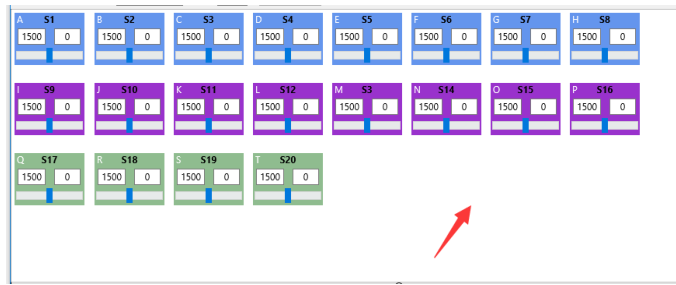

在软件中间空白处，双击电脑鼠标，之后空白处的颜色会变成彩色，同时会出现 32个舵机的勾选框。

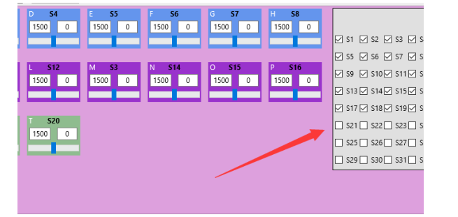

当背景变色之后，就可以移动舵机的位置了，软件右侧的勾选可以显示或者隐藏对应的舵机。

调整好了之后，同样双击 空白处 就会退出编辑模式。

右键菜单中有几个常用的布局

右键菜单说明：

设置为参考状态：就是将目前调试好的状态，设置为一个参考状态（普通用户用不到，详情看第 15 条说明）

恢复到参考状态：就是恢复到之前设置好的参考状态

### 2.2 文件关联

软件上方菜单-帮助-关联，关联操作之后，用户可以直接双击打开软件编辑好的机器人动作文件（.tox 文件），而不需要先打开软件，再打开文件。

该操作需要计算机管理员权限，请右键以管理员身份运行软件，然后再进行关联。

### 3.3 导入老版本软件的.txt 文件

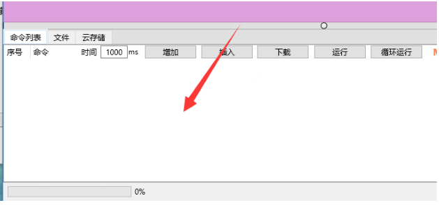

用鼠标将文件拖入到软件下方的列表中即可（必须为完整值的动作组文件，不支持相对值的动作组文件）（拖拽在部分电脑上可能无法使用，请用下一种方式）或者，软件上方菜单---文件---打开—选择文件（右下角选择 原始文件.txt）

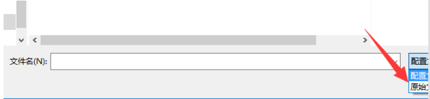

### 2.4 保存文件

软件上方，菜单，文件，保存。

会保存软件中舵机的布局，和软件下方命令列表中的所有命令。

### 2.5 编辑动作组

将舵机接在控制板上，然后给控制板接好舵机电源（舵机电源必须另外接，USB 无法给舵机供电）
（舵机三根线，橘黄色的是信号线，朝控制板的内部，褐色的地线，朝控制板外面）

（舵机电源的电压问题，这个请您查看您自己舵机的参数，每一种舵机都是不一样的，不能忽视这个问题，供电问题后果很严重。）

然后打开电脑软件-选择对应的 COM 口，如果是 USB 接口，波特率可以任意，然后联机。

然后拖动对应脱机的滑条

（这个是 S1 号舵机，电路板上有标记）
将舵机调整到您自己想要的位置，然后在软件下方设置对应的时间

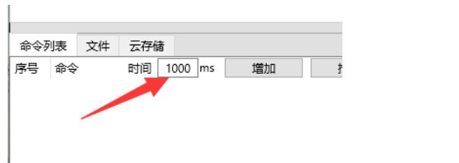

然后点击旁边的“增加”，就是将该状态生成一条命令，插入到命令列表的最后一行。（一条命令类似一副“图片”，而动画是很多图片，按照设置的时间一张一张的播放，才会有动画效果，这个地方也是一样，一条一条命令，按照你设置的时间，一条一条的运行，就会形成一个连贯的动作。）

以上是调整了一个舵机的位置，如果你需要调整很多舵机，方法是一样的，您只需将所有的舵机一个一个的调整到合适的位置，然后设置时间，然后点击一次“添加”，就可以生成一条包含所有舵机位置的一条命令。

### 2.6 在线调试编号好的动作

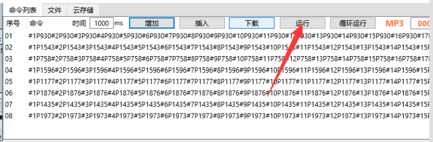

当您编辑完你想要的动作之后，您可以先在电脑上运行一下，看看你调试好的动作是否满意。如果你满意就可以下载到控制板中，或者保存到电脑上（软件上方菜单，文件，保存），如果您觉得某一行不满意，您可以选中这一行，然后再次拖动滑条调整舵机的位置，然后点击“修改”按钮，就可以修改成当前的状态。

### 2.7 下载动作组

将您增加好的很多行命令，下载到控制板中，下载包含两个意思，下载和打包。

下载就是下载到控制板中。

打包就是将很多行命令，打包成一个一个动作组。

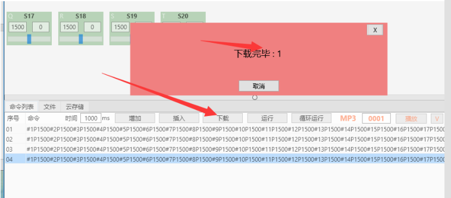

下载完了会有提示编号。下载之后，您只需知道这个编号就行，然后去执行它。

### 2.8 下载之后的文件在哪里看、及其他先关操作

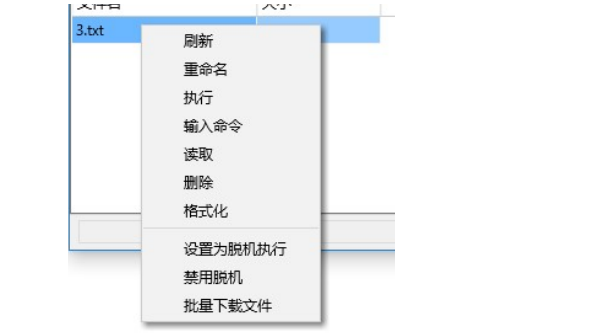

软件下方，进入 文件 页面。

然后在空白处点鼠标右键，在菜单中选择 刷新 会刷新文件列表。

刷新的时候需要等待几秒钟。

刷新也就是获得控制板内部文件的列表。

其他菜单说明：

重命名，可以修改文件的名称，文件后缀.txt 不要修改，只要修改. 号前面的数字，数字表示动作组编号。
执行，是执行这个文件里面的动作。
输入命令，可以输入其他命令，如执行多个动作组，输入#1G#2G#3GC1，这样的。
读取，可以读取文件的内容。

删除，删除文件。

格式化，就是恢复出厂设置。

设置为脱机执行，就是把这个动作组设置为脱机执行，脱机执行的意思是控制板上电之后就会执行，简单的说就是“开机执行”

禁用脱机，就是禁止前面设置的脱机执行

批量下载文件，仅批量用户可用，仅限部分控制板版本才有这种功能

### 2.9 执行下载之后的动作组

在文件列表中，选中文件，然后右键，然后选择 执行，在弹出的界面中输入执行的次数 ，范围为 1-999 次。

### 2.10 设置脱机动作组。

在文件列表中，选中文件，然后右键，然后选择 设置为脱机执行，在弹出的界面中输入执行的次数 ，范围为 1-999 次。

设置完了需要重启控制板，才会执行（因为设置的动作组是在控制板重启之后才会运行的）。

### 2.11 读取文件(仅 USB 接口连接有效)

选中文件，可以将下载进入的文件读取出来。读取需要的时间视动作组长度而定。

读取过程，右侧会一条一条的显示数据。

读取完了之后，可以

就是将读取出来的数据，在这里显示，方便再次编辑。

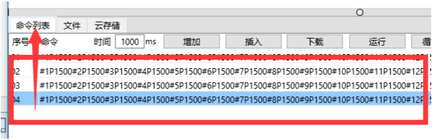

### 2.12 文件---格式化

（格式化等同于恢复出厂设置）
在文件列表中，右键—格式化，这个操作会删除下载到控制板中的所有的动作组，同时将控制板的设置恢复的出厂默认设置。

### 2.13 MP3 模块的操作。（需要连接 MP3 模块）

按照 MP3 的说明书将线接好。

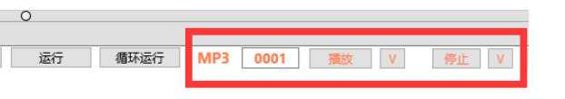

上图中 MP3 旁边的框是输入 mp3 文件名称的，必须为 4 位数的数据。（MP3 的说明书中有）

接着是播放按钮，播放右侧文件名的 mp3 文件。

接着旁边的 V 按键是将播放命令插入到命令列表的最后一行。

接着是停止按钮，是停止播放 MP3。

接着的 V 按钮是插入停止命令到命令列表中。

### 2.14 软件设置

软件上方菜单，工具，设置

延迟发送： 范围是 10-1000 单位是毫秒，意思是当你拖动软件滑条的时候，软件会延迟你设置的时间再发送命令，这个是是因为有的电脑配置比较低，拖动滑条会很灵敏，如果马上发送数据电脑可能会死机，更何况电脑跟控制板之间的通讯速度也没有那么快。

默认是 10，如果此时，当您拖动滑条的时候电脑软件反应很慢，您可以设置成更大的数值。

串口 1 波特率 设置，这个串口是 USB 旁边黄色插针的 TXD 和 RXD，设置它的波特率。

串口 2 波特率 设置，这个串口是蜂鸣器旁边黑色 5P 排母的 TXD 和 RXD，设置它的波特率。

设置页面左下方，读取所有的设置，这个按钮会读取控制板中的所有的设置。（包括手柄的命令和波特率）

### 2.15 手柄设置

软件上方菜单，工具，PS2 手柄。

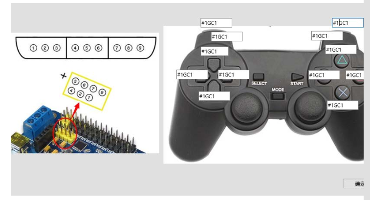

暂时只能设置 12 个按键，输入的格式为#1GC1（这个意思是执行动作组 1 执行 1次，1G 是动作组 1，C1 是执行一次）。

动作组必须为你下载到控制板之后的动作组，1G 对应的文件为 1.txt 。

### 2.16 舵机的相对运动（也就是所谓的微调）

左侧的框的数值是舵机的脉冲信号的脉冲，范围是 500 到 2500.右侧的框的数值是相对脉冲的值，范围是 -2000 到 2000 （普通用户可以忽视这个数值。）

相对值是相对于参考状态才有效的，比如将机器人完全站立的状态设置为参考状态，如果您有 N 台机器人，这 N 台机器人的参考状态都是站立，但是舵机的实际角度却不一样（安装误差），但是机器人运动的时候它的相对运动是一样的，如机器人相对运动 30 度，这个 30 度是相对的，每一台机器人都是一样的。所以您只需要只到这个相对值就行了。

相对值它的用法是方便批量用户，用法如下：

量产用户，具体操作流程如下：

1， 用一台机器人，将机器人完全站立的状态设置为参考状态，然后调试好机器人的所有舞蹈，然后将调试好的动作文件保存到电脑上，为.tox 文件格式。（此时称他为母版动作）

2， 然后将新的机器人连接电脑，然后将新的机器人调整到完全站立的状态，然后重新设置为参考状态，然后用软件打开之前调试好的机器人的动作文件（.tox 文件），然后之前调试好的动作，就可以直接用在新的机器人上了。

3， 每一台机器人在用之前的动作文件之前，都必须对新的机器人调到一模一样的参考状态，并将该状态设置为参考状态。

### 2.17 软件升级

软件会不定期的修改，或增加新功能，或修复 bug。

请用户保持自己使用的是最新的版本，软件默认会自动检测升级，用户也可以进入软件上方的菜单，帮助，升级，来手动检测升级。

### 2.18 关于软件的其他语言

软件最上方菜单，工具，语言，可以选择合适的语言。
如果用户觉得翻译不对，或者对其他语种有需求，可以联系 QQ：621849199。

### 2.19 关于意见和建议

如果您对某个功能有需求，或者发现软件存在 bug，可以联系 QQ：621849199，我们会尽量在最短的时间内添加和修复相应的 bug。

软件为通用型软件，软件上的某些功能可能在您的硬件上无法使用，此为正常现象，具体请以硬件说明为准。

批量生产：

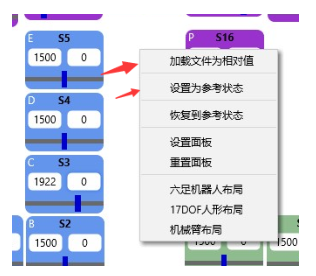

Tox 文件的用法。

用户打开 tox 文件，全部是完整的参数。

如果要在批量生产中使用 tox 文件，方法如下：

1， 打开 tox 文件。

2， 打开文件之后，调整机器人的状态，调整机器人的参考状态。然后设置参考状态（右键菜单）。

3， 然后右键，加载文件为相对值，就可以了（意思是你刚才设置了机器人的参考状态，然后重新加载文件，但是只是加载他的相对值）

## 3 MP3 模块使用说明、

### 3.1 简要说明

将 MP3 模块接到舵机控制板上，用电脑软件编辑命令，然后机器人在动作的时候就可以一边动作一边播放 MP3 音乐，或者一边动作一边自我介绍。

或者将 MP3 模块连接单片机，单片机通过串口发命令给 MP3 模块，播放指定的 MP3 文件。

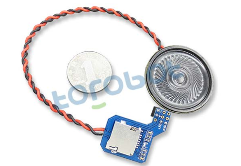

### 3.2 模块特点

1，TTL 串口通讯接口，通过串口接收命令，从而播放指定的 MP3 文件。（9600 波特率）

2，支持 FAT16、FAT32 文件系统

3，支持 MP3、WAV、WMA 文件格式

4，最大支持 32G TF 卡

### 3.3 应用范围：

1，机器人语音、自我介绍、播放音乐

2，车载语音系统

3，车站播报

### 3.4 接口说明

+ +电源正极，供电范围 5-12V
- - 电源负极

- RXD 串口接收 

- TXD 串口发送（可不接）

### 3.5 接线说明（接舵机控制板）

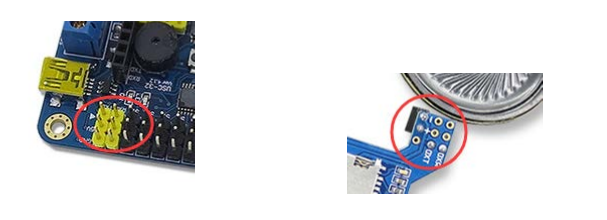

将 MP3 模块上的 + 接到舵机控制板上 S1 号舵机接口的电源正极（MP3 与舵机共用电源）

将 MP3 模块上的 - 接到舵机控制板上 S1 号舵机接口的电源负极

将 MP3 模块上的 TXD 接到舵机控制板上 S1 旁边的 RXD

将 MP3 模块上的 RXD 接到舵机控制板上 S1 旁边的 TXD

### 3.6 接单片机

将 MP3 模块上的 + 接到电源正极（范围 5-12V）

将 MP3 模块上的 – 接到电源负极

将 MP3 模块上的 TXD 接到单片机上的 RXD

将 MP3 模块上的 RXD 接到单片机上的 TXD

**串口通讯的波特率必须为 9600**

### 3.7 TF 卡说明

TF 最大支持 32G，文件格式建议为 FAT32。

TF 根目录新建名为 MP3 的文件夹

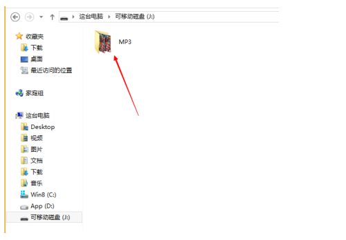

然后再 MP3 文件夹内，放置需要播放的 MP3 文件

文件名称必须为：四位数字+歌曲名

如：0001 你好

如：0002 小苹果

舵机控制板电脑软件使用说明

下载最新的电脑软件：http://dl.torobot.com/down/rios_usc.exe

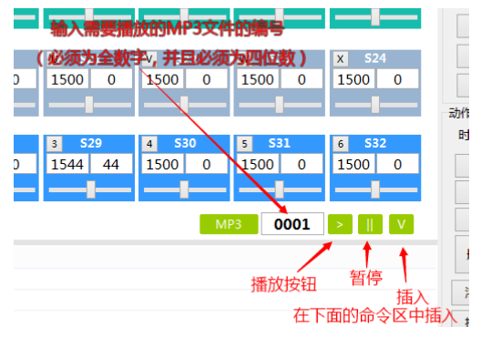

### 3.8 通讯协议说明（部分）

十六进制数命令：7E FF 06 12 00 00 01 EF

说明：红色部分的数据是变量，00 01 表示 0001 号文件

十六进制数命令：7E FF 06 12 00 00 02 EF

说明：红色部分的数据是变量，00 02 表示 0002 曲目

十六进制数命令：7E FF 06 12 00 00 FF EF

说明：红色部分的数据是变量，00 FF 表示 0255 曲目

十六进制数命令：7E FF 06 12 00 07 CF EF

说明：红色部分的数据是变量，07 CF 表示 1999 曲目（十六进制数 07CF = 1999）

十六进制数命令：7E FF 06 0E 00 00 00 EF

说明：该命令为暂停播放

## 支持与服务

| 四博智联资源                                        |                                                              |
| --------------------------------------------------- | ------------------------------------------------------------ |
| 官网                                                | [www.doit.am](http://www.doit.am/)                           |
| 教材                                                | [ESPDuino智慧物联开发宝典](https://item.taobao.com/item.htm?spm=a1z10.3-c.w4002-7420449993.9.Bgp1Ll&id=520583000610) |
| 购买                                                | [官方淘宝店](https://szdoit.taobao.com/)(szdoit.am)          |
| 讨论                                                | [技术论坛](http://bbs.doit.am/forum.php)(bbs.doit.am)        |
| 应用案例集锦                                        |                                                              |
| [Doit玩家云](http://wechat.doit.am)(wechat.doit.am) | [免费TCP公网调试服务](http://tcp.doit.am)(tcp.doit.am)       |
| 官方技术支持QQ群1/2/3群已满                         |                                                              |
| 技术支持群4                                         | 278888904                                                    |
| 技术支持群5                                         | 278888905                                                    |
| 术支持群6                                           | 278888906                                                    |
| 技术支持群7                                         | 278888907                                                    |
| 技术支持群8                                         | 278888908                                                    |
| 技术支持群9                                         | 278888909                                                    |
| 技术支持群10                                        | 278888900                                                    |