
 4电机&&16舵机控制套件使用说明 

 From SZDOIT

## 1. 简介

该控制套件采用金典的Arduino UNO R3作为控制板，驱动扩展板是我司自主研发采用 TB6612 四路驱动，PCA9685 作 16 路舵机控制。

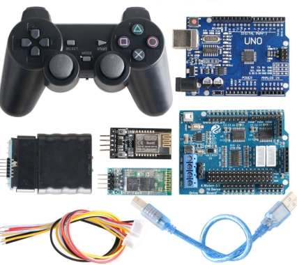 

## 2. 特点

（1）引出 Arduino UNO I/O 引脚；

（2）电源最大输入电压 15V/DC；

（3）预留蓝牙&WIFI 模块插座；

（4）预留 PS2 手柄插座；

（5）四路直流电机驱动，单路最大驱动电流 1.2A平均值/3.2A峰值；

（6）16 路舵机驱动插针，供电可通过跳线帽外部/内部供电切换；

## 3. 接线说明

特别注意：

（1）VM上电源不要超过15V

（2）共用1个电源时，（VM和VIN）和（VS和+5V）上的跳线帽要插上，电源要接在VM上

（3）在VS上为舵机供电时，（VS和+5V）上的跳线帽要取下，否则板子会烧毁

（4）在使用手柄或者WiFi或者蓝牙的时候，对应引脚插上即可

### 3.1 蓝牙接线说明

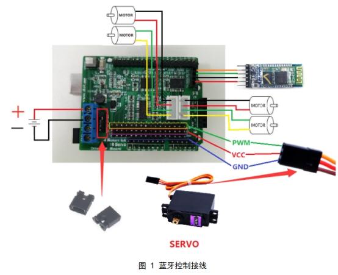 

### 3.2 WiFi接线说明

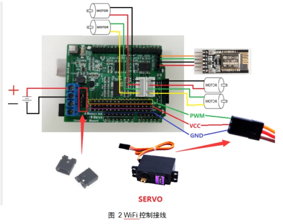 

 

### 3.2 PS2手柄接线说明

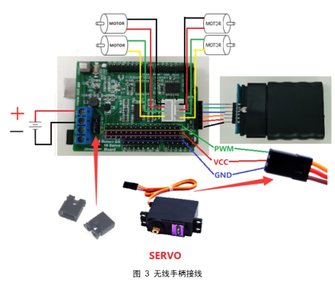 

 

## 4. 源码

WiFi和蓝牙共用一个程序，温馨提示：下载程序的时候，要把WiFi/蓝牙模块取下来，因为WiFi/蓝牙模块会占用板子的串口导致板子程序下载不成功，而下载程序之前要把程序中使用到的库文件下载下来，然后接到到arduino IDE安装目录下的libraries文件夹下，库文件下载地址：https://github.com/SmartArduino/Arduino-Third-party-Libraries

### 4.1 WiFi/蓝牙程序

### 4.2 手柄程序

## 5.使用说明

### 5.1 下载程序

具体步骤如下，步骤有完成的自行跳到下一步：

 

（1）下载安装arduino IDE软件，Arduino官网：https://www.arduino.cc/，安装流程自行百度

（2）安装CH340驱动

根据自己的系统下载对应的驱动：https://gitnova.com/#/GeneralSource/drivers

 

 

 

（3）配置库文件

打开第四节中库文件的下载地址：https://github.com/SmartArduino/Arduino-Third-party-Libraries，下载这两个库文件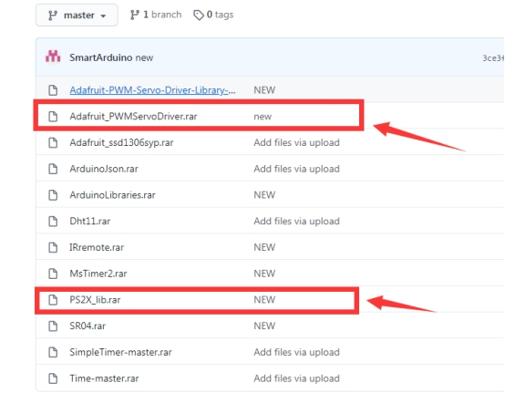

然后将其解压到libraries文件接中

 

 

 

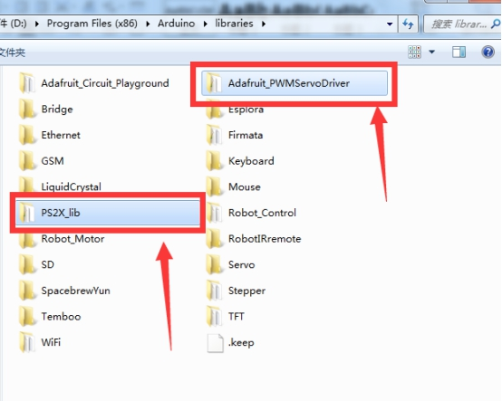 

 

（4）打开程序

在github仓库中下载：https://github.com/SmartArduino/Arduino-Code，也可以自行创建新文件夹，然后把上一节中给的源码复制过来

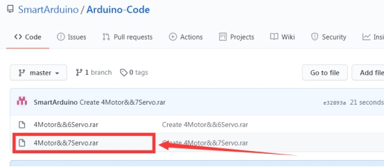 

 

 

（5）选择板子型号

 

 

（6）选择端口号

前提：使用USB线将控制板和USB连上

注：有多个串口的时候，请确保选择端口号是板子的

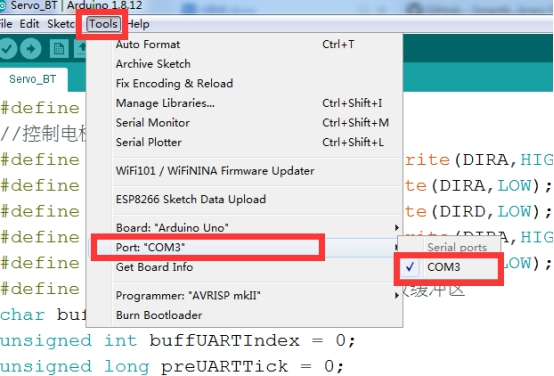 

（7）编译程序

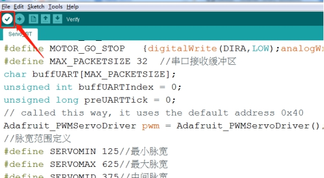 

 

编译成功，如果不成功根据报错信息进行修改

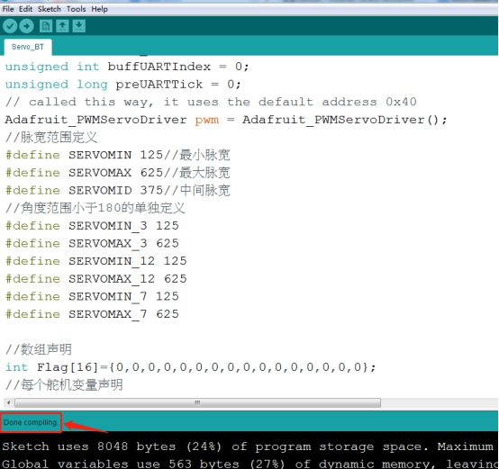 

（8）下载

如果前面编译成功，下载报错的话，先检查板子型号、端口号选对没有，然后在下载，还是不行的话，重启软件再试

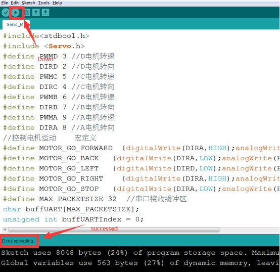 

 

 

### 5.2 操作说明

 

下载程序之后，按照接线说明接好线

注意：使用WiFi/蓝牙控制时，先安装手机app软件（只支持Android手机）：https://github.com/SmartArduino/SmartArduino.github.io/blob/master/docs/Robot/Controller/app/base.apk

#### 5.2.1 蓝牙控制说明

上电，开发手机APP

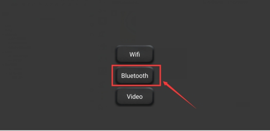 

 

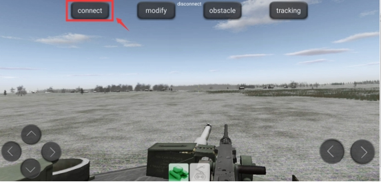 

 

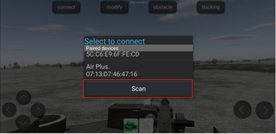 

注：图中蓝牙名称只是示例，根据自己的蓝牙选择对应的名称

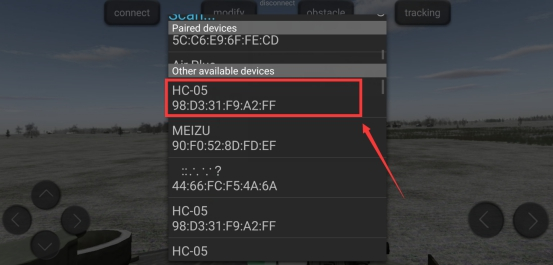 

 

 

中间这个英文字母变成ed形式表示蓝牙连接成功

 

通过点击这四个按键，控制小车前后左右运动，如果是麦克纳姆轮，要加上右下角那两个按钮，分别控制小车左漂移和右漂移

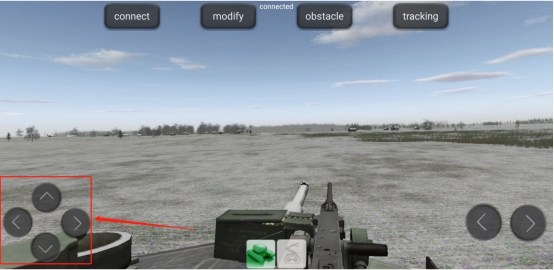 

控制舵机运动：

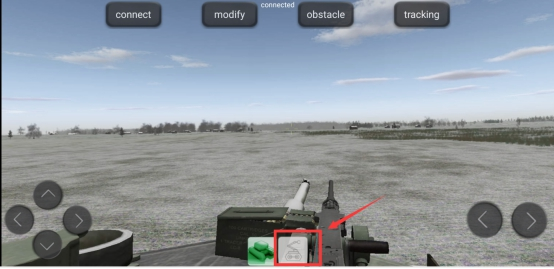 

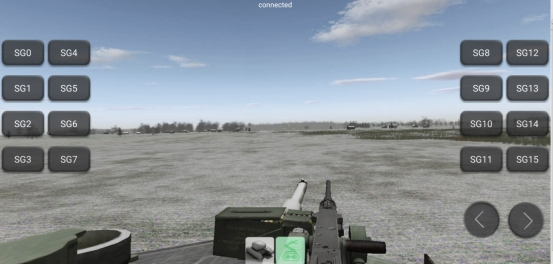 

先选中控制路数，然后点击右下角两个按钮控制舵机左右和右转

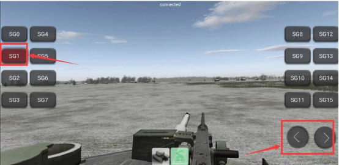 

注意：这里的路数SG0~SG15对应板子上的控制引脚号0~15

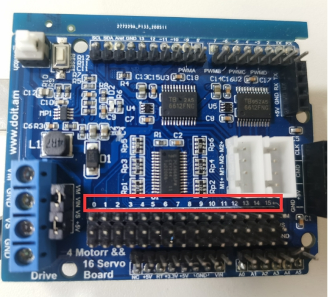 

视屏教程：

#### 5.2.2 WiFi控制说明

温馨提示：蓝牙和WiFi控制，除了连接方式不一样，控制方式是一样的。

打开手机WLAN，找到名称为Doit_WiFI_XXXX的热点并连接（XXXX是模块MAC地址，注意有多个设备同时使用的时候），连上等5s左右会出现弹出一个选择框，然后选择“使用”

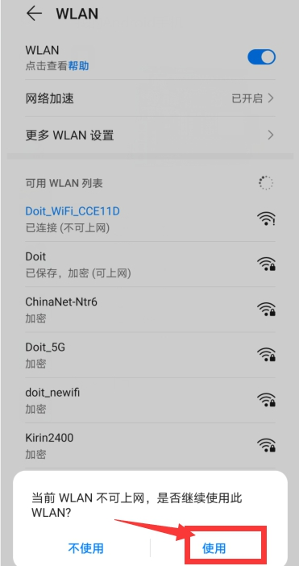 

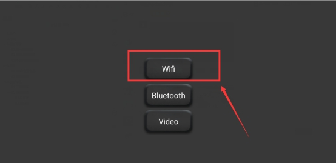 

 

进去之后查看界面中间这个字母有没有变为ed形式，没有的话在检查下热点有没有连接好

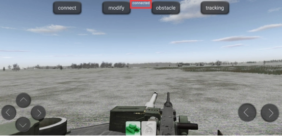 

 

电机和舵机的控制和上一小节蓝牙的一样，自行参照控制。

#### 5.2.3 手柄控制说明

注意：先把接收器插到板子上在通电，如果是先通电在插手柄接收器话，要按下板子上的复位按键，否则板子检查不到接收器，无法控制

（1）插上接受器，上电；打开手柄的电源开关，当手柄上的指示灯和接受器上的指示灯不闪烁的时候就表示手柄连接好，可以开始控制了

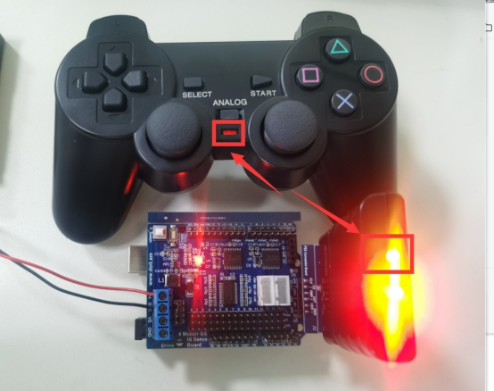 

（2）按PSB_PAD_UP 和PSB_PAD_DOWN和PSB_PAD_LEFT和PSB_PAD_RIGHT这四个按键控制小车前后左右运动

（3）控制舵机：先选择控制数，然后按下PSB_R1同时摇动PSB_R3，往上左转，往下右转（舵机要接到板子上的0~6这几个接口）

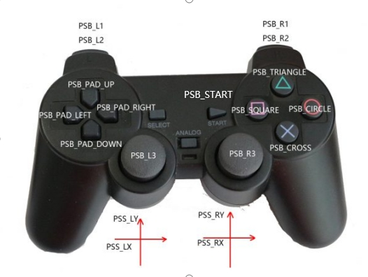 

 

手柄上的控制数和板子上的控制接口对应关系

| 手柄按键（控制数） | 控制板 |
| ------------------ | ------ |
| PSB_START          | 0      |
| PSB_SQUARE         | 1      |
| PSB_TRIANGLE       | 2      |
| PSB_CIRCLE         | 3      |
| PSB_CROSS          | 4      |
| PSB_L2             | 5      |
| PSB_R2             | 6      |

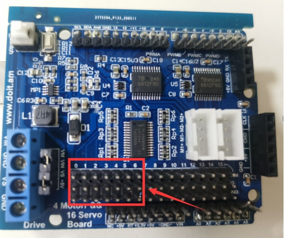 

## 支持与服务

| 四博智联资源                                        |                                                              |
| --------------------------------------------------- | ------------------------------------------------------------ |
| 官网                                                | [www.doit.am](http://www.doit.am/)                           |
| 教材                                                | [ESPDuino智慧物联开发宝典](https://item.taobao.com/item.htm?spm=a1z10.3-c.w4002-7420449993.9.Bgp1Ll&id=520583000610) |
| 购买                                                | [官方淘宝店](https://szdoit.taobao.com/)(szdoit.am)          |
| 讨论                                                | [技术论坛](http://bbs.doit.am/forum.php)(bbs.doit.am)        |
| 应用案例集锦                                        |                                                              |
| [Doit玩家云](http://wechat.doit.am)(wechat.doit.am) | [免费TCP公网调试服务](http://tcp.doit.am)(tcp.doit.am)       |
| 官方技术支持QQ群1/2/3群已满                         |                                                              |
| 技术支持群4                                         | 278888904                                                    |
| 技术支持群5                                         | 278888905                                                    |
| 术支持群6                                           | 278888906                                                    |
| 技术支持群7                                         | 278888907                                                    |
| 技术支持群8                                         | 278888908                                                    |
| 技术支持群9                                         | 278888909                                                    |
| 技术支持群10                                        | 278888900                                                    |