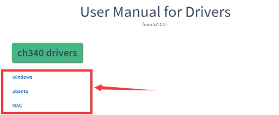
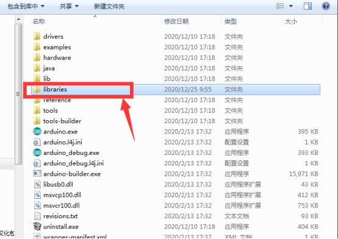
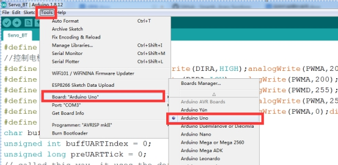

<center><font size=10> 4电机&&16舵机控制套件使用说明 </center></font>
<center> From SZDOIT</center>

## 1. 简介

该控制套件采用金典的Arduino UNO R3作为控制板，驱动扩展板是我司自主研发采用 TB6612 四路驱动，PCA9685 作 16 路舵机控制。

 

## 2. 特点

（1）引出 Arduino UNO I/O 引脚；

（2）电源最大输入电压 15V/DC；

（3）预留蓝牙&WIFI 模块插座；

（4）预留 PS2 手柄插座；

（5）四路直流电机驱动，单路最大驱动电流 1.2A平均值/3.2A峰值；

（6）16 路舵机驱动插针，供电可通过跳线帽外部/内部供电切换；

## 3. 接线说明

特别注意：

（1）VM上电源不要超过15V

（2）共用1个电源时，（VM和VIN）和（VS和+5V）上的跳线帽要插上，电源要接在VM上

（3）在VS上为舵机供电时，（VS和+5V）上的跳线帽要取下，否则板子会烧毁

（4）在使用手柄或者WiFi或者蓝牙的时候，对应引脚插上即可

### 3.1 蓝牙接线说明

 

### 3.2 WiFi接线说明

 

 

### 3.2 PS2手柄接线说明

 

 

## 4. 源码

WiFi和蓝牙共用一个程序，温馨提示：下载程序的时候，要把WiFi/蓝牙模块取下来，因为WiFi/蓝牙模块会占用板子的串口导致板子程序下载不成功，而下载程序之前要把程序中使用到的库文件下载下来，然后接到到arduino IDE安装目录下的libraries文件夹下，库文件下载地址：https://github.com/SmartArduino/Arduino-Third-party-Libraries

### 4.1 WiFi/蓝牙程序

```
#include <Wire.h>
#include "Adafruit_PWMServoDriver.h"
#include<stdio.h>
#include<stdbool.h>
#include <Servo.h> 
#define PWMD 3 //D电机转速
#define DIRD 2 //D电机转向
#define PWMC 5 //C电机转速
#define DIRC 4 //C电机转向
#define PWMB 6 //B电机转速
#define DIRB 7 //B电机转向
#define PWMA 9 //A电机转速
#define DIRA 8 //A电机转向
//控制电机运动    宏定义
#define MOTOR_GO_FORWARD  {digitalWrite(DIRA,HIGH);analogWrite(PWMA,200);digitalWrite(DIRB,LOW);analogWrite(PWMB,200);digitalWrite(DIRC,HIGH);analogWrite(PWMC,200);digitalWrite(DIRD,LOW);analogWrite(PWMD,200);} //车体前进                              
#define MOTOR_GO_BACK   {digitalWrite(DIRA,LOW);analogWrite(PWMA,200);digitalWrite(DIRB,HIGH);analogWrite(PWMB,200);digitalWrite(DIRC,LOW);analogWrite(PWMC,200);digitalWrite(DIRD,HIGH);analogWrite(PWMD,200);}   //车体后退
#define MOTOR_GO_LEFT   {digitalWrite(DIRD,LOW);analogWrite(PWMD,255);digitalWrite(DIRB,LOW);analogWrite(PWMB,255);digitalWrite(DIRA,LOW);analogWrite(PWMA,255);digitalWrite(DIRC,LOW);analogWrite(PWMC,255);}  //车体左转
#define MOTOR_GO_RIGHT    {digitalWrite(DIRA,HIGH);analogWrite(PWMA,255);digitalWrite(DIRC,HIGH);analogWrite(PWMC,255);digitalWrite(DIRD,HIGH);analogWrite(PWMD,255);digitalWrite(DIRB,HIGH);analogWrite(PWMB,255);}  //车体右转
#define MOTOR_GO_STOP   {digitalWrite(DIRA,LOW);analogWrite(PWMA,0);digitalWrite(DIRB,LOW);analogWrite(PWMB,0);digitalWrite(DIRC,HIGH);analogWrite(PWMC,0);digitalWrite(DIRD,LOW);analogWrite(PWMD,0);}       //车体静止
#define MAX_PACKETSIZE 32  //串口接收缓冲区
char buffUART[MAX_PACKETSIZE];
unsigned int buffUARTIndex = 0;
unsigned long preUARTTick = 0;
// called this way, it uses the default address 0x40
Adafruit_PWMServoDriver pwm = Adafruit_PWMServoDriver();
//脉宽范围定义
#define SERVOMIN 125//最小脉宽
#define SERVOMAX 625//最大脉宽
#define SERVOMID 375//中间脉宽
//角度范围小于180的单独定义
#define SERVOMIN_3 125
#define SERVOMAX_3 625
#define SERVOMIN_12 125
#define SERVOMAX_12 625
#define SERVOMIN_7 125
#define SERVOMAX_7 625

//数组声明
int Flag[16]={0,0,0,0,0,0,0,0,0,0,0,0,0,0,0,0};
//每个舵机变量声明
uint16_t pulselen_0=SERVOMID;
float pulselen_1=SERVOMID;
float pulselen_2=SERVOMID;
uint16_t pulselen_3=SERVOMID;
uint16_t pulselen_4=SERVOMID;
uint16_t pulselen_5=SERVOMID;
uint16_t pulselen_6=SERVOMID;
uint16_t pulselen_7=SERVOMID;
uint16_t pulselen_8=SERVOMID;
//角度增量声明
uint16_t angle=0;
float angle1=0,n=2;

uint16_t pulse_limit(uint16_t angle)
{
  if(angle < 125)
  {
    angle =125;
  }
  if(angle >= 535)
  {
    angle = 535;
  }
  else{
    return angle;
  }
  return angle;
}

enum DN
{ 
  GO_ADVANCE, 
  GO_LEFT, 
  GO_RIGHT,
  GO_BACK,
  STOP_STOP,
  DEF
}Drive_Num=DEF;
//电机控制标志量
bool flag1=false;
bool stopFlag = true;
bool JogFlag = false;
uint16_t JogTimeCnt = 0;
uint32_t JogTime=0;


//小车电机控制
void CAR_Control()
{
	switch (Drive_Num) 
    {
      case GO_ADVANCE:MOTOR_GO_FORWARD;JogFlag = true;JogTimeCnt = 1;JogTime=millis();break;
      case GO_LEFT: MOTOR_GO_LEFT;JogFlag = true;JogTimeCnt = 1;JogTime=millis();break;
      case GO_RIGHT:MOTOR_GO_RIGHT;JogFlag = true;JogTimeCnt = 1;JogTime=millis();break;
      case GO_BACK:MOTOR_GO_BACK;JogFlag = true;JogTimeCnt = 1;JogTime=millis();break;
      case STOP_STOP: MOTOR_GO_STOP;JogTime = 0;JogFlag=false;stopFlag=true;break;
      default:break;
    }
    Drive_Num=DEF;
    //小车保持姿态210ms
    if(millis()-JogTime>=210)
    {
      JogTime=millis();
      if(JogFlag == true) 
      {
        stopFlag = false;
        if(JogTimeCnt <= 0) 
        {
          JogFlag = false; stopFlag = true;
        }
        JogTimeCnt--;
      }
      if(stopFlag == true) 
      {
        JogTimeCnt=0;
        MOTOR_GO_STOP;
      }
    }
}

//舵机驱动板调用函数
void setServoPulse(uint8_t n, double pulse) {
  double pulselength;
  
  pulselength = 1000000; // 1,000,000 us per second
  pulselength /= 60; // 60 Hz
  Serial.print(pulselength); Serial.println(" us per period"); 
  pulselength /= 4096; // 12 bits of resolution
  Serial.print(pulselength); Serial.println(" us per bit"); 
  pulse *= 1000;
  pulse /= pulselength;
  Serial.println(pulse);
  pwm.setPWM(n, 0, pulse);
}


void Servo1(uint16_t pulselen,int i)//舵机正转
{
  angle=pulselen-1;
    for(;pulselen>angle;pulselen=pulselen-1){
    pwm.setPWM(i,0,pulselen);
    }
}
void Servo0(uint16_t pulselen,int i)//舵机反转
{
  angle=pulselen+1;
    for(;pulselen<angle;pulselen=pulselen+1){
    pwm.setPWM(i,0,pulselen);
    }
}
void Servo1_12(float pulselen,int i)//舵机1和舵机2
{
  angle1=pulselen-0.5;
    for(;pulselen>angle1;pulselen=pulselen-0.5){
    pwm.setPWM(i,0,pulselen);
 
    }

}
void Servo0_12(float pulselen,int i)
{
  angle1=pulselen+0.5;
 
    for(;pulselen<angle1;pulselen=pulselen+0.5){
    pwm.setPWM(i,0,pulselen);
    }

}

//标志位初始化
void Init()
{
  Flag[0]=0;  
  Flag[1]=0; 
  Flag[2]=0; 
  Flag[3]=0; 
  Flag[4]=0;
  Flag[5]=0;
  Flag[6]=0;  
  Flag[7]=0; 
  Flag[8]=0; 
  Flag[9]=0; 
  Flag[10]=0;
  Flag[11]=0;
  Flag[12]=0;
  Flag[13]=0;
  Flag[14]=0;
  Flag[15]=0;
}
//串口接收
void UART_Control(){
if(Serial.available()){ 
  char Uart_Date = Serial.read();
  
	if(buffUARTIndex > 0 && (millis() - preUARTTick >= 100))//超过100ms没接到数据，则认为已经接收到完整指令
	{ //data ready
		buffUART[buffUARTIndex] = 0x00;
		/*if((buffUART[0]=='C') && (buffUART[1]=='M') && (buffUART[2]=='D')) //若发送指令非法，则忽略
	    {
	    	;
	    }
		else Uart_Date=buffUART[0];
    	buffUARTIndex = 0;*/
    }
    switch (Uart_Date)    //串口控制指令
	{
      case'a':Flag[0]=true;Serial.print(Uart_Date);break;
      case'A':Flag[1]=true;Serial.print(Uart_Date);break;
      case'b':Flag[2]=true;Serial.print(Uart_Date);break;
      case'B':Flag[3]=true;Serial.print(Uart_Date);break;
      case'c':Flag[4]=true;Serial.print(Uart_Date);break;
      case'C':Flag[5]=true;Serial.print(Uart_Date);break;
      case'd':Flag[6]=true;Serial.print(Uart_Date);break;
      case'D':Flag[7]=true;Serial.print(Uart_Date);break;
      case'e':Flag[8]=true;Serial.print(Uart_Date);break;
      case'E':Flag[9]=true;Serial.print(Uart_Date);break;
      case'f':Flag[10]=true;Serial.print(Uart_Date);break;
      case'F':Flag[11]=true;Serial.print(Uart_Date);break;
      case'g':Flag[12]=true;Serial.print(Uart_Date);break;  
      case'G':Flag[13]=true;Serial.print(Uart_Date);break;
      case'h':Flag[14]=true;Serial.print(Uart_Date);break;  
      case'H':Flag[15]=true;Serial.print(Uart_Date);break;
      //case '2': Drive_Num=GO_ADVANCE;Serial.print(Uart_Date);break;
      case '6': Drive_Num=GO_LEFT; Serial.print(Uart_Date);break;
      case '4': Drive_Num=GO_RIGHT;Serial.print(Uart_Date); break;
      //case '1': Drive_Num=GO_BACK; Serial.print(Uart_Date);break;
      default:Serial.print(Uart_Date);break;
	}
     }
}

//初始化

void setup() {
Serial.begin(9600);
Serial.println("16 channel Servo test!");
pwm.begin();
pwm.setPWMFreq(60); // Analog servos run at ~60 Hz updates
pwm.setPWM(0, 0, SERVOMID);
pwm.setPWM(1, 0, SERVOMID);
pwm.setPWM(2, 0, SERVOMID);
pwm.setPWM(3, 0, SERVOMID);
pwm.setPWM(4, 0, SERVOMID);
pwm.setPWM(5, 0, SERVOMID);
pwm.setPWM(6, 0, SERVOMID);
pwm.setPWM(7, 0, SERVOMID);//SERVOMIN_8
pinMode(DIRA,OUTPUT);
pinMode(PWMA,OUTPUT);  
pinMode(DIRB,OUTPUT);
pinMode(PWMB,OUTPUT); 
pinMode(DIRC,OUTPUT);
pinMode(PWMC,OUTPUT);
pinMode(DIRD,OUTPUT);
pinMode(PWMD,OUTPUT);
MOTOR_GO_STOP;
delay(10);
}

void loop() 
{
  Init();
  UART_Control();
  CAR_Control();
  
  if(Flag[0]==true&&pulselen_0<=SERVOMAX){
    
    Servo0(pulselen_0,0);
    pulselen_0=pulselen_0+n;
    pulselen_0 = pulse_limit(pulselen_0);
  }
  if(Flag[1]==true&&pulselen_0>=SERVOMIN){
     
    Servo1(pulselen_0,0);
    pulselen_0=pulselen_0-n;
    pulselen_0 = pulse_limit(pulselen_0);
  }
  if(Flag[2]==true&&pulselen_1<=SERVOMAX_12){
    
    Servo0(pulselen_1,1);
    Servo1(pulselen_2,2);
    pulselen_1=pulselen_1-n;
    pulselen_2=pulselen_2+n;
    pulselen_1 = pulse_limit(pulselen_1);
    pulselen_2 = pulse_limit(pulselen_2);
  }
  if(Flag[3]==true&&pulselen_1>=SERVOMIN_12){
     
    Servo0(pulselen_1,1);
    Servo1(pulselen_2,2);
    pulselen_1=pulselen_1-n;
    pulselen_2=pulselen_2+n;
    pulselen_1 = pulse_limit(pulselen_1);
    pulselen_2 = pulse_limit(pulselen_2);
  }
if(Flag[4]==true&&pulselen_3<=SERVOMAX_12){
    
    Servo1(pulselen_3,3);
    pulselen_3=pulselen_3+n;
    pulselen_3 = pulse_limit(pulselen_3);
  }
  if(Flag[5]==true&&pulselen_3>=SERVOMIN_12){
     
    Servo1(pulselen_3,3);
    pulselen_3=pulselen_3-n;
    pulselen_3 = pulse_limit(pulselen_3);
  }
  /****************************************/
  /**************Servo5********************/
  if(Flag[6]==true&&pulselen_4<=SERVOMAX){
    
    Servo0(pulselen_4,4);
    pulselen_4=pulselen_4+n;
    pulselen_4 = pulse_limit(pulselen_4);
  }
  if(Flag[7]==true&&pulselen_4>=SERVOMIN){
     
    Servo1(pulselen_4,4);
    pulselen_4=pulselen_4-n;
    pulselen_4 = pulse_limit(pulselen_4);
  }
  /*****************************************/
  /****************Servo6******************/
  if(Flag[8]==true&&pulselen_5<=SERVOMAX){

    Servo0(pulselen_5,5);
    pulselen_5=pulselen_5+n;
    pulselen_5 = pulse_limit(pulselen_5);
  }
  if(Flag[9]==true&&pulselen_5>=SERVOMIN){

    Servo1(pulselen_5,5);
    pulselen_5=pulselen_5-n;
    pulselen_5 = pulse_limit(pulselen_5);
  }
  /**************************************/
  /****************servo7****************/
  if(Flag[10]==true&&pulselen_6<=SERVOMAX){
    
    Servo0(pulselen_6,6);
    pulselen_6=pulselen_6+n;
    pulselen_6 = pulse_limit(pulselen_6);
  }
  if(Flag[11]==true&&pulselen_6>=SERVOMIN)
  { 
    Servo1(pulselen_6,6);
    pulselen_6=pulselen_6-n;
    pulselen_6 = pulse_limit(pulselen_6);
  }
  /**************************************/
  /***************Servo8*****************/
  if(Flag[12]==true&&pulselen_7<=SERVOMAX){

    Servo0(pulselen_7,7);
    pulselen_7=pulselen_7+n;
    pulselen_7 = pulse_limit(pulselen_7);
  }
  if(Flag[13]==true&&pulselen_7>=SERVOMIN){

    Servo1(pulselen_7,7);
    pulselen_7=pulselen_7-n;
    pulselen_7 = pulse_limit(pulselen_7);
  }
  /**************************************/
//  /***************Servo9*****************/
//  if(Flag[14]==true&&pulselen_8<=SERVOMAX){
//
//    Servo0(pulselen_8,8);
//    pulselen_8=pulselen_8+n;
//    pulselen_8 = pulse_limit(pulselen_8);
//  }
//  if(Flag[15]==true&&pulselen_8>=SERVOMIN){
//
//    Servo1(pulselen_8,8);
//    pulselen_8=pulselen_8-n;
//    pulselen_8 = pulse_limit(pulselen_8);
//  }
//  /***************************************/
}
```


### 4.2 手柄程序

```
#include <Servo.h> 
#include <Wire.h>
#include <PS2X_lib.h>  //for v1.6
#include "Adafruit_PWMServoDriver.h"
// called this way, it uses the default address 0x40
Adafruit_PWMServoDriver pwm = Adafruit_PWMServoDriver();
// you can also call it with a different address you want
//Adafruit_PWMServoDriver pwm = Adafruit_PWMServoDriver(0x41);
// Depending on your servo make, the pulse width min and max may vary, you 
// want these to be as small/large as possible without hitting the hard stop
// for max range. You'll have to tweak them as necessary to match the servos you
// have!
//脉宽范围定义
#define SERVOMIN 125//最小脉宽
#define SERVOMAX 535//最大脉宽
#define SERVOMID 330//中间脉宽
//角度范围小于180的单独定义
#define SERVOMIN_3 125
#define SERVOMAX_3 535
#define SERVOMIN_12 125
#define SERVOMAX_12 535
#define SERVOMIN_7 125
#define SERVOMAX_7 535
int angle_step = 5;

uint16_t pulselen_0=SERVOMID;
float pulselen_1=SERVOMID;
float pulselen_2=SERVOMID;
uint16_t pulselen_3=SERVOMID;
uint16_t pulselen_4=SERVOMID;
uint16_t pulselen_5=SERVOMID;
uint16_t pulselen_6=SERVOMID;
uint16_t pulselen_7=SERVOMID;
uint16_t angle=0;
float angle1=0;
bool pt0=0;
bool pt1=0;
bool pt2=0;
bool pt3=0;
bool pt4=0;
bool pt5=0;
bool pt6=0;

// our servo # counter
//uint8_t servonum = 0;
// you can use this function if you'd like to set the pulse length in seconds
// e.g. setServoPulse(0, 0.001) is a ~1 millisecond pulse width. its not precise!
void setServoPulse(uint8_t n, double pulse) {
  double pulselength;
  //float pulselen;
  pulselength = 1000000; // 1,000,000 us per second
  pulselength /= 60; // 60 Hz
  Serial.print(pulselength); Serial.println(" us per period"); 
  pulselength /= 4096; // 12 bits of resolution
  Serial.print(pulselength); Serial.println(" us per bit"); 
  pulse *= 1000;
  pulse /= pulselength;
  Serial.println(pulse);
  pwm.setPWM(n, 0, pulse);
}
void Servo0(uint16_t pulselen,int i){

  angle=pulselen-1;
  for(;pulselen>angle;pulselen=pulselen-1){
    pwm.setPWM(i,0,pulselen);
  }
}
void Servo1(uint16_t pulselen,int i){

  angle=pulselen+1;
  for(;pulselen<angle;pulselen=pulselen+1){
    pwm.setPWM(i,0,pulselen);
  }
}
void Servo1_12(float pulselen,int i){
  angle1=pulselen+0.5;
    for(;pulselen<angle1;pulselen=pulselen+0.5){
    pwm.setPWM(i,0,pulselen);
 
    }

}
void Servo0_12(float pulselen,int i){
  angle1=pulselen-0.5;
 
    for(;pulselen>angle1;pulselen=pulselen-0.5){
    pwm.setPWM(i,0,pulselen);
    }

}
/******************************************************************
 * set pins connected to PS2 controller:
 *   - 1e column: original 
 *   - 2e colmun: Stef?
 * replace pin numbers by the ones you use
 ******************************************************************/
//PS2手柄引脚；
#define PS2_DAT        13  //14    
#define PS2_CMD        11  //15
#define PS2_SEL        10  //16
#define PS2_CLK        12  //17

// 电机控制引脚；
#define PWMD 3
#define DIRD 2
#define PWMC 5
#define DIRC 4
#define PWMB 6
#define DIRB 7
#define PWMA 9
#define DIRA 8
int speed1 = 100;
enum DN
{
  GO_FORWARD,
  GO_BACK,
  GO_LEFT,
  GO_RIGHT,
  GO_STOP,
  DEF
}Drive_Num = DEF;

/******************************************************************
 * select modes of PS2 controller:
 *   - pressures = analog reading of push-butttons 
 *   - rumble    = motor rumbling
 * uncomment 1 of the lines for each mode selection
 ******************************************************************/
#define pressures   true
//#define pressures   false
#define rumble      true
//#define rumble      false

PS2X ps2x; // create PS2 Controller Class

//right now, the library does NOT support hot pluggable controllers, meaning 
//you must always either restart your Arduino after you connect the controller, 
//or call config_gamepad(pins) again after connecting the controller.

int error = 0;
byte type = 0;
byte vibrate = 0;
void (* resetFunc) (void) =0;
 void setup(){
   pinMode(PWMA, OUTPUT);
   pinMode(DIRA, OUTPUT);
   pinMode(PWMB, OUTPUT);
   pinMode(DIRB, OUTPUT);
   pinMode(PWMC, OUTPUT);
   pinMode(DIRC, OUTPUT);
   pinMode(PWMD, OUTPUT);
   pinMode(DIRD, OUTPUT);
   Serial.begin(9600);
 //double val=ps2x.read_gamepad();
   delay(500) ; //added delay to give wireless ps2 module some time to startup, before configuring it
   //CHANGES for v1.6 HERE!!! **************PAY ATTENTION*************

  //setup pins and settings: GamePad(clock, command, attention, data, Pressures?, Rumble?) check for error
error = ps2x.config_gamepad(PS2_CLK, PS2_CMD, PS2_SEL, PS2_DAT, pressures, rumble);

  if(error == 0){
    Serial.print("Found Controller, configured successful ");
    Serial.print("pressures = ");
    if (pressures)
      Serial.println("true ");
    else
      Serial.println("false");
    Serial.print("rumble = ");
    if (rumble)
      Serial.println("true)");
    else
      Serial.println("false");
    Serial.println("Try out all the buttons, X will vibrate the controller, faster as you press harder;");
    Serial.println("holding L1 or R1 will print out the analog stick values.");
    Serial.println("Note: Go to www.billporter.info for updates and to report bugs.");
  }  
  else if(error == 1)
    Serial.println("No controller found, check wiring, see readme.txt to enable debug. visit www.billporter.info for troubleshooting tips");

  else if(error == 2)
    Serial.println("Controller found but not accepting commands. see readme.txt to enable debug. Visit www.billporter.info for troubleshooting tips");

  else if(error == 3)
    Serial.println("Controller refusing to enter Pressures mode, may not support it. ");

  type = ps2x.readType(); 
  switch(type) {
    case 0:
      Serial.println("Unknown Controller type found ");
      break;
    case 1:
      Serial.println("DualShock Controller found ");
      break;
    case 2:
      Serial.println("GuitarHero Controller found ");
      break;
    case 3:
      Serial.println("Wireless Sony DualShock Controller found ");
      break;
   }
      Serial.println("16 channel Servo test!");
  pwm.begin();
    pwm.setPWMFreq(60); 
   pwm.setPWM(0,0,SERVOMID);
   pwm.setPWM(1,0,SERVOMID);
   pwm.setPWM(3,0,SERVOMID);
   pwm.setPWM(2,0,SERVOMID);
   pwm.setPWM(4,0,SERVOMID);
   pwm.setPWM(5,0,SERVOMID);
   pwm.setPWM(6,0,SERVOMID);
   pwm.setPWM(7,0,SERVOMID);  
}
//定义小车运动方式

 void turnLeft(int speed1){//小车左转
   digitalWrite(DIRA,HIGH);
   digitalWrite(DIRB,LOW);
   digitalWrite(DIRC,HIGH);
   digitalWrite(DIRD,LOW);
   analogWrite(PWMA, speed1);
   analogWrite(PWMB, speed1);
   analogWrite(PWMC, speed1);
   analogWrite(PWMD, speed1);
}
 void turnRight(int speed1)//右转
{
   digitalWrite(DIRA,LOW);
   digitalWrite(DIRB,HIGH);
   digitalWrite(DIRC,LOW);
   digitalWrite(DIRD,HIGH);
   analogWrite(PWMA, speed1);
   analogWrite(PWMB, speed1);
   analogWrite(PWMC, speed1);
   analogWrite(PWMD, speed1);
}

 void forward(int speed1)//前进
{
   digitalWrite(DIRA,HIGH);
   digitalWrite(DIRB,HIGH);
   digitalWrite(DIRC,HIGH);
   digitalWrite(DIRD,HIGH);
   analogWrite(PWMA, speed1);
   analogWrite(PWMB, speed1);
   analogWrite(PWMC, speed1);
   analogWrite(PWMD, speed1);  
}

 void back(int speed1)//后退
{
   digitalWrite(DIRA,LOW);
   digitalWrite(DIRB,LOW);
   digitalWrite(DIRC,LOW);
   digitalWrite(DIRD,LOW);
   analogWrite(PWMA, speed1);
   analogWrite(PWMB, speed1);
   analogWrite(PWMC, speed1);
   analogWrite(PWMD, speed1);
}
void stop() // 停止；
 {
   digitalWrite(DIRA,LOW);
   digitalWrite(DIRB,LOW);
   digitalWrite(DIRC,LOW);
   digitalWrite(DIRD,LOW);
   analogWrite(PWMA, 0);
   analogWrite(PWMB, 0);
   analogWrite(PWMC, 0);
   analogWrite(PWMD, 0);
   delay(20);
}
void PS2()
{
  
   /* You must Read Gamepad to get new values and set vibration values
     ps2x.read_gamepad(small motor on/off, larger motor strenght from 0-255)
     if you don't enable the rumble, use ps2x.read_gamepad(); with no values
     You should call this at least once a second
   */  
  if(error == 1) //skip loop if no controller found
    return; 

  if(type == 2) {//Guitar Hero Controller
  return;
  }
  else  { //DualShock Controller
    ps2x.read_gamepad(false, vibrate); //read controller and set large motor to spin at 'vibrate' speed1
     vibrate = ps2x.Analog(PSAB_CROSS);  //this will set the large motor vibrate speed1 based on how hard you press the blue (X) button
    if (ps2x.NewButtonState()) {
     if(ps2x.Button(PSB_L2)){
        Serial.println("L2 pressed");
        pt0=0;
        pt1=0;
        pt2=0;
        pt3=0;
        pt4=0;
        pt5=1;
        pt6=0;
      }
      if(ps2x.Button(PSB_R2)){
        Serial.println("R2 pressed");
        pt0=0;
        pt1=0;
        pt2=0;
        pt3=0;
        pt4=0;
        pt5=0;
        pt6=1;
      }
      if(ps2x.Button(PSB_TRIANGLE)){
        Serial.println("Triangle pressed");
        pt0=0;
        pt1=0;
        pt2=1;
        pt3=0;
        pt4=0;
        pt5=0;
        pt6=0;
       }      
    }
    if(ps2x.ButtonPressed(PSB_CIRCLE)){               //will be TRUE if button was JUST pressed
      Serial.println("Circle just pressed");
        pt0=0;
        pt1=0;
        pt2=0;
        pt3=1;
        pt4=0;
        pt5=0;
        pt6=0;
    }
    if(ps2x.NewButtonState(PSB_CROSS)){      //will be TRUE if button was JUST pressed OR released
      Serial.println("X just changed");
      pt0=0;
        pt1=0;
        pt2=0;
        pt3=0;
        pt4=1;
        pt5=0;
        pt6=0;
    }
    if(ps2x.ButtonReleased(PSB_SQUARE)){              //will be TRUE if button was JUST released
      Serial.println("Square just released");
        pt0=0;
        pt1=1;
        pt2=0;
        pt3=0;
        pt4=0;
        pt5=0;
        pt6=0;
    }
 //start 开始运行，电机初PWM为100；
    if(ps2x.Button(PSB_START))  {
       Serial.println("Start is being held");
        pt0=1;
        pt1=0;
        pt2=0;
        pt3=0;
        pt4=0;
        pt5=0;
        pt6=0;
                 
    }
// 电机正转；
    if(ps2x.Button(PSB_PAD_UP)){
      Serial.println("Up held this hard: ");
     Drive_Num = GO_FORWARD;
    }

// 电机反转；
    else if(ps2x.Button(PSB_PAD_DOWN)){
      Serial.print("Down held this hard: ");
      Drive_Num = GO_BACK; 
    }

 //左转；   
    else if(ps2x.Button(PSB_PAD_LEFT)){
       Serial.println("turn left ");
       Drive_Num = GO_LEFT;        
    }

//右转；
   else if(ps2x.Button(PSB_PAD_RIGHT)){
    Serial.println("turn right");
    speed1=50;
    Drive_Num = GO_RIGHT;
   }
// Stop
   else{
    Drive_Num = GO_STOP;
   }
   delay(20);

  }   
   if(ps2x.Button(PSB_L1)||ps2x.Button(PSB_R1)){
       int LY=ps2x.Analog(PSS_LY);
       int LX=ps2x.Analog(PSS_LX);
       int RY=ps2x.Analog(PSS_RY);
       int RX=ps2x.Analog(PSS_RX);    
      if(pt0){
       if((RY<100)&&(pulselen_0>=SERVOMIN)){//
       Servo0(pulselen_0,0);
       pulselen_0=pulselen_0-angle_step;

     }
       else if((RY>=150)&&(pulselen_0<=SERVOMAX)){//
       Servo1(pulselen_0,0);
       pulselen_0=pulselen_0+angle_step;
      }
     } 
      if(pt1){
       if((RY<100)&&(pulselen_1>=SERVOMIN_12)){//
        Servo0(pulselen_1,1);
        Servo1(pulselen_2,2);
        pulselen_1=pulselen_1-angle_step;
        pulselen_2=pulselen_2+angle_step;
     }
       else if((RY>=150)&&(pulselen_1<=SERVOMAX_12)){//
        Servo1(pulselen_1,1);
        Servo1(pulselen_2,2);
        pulselen_1=pulselen_1+angle_step;
        pulselen_2=pulselen_2-angle_step;
     }
    }  
     if(pt2){
       if((RY<100)&&(pulselen_3>=SERVOMIN_3)){//
       Servo0(pulselen_3,3);
       pulselen_3=pulselen_3-angle_step;

     }
       else if((RY>=150)&&(pulselen_3<=SERVOMAX_3)){//
       Servo1(pulselen_3,3);
       pulselen_3=pulselen_3+angle_step;
     }
    }
      if(pt3){
       if((RY<100)&&(pulselen_4>=SERVOMIN)){//
       Servo0(pulselen_4,4);
       pulselen_4=pulselen_4-angle_step;

     }
       else if((RY>=150)&&(pulselen_4<=SERVOMAX)){//
       Servo1(pulselen_4,4);
       pulselen_4=pulselen_4+angle_step;
      }
     }
       if(pt4){
       if((RY<100)&&(pulselen_5>=SERVOMIN)){//
       Servo0(pulselen_5,5);
       pulselen_5=pulselen_5-angle_step;

     }
       else if((RY>=150)&&(pulselen_5<=SERVOMAX)){//
       Servo1(pulselen_5,5);
       pulselen_5=pulselen_5+angle_step;

     }
   }
      if(pt5){
       if((RY<100)&&(pulselen_6>=SERVOMIN)){//
       Servo0(pulselen_6,6);
       pulselen_6=pulselen_6-angle_step;

     }
       else if((RY>=150)&&(pulselen_6<=SERVOMAX)){//
       Servo1(pulselen_6,6);
       pulselen_6=pulselen_6+angle_step;

     }
     }
     if(pt6){
       if((RY<100)&&(pulselen_7>=SERVOMIN_7)){//
       Servo0(pulselen_7,7);
       pulselen_7=pulselen_7-angle_step;

     }
       else if((RY>=150)&&(pulselen_7<=SERVOMAX_7)){//
       Servo1(pulselen_7,7);
       pulselen_7=pulselen_7+angle_step;
     }
    }
  }

  delay(5);
}
void Control()
{
  switch(Drive_Num)
  {
    case GO_FORWARD: forward(speed1);   break;
    case GO_BACK:    back(speed1);      break;
    case GO_LEFT:    turnLeft(speed1);  break;
    case GO_RIGHT:   turnRight(speed1); break;
    case GO_STOP:    stop();           break;
  }
}
void loop()
{
  PS2();
  Control();
}  
```


## 5.使用说明

### 5.1 下载程序

具体步骤如下，步骤有完成的自行跳到下一步：

（1）下载安装arduino IDE软件，Arduino官网：https://www.arduino.cc/，安装流程自行百度

（2）安装CH340驱动

根据自己的系统下载对应的驱动：https://gitnova.com/#/GeneralSource/drivers

 

 

（3）配置库文件

打开第四节中库文件的下载地址：https://github.com/SmartArduino/Arduino-Third-party-Libraries，下载这两个库文件


然后将其解压到libraries文件接中

 

 

 

（4）打开程序

在github仓库中下载：https://github.com/SmartArduino/Arduino-Code，也可以自行创建新文件夹，然后把上一节中给的源码复制过来

 

 

（5）选择板子型号

 

 

（6）选择端口号

前提：使用USB线将控制板和USB连上

注：有多个串口的时候，请确保选择端口号是板子的

 

（7）编译程序

 

 

编译成功，如果不成功根据报错信息进行修改

 

（8）下载

如果前面编译成功，下载报错的话，先检查板子型号、端口号选对没有，然后在下载，还是不行的话，重启软件再试

 

 

### 5.2 操作说明

下载程序之后，按照接线说明接好线

注意：使用WiFi/蓝牙控制时，先安装手机app软件（只支持Android手机）：https://github.com/SmartArduino/SmartArduino.github.io/blob/master/docs/Robot/Controller/app/base.apk

#### 5.2.1 蓝牙控制说明

上电，开发手机APP

 

 

 

 

 

注：图中蓝牙名称只是示例，根据自己的蓝牙选择对应的名称

 

 

 

中间这个英文字母变成ed形式表示蓝牙连接成功

 

通过点击这四个按键，控制小车前后左右运动，如果是麦克纳姆轮，要加上右下角那两个按钮，分别控制小车左漂移和右漂移

 

控制舵机运动：

 

 

先选中控制路数，然后点击右下角两个按钮控制舵机左右和右转

 

注意：这里的路数SG0~SG15对应板子上的控制引脚号0~15

 

视屏教程：https://github.com/SmartArduino/zhdocs/blob/master/zhControlPanel/4%26%2616ControlKit/Bluetooth.rar

#### 5.2.2 WiFi控制说明

温馨提示：蓝牙和WiFi控制，除了连接方式不一样，控制方式是一样的。

打开手机WLAN，找到名称为Doit_WiFI_XXXX的热点并连接（XXXX是模块MAC地址，注意有多个设备同时使用的时候），连上等5s左右会出现弹出一个选择框，然后选择“使用”

 

 

 

进去之后查看界面中间这个字母有没有变为ed形式，没有的话在检查下热点有没有连接好

 

 

电机和舵机的控制和上一小节蓝牙的一样，自行参照控制。

#### 5.2.3 手柄控制说明

注意：先把接收器插到板子上在通电，如果是先通电在插手柄接收器话，要按下板子上的复位按键，否则板子检查不到接收器，无法控制

（1）插上接受器，上电；打开手柄的电源开关，当手柄上的指示灯和接受器上的指示灯不闪烁的时候就表示手柄连接好，可以开始控制了

 

（2）按PSB_PAD_UP 和PSB_PAD_DOWN和PSB_PAD_LEFT和PSB_PAD_RIGHT这四个按键控制小车前后左右运动

（3）控制舵机：先选择控制数，然后按下PSB_R1同时摇动PSB_R3，往上左转，往下右转（舵机要接到板子上的0~6这几个接口）

 

 

手柄上的控制数和板子上的控制接口对应关系

| 手柄按键（控制数） | 控制板 |
| ------------------ | ------ |
| PSB_START          | 0      |
| PSB_SQUARE         | 1      |
| PSB_TRIANGLE       | 2      |
| PSB_CIRCLE         | 3      |
| PSB_CROSS          | 4      |
| PSB_L2             | 5      |
| PSB_R2             | 6      |

 

## 6. 常见问题

（1）板子最高能承受多大的电压？

A：15V，由于电机驱动芯片是TB6612，他的最大承受电压为15V

（2）如果给舵机单独供电，可以只用一个电源吗？

A：不可以，因为舵机启动过程中瞬间电流不叫大，导致工作电压不稳定造成控制板不能正常工作，所以在VM上要加一个电源给控制板供电。

（3）给舵机单独供电的时候，可以不拆（VS和+5V）上的跳线帽吗？

A：不可以，这样会导致板子上面的5V电源和外接的电源串联，严重的会烧毁芯片

（4）插上蓝牙/WiFi模块，为什么不能下载程序？

A：因为蓝牙/WiFi模块会占用板子上的下载串口，所以下载程序的时候一定要取下蓝牙/WiFi模块

（5）插上手柄之后，指示灯常亮，但是控制的时候没有反应，什么原因？

A：1）程序中使用的PS2库不支持热插拔，插上接收器之后要按下板子上的复位按键

​      2）手柄需要3V（2接1.5V）电池供电，电压低了不能工作

​      3）检查程序有没有下载成功（通过Arduino IDE串口监视器验证）

（6）什么时候需要给舵机单独供电？

A：1）使用的舵机电源高于5V 

​	  2）要同时控制多个舵机的时候

（7）使用PS2手柄控制的时候，能控制小车，不能控制舵机，什么原因？

A：核对下舵机的接线，然后看下手柄的操作是否正确

## 更多资源，请关注公众号！


|      |      |
| ---- | ---- |
|      |      |
|      |      |
|      |      |
|      |      |
|      |      |
|      |      |
|      |      |
|      |      |
|      |      |
|      |      |
|      |      |
|      |      |
|      |      |
|      |      |