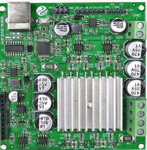
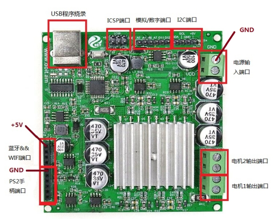
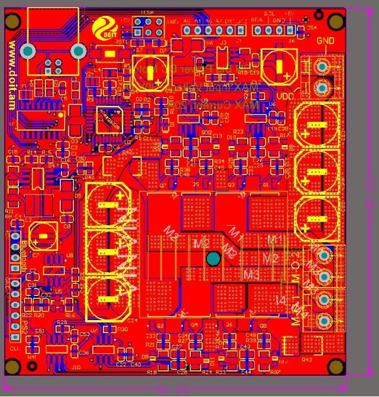

 MEGA328P大功率直流电机控制板

 From SZDOIT

# 一、简介

这是一款基于MEGA328P的大功率直流电机的控制和驱动二合一的Arduino板子，使用非常简单方便，支持PS2手柄、WiFi以及蓝牙三种控制模式，非常适用我们店各种大功率小车。

 

# 二、特点

- 功率大:最大电流10A，功率240W;

- 大负荷:试验负荷40kg;

- 控制方式:wifi (DT-06)、蓝牙(HC-05)、PS2;

- 2 in 1 board:是控制板(兼容Arduino)，也是直流电机驱动板;

- 长距离:wifi 100m，蓝牙或ps2 10m

# 三、模块引脚说明及原理图

大功率直流电机，内部嵌入ATMEGA328作为电机驱动控制单元。

1. 板上预留ATMEGA328单片机烧录接口（USB与ICSP两种方式），方便程序烧录；

2. 部分模拟/数字信号端口，供用户作拓展使用；

3. 预留蓝牙&WIFI接口，我司模块可直接插接使用；

4. 预留PS2手柄接口，直接插接使用；

5. 预留I2C接口，同时引出的+5V，供小功率模块使用（最大输出电流不超过100mA）；

6. 两路直流电机输出，单路输出最大电流20A；

7. 电源输入，最大直流电压30V。电源输入端未设计防反接保护，接线错误可能引起炸机；

8. 电机输出过电流保护软件预留检测，可软件设置保护阈值（接到ATMEGA328外部中断口D2，具体计算请参考原理图设计参数，保护电流可软件修改≤20A）；

 

 

# 附录. 设计资料

| 四博智联资源                                           |                                                              |
| ------------------------------------------------------ | ------------------------------------------------------------ |
| 官网                                                   | [www.doit.am](http://www.doit.am/)                           |
| 教材                                                   | [ESPDuino智慧物联开发宝典](https://item.taobao.com/item.htm?spm=a1z10.3-c.w4002-7420449993.9.Bgp1Ll&id=520583000610) |
| 购买                                                   | [官方淘宝店](https://szdoit.taobao.com/)(szdoit.am)          |
| 讨论                                                   | [技术论坛](http://bbs.doit.am/forum.php)(bbs.doit.am)        |
| 应用案例集锦                                           | [智能建筑云](http://building.doit.am)(building.doit.am)      |
| [光伏监控云](http://solar.doit.am)(solar.doit.am)      |                                                              |
| [Doit玩家云](http://wechat.doit.am)(wechat.doit.am)    |                                                              |
| [免费TCP公网调试服务](http://tcp.doit.am)(tcp.doit.am) |                                                              |
| 官方技术支持QQ群                                       |                                                              |
| 技术支持群1                                            | 278888901                                                    |
| 技术支持群2                                            | 278888902                                                    |
| 技术支持群3                                            | 278888903                                                    |
| 技术支持群4                                            | 278888904                                                    |
| 技术支持群5                                            | 278888905                                                    |
| 技术支持群6                                            | 278888906                                                    |
| 技术支持群7                                            | 278888907                                                    |
| 技术支持群8                                            | 278888908                                                    |
| 技术支持群9                                            | 278888909                                                    |
| 技术支持群10                                           | 278888900                                                    |

| 乐鑫ESP8266资源                                              |                                                              |
| ------------------------------------------------------------ | ------------------------------------------------------------ |
| 芯片基本资料                                                 | [ESP8266快速入门指南](http://espressif.com/sites/default/files/documentation/esp8266_quick_start_guide_cn.pdf) |
| 软件编程基本资料                                             | [ESP8266 SDK⼊⻔指南](http://espressif.com/sites/default/files/documentation/2a-esp8266-sdk_getting_started_guide_cn.pdf) |
| [ESP8266 SDK](http://www.espressif.com/zh-hans/support/download/sdks-demos?keys=&field_type_tid[]=14) |                                                              |
| 固件下载工具                                                 | [ESP8266下载⼯具](http://www.espressif.com/zh-hans/support/download/other-tools?keys=&field_type_tid[]=14) |
| 资源整合                                                     | [ESP8266官⽅论坛](http://bbs.espressif.com/)                 |
| [ESP8266资源合集](http://www.espressif.com/zh-hans/products/hardware/esp8266ex/resources) |                                                              |

# 免责申明和版权公告

本文中的信息，包括供参考的URL地址，如有变更，恕不另行通知。 

文档“按现状”提供，不负任何担保责任，包括对适销性、适用于特定用途或非侵权性的任何担保，和任何提案、规格或样品在他处提到的任何担保。本文档不负任何责任，包括使用本文档内信息产生的侵犯任何专利权行为的责任。本文档在此未以禁止反言或其他方式授予任何知识产权使用许可，不管是明示许可还是暗示许可。 

Wi-Fi联盟成员标志归Wi-Fi联盟所有。

文中提到的所有商标名称、商标和注册商标均属其各自所有者的财产，特此声明。 

# 注 意

由于产品升级或其他原因，本手册内容有可能变更。深圳四博智联科技有限公司保留在没有任何通知或者提示的情况下对本手册的内容进行修改的权利。本手册仅作为使用指导，深圳四博智联科技有限公司尽全力在本手册中提供准确的信息，但是并不确保手册内容完全没有错误，本手册中的所有陈述、信息和建议也不构成任何明示或暗示的担保。