
 BN880 GPS+罗盘一体模块数据手册 

 From SZDOIT

## 1 模块外观

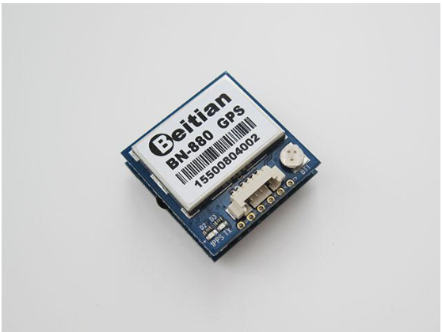

## 2 参数表

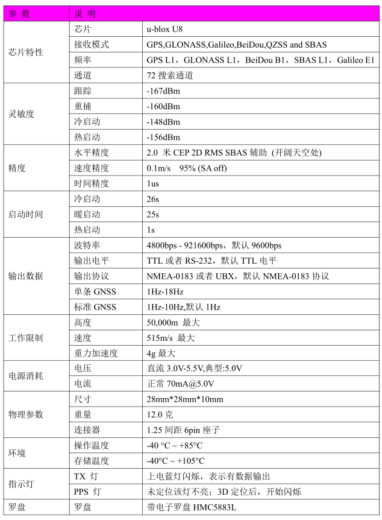

## 3 管脚定义

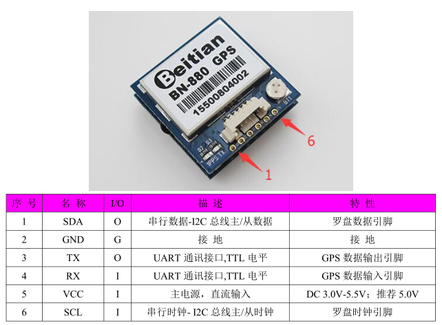

指示灯：
1.蓝灯，TX 灯，上电蓝灯闪烁，表示有数据输出。
2.红灯，PPS 灯，未定位该灯不亮；3D 定位后，开始闪烁。

## 4 模块背面图

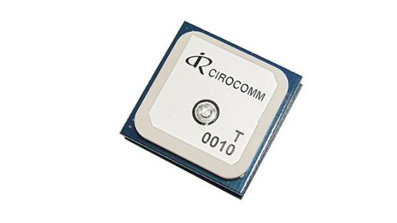

电子罗盘 IC HMC5883L 的位置及指示方向：

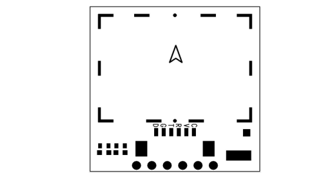

## 5 数据输出协议

联合模式协议头-GN
GPS 模式协议头-GP
GLONASS 模式协议头-GL
北斗模式协议头-GB 或BD
输出实例：

$GNRMC,073114.00,A,2237.56240,N,11401.59614,E,1.329,21.11,020916,,,A,V*37*

$GNVTG,21.11,T,,M,1.329,N,2.462,K,A*1B*

$GNGGA,073114.00,2237.56240,N,11401.59614,E,1,12,0.78,112.9,M,-2.5,M,,*54

$GNGSA,A,3,19,05,02,06,17,12,09,13,,,,,1.48,0.78,1.26,1*01*

$GNGSA,A,3,69,83,84,70,68,82,,,,,,,1.48,0.78,1.26,2*0E*

$GPGSV,4,1,13,02,46,340,36,05,52,254,37,06,42,041,41,09,22,053,40,0*6E

$GPGSV,4,2,13,12,32,282,35,13,13,185,33,17,36,131,37,19,57,119,44,0*66

*$GPGSV,4,3,13,20,03,237,,23,00,038,,25,09,311,19,42,51,128,32,0*60

$GPGSV,4,4,13,50,46,123,33,0*50

*$GLGSV,2,1,08,68,25,027,39,69,78,011,36,70,40,213,43,74,00,259,,0*78

$GLGSV,2,2,08,82,06,124,36,83,46,085,44,84,44,358,41,85,05,324,14,0*74

*$GNGLL,2237.56240,N,11401.59614,E,073114.00,A,A*7C

出范例：
$GNRMC,073114.00,A,2237.56240,N,11401.59614,E,1.329,21.11,020916,,,A,V*37

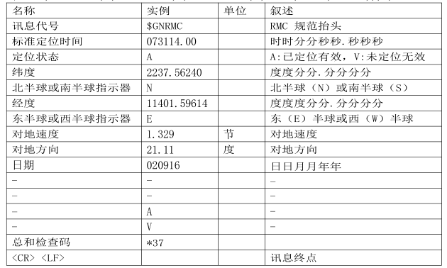

输出范例：
$GNVTG,21.11,T,,M,1.329,N,2.462,K,A*1B

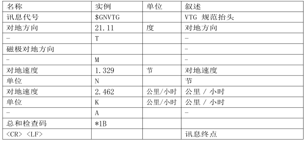

输出范例:
$GNGGA,073114.00,2237.56240,N,11401.59614,E,1,12,0.78,112.9,M,-2.5,M,,*54

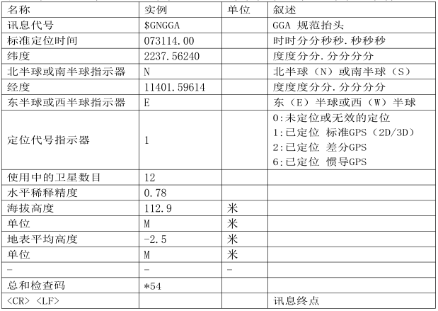

输出范例：

$GNGSA,A,3,19,05,02,06,17,12,09,13,,,,,1.48,0.78,1.26,1*01

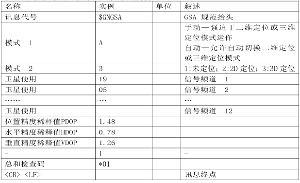

输出范例：
$GPGSV,4,1,13,02,46,340,36,05,52,254,37,06,42,041,41,09,22,053,40,0*6E

$GPGSV,4,2,13,12,32,282,35,13,13,185,33,17,36,131,37,19,57,119,44,0*66

*$GPGSV,4,3,13,20,03,237,,23,00,038,,25,09,311,19,42,51,128,32,0*60

$GPGSV,4,4,13,50,46,123,33,0*50

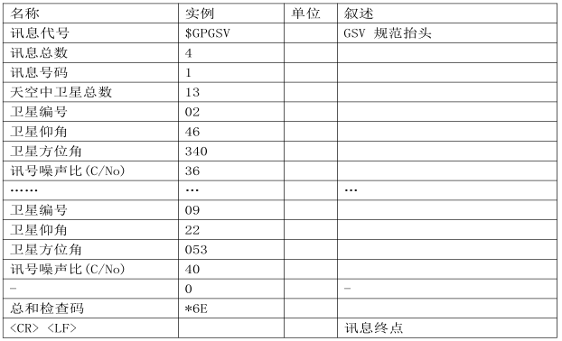

每行最多有四颗卫星。每四颗卫星占用一条GSV，超过自动增加一条GSV 语句。

输出范例：
$GNGLL,2237.56240,N,11401.59614,E,073114.00,A,A*7C

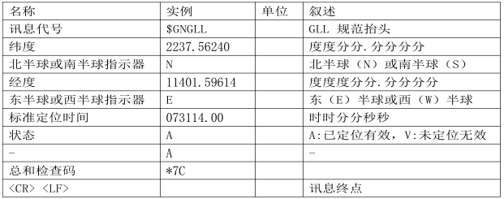

## 支持与服务

| 四博智联资源                                        |                                                              |
| --------------------------------------------------- | ------------------------------------------------------------ |
| 官网                                                | [www.doit.am](http://www.doit.am/)                           |
| 教材                                                | [ESPDuino智慧物联开发宝典](https://item.taobao.com/item.htm?spm=a1z10.3-c.w4002-7420449993.9.Bgp1Ll&id=520583000610) |
| 购买                                                | [官方淘宝店](https://szdoit.taobao.com/)(szdoit.am)          |
| 讨论                                                | [技术论坛](http://bbs.doit.am/forum.php)(bbs.doit.am)        |
| 应用案例集锦                                        |                                                              |
| [Doit玩家云](http://wechat.doit.am)(wechat.doit.am) | [免费TCP公网调试服务](http://tcp.doit.am)(tcp.doit.am)       |
| 官方技术支持QQ群1/2/3群已满                         |                                                              |
| 技术支持群4                                         | 278888904                                                    |
| 技术支持群5                                         | 278888905                                                    |
| 术支持群6                                           | 278888906                                                    |
| 技术支持群7                                         | 278888907                                                    |
| 技术支持群8                                         | 278888908                                                    |
| 技术支持群9                                         | 278888909                                                    |
| 技术支持群10                                        | 278888900                                                    |