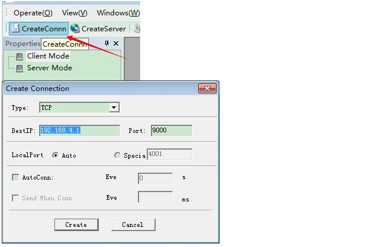

<center><font size=10> ESP8266串口WiFi扩展板 </center></font>
<center> From SZDOIT</center>

## 1 产品简介

​		ESP8266串口WiFi扩展板是深圳四博智联科技有限公司开的一款基于乐鑫ESP8266的超低功耗的UART_WiFi模块，兼容Arduino UNO、Mega灯标准主板，可以方便的进行二次开发，加速产品原型设计。

​		基于乐鑫ESP8266，实现串口转WiFi功能。模块具有以下特点：

​		1、WiFi采用工业级芯片ESP8266，模块为ESP-12E带金属屏蔽罩，强抗干扰能力；

​		2、标准引脚兼容Arduino UNO、Mega2560等主控板，Arduino与UNO连接采用电压转换芯片，使得3.3V和5V兼容；

​		3、串口采用双路拨码开关进行控制，使得扩展板既可以单独作为Arduino UNO扩展板使用，也可以作为ESP8266扩展板使用；

​		4、真正串口WiFi，Arduino程序无需任何配置；

​		5、基于WebServer配置WiFi参数和串口参数；

​		6、可作为独立的ESP8266开发板使用，下载官方AT指令固件。NodeMCU开源固件等；

​		7、可作为独立的Arduino UNO扩展板使用，引脚全部引出。

​		更多的Doit串口WiFi模块扩展板、驱动板资料，可以参考： [http://www.doit.am](http://www.doit.am/)，[https://szdoit.taobao.com](https://szdoit.taobao.com/)/。

## 2 技术规格

- 支持无线802.11 b/g/n标准
- 支持STA/AP两种工作模式
- 内置TCP/IP协议栈，可以配置一个socket
- 支持标准TCP/UDP Server和Client
- 串口波特率支持：1200/2400/4800/9600/19200/38400/74800/115200/ bps
- 串口数据位：5/6/7/8位
- 串口奇偶校验：无
- 串口停止位：1/2位
- 标准Arduino UNO、Mega引脚间距
- 引出Arduino Pin 2/3/4/5/6/7/8/9/10/11/12/13
- 引出ESP8266 GPIO 0/2/4/5/9/10/12/13/14/15/16/ADC/EN/UART TX/UART RX
- RESET复位
- KEY按键复用配置功能
- 两位拨码开关实现Arduino和ESP8266串口扩展板切换
- WiFi工作电流：持续发送：≈70mA（200mA MAX），待机：<200uA
- 无线传输速率：110-460800bps
- 工作温度：-40℃～＋125℃
- 模块重量：约20g

## 3 机械尺寸


## 4 接口定义

本扩展板提供PCB视图所示的接口引脚，每个管脚功能均丝印在线路板上，具体定义如下：


## 5 指示灯含义

SP8266串口WiFi扩展板有两个LED指示灯。红色为电源指示常亮LED。蓝色为多功能指示灯，其具体含义如下：


## 6 快速开始使用

本节使用两个案例快速配置ESP8266串口WiFi，实现串口透传功能。

### 6.1 进入配置模式

扩展板在出厂的时候设置为配置模式，必须设置后才能开始透传使用。此外，如果扩展板已经配置工作在透传模式，可以通过长按KEY按键超过一秒钟进入配置模式，重新对模块进行设定。

1，模块上电，在配置模式下模块WiFi信号：“DoitWiFi_Config”。密码为：“12345678”。


2， 在浏览器输入WiFi扩展板地址：192.168.4.1打开配置页面。 如下图所示。


WiFi扩展板内置的WebServer支持配置串口参数、ESP8266的WiFi工作模式（AP、STA）、网络参数设置等。支持自动或手动扫描AP列表。

3，在此无需进行任何更改。直接点击“Submit”按钮提交。提示成功。


提交后，模块会自动重启，进入AP模式，设置串口参数为9600，n，8，1。WiFi工作模式为热点（AP），ssid为“DoitWiFi_Ser2Net”，密码为“12345678”。建立TCP Server，监听端口为9000。这是WiFi模块的出厂默认配置。如果使用“FactorDefault”，同样会配置为这些参数。

### 6.2 Arduino数据转WiFi

完成上一节步骤后，按照如下简单步骤实现数据透传。

步骤如下：

1，将WiFi扩展板插入Arduino主板的扩展插槽中。将拨码开关的1、2均拨到OFF位置，断开WiFi扩展板与Arduino的串口连接。

2，将下列代码下载到Arduino中。该代码将Arduino的串口初始化为9600，n，8，1。

```
void setup()
{
	Serial.begin(9600);  
}
void loop()
{ 
    delay(1000);
    Serial.println("hello ESP8266 WiFi"); 
}
```

3，拨码开关1/2均拨到ON位置。连接WiFi扩展板和Arduino的串口。上电。

4，笔记本搜索并连接到WiFi扩展板的WiFi信号：“DoitWiFi_Ser2Net”，密码为“12345678”。


5，在电脑上运行tcp udp调试工具。

推荐使用：tcp udp debugger，下载地址： http://bbs.doit.am/forum.php?mod=viewthread&tid=174&page=1&extra=#pid206

运行软件，建立一个tcp客户端连接，DestIP地址为192.168.4.1，Port为9000。本地端口LocalPort设置为Auto。



连接后，可以看到Arduino每隔1秒发送出来的数据，实现了串口数据向网络数据的传送。


### 6.3 连接远程服务器

本例使用Doit的公网TCP工具测试WiFi扩展板与远程服务器通信的功能。

1，从Doit的TCP服务器获取一个临时IP和端口。 此处获得的IP为：“115.29.109.104”，端口为“6533”。


关于TCP公网测试工具更多资料可参考： http://bbs.doit.am/forum.php?mod=viewthread&tid=12&extra=page%3D1

2，WiFi扩展板进入配置模式 WiFi扩展板上电后，长按KEY按键超过一秒钟。连接“DoitWiFi_Config”。密码为：“12345678”。在浏览器中输入“192.168.4.1”，进入WebServer。

3，配置WiFi扩展板工作在节点模式（STA模式），使其连接到可上网的无线路由器

“WiFi Mode”选择“STA”。

此处无线路由器为：“MIFI_A6_cd1c”。密码为“mifi66666666”。

WebServer在加载页面的时候，会自动刷新当前ESP8266搜索到的AP列表。在“AP List中显示”。在选择“STA”时，“Refresh”按钮使能，使用该按钮可刷新扫描结果。


4，配置WiFi扩展板的网络参数

　　Socket Type：选择“Client”。

　　Transport Type：选择“TCP”。

　　Remote IP:“115.28.109.104”。

　　Remote Port：“6533”。


5，“Submit”提交生效。


6，在可以上网的计算机上运行tcp udp调试工具。 推荐使用：tcp udp debugger，下载地址：http://bbs.doit.am/forum.php?mod=viewthread&tid=174&page=1&extra=#pid206

运行软件，建立一个tcp客户端连接，DestIP地址为“115.29.109.104”，Port为“6533”。本地端口LocalPort设置为Auto。


7，在TCP 调试工具可以看到arduino发送的数据。实现了将arduino的数据发送到远程TCP服务器。


### 6.4 工作模式切换

ESP8266串口WiFi扩展板工作流程如下图所示。


### 6.5 串口参数设置

ESP8266串口WiFi扩展板的串口可配置参数见下表。


### 6.6 WiFi模式设置

ESP8266串口WiFi扩展板的WiFi模式可以配置为AP或者STA模式。

在WebServer中，如果选择“AP”模式，“Refresh”按钮和“AP List”将会被禁止使用。此时可以配置AP模式下的SSID和密码。


如果选择“STA”模式，“Refresh”按钮和“AP List”将会被使能。通过“Refresh”按钮可以手动扫描热点SSID，扫描结果将会自动出现在“AP List”下拉列表框中。


### 6.7 网络设置

网络设置可以设置为服务器（Server）或者客户端（Client）模式。WiFi扩展模块只支持一个Socket。

当设置为“Server”时，“Remote IP”输入框被禁止。“Local Port”处需要填写监听端口。


当设置为“Client”时，“Remote IP”输入框被使能。远程IP和连接端口。


网络协议可以根据需要选择TCP或者UDP。

### 6.8 恢复出厂设置

点击Webserver 中“FactoryDefault”恢复出厂设置（STA模式下需要长按Key按钮就如配置模式）。出厂设置见下表


**购买及技术服务**

　　本串口WiFi扩展板购买地址：[ https://szdoit.taobao.com/](https://szdoit.taobao.com/)。

　　购买本产品后，如果想获得本产品的最新信息或者其他产品信息，你可以访问我们的网站：[http://www.doit.am](http://www.doit.am/)

　　产品技术支持：Doit技术支持群 453053759，电话：158 9988 0115。邮箱：[support@doit.am](mailto:support@doit.am)。

其他链接：
ESP8266透传固件：[http://bbs.doit.am/forum.php?mod ... =179&extra=page%3D1](http://bbs.doit.am/forum.php?mod=viewthread&tid=179&extra=page%3D1)
应用案例：[http://bbs.doit.am/forum.php?mod ... =177&extra=page%3D1](http://bbs.doit.am/forum.php?mod=viewthread&tid=177&extra=page%3D1)

## 支持与服务

| 四博智联资源                                        |                                                              |
| --------------------------------------------------- | ------------------------------------------------------------ |
| 官网                                                | [www.doit.am](http://www.doit.am/)                           |
| 教材                                                | [ESPDuino智慧物联开发宝典](https://item.taobao.com/item.htm?spm=a1z10.3-c.w4002-7420449993.9.Bgp1Ll&id=520583000610) |
| 购买                                                | [官方淘宝店](https://szdoit.taobao.com/)(szdoit.am)          |
| 讨论                                                | [技术论坛](http://bbs.doit.am/forum.php)(bbs.doit.am)        |
| 应用案例集锦                                        |                                                              |
| [Doit玩家云](http://wechat.doit.am)(wechat.doit.am) | [免费TCP公网调试服务](http://tcp.doit.am)(tcp.doit.am)       |
| 官方技术支持QQ群1/2/3群已满                         |                                                              |
| 技术支持群4                                         | 278888904                                                    |
| 技术支持群5                                         | 278888905                                                    |
| 术支持群6                                           | 278888906                                                    |
| 技术支持群7                                         | 278888907                                                    |
| 技术支持群8                                         | 278888908                                                    |
| 技术支持群9                                         | 278888909                                                    |
| 技术支持群10                                        | 278888900                                                    |