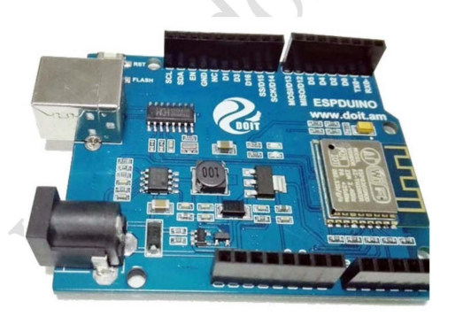

 
  ESPduino基本使用 

 from SZDOIT 

#  简介

本手册只是简单介绍如何搭建 ESPduino 的开发环境及相关参数设置。新版 ESPduino 开发板无需按键。

# 一、安装 ESPduino 开发环境

在下面链接中下载 Arduino 软件(Arduino1.6.8+ESP2.1.0)

[http://espduino.doit.am/](https://github.com/SmartArduino/zhdocs/raw/master/zhControlPanel/ESPDuino/http://espduino.doit.am/      )      

 

在运行 Arduino IDE 之前，需要安装 CH340 驱动，下载地址：[http://espduino.doit.am/](https://github.com/SmartArduino/zhdocs/raw/master/zhControlPanel/ESPDuino/http://espduino.doit.am/)

## 二、运行 Arduino IDE

安装上述链接的安装文件后，默认的安装环境是 ESPduino。主要参数如下：

 开发板默认选择是 ESPduino（ESP‐13 Module）；

Upload Using：“Serial”；

CPU Frequency：“80MHZ”;l 

Flash size：“4M（3M SPIFFS）”；

 端口“COM7”。（不同电脑，端口号不同）

温馨提示 
 在上述提供的链接中下载的 Arduino IDE 安装包，上面这些参数设置是固定的，除了端口。端口是根据个人电脑不同，端口也不一样。具体查找端口的方法如下。选择右键选择“计算机”→“属性”，选择“设备管理器”，可以查到此台电脑的端口号为“COM7”。如果是下载其他的安装软件。可以参考第 4 节的内容进行安装配置。 

#  三、测试 Arduino IDE

​	在第二节中已经将 ESPduino 的开发环境基本搭建确认好后，接下来需要用 Arduino 自动的实例程序来测试一下 ESPduino 的开发环境。

​	1） 选用 ESP8266 自带的 BLINK 示例

​	“文件”→“示例”→“ESP8266”→“Blink”，如下图所示。

​	注意，不要选择“Basics”里面的“Blink”，因为这个是 Arduino 自带的示例，不是 ESPduino的自带示例程序。如果一定要选择“Basics”里面的“Blink”，请将其端口号设置为“16”。ESPduino 默认的 LED 灯端口号为“16”。

2） 编译 Blink打开 ESP8266 自带的 Blink 程序后，先点击编译按钮，如下图所示。如果按照第 2 节中的参数设置成功后，编译一定成功。

 

#  四、搭建 ESPduino 环境第二种方法

1.下载 Arduino:

http://www.arduino.cc/en/main/software

2.安装运行 Arduino

a)打开“文件”‐>首选项 

 

在弹出的界面中输入地址：[http://espduino.doit.am/package_esp8266com_index.json](https://github.com/SmartArduino/zhdocs/raw/master/zhControlPanel/ESPDuino/http://espduino.doit.am/package_esp8266com_index.json)

点击确认后，转入第 4 步，工具 ‐> 开发板 

 搜索 ESP8266，随便点击空白处，即可弹出“安装”按钮。点击“安装”按钮即可完成 ESPduino的安装。

# 五、要点

1）安装指定链接下载的 Arduino 软件，可以直接使用，选择示例时，请选择 ESP8266 中的示例；

2）在下载代码到 ESPduino 开发板时，与原来旧版不同的是，新版 ESPduino 开发板，不需要按按键了；

3 ） 在 已 有 Arduino 系 统 上 使 用 ESPduino 开 发 板 ， 需 要 安 装 手 册 将 网 址http://espduino.doit.am/package_esp8266com_index.json 输入后再安装；

4）以上所有的安装方法适用于基于 ESP8266 的 Arduino 开发板。

5）如果选择 ESPDduino（ESP‐13 module）不能下载，请选择 NodeMCU 1.0 (ESP‐12E Module). 

# 支持与服务

购买地址：

https://item.taobao.com/item.htm?id=525057040876

技术支持 QQ 群：

四博智联技术支持群①：278888901

四博智联 技术支持 群②：278888902

四博智联 技术支持 群③：278888903

四博智联 技术支持 群④：278888904

四博智联 技术支持 群⑤：278888905

四博智联 技术支持 群⑥：278888906

四博智联 技术支持 群⑦：278888907

四博智联 技术支持 群⑧：278888908

四博智联 技术支持 群⑨：278888909

四博智联 技术支持 群⑩：278888900