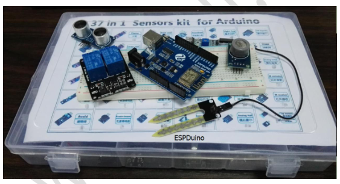

 基于 O ESPDUINO 开发板的 T IOT 物联网平台技术 

 From SZDOIT

 序言

​		本文档详尽介绍了如何用集成了ESP8266芯片的WiFi透传功能的ESPDuino开发板搭载各种传感器实现基于 iot.doit.am 物联网数据控制平台的上传数据到服务器和从远端服务器(物联网控制平台)反向控制板载传感器的功能，实现嵌入式物联网技术的初步应用。

​		文档主要演示了基于 ESPDuino 开发板，应用于 iot.doit.am 物联网平台，采用 TCP协议，通过 WiFi 透传模式进行数据的远程传输。集上传传感器数据到远端与远端反向控制终端的应用举例。

本文档主要内容分为五部分：

​		第一部分是详细介绍了深圳四博智联科技有限公司开发的 ESPDuino 开发板以及配套的程序编译软件 Arduino 的基本使用方法，这部分是初学者必看的内容，假如你已经能熟悉使用基于 ESPDuino 开发板的 Arduino IDE 编译器了，那么此部分内容可以跳过。

​		第二部分是介绍在开始实验之前需要做的准备工作，包括硬件准备、到云平台申请账号和获取对应的 Key 以及阅读相关上传协议等。

​		第三部分开始介绍本文档重点内容的 ESPDuino 板载传感器上传数据到物联网平台(服务器)部分，通过一个应用实例，从硬件连接到图文并茂地介绍该功能的实现方法。

​		第四部分介绍在物联网数据控制平台(服务器)上实现反向控制 ESPDuio 开发板以及板载的各种传感器，也是通过一个应用实例，手把手地介绍了如何实现反向控制的目的。

​		第五部分是综合前面第三、第四部分的内容，同时实现传感器数据上传到远端服务器和在物联网数据控制平台反向控制传感器的功能。这部分内容也主要是通过 7 个综合例子图文并茂地介绍了整个功能的实现和验证，让初学者能较好地掌握整个技术要点。

​		本文档循序渐进地介绍了基于 ESPDuino 开发板和其他传感器应用于 iot.doit.am 物联网数据控制平台实现基本的物联网技术实现，里面所有实验例程和相关程序源码均为作者已亲自验证无误，每个方案虽然简单，但作为抛砖引玉的例程，更多的目的还是为了让读者看懂其中的原理，方便读者举一反三，实现个性化开发。本文档尽可能地图文并茂、内容详实，适合初学者当做物联网技术开发指南，限于作者水平，文中难免会有纰漏之处，若有误导请谅解，也欢迎批评指正，谢谢！

 目 录

序 言.......................................................................................................................................................................................................................2
目录........................................................................................................................................................................................................................3
第一章 ESPduino 基本使用...................................................................................................................................................................................4
1.1 安装 ESPduino 开发环境................................................................................................................................................................................4
1.2 运行 Arduino IDE............................................................................................................................................................................................5
1.3 测试 Arduino IDE............................................................................................................................................................................................6
1.4 搭建 ESPduino 环境第二种方法.....................................................................................................................................................................9
1.5 要点................................................................................................................................................................................................................11
1.6 支持与服务.....................................................................................................................................................................................................11
第二章 准备工作..................................................................................................................................................................................................12
2.1 硬件准备........................................................................................................................................................................................................12
2.2 上传账号以及 API Key...................................................................................................................................................................................12
2.3 阅读上传协议.................................................................................................................................................................................................14
2.3.1 数据上传.....................................................................................................................................................................................................14
2.3.2 控制设备....................................................................................................................................................................................................,15
第三章 上传数据到服务器...................................................................................................................................................................................16
基于 ESPduino 开发板的发送数据到远端控制平台...........................................................................................................................................16
3.1 简介................................................................................................................................................................................................................16
3.2 实验原理........................................................................................................................................................................................................17
3.3 实验过程相关截图说明..................................................................................................................................................................................18
3.4 程序源码........................................................................................................................................................................................................21
第四章 反向控制..................................................................................................................................................................................................27
基于 ESPDuino 的反向控制（网页控制）..........................................................................................................................................................27
4.1 简介................................................................................................................................................................................................................27
4.2 实验原理........................................................................................................................................................................................................30
4.3 实验过程相关截图说明..................................................................................................................................................................................30
4.4 实验效果图.....................................................................................................................................................................................................35
4.5 程序相关源码.................................................................................................................................................................................................36
第五章 综合上传数据到服务器和反向控制........................................................................................................................................................ 39
5.1 简介................................................................................................................................................................................................................39
5.2 综合实验例程.................................................................................................................................................................................................39
例程一 温湿度采集数据上传与远端控制 LED 灯................................................................................................................................................39
例程二 超声波测距上传距离与远端控制继电器和三色灯..................................................................................................................................53
例程三 反向控制蜂鸣器与检测声音上传数据.....................................................................................................................................................67
例程四 反向控制继电器开启 4 个传感器读取数据上传......................................................................................................................................79
例程五 倾斜度、温度和磁场数据上传与反向控制三色灯..................................................................................................................................89
例程六 反向控制激光触发光敏开启温湿度与土壤湿度采集数据上传..............................................................................................................101
例程七 光折断、红外避障和金属触摸传感器数据上传远端与反向控制双色灯..............................................................................................116

更多内容，请访问链接：https://pan.baidu.com/s/1bRkj3iRUpsgfWoaYv9NffQ  提取码：doit 

购买链接：

ESPDuino板：https://item.taobao.com/item.htm?spm=a1z10.3-c-s.w4002-23087949821.9.28ce5ac1dK8pj0&id=520583000610

传感器：https://item.taobao.com/item.htm?spm=a1z10.3-c-s.w4002-23087949821.39.21345ac1eOhU8g&id=539422586797

## 更多资源，请关注公众号！

