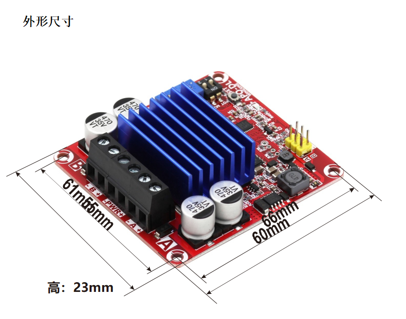
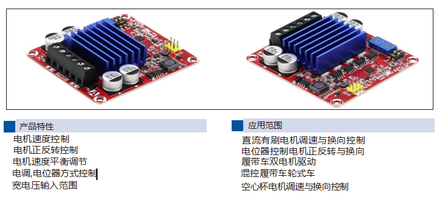
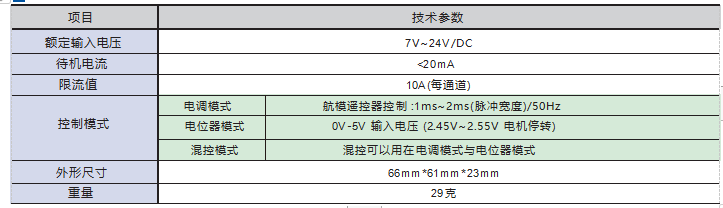
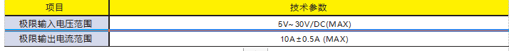
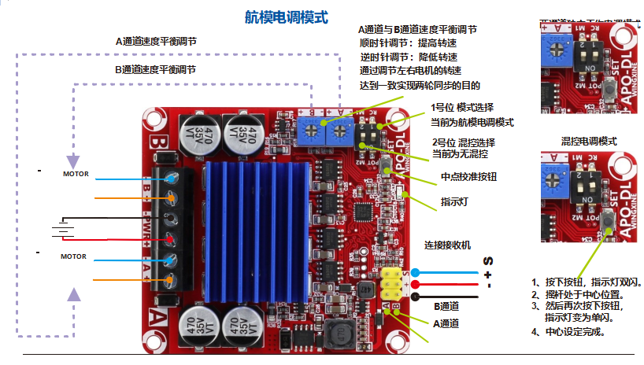
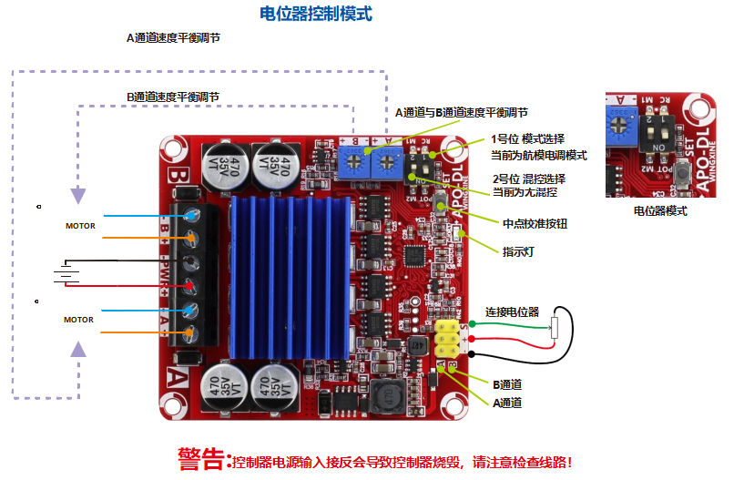
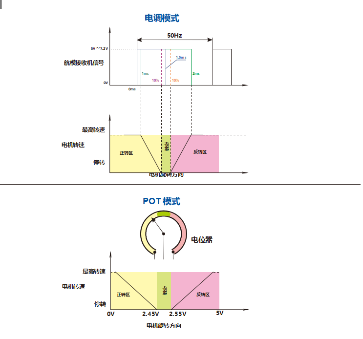
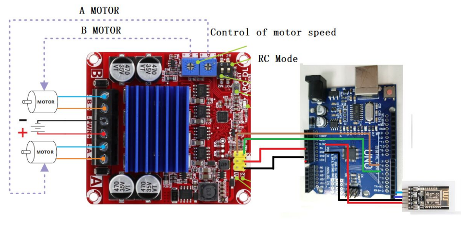
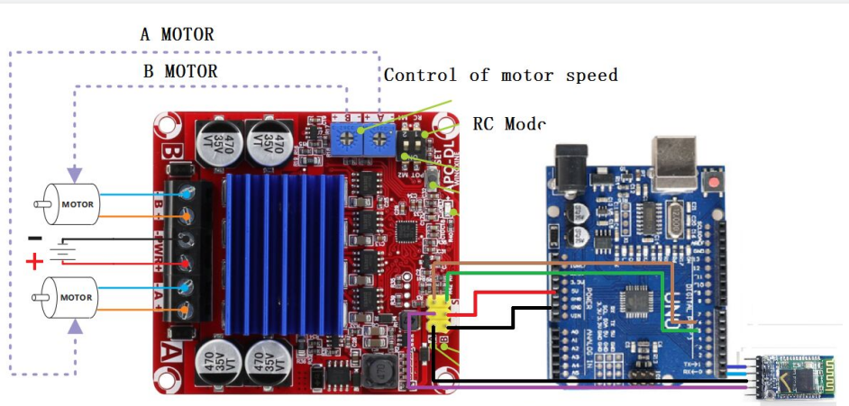
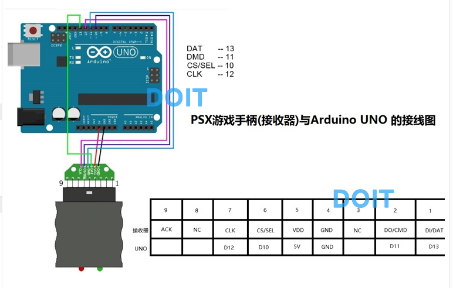

大功率直流有刷电机驱动板数据手册

## 一、概要

## 二、额定参数

### 三、极限参数

## 四、控制模式

### 4.1 航模电调模式

### 4.2 电位器控制模式（示例程序使用）

### 4.3 控制时许

## 五、接线说明

### 5.1 WiFi接线

| Arduino UNO R3 | 大功率板 |
| :------------: | :------: |
|       6        |  A（S）  |
|       7        |  B（S）  |
|       5V       |  B（+）  |
|      GND       |  B（—）  |

| Arduino UNO R3 | 大功率板 | WiFi模块 |
| :------------: | :------: | :------: |
|       TX       |   ----   |    RX    |
|       RX       |   ----   |    TX    |
|      ----      |  A（+）  |   VCC    |
|      ----      |  A（-）  |   GND    |

### 5.2 蓝牙接线

| Arduino UNO R3 | 大功率板 |
| :------------: | :------: |
|       6        |  A（S）  |
|       7        |  B（S）  |
|       5V       |  B（+）  |
|      GND       |  B（—）  |

| Arduino UNO R3 | 大功率板 | 蓝牙模块 |
| :------------: | :------: | :------: |
|       TX       |   ----   |    RX    |
|       RX       |   ----   |    TX    |
|      ----      |  A（+）  |   VCC    |
|      ----      |  A（-）  |   GND    |

### 5.3 手柄接线

| Arduino UNO R3 | 大功率板 |
| :------------: | :------: |
|       6        |  A（S）  |
|       7        |  B（S）  |
|       5V       |  B（+）  |
|      GND       |  B（—）  |

| Arduino UNO R3 | 大功率板 | 手柄接收器 |
| :------------: | :------: | :--------: |
|       10       |   ----   |     CS     |
|       11       |   ----   |    CMD     |
|       12       |   ----   |    CLK     |
|       13       |   ----   |    DAT     |
|      ----      |  A（+）  |    VCC     |
|      ----      |  A（-）  |    GND     |

## 六、操作说明

具体请参照使用一样：https://gitnova-cn.gitee.io/zhdocs/#/zhControlPanel/4&&16ControlKit/4&&16ControlKit 中的第五小结《使用说明》