
 ESP32模块数据手册

 From SZDOIT

# 1.  概述

ESP32 是集成 2.4 GHz Wi-Fi 和蓝牙双模的单芯片方案，采用台积电（TSMC）超低功耗的 40 纳米工艺，拥有最佳的功耗性能、射频性能、稳定性、通用性和可靠性，适用于各种应用和不同功耗需求。

## 1.1 专用解决方案

### 1.1.1 超低功耗

ESP32 专为移动设备、可穿戴电子产品和物联网（IoT）应用而设计。作为业内领先的低功耗芯片，ESP32 具有精细分辨时钟门控、省电模式和动态电压调整等特性。

例如，在低功耗 IoT 传感器 Hub 应用场景中，ESP32 只有在特定条件下才会被周期性地唤醒。低占空比可以令ESP32 芯片的能耗达到最小。射频功率放大器的输出功率也可调节，以实现通信距离、数据率和功耗之间的最佳平衡。

**说明：**

更多信息请参阅第 3.7 节：RTC 和低功耗管理。

### 1.1.2  高集成度

ESP32 是业内集成度领先的 Wi-Fi + 蓝牙解决方案，外部元器件少于 10 个，并且集成了天线开关、射频 Balun、功率放大器、低噪放大器、过滤器以及电源管理模块，极大减少了印刷电路板（PCB）的面积。

ESP32 采用 CMOS 工艺实现单芯片集成射频和基带，还集成了先进的自校准电路，实现了动态自动调整，可以消除外部电路的缺陷，更好地适应外部环境的变化。

因此，ESP32 的批量生产不需要昂贵的专用 Wi-Fi 测试设备。

## 1.2 基础协议

### 1.2.1 Wi-Fi

• 802.11 b/g/n/e/i

• 802.11 n（2.4 GHz），速度高达 150 Mbps

• 802.11 e：QoS 机制实现无线多媒体技术

• WMM-PS, UAPSD

• A-MPDU 和 A-MSDU 帧聚合技术

• 块回复

• 分片和重组

• Beacon 自动监测／扫描

• 802.11 i 安全特性：预认证和 TSN

• 支持 WPA ／ WPA2 ／ WPA2-Enterprise ／ WPS 加密

• 基础结构型网络（Infrastructure BSS）Station 模式／ SoftAP 模式

• Wi-Fi Direct（P2P）、P2P 发现、P2P GO 模式和 P2P 电源管理

• UMA 兼容和认证

• 天线分集与选择

**说明：**

更多信息，请参阅第 3.5 节：Wi-Fi。

### 1.2.2 蓝牙

• 蓝牙 v4.2 完整标准，包含传统蓝牙（BR/EDR）和低功耗蓝牙（BLE） 

• 支持标准 Class-1、Class-2 和 Class-3，且无需外部功率放大器

• 加强的精准功率控制

• 输出功率高达＋ 10 dBm

• NZIF 接收器具有 -98 dBm 的 BLE 接收灵敏度

• 自适应跳频（AFH） 

• 基于 SDIO ／ SPI ／ UART 接口的标准 HCI

• 速度高达 4 Mbps 的高速 UART HCI

• 支持 BT 4.2 controller 和 host 协议栈

• 服务发现协议（SDP） 

• 通用访问应用（GAP） 

• 安全管理协议（SMP） 

• 低功耗蓝牙

• ATT ／ GATT

• HID

• 可支持所有基于 GATT 的低功耗蓝牙应用

• SPP-Like 低功耗蓝牙数据透传协议

• BLE Beacon

• A2DP ／ AVRCP ／ SPP, HSP ／ HFP, RFCOMM

• CVSD 和 SBC 音频编解码算法

• 蓝牙微微网（Piconet）和散射网（Scatternet）

## 1.3 MCU 和高级特性

### 1.3.1 CPU 和存储

• Xtensa® 32-bit LX6 双核处理器，运算能力高达 600 DMIPS

• 448 KByte ROM

• 520 KByte SRAM

• RTC 中 16 KByte SRAM

• QSPI 最多可连接 4 个 Flash ／ SRAM，每个 Flash 最大为 16 MBytes

• 供电电压：2.2V 到 3.6V

### 1.3.2 时钟和定时器

• 内置 8 MHz 振荡器，支持自校准

• 内置 RC 振荡器，支持自校准

• 支持外置 2 MHz 至 40 MHz 的晶振

• 支持外置 32 kHz 晶振，用于 RTC，支持自校准

• 2 个定时器群组，每组包括 2 个 64-bit 通用定时器和 1 个主系统看门狗

• 具有次秒级精度的 RTC 定时器

• RTC 看门狗

### 1.3.3 高级外设接口

• 12-bit SAR ADC，多达 18 个通道

• 2 个 8-bit D/A 转换器

• 10 个触摸传感器

• 温度传感器

• 4 个 SPI

• 2 个 I2S

• 2 个 I2C

• 3 个 UART

• 1 个 Host SD ／ eMMC ／ SDIO

• 1 个 Slave SDIO ／ SPI

• 带有专用 DMA 的以太网 MAC 接口，支持 IEEE 1588

• CAN 2.0

• IR（TX ／ RX） 

• 电机 PWM

• LED PWM，多达 16 个通道

• 霍尔传感器

• 超低功耗前置模拟放大器

### 1.3.4 安全机制

• 支持所有 IEEE 802.11 的安全特性，包括 WFA、WPA ／ WPA2 和 WAPI

• 安全启动

• Flash 加密

• 1024-bit OTP，用户可用的高达 768 bits

• 加密硬件加速器：

– AES

– HASH（SHA-2）库

– RSA

– ECC

– 随机数生成器（RNG）

### 1.3.5 开发支持

• 支持快速线上编程的 SDK 固件

• 基于 GCC 的开源工具链

**说明：**

更多信息请参考第 7 章：支持资源。

## 1.4 应用

• 通用低功耗 IoT 传感器 Hub

• 通用低功耗 IoT 记录器

• 相机的视频流传输

• OTT 电视盒／机顶盒设备

• 音乐播放器

– 网络音乐播放器

– 音频流媒体设备

• Wi-Fi 玩具

– 计数器

– 玩具防丢器

• Wi-Fi 语音识别设备

• 耳麦

• 智能插座

• 家庭自动化

• Mesh 网络

• 工业无线控制

• 婴儿监控器

• 可穿戴电子产品

• Wi-Fi 位置感知设备

• 安全 ID 标签

• 健康医疗

– 运动监测和防丢报警器

– 温度记录仪

## 1.5 功能框图

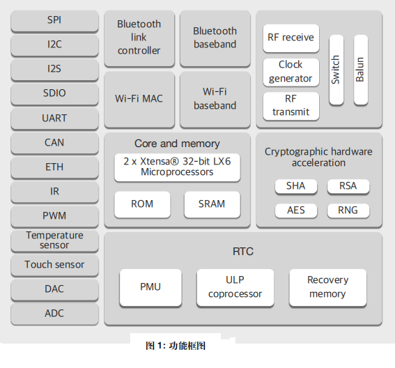

# 2. 管脚定义

## 2.1 管脚布局

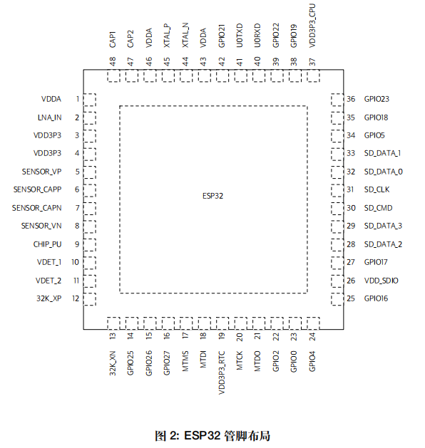

## 2.2 管脚描述

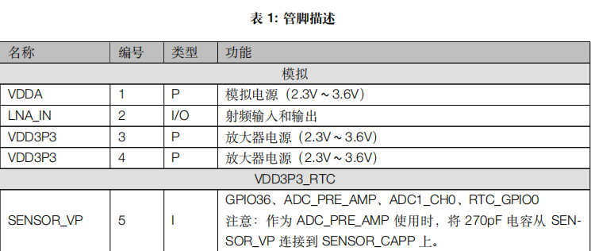

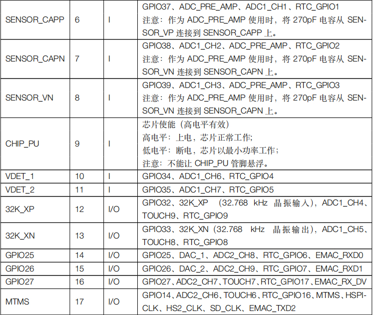

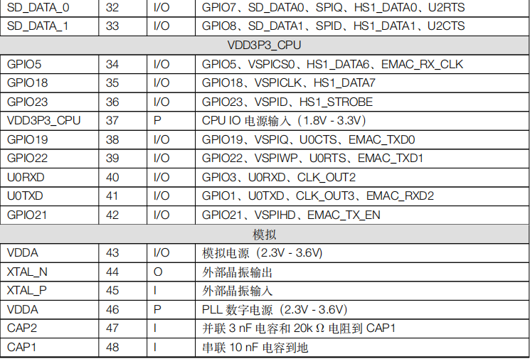

## 2.3 电源管理

ESP32 的数字管脚可分为有 3 种不同的电源域：

• VDD3P3_RTC

• VDD3P3_CPU

• VDD_SDIO

VDD3P3_RTC 同时是 RTC 和 CPU 的输入电源。VDD3P3_CPU 是 CPU 的输入电源。

VDD_SDIO 与一个内置 LDO 的输出相连，该内置 LDO 的输入是 VDD3P3_RTC。当 VDD_SDIO 与 VDD3P3_RTC 连接在相同的电源上，内置 LDO 会自动关闭。

内置 LDO 可被配置成 1.8V 或与 VDD3P3_RTC 相同的电压。在 Deep-sleep 模式下，为了使 Flash 电流降到最低, 可以通过软件关闭内置 LDO。

**说明：**

VDD3P3_RTC、VDD3P3_CPU 和模拟的电源在管脚 CHIP_PU 设置为高电平之前需要保持稳定。

## 2.4  Strapping 管脚

ESP32 共有 6 个 Strapping 管脚。

• MTDI：内部下拉

• GPIO0：内部上拉

• GPIO2：内部下拉

• GPIO4：内部下拉

• MTDO：内部上拉

• GPIO5：内部上拉

软件可以读取寄存器“GPIO_STRAPPING”中这 6 个位的值。

在芯片上电复位过程中，Strapping 管脚对电平采样并存储到锁存器中，锁存为“0”或“1”，并一直保持到芯片掉电或关闭。

每一个 Strapping 管脚都会连接内部上拉／下拉。如果一个 Strapping 管脚没有外部连接或者连接的外部线路处于高阻抗状态，内部弱上拉／下拉将决定 Strapping 管脚输入电平的默认值。

为改变 Strapping 比特的值，用户可以应用外部下拉／上拉电阻，或者应用主机 MCU 的 GPIO 控制 ESP32 上电复位时的 Strapping 管脚电平。

复位后，Strapping 管脚和普通管脚功能相同。

配置 Strapping 管脚的详细启动模式请参阅表 2 。

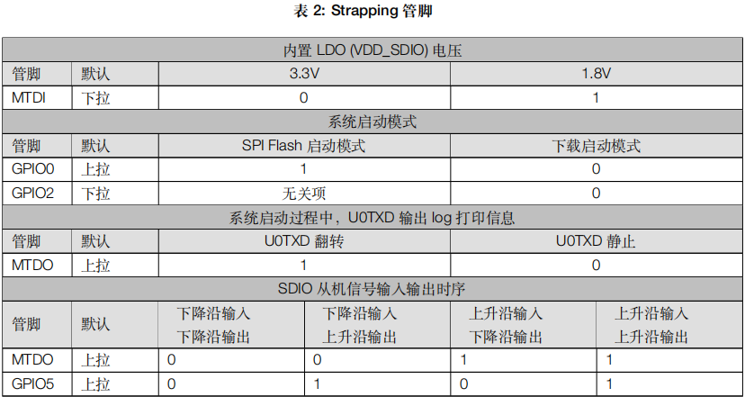

**说明：**

固件可以通过配置一些寄存器比特位，在启动后改变“内置 LDO (VDD_SDIO) 电压”和“SDIO 从机信号输入输出时序”的设定。

# 3. 功能描述

本章描述了 ESP32 的具体功能。

## 3.1 CPU 和存储

### 3.1.1 CPU

ESP32 搭载低功耗 Xtensa® LX6 32-bit 双核处理器，具有以下特性：

• 7 级流水线架构，支持高达 240 MHz 的时钟频率

• 16-bit ／ 24-bit 指令集提高代码密度

• 支持浮点单元（FPU） 

• 支持 DSP 指令，例如 32-bit 放大器、32-bit 除法器和 40-bit 累加乘法器（MAC） 

• 支持来自约 70 个中断源的 32 个中断向量

双核处理器接口包括：

• Xtensa RAM ／ ROM 指令和数据接口

• 用于快速访问外部寄存器的 Xtensa 本地存储接口

• 具有内外中断源的中断

• 用于调试的 JTAG 接口

### 3.1.2 片上存储

ESP32 片上存储包括：

• 448 KBytes 的 ROM，用于程序启动和内核功能调用

• 用于数据和指令存储的 520 KBytes 片上 SRAM

• RTC 中 8 KBytes 的 SRAM，即 RTC 慢速存储器，可以在 Deep-sleep 模式下被协处理器访问

• RTC 中 8 kBytes 的 SRAM，即 RTC 快速存储器，可以在 Deep-sleep 模式下 RTC 启动时用于数据存储以及被主 CPU 访问

• 1 kbit 的 EFUSE，其中 256 bits 为系统专用（MAC 地址和芯片设置）；其余 768 bits 保留给用户应用，这些应用包括 Flash 加密和芯片 ID

### 3.1.3 外部 Flash 和 SRAM

ESP32 最多支持 4 个 16 MBytes 的外部 QSPI Flash 和静态随机存储器（SRAM），具有基于 AES 的硬件加密功能，从而保护开发者的程序和数据。

ESP32 通过高速缓存访问外部 QSPI Flash 和 SRAM： 

• 高达 16 MBytes 的外部 Flash 映射到 CPU 代码空间，支持 8-bit、16-bit 和 32-bit 访问，并可执行代码。

• 高达 8 MBytes 的外部 Flash 和 SRAM 映射到 CPU 数据空间，支持 8-bit、16-bit 和 32-bit 访问。Flash 仅支持读操作，SRAM 可支持读写操作。

### 3.1.4 存储器映射

ESP32 的地址映射结构如图 3 所示。ESP32 存储器和外设地址映射如表 3 所示

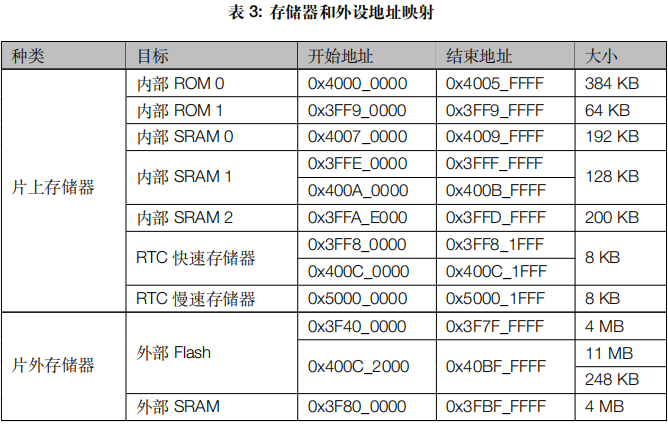

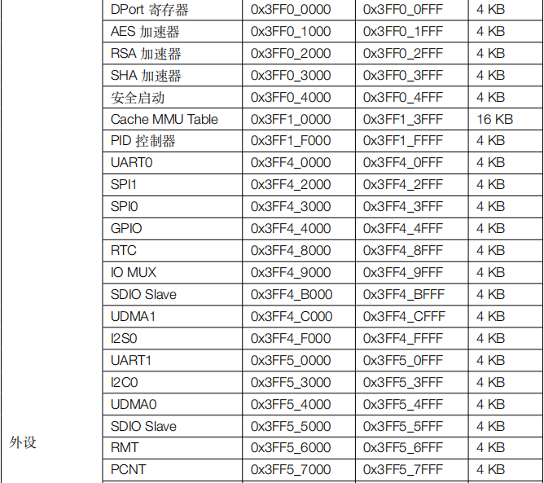

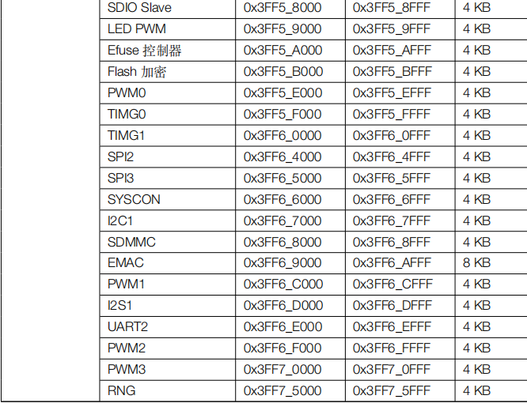

## 3.2 定时器和看门狗

### 3.2.1 64-bit 通用定时器

ESP32 内置 4 个 64-bit 通用定时器，具有 16-bit 分频器和 64-bit 可自动重载的向上／向下计数器。

定时器特性：

• 16-bit 时钟分频器，分频系数为 2 至 65536

• 64-bit 时基计数器

• 时基计数器方向可配置：递增或递减

• 软件控制计数暂停和继续

• 定时器超时自动重载

• 软件控制的即时重载

• 电平触发中断和边沿触发中断

### 3.2.2 看门狗定时器

ESP32 中有 3 个看门狗定时器：2 个定时器模块中各有 1 个（称作主看门狗定时器，即 MWDT），RTC 模块中也有 1 个（称作 RTC 看门狗定时器，即 RWDT）。意外的软件或硬件问题会导致应用程序工作失常，而看门狗定时器可以帮助系统从中恢复。看门狗定时器有 4 个阶段。如果当前阶段超过预定时间，但没有喂狗或关闭看门狗定时器，可能引发以下 3 到 4 种动作中的 1 种。这些动作是：中断、CPU 复位、内核复位和系统复位。其中，只有 RWDT 能够触发系统复位，将复位包括 RTC 在内的整个芯片。每个阶段的超时时间长度均可单独设置。

在 Flash 启动期间，RWDT 和第一个 MWDT 会自动开启，以便检测和修复启动问题。

ESP32 看门狗具有以下特性：

• 4 个阶段，每一阶段都可被单独配置或关闭

• 各阶段时间段可被编程

• 如阶段超时，会采取 3 到 4 种可能动作中的 1 种（中断、CPU 复位、内核复位和系统复位）

• 32-bit 超时计数器

• 写保护，防止 RWDT 和 MWDT 配置被不小心改变

• SPI Flash 启动保护

如果在预定时间内，来自 SPI Flash 的启动过程没有完成，看门狗会重启整个系统。

## 3.3 系统时钟

### 3.3.1 CPU 时钟

一旦重启，一个外置晶振时钟源（2 MHz ~ 60 MHz）会被选为默认的 CPU 时钟。这个外置晶振时钟源也会与PLL 连接产生一个高频时钟（通常为 160 MHz）。

另外，ESP32 内置了一个 8 MHz 的振荡器，保证其在工作温度范围内都能保持精度稳定（误差小于 1%）。因此，应用程序可以从外置晶振时钟源、PLL 时钟和内置 8 MHz 时钟当中选择。根据应用程序不同，被选择的时钟源直接或在分频之后驱动 CPU 时钟。

### 3.3.2 RTC 时钟

RTC 时钟有 5 种可能的时钟源：

• 外置低速（32 kHz）晶振时钟

• 4 分频外置晶振时钟

• 内置 RC 振荡器（通常为 150 kHz，频率可调节）

• 内置 8 MHz 振荡器时钟

• 内置 31.25 kHz 时钟（由内置 8 MHz 振荡器时钟经 256 分频生成）

当芯片处于正常功耗模式且需要更快速的 CPU 访问时，应用程序可选择 4 分频外部高速晶振时钟或者内置 8MHz 振荡器时钟。当芯片在低功耗模式下运行时，应用程序可选择外部低速（32 kHz）晶振时钟、内置 RC 振荡器时钟或内置 31.25 kHz 时钟。

### 3.3.3 音频 PLL 时钟

音频时钟由超低噪声 fractional-N PLL 生成。根据以下公式，音频 PLL 的输出频率可配置范围是 16 MHz 至 128MHz： 

其中，f*out* 表示输出频率，f*xtal* 表示晶振的频率，N*div*、M*div* 和 K*div* 都是整数值，由寄存器配置。

## 3.4 射频

ESP32 射频包含以下主要模块：

• 2.4 GHz 接收器

• 2.4 GHz 发射器

• 偏置和线性稳压器

• Balun 和收发切换器

• 时钟生成器

### 3.4.1 2.4 GHz 接收器

2.4 GHz 接收器将 2.4 GHz 射频信号降频为正交基带信号，并用 2 个高精度、高速的 ADC 将后者转为数字信号。为了适应不同的信道情况，ESP32 集成了 RF 滤波器、自动增益控制（AGC）、DC 偏移补偿电路和基带滤波器。

### 3.4.2 2.4 GHz 发射器

2.4 GHz 发射器将正交基带信号升频到 2.4 GHz 射频信号，使用大功率互补金属氧化物半导体（CMOS）功率放大器驱动天线。数字校准进一步改善了功率放大器的线性，使得 802.11b 无线传输达到 +20.5 dBm 的平均功率，802.11n 无线传输达到 +17 dBm 的平均功率，功能超强。

为了抵消射频接收器的瑕疵，ESP32 还另增了校准措施，例如: 

• 载波泄露

• I/Q 相位匹配

• 基带非线性

• 射频非线性

• 天线匹配

这些内置校准措施缩短了产品的测试时间，不再需要测试设备。

### 3.4.3 时钟生成器

时钟生成器为接收器和发射器生成 2.4 GHz 正交基带时钟信号，所有部件均集成于芯片上，包括电感、变容二极管、闭环滤波器、线性稳压器和分频器。

时钟生成器含有内置校准电路和自测电路。运用拥有自主知识产权的校准算法，正交时钟相噪特性在片上经过算法优化处理（该算法拥有自主知识产权），以确保接收器和发射器达到最佳性能。

## 3.5 Wi-Fi

ESP32 支持 TCP ／ IP 协议，完全遵循 802.11 b/g/n/e/i WLAN MAC 协议和 Wi-Fi Direct 标准，支持分布式控制功能（DCF）下的基本服务集（BSS）STA 和 SoftAP 操作，也支持最新 Wi-Fi P2P 协议的 P2P GO 模式。

通过适当的命令，ESP32 会自动实施主动扫描、被动扫描以及 P2P 发现。通过最小化主机交互来优化有效工作周期，以实现功耗管理。

### 3.5.1 Wi-Fi 射频和基带

ESP32 Wi-Fi 射频和基带支持以下特性：

• 802.11b 和 802.11g 数据率

• 802.11n MCS0-7 同时支持 20 MHz 和 40 MHz 带宽

• 802.11n MCS32

• 802.11n 0.4 *µ*S 保护间隔

• 数据率高达 150 Mbps

• 接收 STBC 2x1

• 发射功率高达 21 dBm

• 可调节的发射功率

• 天线分集与选择（软件控制硬件）

### 3.5.2 Wi-Fi MAC

ESP32 Wi-Fi MAC 自行支持的底层协议功能如下：

• RTS ／ CTS 和 ACK ／ BA

• 分片和重组

• 帧聚合算法 AMPDU 和 AMSDU

• WMM，U-APSD

• 802.11 e：QoS 机制实现无线多媒体技术

• CCMP（CBC-MAC，计数器模式）、TKIP (MIC，RC4)、WAPI (SMS4)、WEP (RC4) 和 CRC

• 帧封装（802.11h ／ RFC 1042） 

• 自动 Beacon 监测／扫描

### 3.5.3 Wi-Fi 固件

ESP32 Wi-Fi 固件具有以下功能：

• 基础结构型网络（Infrastructure BSS）工作站（Station）模式／ P2P 模式／ SoftAP 模式

• P2P 发现、P2P GO、P2P GC 和 P2P 电源管理

• WPA ／ WPA2-Enterprise 和 WPS 驱动

• 附加 802.11i 安全特性，例如预认证和 TSN

• 针对企业级平台的认证开放接口，例如 TLS、PEAP、LEAP、SIM、AKA 或者用户自定义接口

• 时钟／电源门控与符合 802.11 标准的电源管理一起动态地适应当前连接条件，实现最小功耗

• 自适应速率回退算法基于实际信噪比（SNR）和丢包信息来控制最佳传输速率和发射功率

• MAC 层的自动重传和应答，以防止在慢速主模式环境中的数据包丢弃

### 3.5.4 通信包仲裁（PTA）

ESP32 拥有一个可配置的通信包仲裁器，支持灵活而精确的 Wi-Fi 和蓝牙共存模式。它采用频分多路复用（FDM）

和时分复用（TDM）的组合机制，自动协调 2 个协议栈，主要特性如下：

• Wi-Fi 最好在 20 MHz 带宽模式下工作，以减少与蓝牙的干扰

• BT 采用 AFH（自适应跳频）来避免在 Wi-Fi 带宽内使用信道

• Wi-Fi MAC 限制 Wi-Fi 数据包的持续时间，也不以最低数据率发射长的 Wi-Fi 数据包

• 一般来讲，BT 数据包的优先级高于正常的 Wi-Fi 数据包

• 保护关键的 Wi-Fi 数据包，包括 Beacon 的收发以及 ACK ／ BA 的收发

• 保护最高优先级的 BT 数据包，包括查询应答、页面响应、LMP 数据和应答、Park Beacon、上一次轮询周期、SCO ／ eSCO 时段以及 BLE 事件序列

• Wi-Fi MAC 采用 CTS-to-self 数据包来保护蓝牙传输的持续时间

• 在 P2P GO 模式下，Wi-Fi MAC 采用缺席通知（NoA）数据包来关闭 Wi-Fi 传输，从而为蓝牙预留时间

• 在 STA 模式下，Wi-Fi MAC 通过带有 Power-Save 比特位的 NULL 数据包来关闭 Wi-Fi 传输，从而为蓝牙预留时间

## 3.6 蓝牙

ESP32 集成了蓝牙链路控制器和蓝牙基带，支持基带协议和其他低层链路协议，例如调制／解调、包处理、比特流处理和跳频等。

### 3.6.1 蓝牙射频和基带

ESP32 蓝牙射频和基带支持以下特性：

• Class-1、Class-2 和 Class-3 发射输出功率，动态控制范围超过 30 dB

• *π*/4 DQPSK 和 8 DPSK 调制

• NZIF 接收器灵敏度高，动态范围超过 98 dB

• 无需外部 PA 即可支持 Class-1 操作

• 内置 SRAM 支持全速数据传送、混合语音和数据以及完整的微微网（Piconet）运行

• 用于前向纠错、包头错误控制、接入码相关、CRC、解调、加密比特流生成、白化和发送脉冲成形的逻辑电路

• ACL、SCO、eSCO 和 AFH

• PCM 接口中的 A-law、*µ*-law 和 CVSD 数字音频编解码

• SBC 音频编解码

• 低功耗应用的电源管理

• 带有 128-bit AES 的 SMP

### 3.6.2 蓝牙接口

• 提供 UART HCI 接口，速度高达 4 Mbps

• 提供 SDIO ／ SPI HCI 接口

• 为主机提供 I2C 接口以进行配置

• 提供 PCM ／ I2S 音频接口

### 3.6.3 蓝牙协议栈

ESP32 的蓝牙协议栈符合蓝牙 v4.2 BR/EDR 和 BLE 标准。

### 3.6.4 蓝牙链路控制器

链路控制器主要可实现 3 种操作：Standby、Connection 和 Sniff。可实现多路连接以及查询、寻呼和安全简易配

对（SSP）等操作，因此能够组建微微网（Piconet）和散射网（Scatternet）。以下为链路控制器的主要特性：

• 传统蓝牙

– 设备发现（查询和查询扫描）

– 建立连接（寻呼和寻呼扫描）

– 多连接

– 支持异步数据收发

– 同步连接（SCO ／ eSCO） 

– 主从切换

– 自适应跳频（AFH）和信道选择

– 加密广播

– 授权和加密

– 安全简易配对（SSP） 

– 多点连接和散射网（Scatternet）管理

– Sniff（呼吸）模式

– 非连接的从模式广播（收发）

– 增强型功率控制

– Ping

• 低功耗蓝牙

– 广播

– 扫描

– 多连接

– 异步数据收发

– 自适应跳频和信道选择

– 连接参数更新

– 支持扩展的数据包长度

– 链路层加密

– LE Ping

## 3.7 RTC 和低功耗管理

ESP32 拥有先进的电源管理技术，可以切换到不同的省电模式（见表 4）。

• 省电模式

– Active 模式：芯片射频处于工作状态。芯片可以接收、发射和侦听信号。

– Modem-sleep 模式：CPU 可运行，时钟可被配置。Wi-Fi ／蓝牙基带和射频关闭。

– Light-sleep 模式：CPU 暂停运行。RTC 和 ULP 协处理器运行。任何唤醒事件（MAC、主机、RTC 定时器或外部中断）都会唤醒芯片。

– Deep-sleep 模式：只有 RTC 处于工作状态。Wi-Fi 和蓝牙连接数据存储在 RTC 中。ULP 协处理器可以工作。

– Hibernate 模式：内置的 8 MHz 振荡器和 ULP 协处理器均被禁用。RTC 内存回收电源被切断。只有1 个位于慢时钟上的 RTC 时钟定时器和某些 RTC GPIO 在工作。RTC 时钟定时器或 RTC GPIO 可以将芯片从 Hibernate 模式中唤醒。

• 睡眠方式

– 关联睡眠方式：省电模式在 Active 模式与 Modem ／ Light-sleep 模式之间切换。CPU、Wi-Fi、蓝牙和射频按照预设的时间间隔被唤醒，以保证 Wi-Fi ／蓝牙的连接。

– 超低功耗传感器监测方式：主系统处于 Deep-sleep 模式，ULP 协处理器定期被开启或关闭来测量传感器数据。根据传感器测量到的数据，ULP 协处理器决定是否唤醒主系统。

功耗随省电模式／睡眠方式以及功能模块的工作状态而改变（见表5）。

**说明：**

更多有关射频功耗的内容，参见第 5.3 节：射频功耗参数。

# 4.外设接口

## 4.1 通用输入／输出接口（GPIO）

ESP32 共有 48 个 GPIO 管脚，通过配置对应的寄存器，可以为这些管脚分配不同的功能，包括如下几类 GPIO：

只有数字功能的 GPIO、带模拟功能的 GPIO 以及带电容触摸功能的 GPIO 等等。带模拟功能的 GPIO 可以被配置为数字 GPIO。带电容触摸功能的 GPIO 可被配置为数字 GPIO。

每个带数字功能的 GPIO 都可以被配置为内部上拉／下拉，或者被设置为高阻。当被配置为输入时，可通过读取寄存器获取输入值。输入管脚也可以被设置为通过边缘触发或电平触发来产生 CPU 中断。简言之，数字 IO 管脚都是双向、非反相和三态的，包括带有三态控制的输入和输出缓冲器。这些管脚可以复用作其他功能，例如SDIO 接口、UART、SI 等。用于低功耗运行时，GPIO 可被设定为保持状态。

## 4.2 模／数转换器（ADC）

ESP32 集成了 12-bit SAR ADC，共支持 18 个模拟通道输入。其中一些管脚可以通过配置可编程增益放大器，用作测量弱模拟信号。为了实现更低功耗，ESP32 的 ULP 协处理器也可以在睡眠方式下测量电压，此时，可通过设置阈值或其他触发方式唤醒 CPU。

通过适当的设置，最多可配置 18 个管脚的 ADC 和放大器，用于电压模数转换。

## 4.3 超低噪声前置模拟放大器

ESP32 集成了一个超低噪声前置模拟放大器输出给 ADC。增益率由一对片外采样电容器的大小决定。选用一个更大的电容，采样噪声会减小，但是稳定时间会延长。增益率还受到放大器的限制，放大器的最大电压增益约为 60 dB。

## 4.4 霍尔传感器

ESP32 集成的霍尔传感器是基于空穴（N-carrier）电阻设计的。当芯片置于电磁场中时，霍尔传感器会在电阻上横向产生一个小电压。这个小电压可由 ADC 直接测量，也可经过超低噪声前置模拟放大器放大后再由 ADC 测量。

## 4.5 数／模转换器（DAC）

ESP32 有 2 个 8-bit DAC 通道，将 2 个数字信号分别转化为 2 个模拟电压信号输出。DAC 电路由内置电阻串和 1 个缓冲器组成。这 2 个 DAC 可以作为参考电压使用，也可以作为其它电路的电源使用。这是 2 个独立的DAC。

## 4.6 温度传感器

温度传感器生成一个随温度变化的电压。内部 ADC 将传感器电压转化为一个数字量。

温度传感器的测量范围为 -40°C 到 125°C。由于制程漂移，每颗芯片的温度传感器补偿各不相同，而且 Wi-Fi 电路本身也会产生热量（这影响了测量结果），因此内置温度传感器只适用于那些探测温度变化而不是绝对温度的应用，也适用于校准。

不过，如果用户校准了温度传感器，并且在最低功耗的应用上使用该传感器，结果就会足够精确。

## 4.7 触摸传感器

ESP32 提供了多达 10 个电容式传感 GPIO，能够探测由手指或其他物品直接接触或接近而产生的电容差异。这种设计的低噪声特性和电路的高灵敏度支持使用相对较小的触摸板。也可以使用触摸板阵列以探测更大区域或更多点。表 6 列出了 10 个电容式传感 GPIO。 

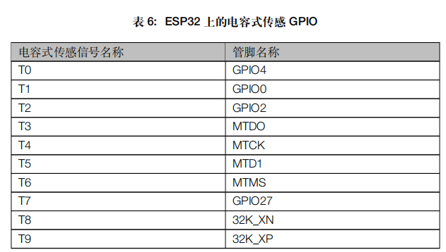

**说明：**

关于触摸传感器的设计与布局的更多内容，参见附录 A：触摸传感器。

## 4.8 超低功耗协处理器（ULP）

ULP 处理器和 RTC 存储器在 Deep-sleep 模式下仍保持工作状态。因此，开发者可以将 ULP 协处理器的程序存放在 RTC 存储器中，使其能够在 Deep-sleep 模式下访问外设、内置定时器和内置传感器。在 CPU 需要由外部事件、定时器或者这些事件的组合来唤醒的应用中，可用于保持最低的功耗。

## 4.9 以太网MAC 接口

ESP32 为以太网通信提供了一个符合 IEEE-802.3-2008 标准的媒体访问控制器（MAC）接口。ESP32 需要一个外部物理接口（PHY）来连接实体 LAN 总线（双绞线、光纤等）。物理接口通过 17 个 MII 信号或 9 个 RMII 信号与 ESP32 连接。以太网 MAC 接口（EMAC）支持以下特性：

• 10 Mbps 和 100 Mbps 的速率

• 专用的 DMA 控制器实现以太网 MAC 接口与专用 SRAM 之间的高速传输

• 带标记的 MAC 帧（支持 VLAN） 

• 半双工（CSMA ／ CD）和全双工操作

• MAC 控制子层（控制帧）

• 32-bit CRC 自动生成和消除

• 用于单播和组播地址（广播和组地址）的多种地址过滤模式

• 记录每个收发帧的 32-bit 状态码

• 内部 FIFO 用于缓冲发射和接收帧。发送 FIFO 和接收 FIFO 均为 512 字（32-bit） 

• 符合 IEEE 1588 2008（PTP V2）标准的硬件 PTP（精确时间协议）

• 25 MHz ／ 50 MHz 的时钟输出

## 4.10 SD／SDIO ／MMC 主机控制器

ESP32 拥有一个 SD ／ SDIO ／ MMC 主机控制器，支持以下特性：

• SD 卡 3.0 和 3.01 版本

• SDIO 3.0 版本

• CE-ATA 1.1 版本

• 多媒体卡（MMC 4.41 版本、eMMC 4.5 版本和 4.51 版本）

控制器实现了高达 80 MHz 的时钟输出，并且支持 3 种数据总线模式：1 bit、4 bit 和 8 bit。在 4-bit 数据总线模式中，可以支持 2 个 SD ／ SDIO ／ MMC4.41 卡，还支持 1 个以 1.8V 电压工作的 SD 卡。

## 4.11 通用异步收发器（UART）

ESP32 有 3 个 UART 接口，即 UART0、UART1 和 UART2，支持异步通信（RS232 和 RS485）和 IrDA，通信速率可达到 5 Mbps。UART 支持 CTS 和 RTS 信号的硬件管理以及软件流控（XON 和 XOFF）。3 个接口均可被DMA 访问或者 CPU 直接访问。

## 4.12 I2C 接口

ESP32 有 2 个 I2C 总线接口，根据用户的配置，总线接口可以用作 I2C 主机或从机模式。I2C 接口支持：

• 标准模式（100 kbit/s） 

• 高速模式（400 kbit/s） 

• 速度最大可达 5 MHz，但受制于 SDA 上拉强度

• 7-bit/10-bit 寻址模式

• 双寻址模式

用户可以配置指令寄存器来控制 I2C 接口，从而实现更多灵活的应用。

## 4.13 I2S 接口

ESP32 拥有 2 个标准 I2S 接口。这 2 个接口可以以主机或从机模式，在全双工或半双工模式下工作，并且可被配置为 8/16/32/40/48-bit 的输入输出通道，支持频率从 10 kHz 到 40 MHz 的 BCK 时钟。当 1 个或 2 个 I2S 接口被配置为主机模式时，主机时钟可以输出到外部 DAC ／ CODEC。 

2 个 I2S 接口都有专用的 DMA 控制器。支持 PDM 和 BT PCM 接口。

## 4.14 红外遥控器

红外遥控器支持 8 通道的红外发射和接收。通过程序控制脉冲波形，遥控器可以支持多种红外协议。8 个通道共用 1 个 512 x 32-bit 的存储模块来存放收发的波形。

## 4.15 脉冲计数器

脉冲计数器通过 7 种模式捕捉脉冲并对脉冲边沿计数。内部有 8 个通道，每个通道一次可同时捕捉 4 个信号。每组 4 个输入包括 2 个脉冲信号和 2 个控制信号。当计数器达到了设定的阈值，就会产生 1 个中断。

## 4.16 脉冲宽度调制（PWM）

PWM 控制器可以用于驱动数字马达和智能灯。该控制器包含 PWM 定时器、PWM 执行器和 1 个专用的捕捉子模组。定时器可以同步定时，也可以独立运行。每个 PWM 执行器为 1 个 PWM 通道生成波形。专用的捕捉子模组可以精确捕捉外部定时事件。

## 4.17 LED PWM

LED PWM 控制器可以生成 16 路独立的数字波形，波形的周期和占空比可配置。

16 路信号在 80 MHz APB 总线时钟下工作，其中 8 路信号可以选择使用芯片内置的 8 MHz 振荡器时钟，可在Light-sleep 模式下工作。每路信号可选择 1 个 20-bit 定时器，定时器的计数范围可配置，在输出信号周期为 1ms 时，占空比的精确度可以高达 16 bit。

通过软件可以实时改变占空比。另外，每路 LED PWM 支持自动步进式地增加或减少占空比，可以用于 LED RGB彩色梯度发生器。

## 4.18 串行外设接口（SPI）

ESP32 共有 3 组 SPI（SPI、HSPI 和 VSPI）接口，可以在主机或从机模式，在 1-line 全双工或 1/2/4-line 单工通信模式下工作，作为通用 SPI 支持以下特性：

• 4 种定时模式的 SPI 格式传输，模式取决于极性（POL）和相位（PHA） 

• 最高支持 80 MHz，也支持 80 MHz 的分频时钟

• 最高支持 64 Bytes 的 FIFO

所有 SPI 接口也可以用来连接外部 Flash ／ SRAM 和 LCD。每一个 SPI 控制器可连接到 DMA 通道。

## 4.19 硬件加速器

ESP32 配备硬件加速器，支持一些通用加密算法，比如 AES（FIPS PUB 197）、SHA（FIPS PUB 180-4）、RSA和 ECC 等，还支持大数乘法、大数模乘等独立运算。硬件加速器支持的 RSA、ECC、大数乘法和大数模乘运算最大长度可达 4096 bits。

硬件加速器极大提高了运算速度，显著减小了软件的复杂度。硬件加速器还支持对 Flash 的加密与动态解密，确保 Flash 中的代码不被窃取。

# 5. 电气特性

**说明：**

如无特别说明，本章参数测试条件如下：V*BAT* = 3.3V，T*A* = 27°C。

## 5.1 极限参数

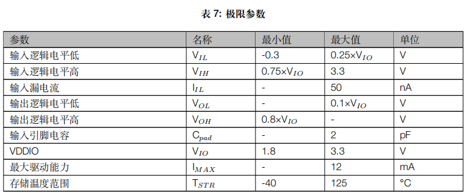

## 5.2 建议工作条件

## 5.3 射频功耗参数

下列功耗数据是基于 3.0 V 电源、25°C 环境温度，在天线接口处完成的测试结果。所有发射数据均基于 90% 的占空比，在连续发射模式下测得。

## 5.4 Wi-Fi 射频

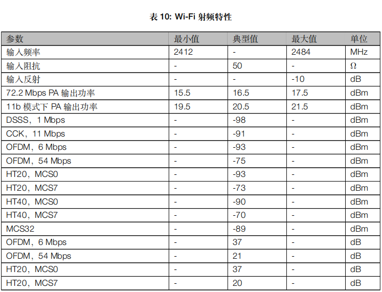

## 5.5 蓝牙射频

### 5.5.1 接收器 - 基础数据率（BR）

# 支持与服务

| 四博智联资源                                        |                                                              |
| --------------------------------------------------- | ------------------------------------------------------------ |
| 官网                                                | [www.doit.am](http://www.doit.am/)                           |
| 教材                                                | [ESPDuino智慧物联开发宝典](https://item.taobao.com/item.htm?spm=a1z10.3-c.w4002-7420449993.9.Bgp1Ll&id=520583000610) |
| 购买                                                | [官方淘宝店](https://szdoit.taobao.com/)(szdoit.am)          |
| 讨论                                                | [技术论坛](http://bbs.doit.am/forum.php)(bbs.doit.am)        |
| 应用案例集锦                                        |                                                              |
| [Doit玩家云](http://wechat.doit.am)(wechat.doit.am) | [免费TCP公网调试服务](http://tcp.doit.am)(tcp.doit.am)       |
| 官方技术支持QQ群1/2/3群已满                         |                                                              |
| 技术支持群4                                         | 278888904                                                    |
| 技术支持群5                                         | 278888905                                                    |
| 术支持群6                                           | 278888906                                                    |
| 技术支持群7                                         | 278888907                                                    |
| 技术支持群8                                         | 278888908                                                    |
| 技术支持群9                                         | 278888909                                                    |
| 技术支持群10                                        | 278888900                                                    |