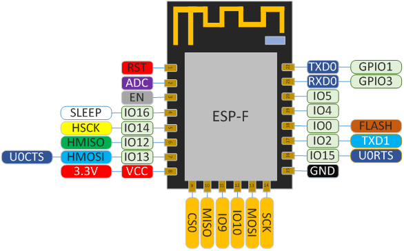
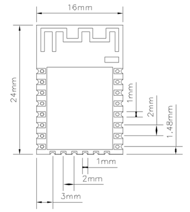
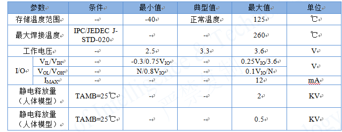
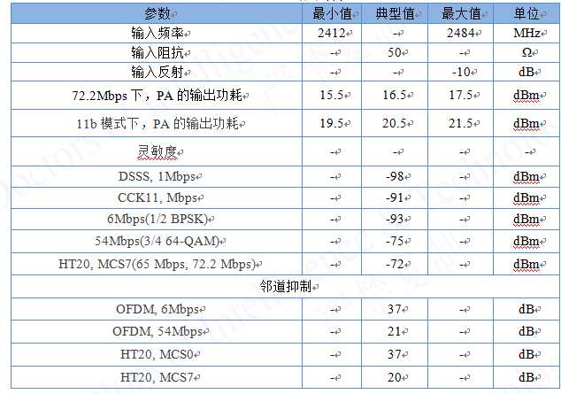
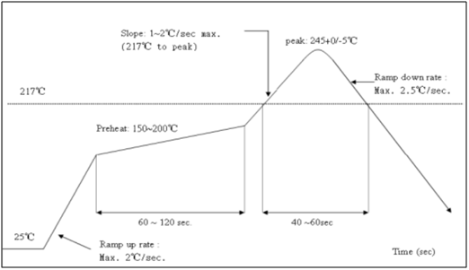
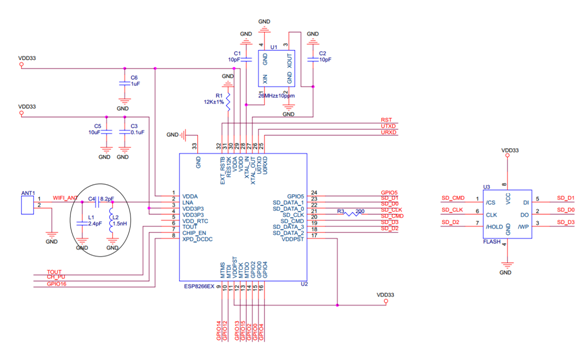
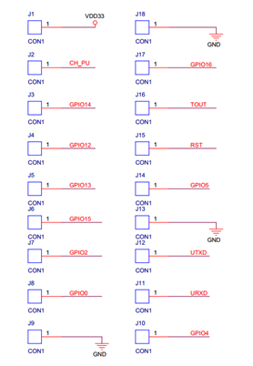
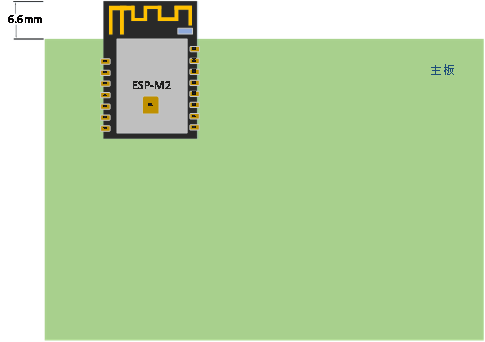
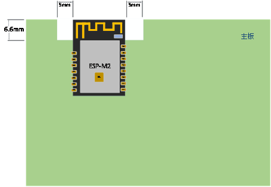
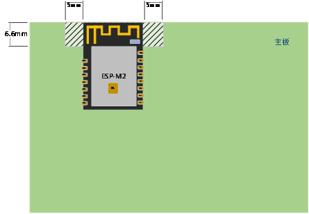

 
  ESP-F模块数据手册

 from SZDOIT 
 

# 特点

## SOC特性

内置Tensilica L106超低功耗32位微处理器，主频支持80MHz和160MHz，支持RTOS

内置TCP/IP协议栈

内置1路10 bit⾼精度ADC

外设接口HSPI、UART、I2C、I2S、IR Remote Control、PWM、GPIO

深度睡眠保持电流为10uA，关断电流小于5uA

2 ms之内唤醒、连接并传递数据包

待机状态消耗功率小于1.0mW(DTIM3)

## Wi-Fi特性

支持802.11 b/g/n/e/i

支持Station、SoftAP、SoftAP+STA模式

支持Wi-Fi Direct(P2P)

支持CCMP(CBC-MAC、计数器模式)、TKIP(MIC、RC4)、WAPI(SMS4)、WEP(RC4)、CRC的硬件加速

P2P发现, P2P GO模式/GC模式和P2P电源管理

WPA/PA2 PSK和WPS

802.11 i 安全特征：预认证和TSN

⽀持802.11n（2.4 GHz）

802.1h/RFC1042 帧封装

无缝漫游支持

支持AT远程升级及云端OTA升级

支持Android和iOS设备SmartConfig功能

# 模块外设

2xUART

1xADC

1xEn

1x唤醒管脚

1xHSPI

1xI2C

1xI2S

最多11xGPIOs

4M字节 SPI Flash

工作温度范围：-40℃-85℃

模块尺寸：16mm×24mm

# 应用场景

● 家用电器                           ● 家庭自动化

● 智能家居                           ● Mesh网络

● 婴儿监控器                       ● IP摄像机

● 传感器网络                       ● 可穿戴电子产品

● 安全ID标签                       ● 无线位置感知

无线定位系统信标               ● 工业无线控制

# 模块型号

| 名称  | 天线类型    |
| ----- | ----------- |
| ESP-F | 板载PCB天线 |

# 模块结构图

# 文档更新说明

| 日期      | 版本 | 更新内容             |
| --------- | ---- | -------------------- |
| 2017-3-14 | V1.0 | 初版                 |
| 2017-3-18 | V1.1 | 增加推荐PCB设计章节  |
| 2018-9-11 | V1.2 | 优化最小系统参数设计 |

# 一. 产品概述

ESP-F模块核心处理器采用高性价比芯片ESP8266EX。该芯片在较小尺寸封装中集成了业界领先的Tensilica’s L106 超低功耗32位微型MCU，带有16位精简模式，主频⽀持80 MHz和160 MHz，支持RTOS。ESP8266EX拥有完整的Wi-Fi网络功能，既能够独⽴应⽤，也可以作为从机搭载于其他主机MCU运⾏。当ESP8266EX独⽴应⽤时，能够直接从外接Flash中启动。内置的⾼速缓冲存储器有利于提⾼系统性能，并且优化存储系统。此外ESP8266EX只需通过SPI/SDIO 接⼝或I2C/UART⼝即可作为Wi-Fi适配器，应⽤到基于任何微控制器的设计中。

ESP-F模块支持标准的IEEE802.11 b/g/n/e/i协议以及完整的TCP/IP协议栈。用户可以使用该模块为现有设备添加联网功能，也可以构建独立的网络控制器。

ESP-F模块以最低成本提供最大实用性，为Wi-Fi功能嵌入其他系统提供无限可能。

图1. 1模块结构图

模块主要技术参数如下：

表1. 1模

块主要参数

# 二. 接口定义

ESP-F接口定义如下图所示。

图2. 1模块管脚图

模块的工作模式选择和每个管脚定义如下表所示。

表2. 1引脚模式

| 模式          | GPIO15 | GPIO0 | GPIO2 |
| ------------- | ------ | ----- | ----- |
| UART 下载模式 | 低     | 低    | 高    |
| FlashBoot模式 | 低     | 高    | 高    |

表2.2 模块管脚功能定义

| 序 号 | Pin脚名称 | 类型 | 功能说明                                                     |
| :---: | :-------: | :--- | ------------------------------------------------------------ |
|   1   |    RST    | I    | 外部重置信号（低电平有效），复位模组                         |
|   2   |    ADC    | I    | A/D转换管脚。输入电压范围0~1V，取值范围：0~1024              |
|   3   |    EN     | I    | 芯⽚使能端，⾼电平：有效，芯⽚正常⼯作；低电平：芯⽚关闭，电流很⼩ |
|   4   |   IO16    | I/O  | 深度睡眠唤醒                                                 |
|   5   |   IO14    | I/O  | GPIO14; HSPI_CLK                                             |
|   6   |   IO12    | I/O  | GPIO12;HSPI_MISO                                             |
|   7   |   IO13    | I/O  | GPIO13;HSPI_MOSI;UART0_CTS                                   |
|   8   |    VCC    | P    | 模块电源：3.3V                                               |
|   9   |    CS0    | I/O  | GPIO11; SD_CMD;  SPI_CS0                                     |
|  10   |   MISO    | I/O  | GPIO7; SD_D0, SPI_MSIO                                       |
|  11   |    IO9    | I/O  | GPIO9; SD_D2 PIHD; HSPIHD                                    |
|  12   |   IO10    | I/O  | GPIO10; SD_D3;SPIWP; HSPIWP1                                 |
|  13   |   MOSI    | I/O  | GPIO8; SD_D1;SPI_MOSI1                                       |
|  14   |   SCLK    | I/O  | GPIO6; SD_CLK; SPI_CLK                                       |
|  15   |    GND    | P    | GND                                                          |
|  16   |   IO15    | I/O  | GPIO15; MTDO;HSPICS;UART0_RTS                                |
|  17   |    IO2    | I/O  | GPIO2; UART1_TXD                                             |
|  18   |    IO0    | I/O  | GPIO0;SPI_CS2                                                |
|  19   |    IO4    | I/O  | GPIO4                                                        |
|  20   |    IO5    | I/O  | GPIO5                                                        |
|  21   |    RXD    | I/O  | GPIO3; 可⽤作烧写Flash时UART Rx                              |
|  22   |    TXD    | I/O  | GPIO1; 可⽤作烧写Flash时UART Tx                              |

# 三. 外型与尺寸

模组的外观尺寸为 16mm x 24mm x 3mm（如图所示）。该模组采用的Flash容量为32Mbits（4M Bytes）。

图3. 1 模组外观

图2.3DMP-P1尺寸图

(b) 侧视图

图3. 2模组尺寸图

表3. 1模组尺寸对照表

|  长  |  宽  |  高  | PAD 尺寸（底部） | Pin 脚间距 |
| :--: | :--: | :--: | :--------------: | :--------: |
| 16mm | 24mm | 3mm  |   0.9mmx1.7mm    |    2mm     |

# 四. 电气特性

表4. 1电气特性

# 五. 功耗

表5. 1功耗

| 参数                                  | 最小值 | 典型值 | 最大值 | 单位 |
| ------------------------------------- | ------ | ------ | ------ | ---- |
| Tx802.11b, CCK 11Mbps, POUT=+17dBm    | -      | 170    | -      | mA   |
| Tx802.11g, OFDM 54 Mbps, POUT =+15dBm | -      | 140    | -      | mA   |
| Tx802.11n,MCS7,POUT =+13dBm           | -      | 120    | -      | mA   |
| Rx 802.11b，1024 Bytes包⻓，-80dBm    | -      | 50     | -      | mA   |
| Rx 802.11g，1024 Bytes包⻓，-70dBm    | -      | 56     | -      | mA   |
| Rx 802.11n，1024 Bytes包⻓，-65dBm    | -      | 56     | -      | mA   |
| Modem-sleep①                          | -      | 15     | -      | mA   |
| Light-sleep②                          | -      | 0.9    | -      | mA   |
| Deep-sleep③                           | -      | 20     | -      | μA   |
| 关闭                                  | -      | 0.5    | -      | μA   |

注①：Modem-Sleep模式用于需要CPU一直处于工作的场景，如应用于PWM或I2S应用等。在保持Wi-Fi连接时，如果没有数据传输，可根据802.11标准(如U-APSD)，关闭Wi-Fi Modem电路来省电。例如在DTIM3时，保持睡眠300ms，醒来3ms间隔唤醒来接收AP的Beacon包，则电流约15mA。

注②：Light-Sleep模式用于CPU可暂停的应用，如Wi-Fi开关。在保持Wi-Fi连接时，如果没有数据传输，可根据802.11标准(如U-APSD)，关闭Wi-Fi Modem电路并暂停CPU来省电。例如，在DTIM3时，保持睡眠300ms，每3ms间隔唤醒来接收AP的Beacon包，则整体平均电流约0.9mA。

注③：Deep-Sleep模式应用于不需一直保持Wi-Fi连接的场景，很长时间才发送一次数据包的应用（如每100秒测量⼀次温度的传感器），每300s 醒来后需0.3s-1s连上AP，则整体平均电流可远小于1mA。

注③：Deep-Sleep模式应用于不需一直保持Wi-Fi连接的场景，很长时间才发送一次数据包的应用（如每100秒测量⼀次温度的传感器），每300s 醒来后需0.3s-1s连上AP，则整体平均电流可远小于1mA。

# 六. Wi-Fi射频特征

下表中数据是在室内温度下，电压为3.3V和1.1V时分别测得。

表6. 1Wi-Fi射频特征

# 七. 推荐炉温曲线

推荐炉温曲线如下：

图7. 1推荐炉温曲线

八. 模块内部原理图

图8. 1模块原理图

# 九. 模块最小系统

模块最小系统电路图如下：

 

图9. 1最小系统

注：

（1）模块供电电压为直流3.3V；

（2）Wi-Fi模块IO最大输出电流为12mA；

（2）Wi-Fi模块NRST管脚低电平有效；EN使能管脚高电平有效；

（4）Wi-Fi模块进入升级模式：GPIO0处于低电平，然后模块复位上电；Wi-Fi模块进入正常工作模式：GPIO0处于高电平，模块复位上电。

（5）Wi-Fi模块的RXD接外部MCU的TXD，Wi-Fi模块的TXD接外部MCU的RXD；

# 十. 推荐PCB设计

Wi-Fi模块可以直接焊接到PCB板上。为了使您的终端产品获得最佳的射频性能，请注意根据本指南合理设计模块及天线在底板上的摆放位置。

针对PCB天线版本ESP-M2建议将模块沿PCB板边放置，天线在板框外或者沿板边放置且下方挖空，参考方案一及方案二；若必须将PCB天线放在底板上，则需要保证天线下方的PCB区域不可敷铜，参考方案三。

针对外置天线版本ESP-M1，由于天线外置，对模块摆放位置要求不高，可参考ESP-M2的布置建议酌情调整。

# 十. 推荐PCB设计

Wi-Fi模块可以直接焊接到PCB板上。为了使您的终端产品获得最佳的射频性能，请注意根据本指南合理设计模块及天线在底板上的摆放位置。

针对PCB天线版本ESP-M2建议将模块沿PCB板边放置，天线在板框外或者沿板边放置且下方挖空，参考方案一及方案二；若必须将PCB天线放在底板上，则需要保证天线下方的PCB区域不可敷铜，参考方案三。

针对外置天线版本ESP-M1，由于天线外置，对模块摆放位置要求不高，可参考ESP-M2的布置建议酌情调整。

图10. 1方案一-天线在板框外

图10. 2方案二-天线沿板边放置且下方挖空

图10. 3 方案三-天线沿板边放置且下方均不铺铜

# 十一. 外围走线建议

Wi-Fi模块集成了高速 GPIO 和外设接口，这可能会产生严重的开关噪声。如果一些应用对于功耗和EMI特性要求较高，建议在数字I/O线上串联10~100欧姆的电阻。这样可以在开关电源时抑制过冲，并使信号变得平稳，同时这种做法也能在一定程度上防止静电释放（ESD）。

# 支持与服务

| 四博智联资源                                           |                                                              |
| ------------------------------------------------------ | ------------------------------------------------------------ |
| 官网                                                   | [www.doit.am](http://www.doit.am/)                           |
| 教材                                                   | [ESPDuino智慧物联开发宝典](https://item.taobao.com/item.htm?spm=a1z10.3-c.w4002-7420449993.9.Bgp1Ll&id=520583000610) |
| 购买                                                   | [官方淘宝店](https://szdoit.taobao.com/)(szdoit.am)          |
| 讨论                                                   | [技术论坛](http://bbs.doit.am/forum.php)(bbs.doit.am)        |
| 应用案例集锦                                           | [智能建筑云](http://building.doit.am)(building.doit.am)      |
| [光伏监控云](http://solar.doit.am)(solar.doit.am)      |                                                              |
| [Doit玩家云](http://wechat.doit.am)(wechat.doit.am)    |                                                              |
| [免费TCP公网调试服务](http://tcp.doit.am)(tcp.doit.am) |                                                              |
| 官方技术支持QQ群1/2/3群已满                            |                                                              |
| 技术支持群4                                            | 278888904                                                    |
| 技术支持群5                                            | 278888905                                                    |
| 技术支持群6                                            | 278888906                                                    |
| 技术支持群7                                            | 278888907                                                    |
| 技术支持群8                                            | 278888908                                                    |
| 技术支持群9                                            | 278888909                                                    |
| 技术支持群10                                           | 278888900                                                    |

# 免责申明和版权公告

本文中的信息，包括供参考的URL地址，如有变更，恕不另行通知。 

文档“按现状”提供，不负任何担保责任，包括对适销性、适用于特定用途或非侵权性的任何担保，和任何提案、规格或样品在他处提到的任何担保。本文档不负任何责任，包括使用本文档内信息产生的侵犯任何专利权行为的责任。本文档在此未以禁止反言或其他方式授予任何知识产权使用许可，不管是明示许可还是暗示许可。

Wi-Fi联盟成员标志归Wi-Fi联盟所有。

文中提到的所有商标名称、商标和注册商标均属其各自所有者的财产，特此声明。

注意：由于产品升级或其他原因，本手册内容有可能变更。深圳四博智联科技有限公司保留在没有任何通知或者提示的情况下对本手册的内容进行修改的权利。本手册仅作为使用指导，深圳四博智联科技有限公司尽全力在本手册中提供准确的信息，但是并不确保手册内容完全没有错误，本手册中的所有陈述、信息和建议也不构成任何明示或暗示的担保。