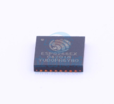

 ESP8266芯片数据手册 

 From SZDOIT

## 1. 概述

ESP8266EX 由乐鑫公司开发，提供了了一套高度集成的 Wi-Fi SoC 解决方案，其低功耗、紧凑设计和高稳定性可以满足用户的需求。

ESP8266EX 拥有完整的且自成体系的 Wi-Fi ⽹网络功能，既能够独立应用，也可以作为从机搭载于其他主机 MCU 运行行。当 ESP8266EX 独立应用时，能够直接从外接 Flash 中启动。内置的高速缓冲存储器器有利利于提高系统性能，并且优化存储系统。此外 ESP8266EX 只需通过SPI/SDIO 接口或 I2C/UART 口即可作为 Wi-Fi 适配器器，应用到基于任何微控制器器的设计中。

ESP8266EX 集成了了天线开关、射频 balun、功耗放大器器、低噪放大器器、过滤器器和电源管理理模块。这样紧凑的设计仅需极少的外部电路路并且将 PCB 的尺寸降到最小。

ESP8266EX 还集成了了增强版的 Tensilica’s L106 钻⽯石系列列 32-bit 内核处理理器器，带⽚片上SRAM。ESP8266EX 可以通过 GPIO 外接传感器器和其他设备。软件开发包 (SDK) 提供了了一些应用的示例例代码。

乐鑫智能互联平台 (ESCP-Espressif Systems’ Smart Connectivity Platform) 表现出来的领先特征有：睡眠/唤醒模式之间的快速切换以实现节能、配合低功耗操作的自适应射频偏置、前端信号的处理理功能、故障排除和射频共存机制可消除蜂窝/蓝牙/DDR/LVDS/LCD 干扰。

### 1.1. Wi-Fi 协议

• 支持 802.11 b/g/n/e/i。

• 支持 Wi-Fi Direct (P2P)。

• P2P 发现，P2P GO 模式 (Group Owner)、GC 模式 (Group Client) 和 P2P 电源管理理。

• 基础结构型⽹网络 (Infrastructure BSS) 工作站 (Station) 模式/P2P 模式/SoftAP 模式。

• 支持 CCMP（CBC-MAC、计数器器模式）、TKIP (MIC、RC4)、WAPI (SMS4)、WEP(RC4)、CRC 的硬件加速器器。

• WPA/PA2 PSK 和 WPS。

• 802.11 i 安全特征：预认证和 TSN。

• 针对企业级平台的开放接口，例例如 TLS、PEAP、LEAP、SIM、AKA 或者客户自定义接口。

• 支持 802.11n (2.4 GHz)。

• 支持 MIMO 1×1 和 2×1、STBC、A- MPDU 和 A-MSDU 帧聚合技术、0.4 μs 的保护间隔。

• WMM 低功耗 U-APSD。

• 多队列列管理理，充分利利用 802.11e 标准的 QoS 传输优先。

• UMA 认证标准。

• 802.1h/RFC1042 帧封装。

• 分散 DMA，实现数据传输操作时 Zero Copy，优化 CPU 负载。

• 天线分集与选择（软件控制硬件）。

• 时钟/电源门控与符合 802.11 标准的电源管理理⼀一起动态地适应当前连接条件，实现最小功耗。

• 自适应速率回退算法基于实际信噪⽐比 (SNR) 和丢包信息来控制最佳传输速率和发射功耗。

• MAC 层上的自动重传和回复以防⽌止在慢速主机环境中的数据包丢弃。

• 无缝漫游支持。

• 可配置的包仲裁 (PTA) 和基于专用的从机处理理器器的设计为⼤大量量蓝牙芯⽚片供应商提供灵活而精确的 Wi-Fi 和蓝牙共存模式。

• 双天线或单天线的蓝牙共存方式，支持分时接收（Wi-Fi/蓝牙）的功能。

### 1.2. 技术参数

## 支持与服务

| 四博智联资源                                        |                                                              |
| --------------------------------------------------- | ------------------------------------------------------------ |
| 官网                                                | [www.doit.am](http://www.doit.am/)                           |
| 教材                                                | [ESPDuino智慧物联开发宝典](https://item.taobao.com/item.htm?spm=a1z10.3-c.w4002-7420449993.9.Bgp1Ll&id=520583000610) |
| 购买                                                | [官方淘宝店](https://szdoit.taobao.com/)(szdoit.am)          |
| 讨论                                                | [技术论坛](http://bbs.doit.am/forum.php)(bbs.doit.am)        |
| 应用案例集锦                                        |                                                              |
| [Doit玩家云](http://wechat.doit.am)(wechat.doit.am) | [免费TCP公网调试服务](http://tcp.doit.am)(tcp.doit.am)       |
| 官方技术支持QQ群1/2/3群已满                         |                                                              |
| 技术支持群4                                         | 278888904                                                    |
| 技术支持群5                                         | 278888905                                                    |
| 术支持群6                                           | 278888906                                                    |
| 技术支持群7                                         | 278888907                                                    |
| 技术支持群8                                         | 278888908                                                    |
| 技术支持群9                                         | 278888909                                                    |
| 技术支持群10                                        | 278888900                                                    |