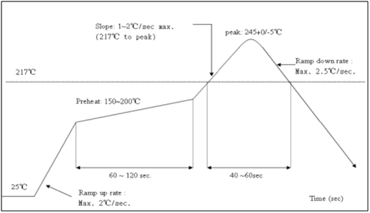

 
  DMP-L1模块数据手册

 from SZDOIT 
 

## 一. 产品基本参数

DMP-L1模块核心处理器采用工业级芯片ESP8285。该芯片在较小尺寸封装中集成了增强版的Tensilica’s L106钻石系列32-bit内核处理器。ESP8285拥有完整的Wi-Fi网络功能，可以脱离控制器独立使用，其内置的高速缓冲存储器大大提供了CPU性能。

DMP-L1模块支持标准的IEEE802.11 b/g/n/e/i协议以及完整的TCP/IP协议栈。

DMP-L1模块采用内置Flash，可以使得芯片工作于-40℃-125℃。

DMP-L1模块内置LED控制算法，可以使得其外部IO控制LED驱动。

DMP-L1模块内置DoHome云服务，可以使用DoHome系列APP控制LED。

DMP-L1模块含有外部红外接口，可以同时支持红外遥控。

DMP-L1模块内置厂测程序，可以使得工厂快速生产测试。

图1.1模块结构图

模块主要技术参数如下：

表1.1模块主要参数

## 二. 接口定义

DMP-L1接口定义如下图所示。

图2.1 DMP-L1管脚定义

模块的引脚定义如下表所示。

表2.1 模块管脚功能定义

| 序号 | Pin脚名称 | 类型 | 功能说明                                                   |
| :--: | :-------: | :--: | ---------------------------------------------------------- |
|  1   |     R     |  O   | 默认为红色LED控制引脚,PWM输出,IO12                         |
|  2   |     G     |  O   | 默认为绿色LED控制引脚,PWM输出,IO14                         |
|  3   |     B     |  O   | 默认为蓝色LED控制引脚,PWM输出,IO5                          |
|  4   |     W     |  O   | 默认为冷白色LED控制引脚,PWM输出,IO4                        |
|  5   |     Y     |  O   | 默认为暖白色LED控制引脚,PWM输出,IO13                       |
|  6   |    GND    |  P   | GND                                                        |
|  7   |    VCC    |  P   | 模块电源：3.3V/200mA                                       |
| 8,12 |    GND    |  P   | GND                                                        |
|  9   |    RX0    | I/O  | GPIO3; 可用作烧写  Flash 时 UART Rx                        |
|  10  |    TX0    | I/O  | GPIO1; 可用作烧写  Flash 时 UART Tx                        |
|  11  |    RST    |  I   | 外部重置信号（低电平有效）, 复位模块; 模块内部已接上拉电阻 |
|  13  |    ADC    | I/O  | 模拟接口，电平范围：0-1V                                   |
|  14  |    D16    | I/O  | GPIO16; 深度睡眠唤醒                                       |
|  15  |    EN     |  I   | 模块使能端，高电平：有效，内部上拉                         |
|  16  |   IRAD    |  I   | 红外输入接口，码率参考附录                                 |
|  17  |    D0     | I/O  | GPIO0;SPI_CS2;                                             |

模块的外观及尺寸如下所示。

图2.2  DMP-L1 模块外观

图2.3 DMP-L1尺寸图

表2.2 DMP-L1模块尺寸对照表

| 长   | 宽   | 高    | PAD尺寸（两侧） | PAD尺寸（底部） |
| ---- | ---- | ----- | --------------- | --------------- |
| 20mm | 15mm | 2.3mm | 0.85mmx1mm      | 1mm1.5mm        |

模块参考封装LAYOUT如图2.3

图2.3 DMP-L1 参考封装

## 三.应用说明

基于DMP-L1的硬件最小系统图为：(R/G/B/W 为 PWM控制)

DMP-L1支持的软件包括DoHome 系列APP，IOS市场和各大Android市场均可搜索获得。

图3.1 DoHome APPs 二维码

DMP-L1目前已经支持的智能音箱包括Amazon Alexa、Google Assistant、天猫精灵、京东叮咚、小爱同学、小度智能等。其使用说明参见APP中详细说明。

## 四. 电气特性

表4.1电气特性

## 五. 功耗

表5.1功耗

|                 参数                  | 最小值 | 典型值 | 最大值 | 单位 |
| :-----------------------------------: | :----: | :----: | :----: | :--: |
|  Tx802.11b, CCK 11Mbps, POUT=+17dBm   |   -    |  170   |   -    |  mA  |
| Tx802.11g, OFDM 54 Mbps, POUT =+15dBm |   -    |  140   |   -    |  mA  |
|      Tx802.11n,MCS7,POUT =+13dBm      |   -    |  120   |   -    |  mA  |
|  Rx 802.11b，1024 Bytes包⻓，-80dBm   |   -    |   50   |   -    |  mA  |
|  Rx 802.11g，1024 Bytes包⻓，-70dBm   |   -    |   56   |   -    |  mA  |
|  Rx 802.11n，1024 Bytes包⻓，-65dBm   |   -    |   56   |   -    |  mA  |
|             Modem-sleep①              |   -    |   15   |   -    |  mA  |
|             Light-sleep②              |   -    |  0.9   |   -    |  mA  |
|              Deep-sleep③              |   -    |   20   |   -    |  μA  |
|                 关闭                  |   -    |  0.5   |   -    |  μA  |

## 六. Wi-Fi射频特征

下表中数据是在室内温度下，电压为3.3V和1.1V时分别测得。

表6.1Wi-Fi射频特征

## 七. 推荐炉温曲线

图7.1推荐炉温曲线

## 附录一:9W球泡灯参考电路

## 附录二：红外码库对照表

程序默认遥控器实物图及其对应码库

## 更多资源，请关注公众号！

