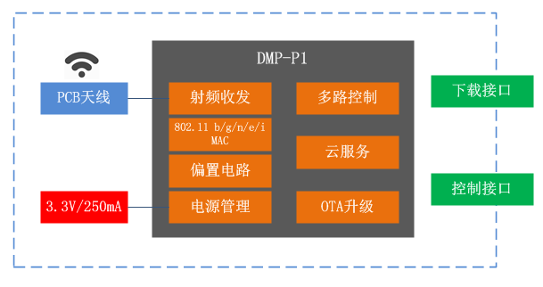
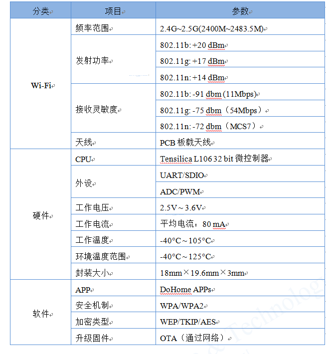
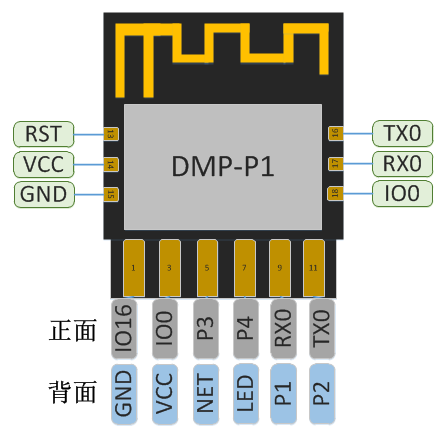
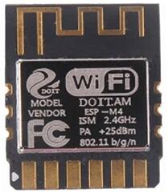
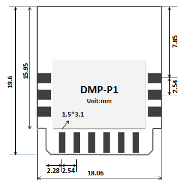
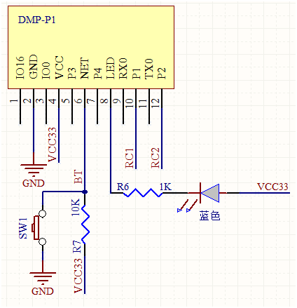
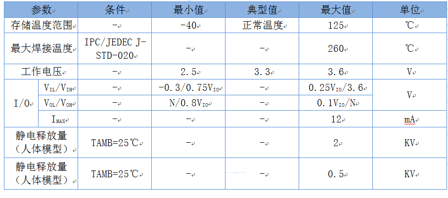
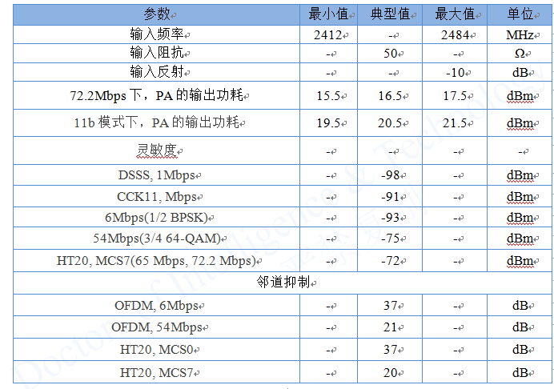

 
  DMP-P1模块数据手册 

 from SZDOIT 
 

## 一.产品基本参数

DMP-P1模块核心处理器采用工业级芯片ESP8285。该芯片在较小尺寸封装中集成了增强版的Tensilica’s L106钻石系列32-bit内核处理器。ESP8285拥有完整的Wi-Fi网络功能，可以脱离控制器独立使用，其内置的高速缓冲存储器大大提供了CPU性能。

DMP-P1模块支持标准的IEEE802.11 b/g/n/e/i协议以及完整的TCP/IP协议栈。

DMP-P1模块采用内置Flash，可以使得芯片工作于-40℃-125℃。

DMP-P1模块内置继电器控制算法，可以使得其外部IO控制继电器。

DMP-P1模块内置DoHome云服务，可以使用DoHome系列APP控制开关。

DMP-P1模块内置厂测程序，可以使得工厂快速生产测试。

图1.1模块结构图

模块主要技术参数如下：

表1.1模块主要参数

## 二. 接口定义

### DMP-P1接口定义如下图所示。

 

图2.1DMP-P1管脚定义

### 模块的引脚定义如下表所示。

表2.1模块管脚功能定义

| 序号  | Pin脚名称 | 类型 | 功能说明                                                     |
| ----- | --------- | ---- | ------------------------------------------------------------ |
| 1     | IO16      | I/O  | GPIO16                                                       |
| 2,15  | GND       | P    | GND                                                          |
| 3,18  | IO0       | O    | GPIO0; SPI_CS2;                                              |
| 4,14  | VCC       | P    | 模块电源：3.3V/250mA                                         |
| 5     | P3        | I/O  | 第三路开关控制IO                                             |
| 6     | NET       | I/O  | 配网开关按钮                                                 |
| 7     | P4        | I/O  | 第四路开关控制IO                                             |
| 8     | LED       | I/O  | 状态指示IO，快闪：等待配网；慢闪：无网络；常亮：打开；长灭：关闭 |
| 9,17  | RX0       | I/O  | GPIO3; 可⽤作烧写 Flash 时 UART Rx                           |
| 10    | P1        | I/O  | 第一路开关控制IO                                             |
| 11,16 | TX0       | I/O  | GPIO1; 可⽤作烧写 Flash 时 UART Tx                           |
| 12    | P2        | I/O  | 第二路开关控制IO                                             |
| 13    | RST       | I/O  | 外部重置信号（低电平有效）, 复位模块; 模块内部已接上拉电阻   |

### 模块的外观及尺寸如下所示。

图2.2 DMP-P1模块外观

图2.3DMP-P1尺寸图

## 三.应用说明

基于DMP-P1的硬件最小系统图为：

DMP-P1支持的软件包括DoHome 系列APP，IOS市场和各大Android市场均可搜索获得。

图3.1 DoHome APPs 二维码

DMP-P1目前已经支持的智能音箱包括Amazon Alexa、Google Assistant、天猫精灵、京东叮咚、小爱同学、小度智能等。其使用说明参见APP中详细说明。

## 四. 电气特性

表4.1电气特性

## 五. 功耗

表5.1功耗

|                 参数                  | 最小值 | 典型值 | 最大值 | 单位 |
| :-----------------------------------: | ------ | ------ | ------ | ---- |
|  Tx802.11b, CCK 11Mbps, POUT=+17dBm   | -      | 170    | -      | mA   |
| Tx802.11g, OFDM 54 Mbps, POUT =+15dBm | -      | 140    | -      | mA   |
|      Tx802.11n,MCS7,POUT =+13dBm      | -      | 120    | -      | mA   |
|  Rx 802.11b，1024 Bytes包⻓，-80dBm   | -      | 50     | -      | mA   |
|  Rx 802.11g，1024 Bytes包⻓，-70dBm   | -      | 56     | -      | mA   |
|  Rx 802.11n，1024 Bytes包⻓，-65dBm   | -      | 56     | -      | mA   |
|              Modem-sleep              | -      | 15     | -      | mA   |
|              Light-sleep              | -      | 0.9    | -      | mA   |
|              Deep-sleep               | -      | 20     | -      | μA   |
|                 关闭                  | -      | 0.5    | -      | μA   |

## 六. Wi-Fi射频特征

下表中数据是在室内温度下，电压为3.3V和1.1V时分别测得。

表6.1Wi-Fi射频特征

## 更多资源，请关注公众号！

