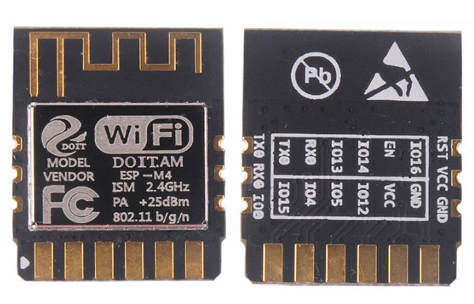
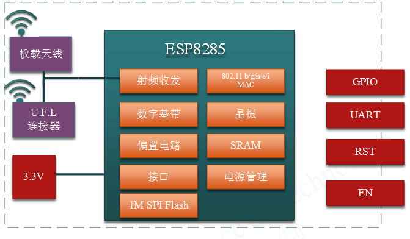
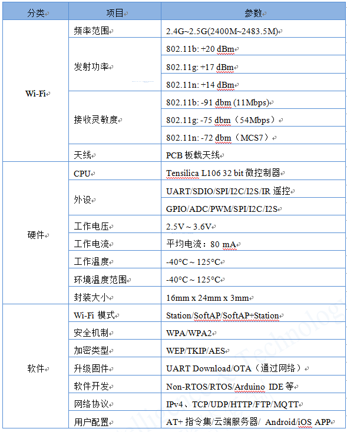
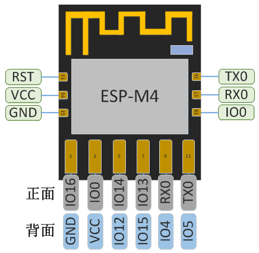
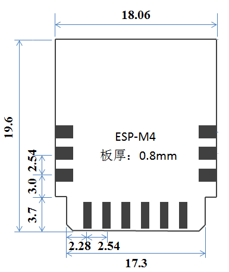
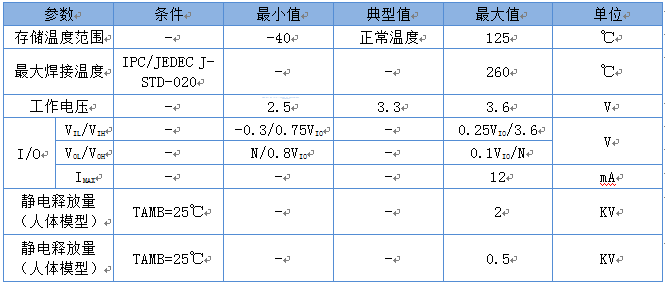
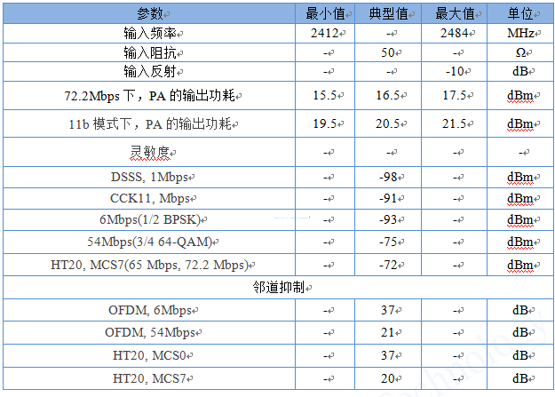
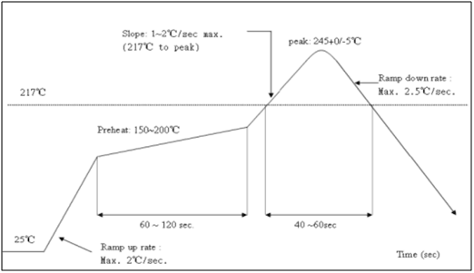
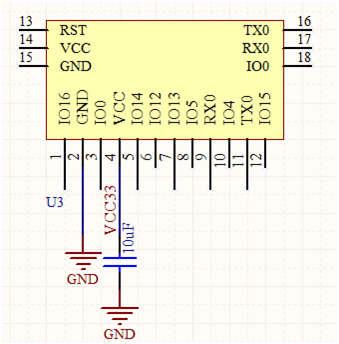

 
  ESP-M4模块数据手册

 from SZDOIT 
 

##  一. 产品概述

ESP-M4模块核心处理器采用高性价比芯片ESP8285。该芯片在较小尺寸封装中集成了增强版的Tensilica’s L106钻石系列32-bit内核处理器，带片上SRAM。ESP8285拥有完整的Wi-Fi网络功能，既能够独⽴应⽤，也可以作为从机搭载于其他主机MCU运⾏。当ESP8285托管应用时，能够直接从外接Flash中启动。内置的⾼速缓冲存储器有利于提⾼系统性能，并且优化存储系统。此外ESP8285只需通过SPI/SDIO接⼝或I2C/UART⼝即可作为Wi-Fi适配器，应⽤到基于任何微控制器的设计中。

ESP-M4模块支持标准的IEEE802.11 b/g/n/e/i协议以及完整的TCP/IP协议栈。用户可以使用该模块为现有设备添加联网功能，也可以构建独立的网络控制器。

ESP-M4模块以最低成本提供最大实用性，为Wi-Fi功能嵌入其他系统提供无限可能。

图1.1模块结构图

模块主要技术参数如下：

表1.1 模块主要参数

## 二. 接口定义

ESP-M4接口定义如下图所示。

图2.1 ESP-M4管脚定义

模块的工作模式选择和每个管脚定义如下表所示。

表2.1引脚模式

|     模式      | GPIO0 | GPIO2(内部已接上拉电阻) |
| :-----------: | :---: | :---------------------: |
| UART下载模式  |  低   |           高            |
| FlashBoot模式 |  高   |           高            |

表2.2模块管脚功能定义

| 序 号 | Pin脚名称 | 类型 | 功能说明                                                    |
| :---: | :-------: | :--: | ----------------------------------------------------------- |
|   1   |   IO16    | I/O  | GPIO16,深度睡眠唤醒                                         |
|   2   |    GND    |  P   | GND                                                         |
| 3,18  |    IO0    | I/O  | 模块下载选择引脚                                            |
| 4,14  |    VCC    |  P   | 模块电源：3.3V/250mA                                        |
| 5,15  |   IO14    | I/O  | GPIO14;                                                     |
|   6   |   IO12    | I/O  | GPIO12;                                                     |
|   7   |   IO13    | I/O  | GPIO13;                                                     |
|   8   |    IO5    | I/O  | IO5;                                                        |
| 9,17  |    RXD    | I/O  | GPIO3; 可用作烧写  Flash 时 UART Rx                         |
|  10   |    IO4    | I/O  | IO4;                                                        |
| 11,16 |    TXD    | I/O  | GPIO1; 可用作烧写  Flash 时 UART Tx                         |
|  12   |   IO15    | I/O  | IO15,内部下拉，上电时会有100us高电平，不适合做继电器控制    |
|  13   |    RST    |  I   | 外部重置信号（低电平有效）, 复位模块; 模块内部已接上拉电阻x |

## 三.外型与尺寸

模块的外观及尺寸如下所示。

图3.1 ESP-M4模块外观

图3.2ESP-M4尺寸图

表3.1 ESP-M4模块尺寸对照表

|   长    |   宽    |  高   | PAD尺寸（两侧） | PAD尺寸（底部） |
| :-----: | :-----: | :---: | :-------------: | :-------------: |
| 21.44mm | 18.06mm | 2.3mm |   0.9mmx1.3mm   |   1.5mm3.1mm    |

## 四. 电气特性

表4.1 电气特性

## 五. 功耗

表5.1功耗

|                 参数                  | 最小值 | 典型值 | 最大值 | 单位 |
| :-----------------------------------: | :----: | :----: | :----: | :--: |
|  Tx802.11b, CCK 11Mbps, POUT=+17dBm   |   -    |  170   |   -    |  mA  |
| Tx802.11g, OFDM 54 Mbps, POUT =+15dBm |   -    |  140   |   -    |  mA  |
|      Tx802.11n,MCS7,POUT =+13dBm      |   -    |  120   |   -    |  mA  |
|  Rx 802.11b，1024 Bytes包⻓，-80dBm   |   -    |   50   |   -    |  mA  |
|  Rx 802.11g，1024 Bytes包⻓，-70dBm   |   -    |   56   |   -    |  mA  |
|  Rx 802.11n，1024 Bytes包⻓，-65dBm   |   -    |   56   |   -    |  mA  |
|             Modem-sleep①              |   -    |   15   |   -    |  mA  |
|             Light-sleep②              |   -    |  0.9   |   -    |  mA  |
|              Deep-sleep③              |   -    |   20   |   -    |  μA  |
|                 关闭                  |   -    |  0.5   |   -    |  μA  |

注①：Modem-Sleep模式用于需要CPU一直处于工作的场景，如应用于PWM或I2S应用等。在保持Wi-Fi连接时，如果没有数据传输，可根据802.11标准(如U-APSD)，关闭Wi-Fi Modem电路来省电。例如在DTIM3时，保持睡眠300ms，醒来3ms间隔唤醒来接收AP的Beacon包，则电流约15mA。

注②：Light-Sleep模式用于CPU可暂停的应用，如Wi-Fi开关。在保持Wi-Fi连接时，如果没有数据传输，可根据802.11标准(如U-APSD)，关闭Wi-Fi Modem电路并暂停CPU来省电。例如，在DTIM3时，保持睡眠300ms，每3ms间隔唤醒来接收AP的Beacon包，则整体平均电流约0.9mA。

注③：Deep-Sleep模式应用于不需一直保持Wi-Fi连接的场景，很长时间才发送一次数据包的应用（如每100秒测量⼀次温度的传感器），每300s 醒来后需0.3s-1s连上AP，则整体平均电流可远小于1mA。

## 六. Wi-Fi射频特征

下表中数据是在室内温度下，电压为3.3V和1.1V时分别测得。

表6.1Wi-Fi射频特征

## 七. 推荐炉温曲线

图7.1 推荐炉温曲线

## 八. 模块最小系统

模块最小系统电路图如下：

图8.1 最小系统

注：

（1）模块供电电压为直流3.3V；

（2）Wi-Fi模块IO最大输出电流为12mA；

（2）Wi-Fi模块RST管脚低电平有效；EN使能管脚高电平有效；

（4）Wi-Fi模块进入升级模式：GPIO0处于低电平，然后模块复位上电；Wi-Fi模块进入正常工作模式：GPIO0处于高电平，模块复位上电；

（5）Wi-Fi模块的RXD接外部MCU的TXD，Wi-Fi模块的TXD接外部MCU的RXD；

## 九 推荐PCB设计

Wi-Fi模块可以直接插件焊接到PCB板上。为了使您的终端产品获得最佳的射频性能，请注意根据本指南合理设计模块及天线在底板上的摆放位置。

针对PCB天线版本ESP-M4建议将模块沿PCB板边放置，天线周围15mm以内不得有金属物体。

## 十. 外围走线建议

Wi-Fi模块集成了高速 GPIO 和外设接口，这可能会产生严重的开关噪声。如果一些应用对于功耗和EMI特性要求较高，建议在数字I/O线上串联10 ~100欧姆的电阻。这样可以在开关电源时抑制过冲，并使信号变得平稳，同时这种做法也能在一定程度上防止静电释放（ESD）。

## 更多资源，请关注公众号！

