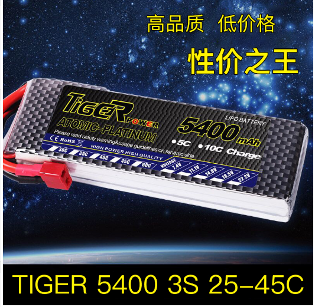
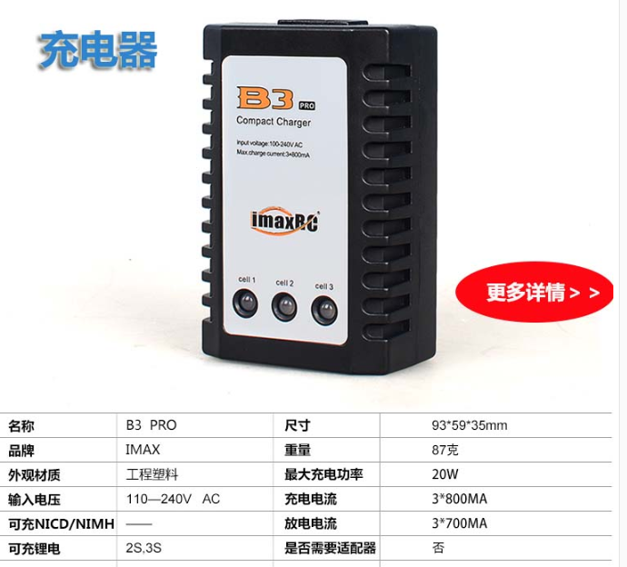

 5400mAh航模电池 

 From SZDOIT

## 1 简介

​	11.1V航模电池是一款低价格、高品质的3S锂电池，适用于智能小车、机器人、航拍等

## 2 产品特点

## 3 充电器

## 4 常见问题解答

Q：过渡放电和过渡充电会造成什么样的后果？

A：锂离子电池过度充放电会对正负极造成永久性损坏。 过度放电导致负极碳片层结构出现塌陷， 而塌陷会造成充电过程中锂离子无法插入； 过度充电使过多的锂离子嵌入负极碳结构，而造成其中部分锂离子再也无法释放出来。

## 更多资源，请关注公众号！

