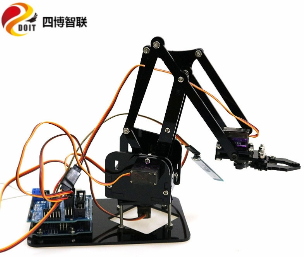

  MeArm机械臂的组装说明  

 from SZDOIT 

MeArm是时下最发烧的桌上型机器手臂，藉由 DIY 套件，它不只能带你走入 maker 世界， 更能培养程序设计能力， 从学生到社会人士都适合玩。本文件为 DIY 步骤，共 16 个步骤。

 

注意：180度舵机不同于普通电机，有固定的角度。所有舵机在出货前都已经是中位90度状态，在安装上机械臂之前，请勿随意转动舵机角度，否则会导致安装失败！（若不慎在安装前转动了舵机，请按角度需要将舵机复位。）

# Step 1: 查看清单

|      |                  |
| ---- | ---------------- |
|      |  |

# 清单列表：

| 名称 | PM3*30mm螺丝 | PM3*10mm螺丝 | PM3*8mm螺丝 | PM3*6mm 螺丝 | M3螺母 | M3*9单通铜柱 | MG90S |
| ---- | ------------ | ------------ | ----------- | ------------ | ------ | ------------ | ----- |
| 数量 | 4            | 12           | 15          | 15           | 16     | 7            | 4     |

## 控制套件:

**Arduino UNO R3             x1**

 **4 Motor && 16 Servo Board  x1**

# Step 2: 从下往上安装，首先安装底座

按下图所示进行安装，使用到螺丝：

1) 30 mm x 4        

2) M3螺母 x 8

2) 弹头铜柱x4

 

 

 

 

# Step 3: 安装第一个舵机

按下图方式安装，注意该舵机是180度的而不是360度的，所以不要转动它，使用到的螺丝

1) 8mm x 2

 

 

 

 

# Step 4: 安装左臂

请装上操纵杆，顺时针旋转伺服器直到停止。然后固定，具体如下图所示，使用到的螺丝：

1) 12mm x 3

2) 8mm x 2

 

 

 

 

 

 

# Step 5: 安装右臂

按下图所示安装，使用到的螺丝：

1) 10mm x 3

2) 8mm x 2

3) 6mm x 1

 

 

 

# Step 6:安装左臂和底盘

按下图所示方式进行安装，使用到的螺丝：

1) 10mm x 2

2) 6mm x 1

 

 

 

 

# Step 7: 安装右臂和底盘

 

 

# Step 8: 安装中间移动杆

 

 

# Step 9: 安装底盘和机箱

请将机箱固定在底座上，顺时针旋转伺服器直到停止。然后固定在基座上的舵机上，使用到的螺丝：

舵机自带的固定螺丝

 

# Step 10: Branch 1

按下图所示方式进行安装，使用到的螺丝：

6mm x 2

 

 

# Step 11: Branch 2

 按下图所示方式进行安装，使用到的螺丝：

1) 8mm x 1

2) 6mm x 2

	

# Step 12: 爪子舵机

按下图所示放下进行安装，使用到的螺丝：

8mm x 4

 

 

 

 

# Step 13: Gripper 1

按下图所示安装，使用到的螺丝：

1) 8mm x 1

2) 6mm x 3

 

 

 

# Step 14: Gripper 2

顺时针旋转伺服，直到停止，并固定为最后一秒的数字。逆时针稍微大一点旋转，以连接棒和夹具。使用到的螺丝：

  10mm x1

 

 

# Step 15: 安装爪子

按下图所示安装，使用到的螺丝： 

 8mm x2

 6mm x1

 

 

# Step 16: 添加控制板

 

 

 