
 8自由度人形机器人安装说明 

 From SZDOIT

## 一、发货清单

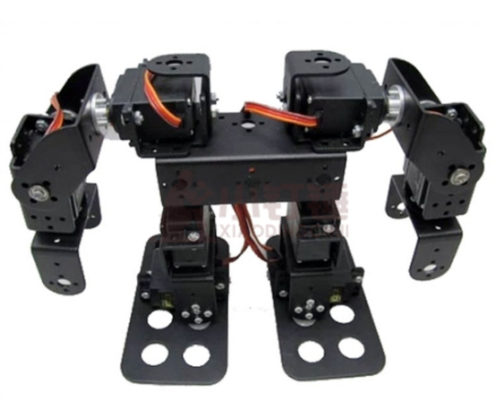

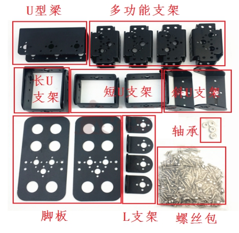

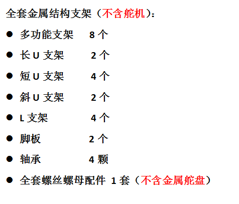 

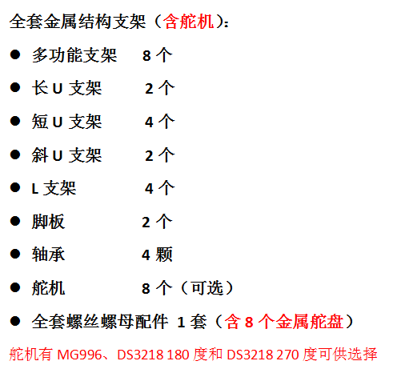 

螺丝套件清单：

| 名称 | M3*8平头螺丝 | M3螺母 | M*312平头螺丝 | 机械人轴承 |
| ---- | ------------ | ------ | ------------- | ---------- |
| 数量 | 120          | 80     | 10            | 4          |

## 二、安装过程

安装时采用从下往上一次安装，具体安装步骤如下：

注意：此过程中必须保证每个关节的舵机都处于中间位置即P1500位置。正常收到的舵机一般都处于P1500位置。购买了控制板的朋友可以通过相关的板子去检测修改下。角度校中好后不要试图用手或者其他方式转动舵机的输出轴。上面的过程既是对舵机角度的校中也是初步检测舵机跟控制板的问题，所以必不可少。完成上面的检测后就可以安装了。

### 1.安装脚掌

1) 取出一个脚板和一个多功能支架，使用M3*8螺丝和M3螺母固定，如下图：

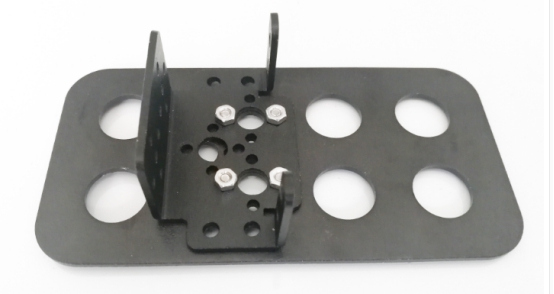 

2) 固定支架的时候，为了后面安装方便，先安装一颗M3*12的螺丝，如下图：

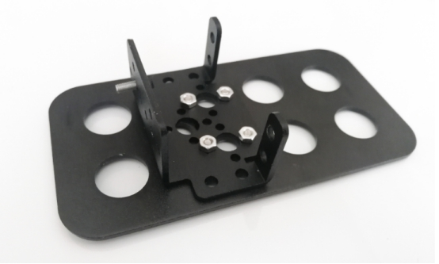 

3) 使用M3*8和M3螺母将舵机固定在多功能支架上，并用一颗M3x8螺丝将舵盘固定在舵机上

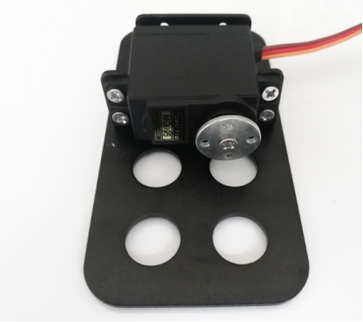 

### 2.安装小腿

1) 取出一个段短U支架，使用M3*8螺丝将其一端固定在舵机上，如下图：

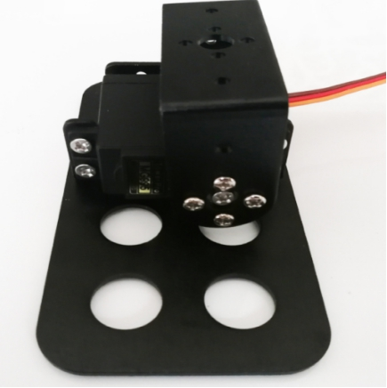 

2) 另一端先放一颗轴承，并用一颗M3螺母固定，如下图：

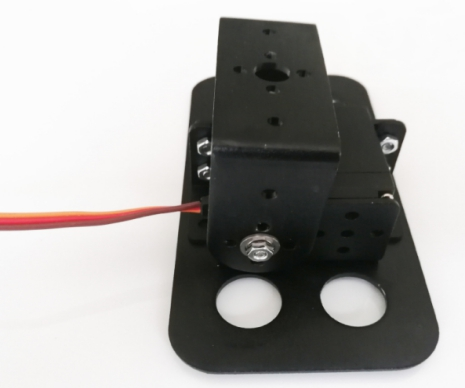 

3)  阶段性展示，如：

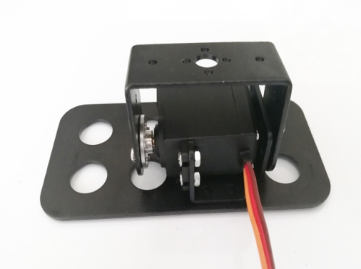 

### 3.安装大腿

1) 取出一个多功能支架，使用M3*8螺丝和M3螺母将其固定在短U支架上，如下图：

 

2) 再取出一个舵机和一个舵盘，先使用M3*8螺丝和M3螺母将舵机固定在多功能支架上，再使用M3x8螺丝将舵盘固定在舵机上，如下图：

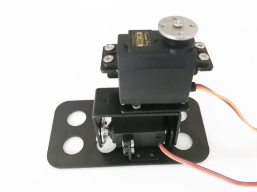 

到此机械人的一只脚已经完成了，使用同样的方法将另一只脚也安装好。

### 4.安装腰部

1) 取出U型梁和安装好的两只脚，使用M3*8螺丝将其固定，如下图：

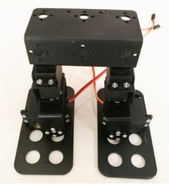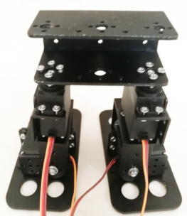 

### 5.安装机械人肩膀

1) 取出两个多功能支架，使用M3*8螺丝和M3螺母将其固定在多功能支架上，而且为了以后安装方便，可以在多功能支架上放M38螺丝，如下图：

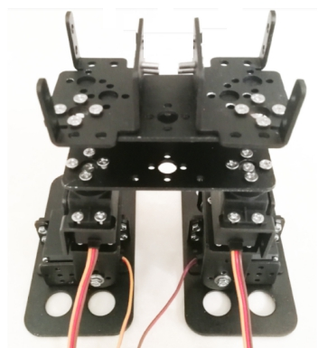 

2) 取出2个舵机、2个舵盘和2个L支架，先使用M3*8螺丝和M3螺母将舵机固定在多功能支架上，在使用M3x8螺丝固定舵盘，最后使用M3螺母将L支架固定，具体如下图：

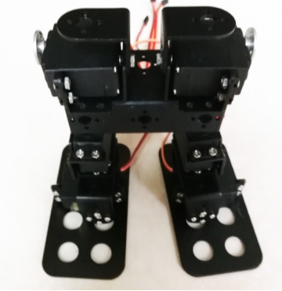 

### 6.安装机械人手柄

1) 先取出一个多功能支架，使用M3*8螺丝按下图位置放置：

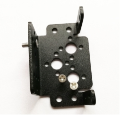 

2) 再取出一个舵机，使用M3*8螺丝和M3螺母将其固定在多功能支架上，如下图：

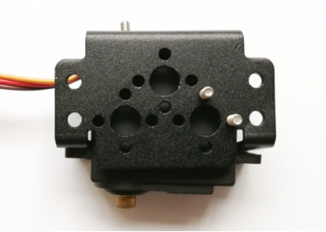 

3) 取出一个斜U支架，一端使用M3*8螺丝固定在舵机上。另一端先放一颗轴承，在使用M3螺母固定，如下图：

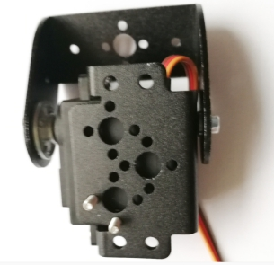 

4) 取出一个L支架，使用M3螺母将其固定在多功能支架上，如：

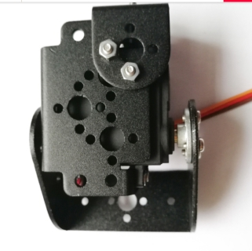 

6) 取出一个短U支架，使用M3*8螺丝和M3螺母，将其固定在L支架上，如下图：

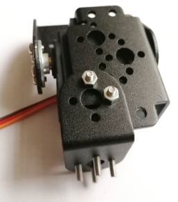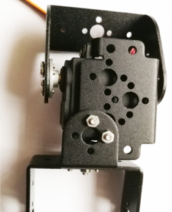 

到此机械人的一只手柄安装完成，使用同样的方法安装好另一只手

### 7.安装剩余部分

1) 取出安装好的主干部分和两只手柄，使用M38螺丝和M3螺母分别将两只手柄固定在主干上。如：

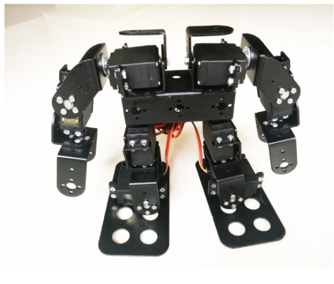 

 安装完成!

祝你成功! 

## 更多资源，请关注公众号！

