
 9自由度人形机器人安装说明 

 From SZDOIT

# 一、材料清单

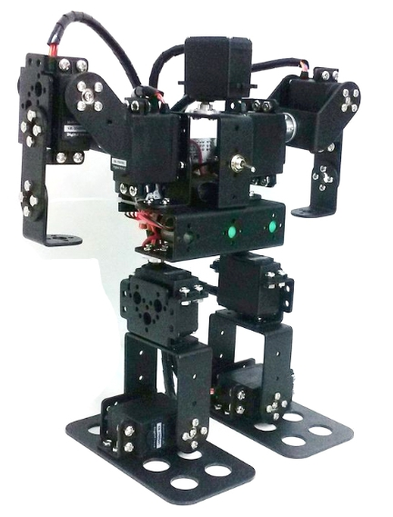

1.硬质铝合金多功能支架x 8
2.硬质铝合金长U型支架 x 2
3.硬质铝合金短U型支架 x 1
4.硬质铝合金斜坡U型支架x 2
5.硬质铝合金u型梁 x 1
6.硬质铝合金l型支架x 5
7.硬质铝合金支架 x 4
8.Robot Big Feet x 2
9.进口玻璃轴承 x 4
10.舵盘 x 9
11.MG996舵机 x 6

12. 控制器 x 1
13. 无线控制模块 x 1
14. 电池 x 1
15. 电池盒 x 1

安装工具:十字螺丝刀

安装提示:
	在安装机器人时，我们应该遵守从下到上、从左到右的安装规则。我们应该确保我们安装的每个步骤都是正确的，没有错误，然后我们才能继续。否则，当您稍后发现错误时，您必须拆解并从头安装。对于初学者来说，需要特别注意舵机的角度位置。你必须把舵机的转角调整到中心位置。如果不这样做，当舵机运转时，各关节的运动将受到限制。

注意：180度舵机不同于普通电机，有固定的角度。所有舵机在出货前都已经是中位90度状态，在安装上机械臂之前，请勿随意转动舵机角度，否则会导致安装失败！（若不慎在安装前转动了舵机，请按角度需要将舵机复位。）

# 二、安装过程

## Step 1: 安装足部结构

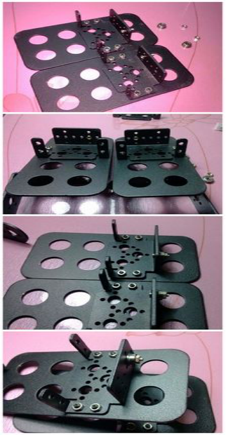 

## Step 2: 把舵机放到右边的角落

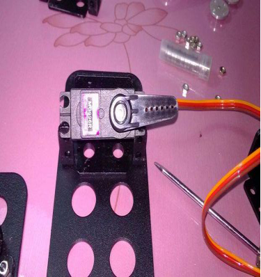 

脚结构安装完成后，开始安装舵机。首先调整中间位置，然后把舵机放到右角。

## Step 3: 把舵机放在左转弯处

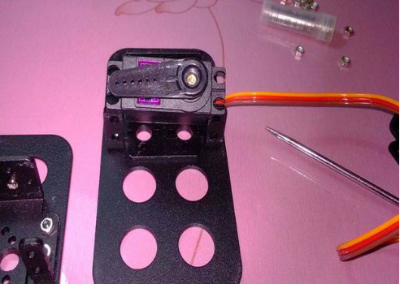 

## Step 4: 把舵机放在中间

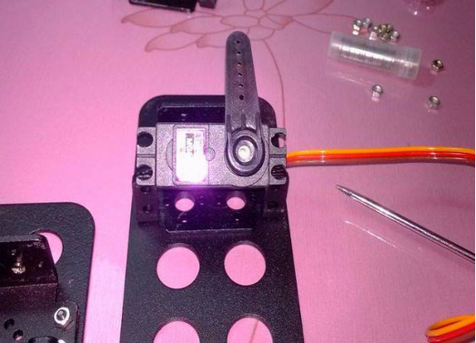 

然后把舵机放在中间。所以转向的角度范围已经设置好了。这样安装舵机机器人的关节范围最大。(在具体的应用中。，可合理选择安装位置的角度，避免出现死角。

## Step 5: 安装两个舵机

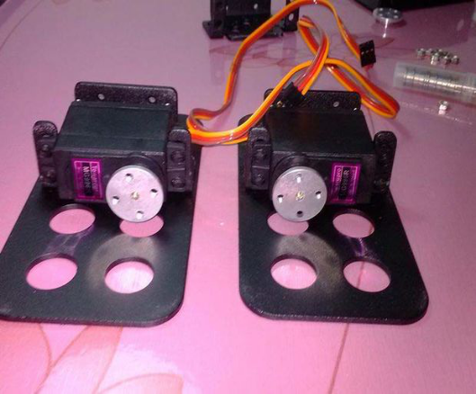 

两个舵机按上述步骤调整到合适的角度，开始安装。

## Step 6: 按下图方式安装长U支架

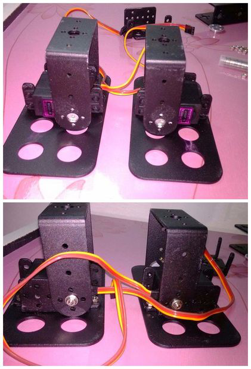 

调整舵角方向，舵角方向与长U型支架的孔径一致。接下来安装长U型支架。

## Step 7: 固定舵机

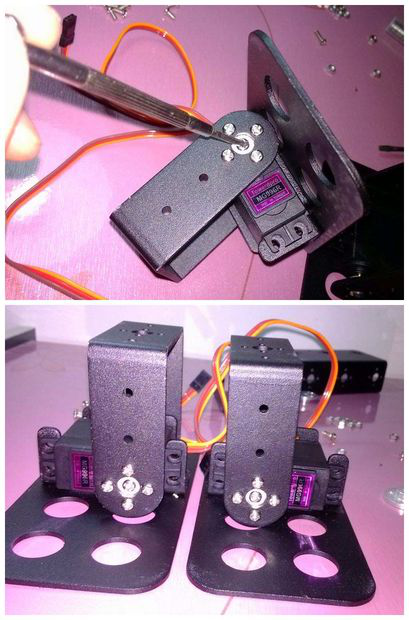 

## Step 8: 安装腿接头

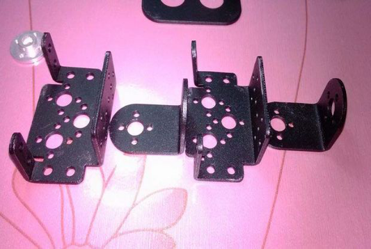 

接下来安装腿接头。准备配件。

## Step 9: 安装L型支架

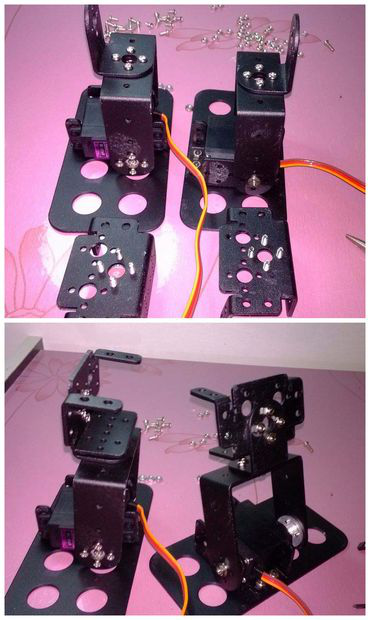 

你应该先安装L型支架，否则将很难安装舵机支架。

## Step 10: 完成伺服器的安装

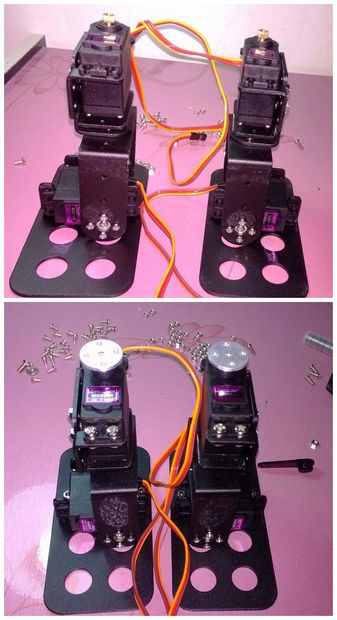 

将舵机调到合适的角度，然后开始安装。

## Step 11: 安装机器人腰部

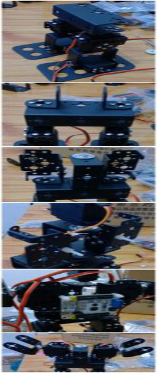 

机器人腰部应采用u形梁安装。

## Step 12: 安装机器人的机械手

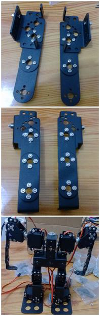 

## Step 13: 完成整个安装

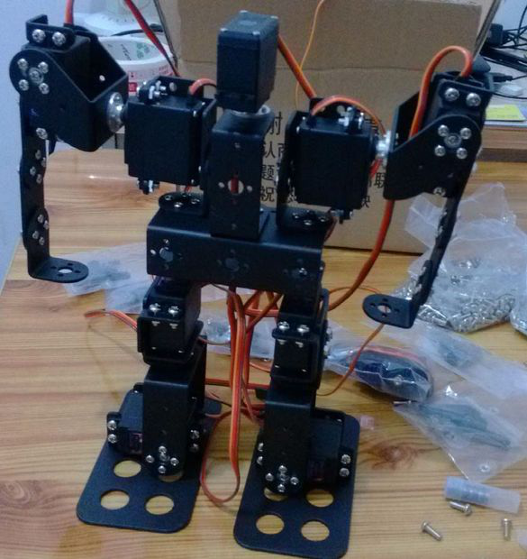 

 
 安装完成!

祝你成功! 

# 支持与服务

| 四博智联资源                                        |                                                              |
| --------------------------------------------------- | ------------------------------------------------------------ |
| 官网                                                | [www.doit.am](http://www.doit.am/)                           |
| 教材                                                | [ESPDuino智慧物联开发宝典](https://item.taobao.com/item.htm?spm=a1z10.3-c.w4002-7420449993.9.Bgp1Ll&id=520583000610) |
| 购买                                                | [官方淘宝店](https://szdoit.taobao.com/)(szdoit.am)          |
| 讨论                                                | [技术论坛](http://bbs.doit.am/forum.php)(bbs.doit.am)        |
| 应用案例集锦                                        |                                                              |
| [Doit玩家云](http://wechat.doit.am)(wechat.doit.am) | [免费TCP公网调试服务](http://tcp.doit.am)(tcp.doit.am)       |
| 官方技术支持QQ群1/2/3群已满                         |                                                              |
| 技术支持群4                                         | 278888904                                                    |
| 技术支持群5                                         | 278888905                                                    |
| 术支持群6                                           | 278888906                                                    |
| 技术支持群7                                         | 278888907                                                    |
| 技术支持群8                                         | 278888908                                                    |
| 技术支持群9                                         | 278888909                                                    |
| 技术支持群10                                        | 278888900                                                    |

