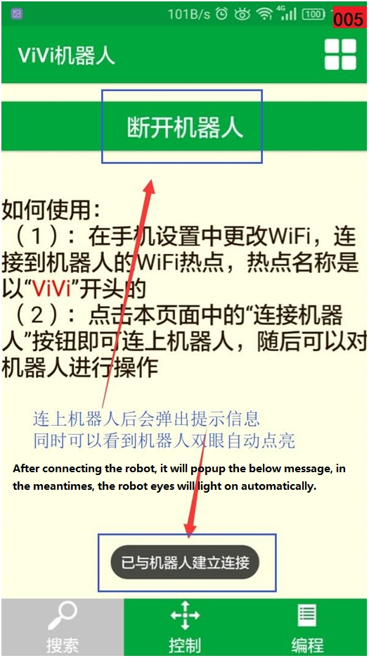
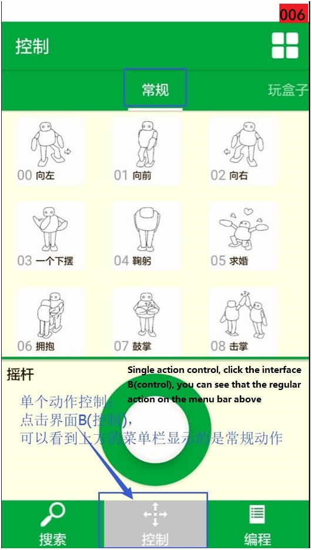
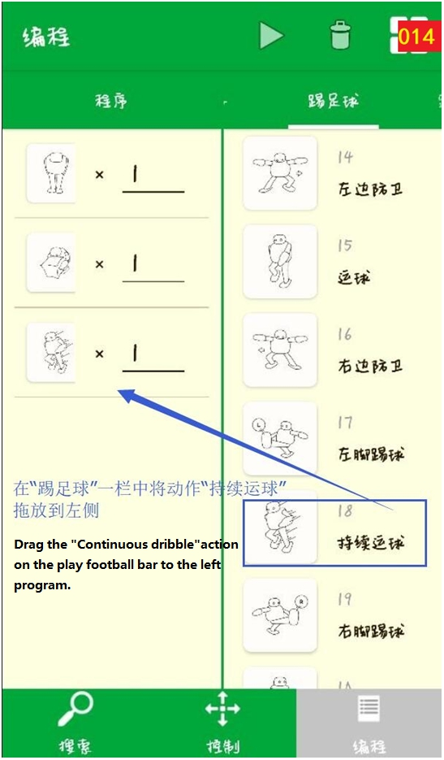
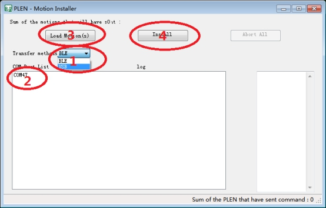
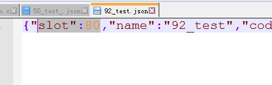
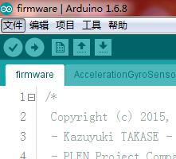

 ViVi人形机器人使用说明 

 From SZDOIT

# 【基础篇】

## 1 手机APP介绍及控制

安卓版：

下载链接1：http://www.doit.am/ViVi_1.1.0.apk

下载链接2：https://www.pgyer.com/qIYq

iOS版：

下载链接：https://itunes.apple.com/us/app/vivi-robot/id1255421040?l=zh&ls=1&mt=81

或者在苹果应用商店中搜索“ViViRobot”，然后下载安装

以下文档使用安卓版APP作为介绍

ViVi人形机器人APP具有控制机器人进行单个动作演示和通过编辑成为一整套连续动作两大功能；其中在“开发者模式”中还有调试模式，可对机器人的关节（舵机）进行校准操作（详情看文档A-组装&调试部分内容），以下是APP功能的图文介绍。

首先打开机器人的电源开关，然后打开手机的WiFi功能，按以下图示顺序进行操作；

 

 

 

 

 

 

 

 

 

 

 

 

 

 

 

 

## 2 充电说明

ViVi人形机器人的电源是4.8V电池，需要用所配的专用充电器给其充电，正常情况下，充满电池需要2小时，满电状态下的电源可以供机器人连续工作30分钟。

 

 

为机器人充电时请按以下图示进行操作：

 

 

 

 

 

 

## 3 固件烧录过程

硬件材料：

机器人控制板、FT232 usb转串口工具和母-母杜邦线；

软件材料：

固件“ViViRobot_7_19.bin”、固件“vivi_firmware.ino.nodemcu.bin”和烧录软件“ESPFlashDownloadTool_v3.4.9.2”；

请按图示顺序将固件下载到开发板中：

 

 

 

 

 

 

 

 

## 4 注意事项

① vivi机器人在电源突然没电的时候由于舵机的特性导致双手和双脚会瞬间不规则扭曲呈痉挛状，这属于正常现象，需要马上关闭电源，然后将手脚按原来的位置原路线旋转回初始化状态，特别是双臂，切不可不按舵机旋转路线的胡乱旋转到常规状态，这样会导致下次开机时舵机转角不准确，影响下次使用，严重者甚至会造成舵机的永久性损坏！

②充电时切记要确保电池正负极没接错再让其长时间充电，避免因为短路而烧坏控制板甚至发生其他不可预料的后果！

## 5 Mesh组网功能介绍（附录）

ViVi人性机器人的升级版自带可WiFi Mesh自组网功能，上电后可以自动识别或创建WiFi组网，理论上无论多少台机器人都可以实现组网功能，将N台带同样自组网功能的机器人都开机后，手机连上其中一个创建的热点“ViVi_Mesh”，密码是123456789，然后打开APP按第1章的操作方法，即可同时控制该已经组成网络的N台机器人同步进行动作演示了。

 

 

话不多说，以下是相关视频演示链接：

http://v.youku.com/v_show/id_XMjk5NjQyMTY1Ng==.html?spm=a2h3j.8428770.3416059.1

注意：ViVi机器人出厂自带的是单机版的程序，Mesh组网功能的这里仅作介绍，并非默认提供；

# 【高级篇】

## 6主程序上传至开发板

代码上传至开发板分网页上传、串口工具两种模式。网页上传前提是控制板已经上传过代码并能开启wifi热点或连接路由器，如果初次上传程序到开发板则需要用串口工具上传代码。

### 6.1 串口上传固件

打开专用的串口工具

 

1.主程序上传软件图标

选择ESP8266 DownloadTool后显示ESP8266程序上传界面。

 

 

2.芯片选择

下载步骤如下：

1)选择上传的BIN文件。

2)确认上传（默认0x00000）地址及上传文件

3)选择串口。

4)选择波特率（推荐选择115200，比较稳定）

5)点击程序上传Start按键进入同步模式

6)进入代码上传模式 ，控制板上按住flash键不放然后按下Reset键，然后松开Reset键后再松开flash键使控制板进入下载模式，如果成功则ESP8266 Download开始烧写程序至开发板。

7)上传完成后，打开串口调试助手测试程序是否上传完成，如果出现如串口调试图中所示则说明程序上传成功（已配置smartconfig模式）注意：如果没有上传动作文件。

 

3.ESP8266DownloadTool设置ESP8266DownloadTool settings

 

4.串口调试（已配置smartconfig）Serial port debugging (smartconfig is configured)

 

5.串口调试（未配置smartconfig）

### 6.2 网页上传固件(AP模式) 

#### 6.2.1 AP模式

AP模式即通过连接控制板的wifi热点对其进行配置。连接控制板wifi热点后在浏览器上输入192.168.4.1/update  进入下载页面，并选择需要上传的BIN文件点击上传。网页左下角有程序上传进度。

 

6.网页上传页面

 

7.上传进度显示

## 7 动作文件上传至开发板

人形机器人的动作文件的上传需要专门的文件上传工具MotionInstaller.exe,通过串口工具上传代码，串口一定要用PL2303串口工具上传，否则上传不成功。注意：烧写动作文件时需要先把00_Lstep.json一起上传，以确定动作文件的起始地址位置。

代码上传步骤：

打开MotionInstaller软件,串口号会在COM Port List显示，如果不显示则说明串口不对。1.Transfer methods选择USB->2.点击串口->3.点击LoadMotion选择动作文件（动作文件在Install Motionmotions内，初次下载建议先下载一个进行测试能不能上传成功，本教程以下载26_Twist_Dance为例）->4.选择完成后点击Install下载到控制板内。

 

8.动作文件上传步骤

 

9.动作文件文档

 

10.文件上传状态

下载完成后打开串口助手并重启控制板，通过串口助手测试动作文件是否下载成功。A

向控制板发送$PM26命令（$PM为执行动作命令，26为动作的标号即26_Twist_Dance名称的前标。相关协议可参考http://plen.jp/playground/wiki/specifications/protocol

 

11.控制板重启后串口显示（未配置smartconfig）

如果串口输出下面的信息则说明动作文件下载成功，之后可以将全部动作文件烧入控制板中，选择动作文件时全选即可。

 

12.动作上传成功

## 8 图形化编辑动作Graphical editing action

如果用户想自己设计人形机器人的动作可以通过motion_editor.exe图形化编辑软件进行开发。motion_editor功能很强大，不仅能够编辑人形机器人的动作还是在线模拟仿真、实时控制等。

### 8.1 软件图标

 

15.图标

### 8.2 软件功能解释

（1）打开动作文件夹

（2）保存当前动作

（3）新建动作

（4）默认设置（未测试）

（5）连接机器人

（6）下载动作程序至控制板

（7）模拟机器人动作

（8）停止模拟动作

（9）选择上一动作帧

（10）选择下一动作帧

（11）动作帧显示区，点击右侧空白处添加动作

（12）动作文件的头（十进制数）

（13）左边当前动作与右边当前动作互换

（14）左对称，以左半边动作为准

（15）右对称，以右半边动作为准

（16）图形界面回到初始位置

（17）动作设计界面，鼠标点击并按住拖动想要运动的轴

 

16.图形编辑界面

注意：由于图形编辑器保存时存在BUG即修改Slot时不能保存至文件中，所以需要在文件内部修改，找到刚才保存的文件通过代码阅读工具打开（推荐notepad++）在代码的头部可以看到如下图所示代码，将”slot”:后面的值改为想要的数值。注意：数值是十进制的数值，而通过TCP或者串口调试时执行动作代码如动作上传中的$PM26中的26是十六进制的值，也就是说在串口或者TCP调试时输入的执行动作命令应该为$PM50(十六进制数50的十进制为80)。

 

17.动作文件代码

修改完成后通过MotionInstaller软件上传至控制板中即可，同时还有一点要注意的修改Slot的值不能大于91。默认的动作文件中有一些空文件，用户可以利用。如下图所示。

 

18.动作文件空文件Action file empty file

## 9 代码编译工具Code compilation tool

控制板的核心是ESP8266，其编译器是ArduinoIDE的二次开发，工具名称为arduino-1.6.8_SDK_1.5.4。

 

19.代码编译工具图标

打开软件点击文件进入主程序文件夹选择以ino结尾的文件即主程序入口文件(如firmware.ino)。并在主界面中的工具选择相应参数(默认)以及串行端口。在代码编译工具的主界面中的图标依次为编译验证、代码上传、新建文档、文件打开、文件保存。用户点击编译验证成功后会生成一个BIN文件，其位置默认在D:bilud2中(BIN文件保存位置修改可参见该文件下的Bin路径修改txt文件)。BIN文件上传至控制板可参考第一节，或者用户可以通过代码编译工具内的代码上传按键直接上传至开发板。注意：在上传代码时需要先让开发板进入代码上传模式，具体操作参考1.1串口上传代码。

 

19.代码编译工具主界面

 

20.选择文件Select the file

## 10 程序相关资料链接

用户如果需要自行开发或者修改内部代码则可以参考一下网站：

1.[ http://plen.jp/playground/wiki/specifications/protocol]( http:/plen.jp/playground/wiki/specifications/protocol)机器人通讯协议

2.[http://plenprojectcompany.github.io/plen-Firmware_Arduino/class_p_l_e_n2_1_1_motion_1_1_frame.html#details ](#details )

机器人代码下载及解释

# 附录. 设计资料

| 四博智联资源                                           |                                                              |
| ------------------------------------------------------ | ------------------------------------------------------------ |
| 官网                                                   | [www.doit.am](http://www.doit.am/)                           |
| 教材                                                   | [ESPDuino智慧物联开发宝典](https://item.taobao.com/item.htm?spm=a1z10.3-c.w4002-7420449993.9.Bgp1Ll&id=520583000610) |
| 购买                                                   | [官方淘宝店](https://szdoit.taobao.com/)(szdoit.am)          |
| 讨论                                                   | [技术论坛](http://bbs.doit.am/forum.php)(bbs.doit.am)        |
| 应用案例集锦                                           | [智能建筑云](http://building.doit.am)(building.doit.am)      |
| [光伏监控云](http://solar.doit.am)(solar.doit.am)      |                                                              |
| [Doit玩家云](http://wechat.doit.am)(wechat.doit.am)    |                                                              |
| [免费TCP公网调试服务](http://tcp.doit.am)(tcp.doit.am) |                                                              |
| 官方技术支持QQ群                                       |                                                              |
| 技术支持群1                                            | 278888901                                                    |
| 技术支持群2                                            | 278888902                                                    |
| 技术支持群3                                            | 278888903                                                    |
| 技术支持群4                                            | 278888904                                                    |
| 技术支持群5                                            | 278888905                                                    |
| 技术支持群6                                            | 278888906                                                    |
| 技术支持群7                                            | 278888907                                                    |
| 技术支持群8                                            | 278888908                                                    |
| 技术支持群9                                            | 278888909                                                    |
| 技术支持群10                                           | 278888900                                                    |

| 乐鑫ESP8266资源                                              |                                                              |
| ------------------------------------------------------------ | ------------------------------------------------------------ |
| 芯片基本资料                                                 | [ESP8266快速入门指南](http://espressif.com/sites/default/files/documentation/esp8266_quick_start_guide_cn.pdf) |
| 软件编程基本资料                                             | [ESP8266 SDK⼊⻔指南](http://espressif.com/sites/default/files/documentation/2a-esp8266-sdk_getting_started_guide_cn.pdf) |
| [ESP8266 SDK](http://www.espressif.com/zh-hans/support/download/sdks-demos?keys=&field_type_tid[]=14) |                                                              |
| 固件下载工具                                                 | [ESP8266下载⼯具](http://www.espressif.com/zh-hans/support/download/other-tools?keys=&field_type_tid[]=14) |
| 资源整合                                                     | [ESP8266官⽅论坛](http://bbs.espressif.com/)                 |
| [ESP8266资源合集](http://www.espressif.com/zh-hans/products/hardware/esp8266ex/resources) |                                                              |

# 免责申明和版权公告

本文中的信息，包括供参考的URL地址，如有变更，恕不另行通知。 

文档“按现状”提供，不负任何担保责任，包括对适销性、适用于特定用途或非侵权性的任何担保，和任何提案、规格或样品在他处提到的任何担保。本文档不负任何责任，包括使用本文档内信息产生的侵犯任何专利权行为的责任。本文档在此未以禁止反言或其他方式授予任何知识产权使用许可，不管是明示许可还是暗示许可。 

Wi-Fi联盟成员标志归Wi-Fi联盟所有。

文中提到的所有商标名称、商标和注册商标均属其各自所有者的财产，特此声明。

# 注 意

由于产品升级或其他原因，本手册内容有可能变更。深圳四博智联科技有限公司保留在没有任何通知或者提示的情况下对本手册的内容进行修改的权利。本手册仅作为使用指导，深圳四博智联科技有限公司尽全力在本手册中提供准确的信息，但是并不确保手册内容完全没有错误，本手册中的所有陈述、信息和建议也不构成任何明示或暗示的担保。