
2自由度支架安装说明

 From SZDOIT 

## 材料清单

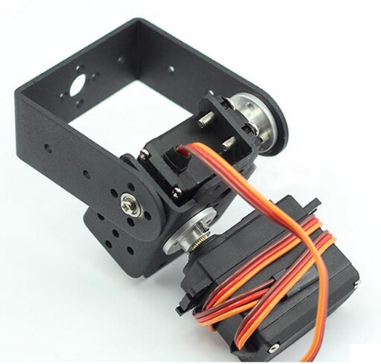

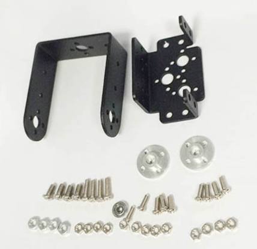

## 安装步骤

### 1.多功能支架，先装舵盘，拧上 4颗M3*6mm螺丝

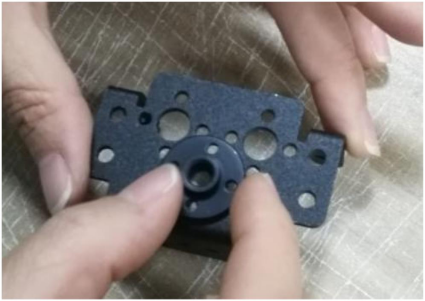
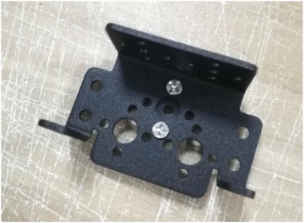

### 2.长 U 支架，一边装上舵盘，另一边套轴承和螺丝

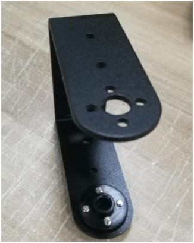
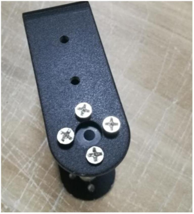

### 3.套上多功能支架，用螺母锁住 2 个支架

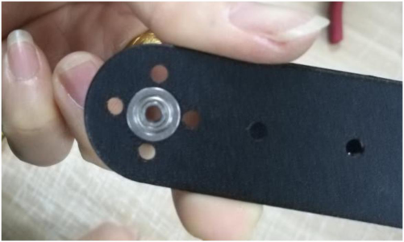
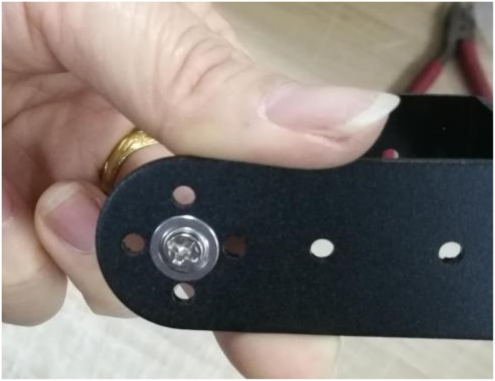

### 4.舵机 4 个角上套上橡胶螺母 

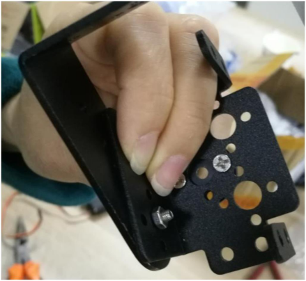
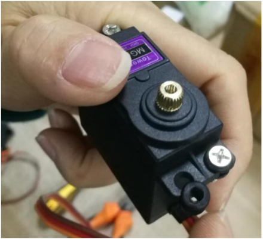

### 5.舵机放进多功能支架，用螺母锁住 

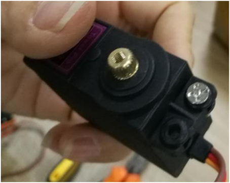
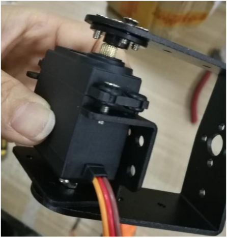

### 6.长支架装舵盘的一边套上黑色螺丝 

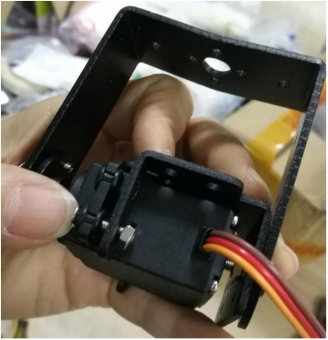

### 7.最后装上第二个舵机。

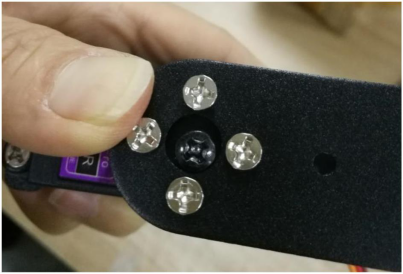
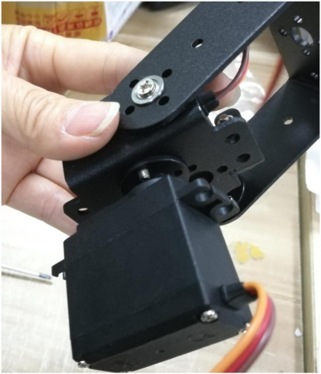

## 更多资源，请关注公众号！

