
 3DOF Robot Arm

 From SZDOIT

# 一、简介

这个一款新型的3自由度的舵机机械臂，具有负载大、性价比高等特点，非常适用于DIY创作。

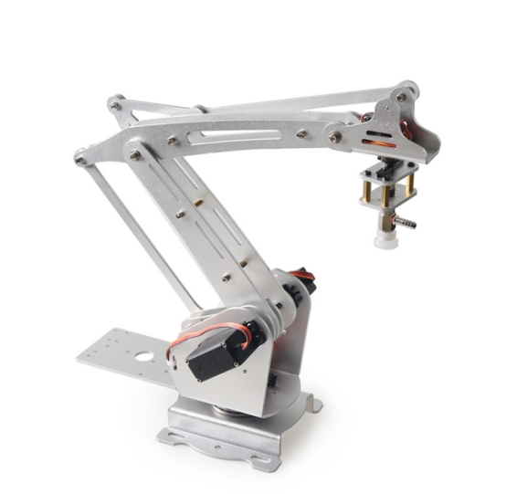 

 

注意：180度舵机不同于普通电机，有固定的角度。所有舵机在出货前都已经是中位90度状态，在安装上机械臂之前，请勿随意转动舵机角度，否则会导致安装失败！（若不慎在安装前转动了舵机，请按角度需要将舵机复位。

**安装使用到的螺丝包：**

| 螺丝型号 | 杯头M3*8 | 杯头M3*0 | 杯头M3*16 | 圆头M3*6 | 圆头M3*8 | 圆头M4*8 | 平头KM4*6 | 螺母M3 | 合计 |
| -------- | -------- | -------- | --------- | -------- | -------- | -------- | --------- | ------ | ---- |
| 数量     | 14       | 2        | 1         | 4        | 10       | 12       | 4         | 13     | 74   |

**其它配件**

| 配件名称 | 内孔3MM大垫片 | 内孔3MM小垫片      | 单通M3*5+6铜螺母 | 单通M3*7+4铜螺母 | 双通M3*15铜螺母 | 双通M3*22铜螺母 | 双通M3*11铜螺母 | 双通M3*10铜螺母 | 双通M3*7铜螺母 | 双通M4*9铜螺母 |
| -------- | ------------- | ------------------ | ---------------- | ---------------- | --------------- | --------------- | --------------- | --------------- | -------------- | -------------- |
| 数量     | 11            | 11                 | 1                | 4                | 3               | 2               | 1               | 1               | 1              | 4              |
| 配件名称 | 51106拖盘轴承 | 内孔3外径7法兰轴承 | 20G舵机          | 舵盘             | 空心管          |                 |                 |                 |                |                |
| 数量     | 1             | 11                 | 3                | 3                | 1               |                 |                 |                 |                |                |

# 二、安装步骤

安装过程遵循从下往上安装的原则，具体步骤如下：

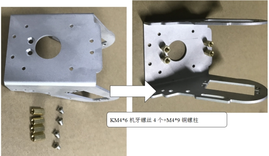 

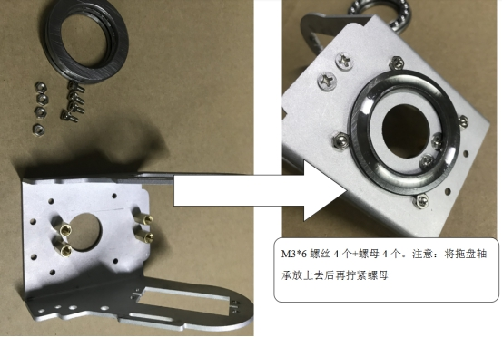 

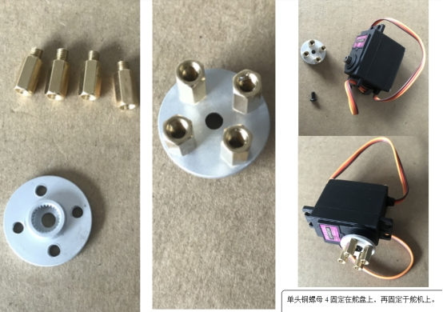 

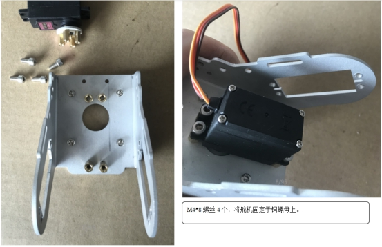 

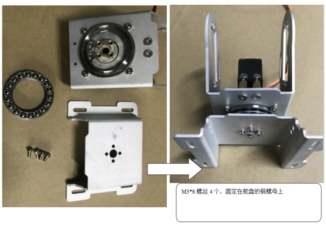 

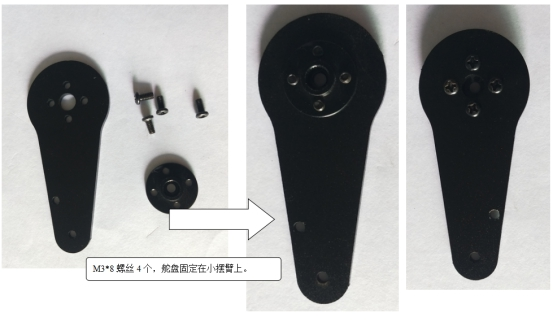 

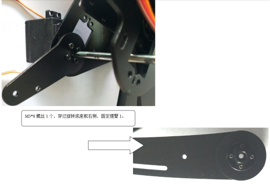 

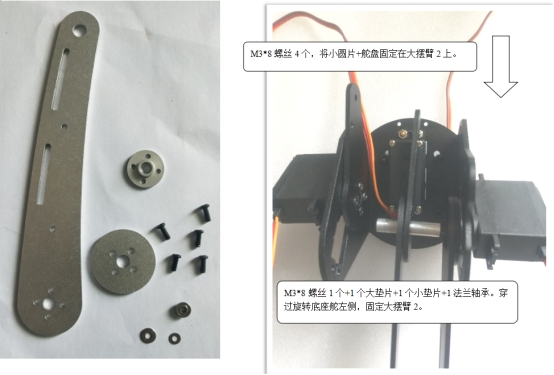 

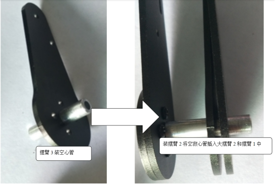 

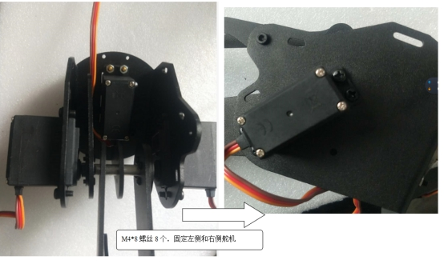 

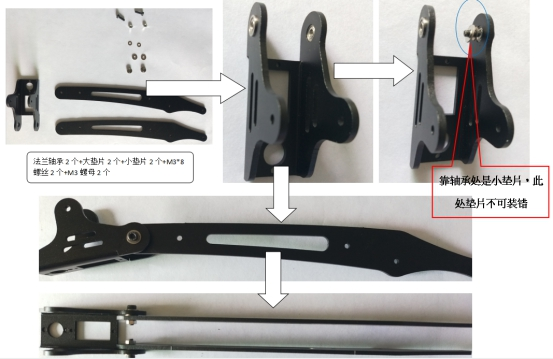 

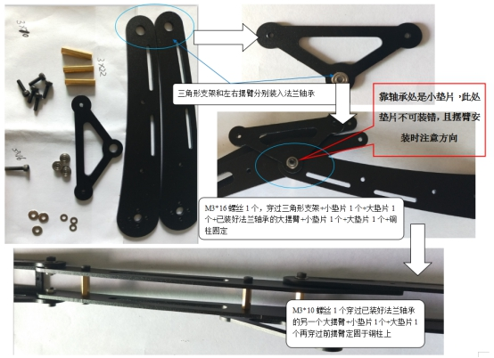 

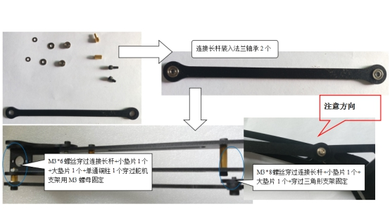 

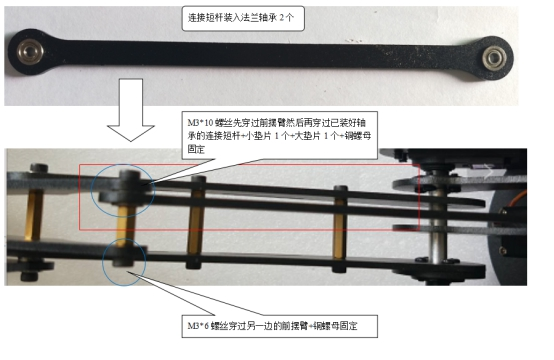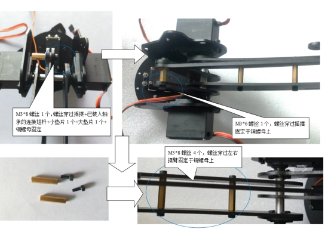 

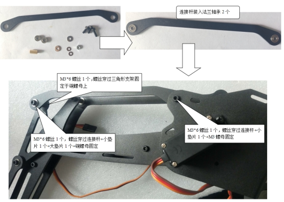 

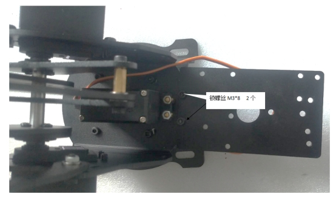 

#  支持与服务

| 四博智联资源                                        |                                                              |
| --------------------------------------------------- | ------------------------------------------------------------ |
| 官网                                                | [www.doit.am](http://www.doit.am/)                           |
| 教材                                                | [ESPDuino智慧物联开发宝典](https://item.taobao.com/item.htm?spm=a1z10.3-c.w4002-7420449993.9.Bgp1Ll&id=520583000610) |
| 购买                                                | [官方淘宝店](https://szdoit.taobao.com/)(szdoit.am)          |
| 讨论                                                | [技术论坛](http://bbs.doit.am/forum.php)(bbs.doit.am)        |
| 应用案例集锦                                        |                                                              |
| [Doit玩家云](http://wechat.doit.am)(wechat.doit.am) | [免费TCP公网调试服务](http://tcp.doit.am)(tcp.doit.am)       |
| 官方技术支持QQ群1/2/3群已满                         |                                                              |
| 技术支持群4                                         | 278888904                                                    |
| 技术支持群5                                         | 278888905                                                    |
| 术支持群6                                           | 278888906                                                    |
| 技术支持群7                                         | 278888907                                                    |
| 技术支持群8                                         | 278888908                                                    |
| 技术支持群9                                         | 278888909                                                    |
| 技术支持群10                                        | 278888900                                                    |

# 免责申明和版权公告

本文中的信息，包括供参考的URL地址，如有变更，恕不另行通知。 

文档“按现状”提供，不负任何担保责任，包括对适销性、适用于特定用途或非侵权性的任何担保，和任何提案、规格或样品在他处提到的任何担保。本文档不负任何责任，包括使用本文档内信息产生的侵犯任何专利权行为的责任。本文档在此未以禁止反言或其他方式授予任何知识产权使用许可，不管是明示许可还是暗示许可。 

Wi-Fi联盟成员标志归Wi-Fi联盟所有。

文中提到的所有商标名称、商标和注册商标均属其各自所有者的财产，特此声明 

# 注 意

由于产品升级或其他原因，本手册内容有可能变更。深圳四博智联科技有限公司保留在没有任何通知或者提示的情况下对本手册的内容进行修改的权利。本手册仅作为使用指导，深圳四博智联科技有限公司尽全力在本手册中提供准确的信息，但是并不确保手册内容完全没有错误，本手册中的所有陈述、信息和建议也不构成任何明示或暗示的担保。

