
 4自由度机械臂

 From SZDOIT

## 一、简介

这个一款新型的3自由度的舵机机械臂，具有负载大、性价比高等特点，非常适用于DIY创作。

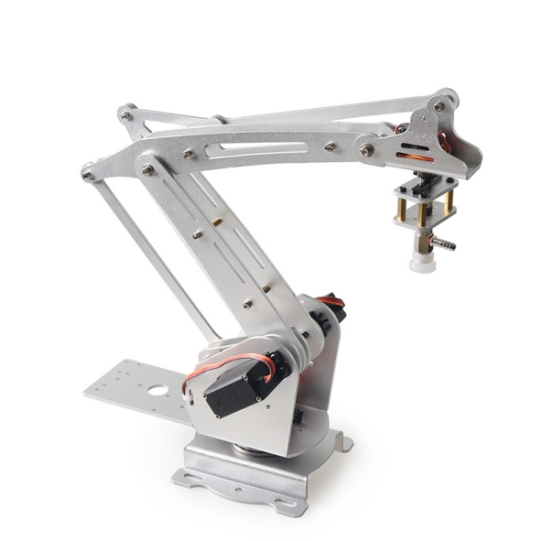 

 

注意：180度舵机不同于普通电机，有固定的角度。所有舵机在出货前都已经是中位90度状态，在安装上机械臂之前，请勿随意转动舵机角度，否则会导致安装失败！（若不慎在安装前转动了舵机，请按角度需要将舵机复位。

**安装使用到的螺丝包：**

| 螺丝型号 | 杯头M3*8 | 杯头M3*0 | 杯头M3*16 | 圆头M3*6 | 圆头M3*8 | 圆头M4*8 | 平头KM4*6 | 螺母M3 | 合计 |
| -------- | -------- | -------- | --------- | -------- | -------- | -------- | --------- | ------ | ---- |
| 数量     | 14       | 2        | 1         | 4        | 10       | 12       | 4         | 13     | 74   |

**其它配件**

| 配件名称 | 内孔3MM大垫片 | 内孔3MM小垫片      | 单通M3*5+6铜螺母 | 单通M3*7+4铜螺母 | 双通M3*15铜螺母 | 双通M3*22铜螺母 | 双通M3*11铜螺母 | 双通M3*10铜螺母 | 双通M3*7铜螺母 | 双通M4*9铜螺母 |
| -------- | ------------- | ------------------ | ---------------- | ---------------- | --------------- | --------------- | --------------- | --------------- | -------------- | -------------- |
| 数量     | 11            | 11                 | 1                | 4                | 3               | 2               | 1               | 1               | 1              | 4              |
| 配件名称 | 51106拖盘轴承 | 内孔3外径7法兰轴承 | 20G舵机          | 舵盘             | 空心管          |                 |                 |                 |                |                |
| 数量     | 1             | 11                 | 3                | 3                | 1               |                 |                 |                 |                |                |

## 二、安装步骤

安装过程遵循从下往上安装的原则，具体步骤如下：

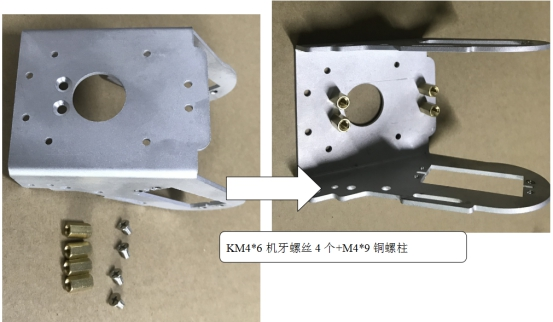 

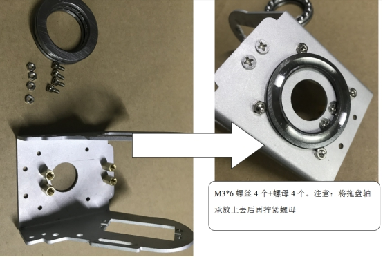 

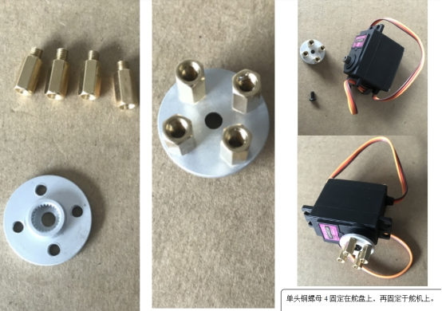 

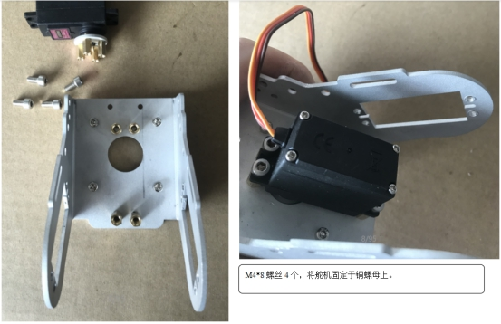 

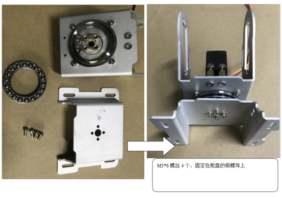 

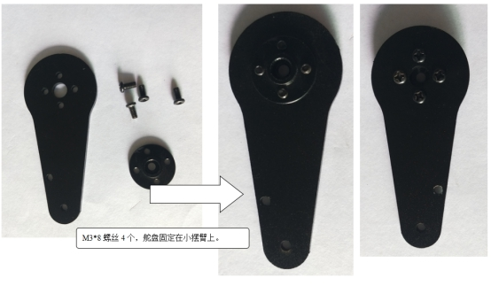 

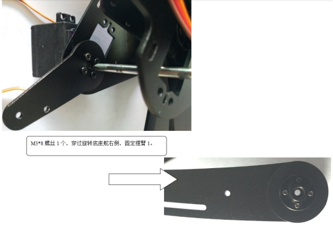 

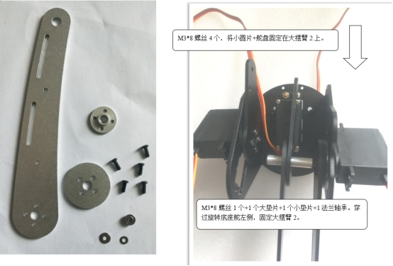 

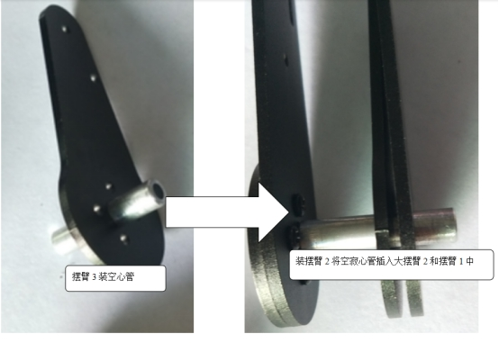 

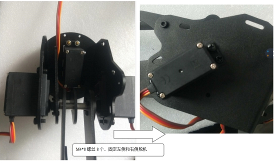 

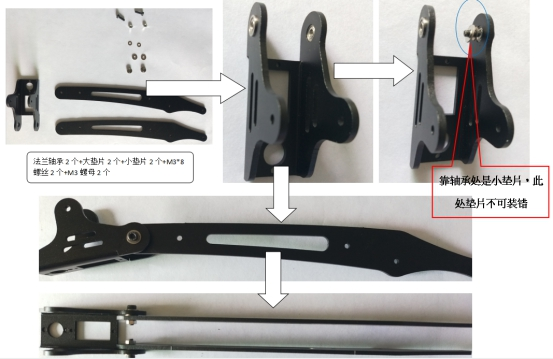 

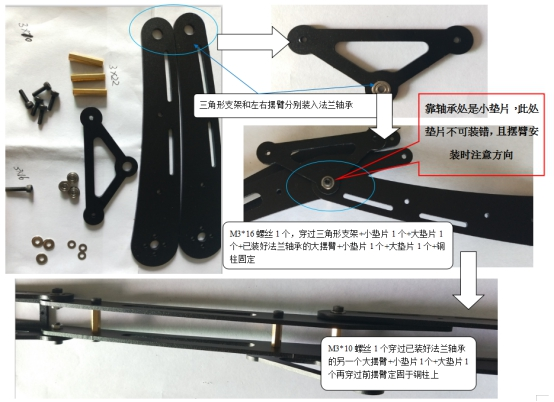 

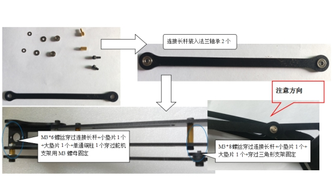 

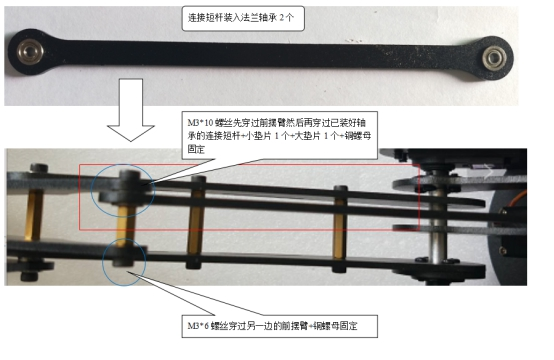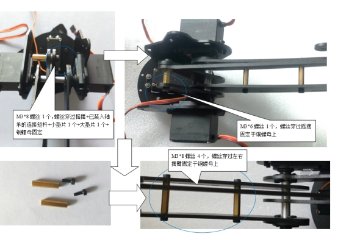 

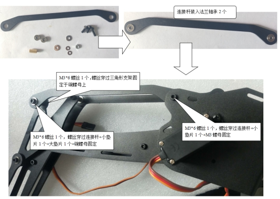 

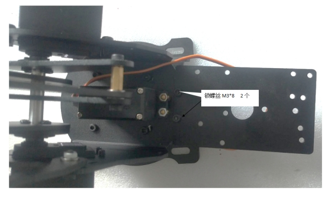

更多资源，请关注微信公众号！ 

