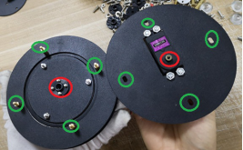

 
 6自由度云台机械臂安装说明 

 from SZDOIT 

# 一、清单

 

注：部分配件后续如有更新，恕不通知。请以实物为准。

1 小圆盘

2 小圆盘2 

3 舵盘 25T 

4空心圆盘

5 大轴承 

6 舵机圆盘 

7 大底座 

8 多功能支架

9 U型支架

 

# 一．底座的安装

1. 取小圆盘2和M320螺丝，用螺母拧紧，如图

 

2. 取小圆盘1和舵盘，如图，对孔安装

 

 

3. 取大轴承放在两个小圆盘中间，对准边缘3个孔，用M3*20螺丝穿过上下小圆盘螺孔，并用M3螺母固定

 

完成后，如图

 

4. 取两个空心圆盘，将大轴承放中间，上下两个圆盘4孔对齐，用M3*20螺丝穿过，并用M3*10+6铜柱体固定住

 

5. 另取舵机圆盘和舵机，将舵机安装在圆盘上，并用4颗M4螺丝螺母固定

 

注意：此处必须注意舵机安装的方向。如图。

 

 

6. 安装两个圆盘。如图，将两个圆盘同颜色部分对准螺孔安装，使得舵机和舵盘结合、铜柱体穿过螺孔。然后用两通铜柱体固定。

 

7. 安装大底板 ,取大底盘。4孔对齐（如图）。用M3螺母锁住。

 

至此，机械臂底座安装完毕

# 二．机械臂的安装

说明：由于机械臂是有几个关节组成，如图，可以先组装好整个机械臂然后再和底盘组装，又或者从底座开始往上由低到高组装，次序可不分先后。本说明是先安装底座的舵机部分1然后再安装2、 3、 4 节，最后安装机械爪。

 

1. 取1个多功能支架、U型支架、一个小舵盘和小轴承。先安装U型支架和舵盘。如图，对准螺丝孔，用M3*8螺丝和螺母固定。

 

然后将多功能支架和U型支架连接。

两个支架对孔（如图所示），放入小舵盘，用M3螺丝和螺母锁紧。

 

 

 

2. 安装支架到底座。

多功能支架4孔（如下图所示）对准底座凸起的4颗螺丝，用力压下。（为了便于理解，右图单独用多功能支架进行示范）并且用螺母锁紧。

 

支架安装后如图

 

3.安装舵机

取一个舵机。将舵机放置在多功能支架上，轻轻掰开U型支架对准舵机减速齿轮，使之正确咬合。然后用4颗M4螺丝螺母锁住

 

 

 

3. （安装机械臂第二部分）取一个多功能支架和一个L型支架，如图所示，对准两个孔口，用M3*8锁住。

 

效果图

 

4.取一个U型支架和舵盘。如上述步骤一样，进行组装。

 

 

5.组装多动能支架和U型支架（如上述步骤一样）。

 

 

6.关节连接。另取一个U型支架。将U型支架和上述步骤5 所得U型支架连接。并用M3*8螺丝固定4个螺孔。如图。（图中没有全部安装螺丝，为了产品的结构稳定，请完整地安装螺丝并锁紧）

 

7.安装舵机。（图中螺丝的安装方向可以向内或向外。不影响产品运行）

 

或者

 

8.另取两个多功能支架。按照图中方式进行组装，并在图中红色标识处用2颗M3螺丝螺母固定。

 

 

固定效果如下

 

 

9. 连接机械臂。拿出组装好的U型支架手臂，给U型支架装上小舵盘。

 

装上小轴承，并对孔锁住。（图中红色标识部分）

 

安装舵机。

 

 

# 三．底座和机械臂连接。

用M3螺丝螺母将底座和机械臂连接在一起。

 

 

# 四．爪子的安装。

装爪子到臂上之前，爪子先不要安装舵机，而是先将爪子与舵盘安装好再固定到机械臂的舵机上，最后再安装爪子上剩余部分。

 

螺丝和舵盘的固定方向如图：

 

## 更多资源，请关注公众号！

