 

金属爪子G6安装手册

 From SZDOIT 

## 1. 简介

本手册详细了介绍爪子的安装过程。

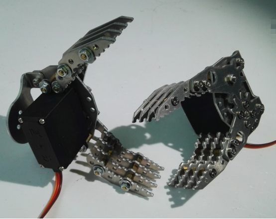

## 2. 材料准备

材料一览表：

| 名称           | 数量 |
| -------------- | ---- |
| 爪子(套装)     | 1    |
| MG995 舵机     | 1    |
| 舵盘25T        | 1    |
| M38 内六角螺丝 | 7    |
| M3螺母         | 13   |
| 10mm单通铜柱   | 4    |
| M36平头螺丝    | 10   |
| M4垫片         | 16   |
| M412螺丝       | 1    |
| 轴承           | 1    |
| 单通铜柱       | 12   |
| M3 六角扳手    | 1    |

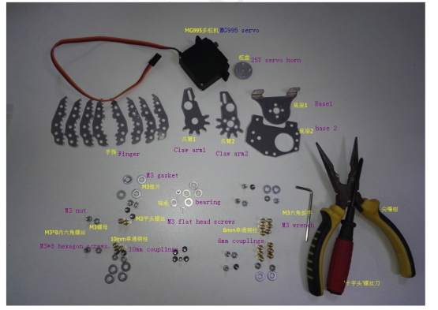

 

## 3. 安装过程

准备齐全上述构件、五金螺丝配件以及工具，进入安装环节。

### 1） 安装爪子的底座

所需材料：底座1、底座2、M38内六角螺丝、M3螺母；

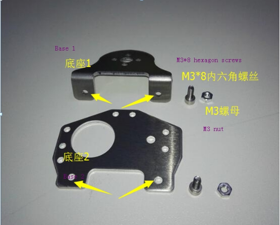 

如图示进行安装：

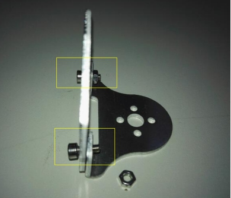 

 

### 2） 安装舵机

所需材料：MG995舵机、10mm单通铜柱、M36平头螺丝、M3垫片、M3螺母；

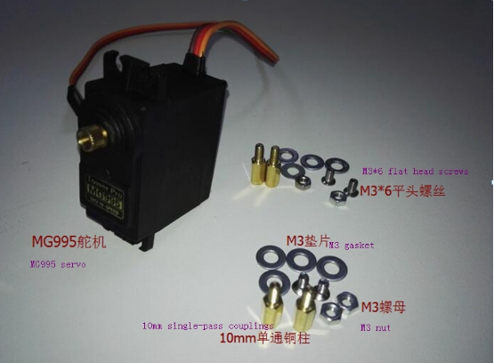 

如图示进行安装：

 

### 3） 底座与爪臂1的连接

所需材料：底座、爪臂1、轴承、M312螺丝、M3垫片、M3螺母；

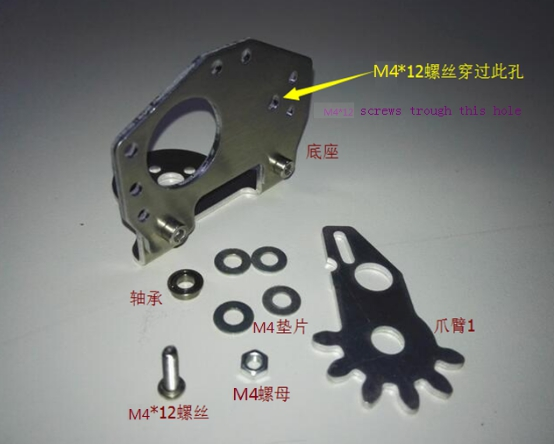 

如图示进行安装：

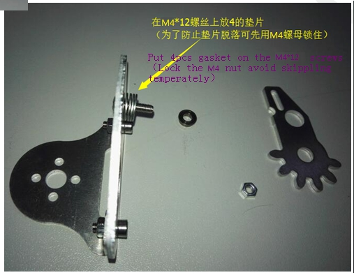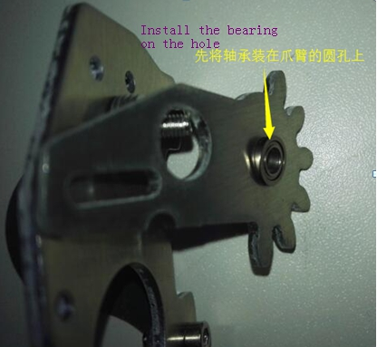 

注意安装时，M412螺丝穿过底座图示那个孔之后，放上4个垫片，暂时用M4螺母锁住，等到进行“步骤5”时将舵机固定在底座之后再将M3螺母取下来然后M412螺丝穿过爪臂1的圆孔再用M4螺母固定住，详见步骤5；

### 4） 安装爪臂2

所需材料：爪臂2、舵盘、M36平头螺丝、M38内六角螺丝；

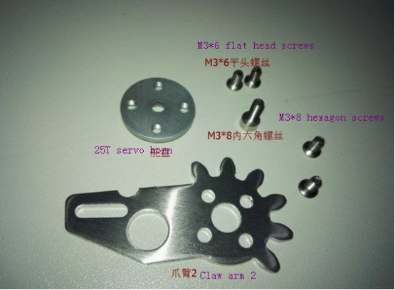 

如图示进行安装Installation：

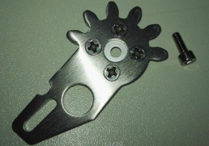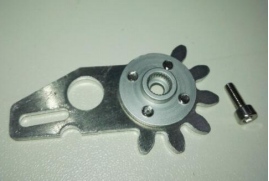 

### 5） 底座与舵机连接

所需材料：舵机、底座、爪臂1、M3平头螺丝、M3螺母；

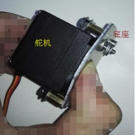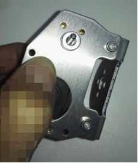 

如图示进行安装：

 

 

### 6） 将爪臂2装在舵机上

所需材料：爪臂2、带底座的舵机、M38内六角螺丝；

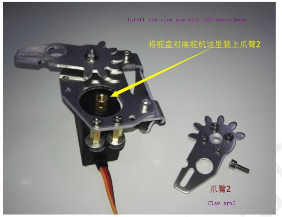 

如图示进行安装：

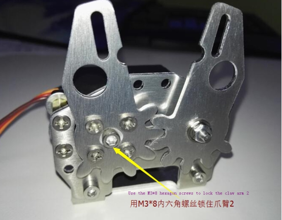 

### 7） 组装手指

所需材料：手指、6mm单通铜柱、M3螺母、M3垫片、M3平头螺丝；

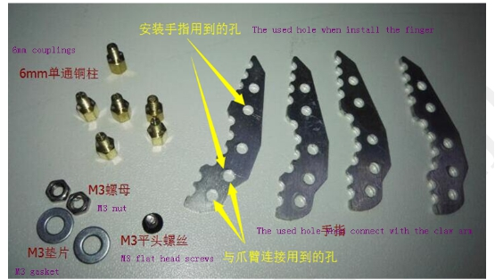 

如图示进行安装：

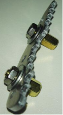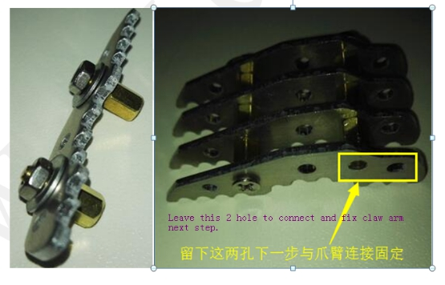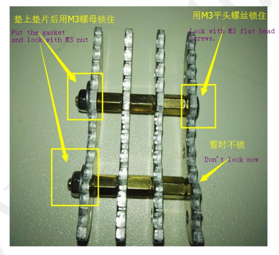 

### 8） 将手指装在爪臂上

所需材料：带爪臂和底座的舵机、手指、M3螺母、M38内六角螺丝；

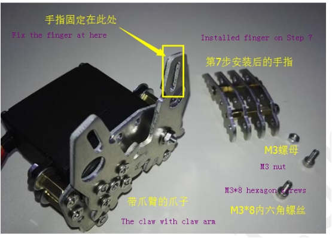 

如图示进行安装：

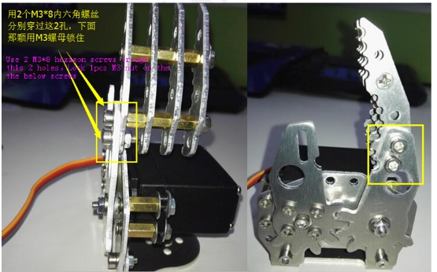 

（注：另一边的手指也是一样的按照第7、第8步安装后，安装在另一边的爪臂上即可！）

到此，整个爪子就安装完毕了。如图示：

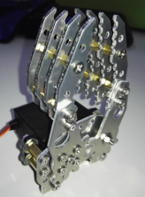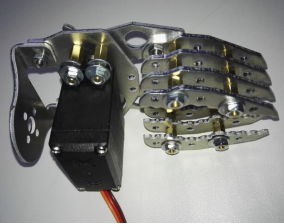 

## 4. 要点

1）步骤3与步骤5之间有一定的关联性，在进行步骤3的时候，先不要把爪臂装在底座上，以免妨碍步骤5舵机的安装，待进行步骤5的时候，先将舵机固定在底座之后再取下之前暂时锁住的M3螺母，将爪臂1装上之后才用M3螺母彻底固定住。

2）本爪子的原理是舵机带动爪臂2转动通过两个爪臂之间的齿轮进行传动从而使爪臂2联动转动，所以安装爪臂的时候注意舵机的转幅，避免让舵机卡住。

## 更多资源，请关注公众号！

