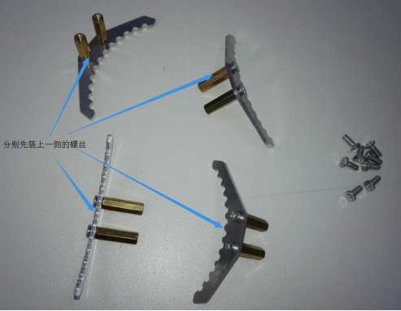

金属爪子G8安装说明

 From SZDOIT 

## 一、简介

本手册详细介绍了安装金属爪子G8需要的材料及步骤。

 

## 二、材料准备

材料一览表：

| 名称           | 数量 |
| -------------- | ---- |
| G8金属爪子套装 | 1    |
| MG996R舵机     | 1    |
| 舵盘           | 1    |
| 17mm双通铜柱   | 8    |
| 10mm单通铜柱   | 4    |
| M38平头螺丝    | 33   |
| M3螺母         | 19   |
| M36平头螺丝    | 4    |
| M312螺丝       | 3    |
| M4垫片         | 3    |
| 轴承           | 3    |
| M4螺母         | 3    |

 

## 三、安装步骤

准备齐全上述构件、五金螺丝配件以及工具，进入安装环节。

### 步骤1 组装爪臂2

所需材料：1个舵盘、1个爪臂2、4个M36平头螺丝；

 

如图示进行安装：

 

### 步骤2 安装舵机

所需材料：1个MG996R舵机、1个支架2、4个10mm单通铜柱、4个M38平头螺丝、

4个M3螺母、1个M312螺丝、1个M3螺母；

 

如图示进行安装：

 

 

### 步骤3 安装爪臂1

所需材料：1个爪臂1/1个带支架2的舵机、1个M38平头螺丝、1个轴承、1个M4螺母、1个M4垫片；

 

如图示进行安装：

 

 

 

### 步骤4 安装爪臂2

所需材料：步骤1和步骤3完成的构件、1个M38平头螺丝；

 

如图示进行安装：

 

### 步骤5 安装2个爪臂1

所需材料：2个爪臂1、1个支架1、2个M3螺母、2个M4垫片、2个M312螺丝、2个轴承、2个M4螺母；

 

如图示进行安装：

 

 

### 步骤6 组装手指

所需材料：4个手指、8个17mm双通铜柱、16个M38平头螺丝；

 

如图示进行安装：

 

### 步骤7 安装手指

所需材料：1个带爪臂的支架1、1个带舵机和爪臂的支架2、4个装有一侧铜柱的手指、

8个M38的平头螺丝；

 

如图示进行安装：

 

### 步骤8 安装底座

所需材料：步骤4完成的构件、1个底座、4个M38螺丝、4个M3螺母；

 

如图示进行安装：

 

### 步骤9 安装传动杆

所需材料：步骤8完成的构件、2个传动杆、8个M38平头螺丝、8个M3螺母；

 

如图示进行安装：

 

到此，整个金属爪子就安装完成了。

 

## 四、要点

1）安装爪臂1和爪臂2的时候，尽可能让舵机左右两边的爪臂能对称，这样后面安装传动杆的时候能更从容些；

2）组装手指的时候记得将连在一起的手指正反面对应，这样安装手指的时候手指的齿牙会更加吻合。

## 更多资源，请关注公众号！

