
 C101小车安装说明 

 From SZDOIT

# 一. 材料清单

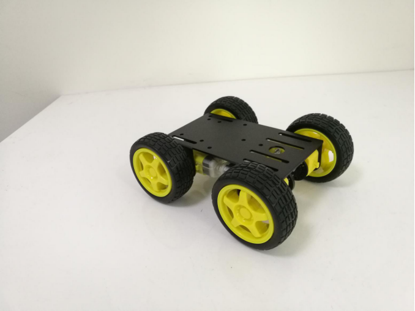 

C101发货清单

| 名称             | 数量 |
| ---------------- | ---- |
| mini底盘         | 1    |
| ttl电机          | 4    |
| 黑色码盘（塑料） | 4    |
| 塑胶车轮         | 4    |
| 长M3平头螺丝     | 8    |
| M3螺母           | 8    |

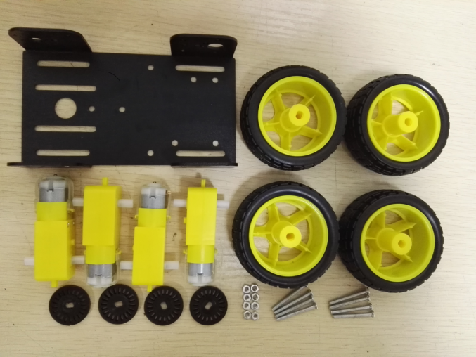 

# 二. 安装过程

## ①ttl电机安装上黑色码盘

清单：

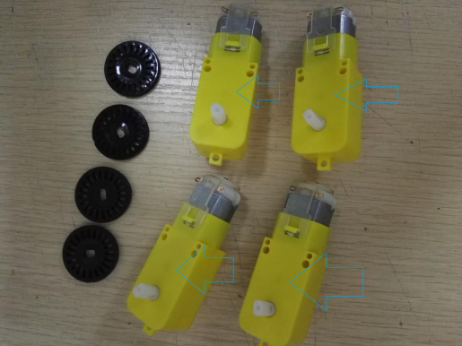 

安装过程：

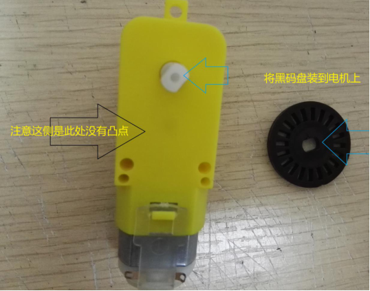 

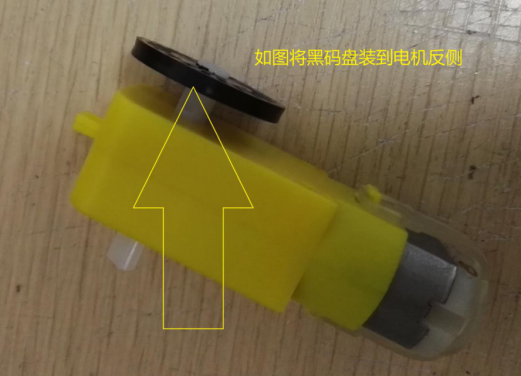 

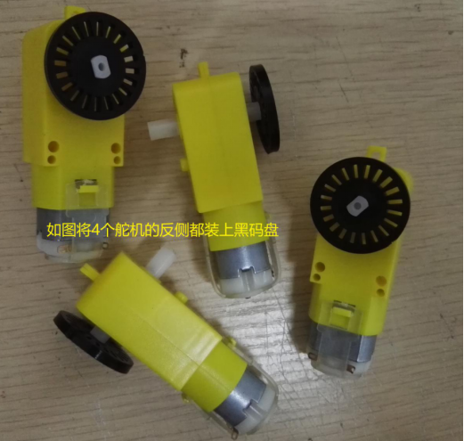 

## ②底盘侧边装上ttl电机

清单：

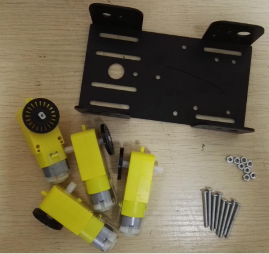 

安装过程：

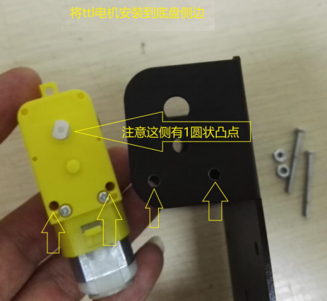 

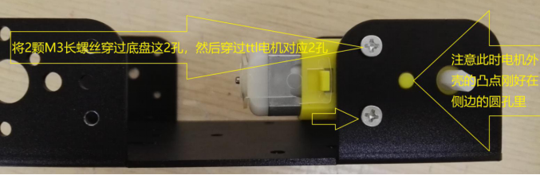 

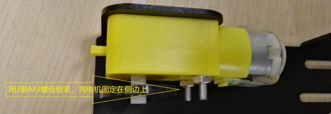 

 

## ③电机装上塑料车轮

清单：

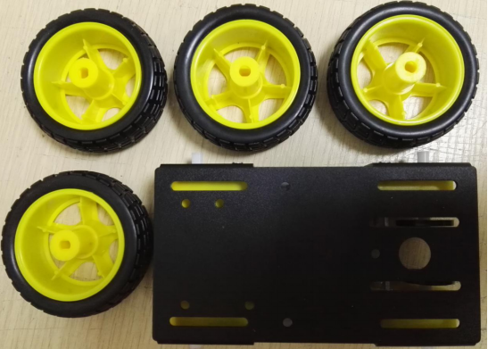 

安装过程：

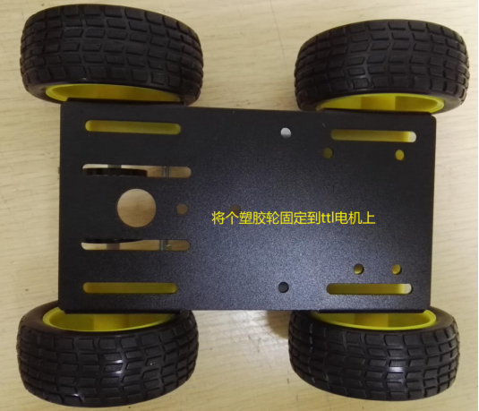 

# 三. 实物图鉴

正视图：

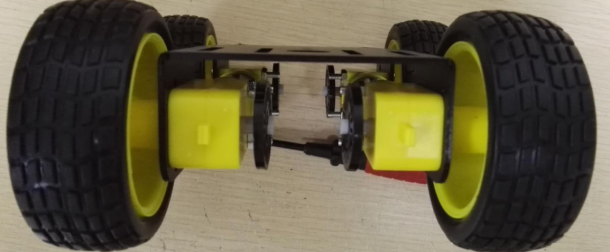 

俯视图：

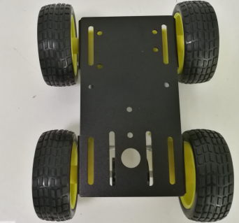 

侧视图：

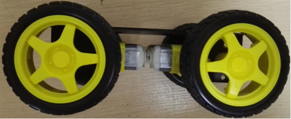 

底视图：

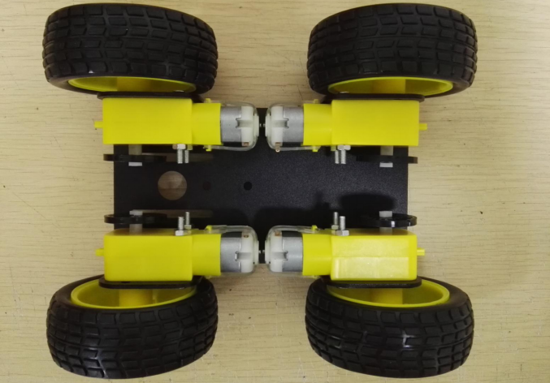 

# 四. 注意事项

①安装时注意8颗螺丝要拧紧；

②如果车轮容易脱落，可考虑在中间粘胶处理。

# 附录. 设计资料

| 四博智联资源                                           |                                                              |
| ------------------------------------------------------ | ------------------------------------------------------------ |
| 官网                                                   | [www.doit.am](http://www.doit.am/)                           |
| 教材                                                   | [ESPDuino智慧物联开发宝典](https://item.taobao.com/item.htm?spm=a1z10.3-c.w4002-7420449993.9.Bgp1Ll&id=520583000610) |
| 购买                                                   | [官方淘宝店](https://szdoit.taobao.com/)(szdoit.am)          |
| 讨论                                                   | [技术论坛](http://bbs.doit.am/forum.php)(bbs.doit.am)        |
| 应用案例集锦                                           | [智能建筑云](http://building.doit.am)(building.doit.am)      |
| [光伏监控云](http://solar.doit.am)(solar.doit.am)      |                                                              |
| [Doit玩家云](http://wechat.doit.am)(wechat.doit.am)    |                                                              |
| [免费TCP公网调试服务](http://tcp.doit.am)(tcp.doit.am) |                                                              |
| 官方技术支持QQ群                                       |                                                              |
| 技术支持群1                                            | 278888901                                                    |
| 技术支持群2                                            | 278888902                                                    |
| 技术支持群3                                            | 278888903                                                    |
| 技术支持群4                                            | 278888904                                                    |
| 技术支持群5                                            | 278888905                                                    |
| 技术支持群6                                            | 278888906                                                    |
| 技术支持群7                                            | 278888907                                                    |
| 技术支持群8                                            | 278888908                                                    |
| 技术支持群9                                            | 278888909                                                    |
| 技术支持群10                                           | 278888900                                                    |

 

| 乐鑫ESP8266资源                                              |                                                              |
| ------------------------------------------------------------ | ------------------------------------------------------------ |
| 芯片基本资料                                                 | [ESP8266快速入门指南](http://espressif.com/sites/default/files/documentation/esp8266_quick_start_guide_cn.pdf) |
| 软件编程基本资料                                             | [ESP8266 SDK⼊⻔指南](http://espressif.com/sites/default/files/documentation/2a-esp8266-sdk_getting_started_guide_cn.pdf) |
| [ESP8266 SDK](http://www.espressif.com/zh-hans/support/download/sdks-demos?keys=&field_type_tid[]=14) |                                                              |
| 固件下载工具                                                 | [ESP8266下载⼯具](http://www.espressif.com/zh-hans/support/download/other-tools?keys=&field_type_tid[]=14) |
| 资源整合                                                     | [ESP8266官⽅论坛](http://bbs.espressif.com/)                 |
| [ESP8266资源合集](http://www.espressif.com/zh-hans/products/hardware/esp8266ex/resources) |                                                              |

 

# 免责申明和版权公告

本文中的信息，包括供参考的URL地址，如有变更，恕不另行通知。 

文档“按现状”提供，不负任何担保责任，包括对适销性、适用于特定用途或非侵权性的任何担保，和任何提案、规格或样品在他处提到的任何担保。本文档不负任何责任，包括使用本文档内信息产生的侵犯任何专利权行为的责任。本文档在此未以禁止反言或其他方式授予任何知识产权使用许可，不管是明示许可还是暗示许可。 

Wi-Fi联盟成员标志归Wi-Fi联盟所有。

文中提到的所有商标名称、商标和注册商标均属其各自所有者的财产，特此声明。

# 注 意

由于产品升级或其他原因，本手册内容有可能变更。深圳四博智联科技有限公司保留在没有任何通知或者提示的情况下对本手册的内容进行修改的权利。本手册仅作为使用指导，深圳四博智联科技有限公司尽全力在本手册中提供准确的信息，但是并不确保手册内容完全没有错误，本手册中的所有陈述、信息和建议也不构成任何明示或暗示的担保。

 