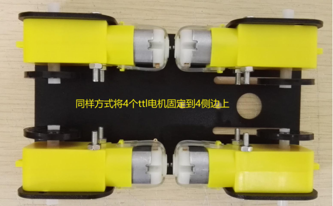

 C101小车安装说明 

 From SZDOIT

## 一. 材料清单

 

C101发货清单

| 名称             | 数量 |
| ---------------- | ---- |
| mini底盘         | 1    |
| ttl电机          | 4    |
| 黑色码盘（塑料） | 4    |
| 塑胶车轮         | 4    |
| 长M3平头螺丝     | 8    |
| M3螺母           | 8    |

 

## 二. 安装过程

### ①ttl电机安装上黑色码盘

清单：

 

安装过程：

 

 

 

### ②底盘侧边装上ttl电机

清单：

 

安装过程：

 

 

 

 

### ③电机装上塑料车轮

清单：

 

安装过程：

 

## 三. 实物图鉴

正视图：

 

俯视图：

 

侧视图：

 

底视图：

 

## 四. 注意事项

①安装时注意8颗螺丝要拧紧；

②如果车轮容易脱落，可考虑在中间粘胶处理。

## 更多资源，请关注公众号！

