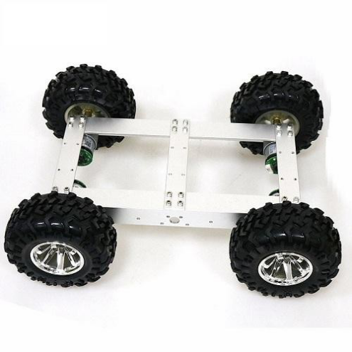
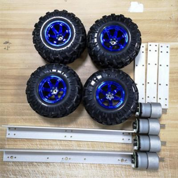
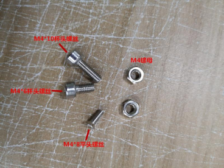
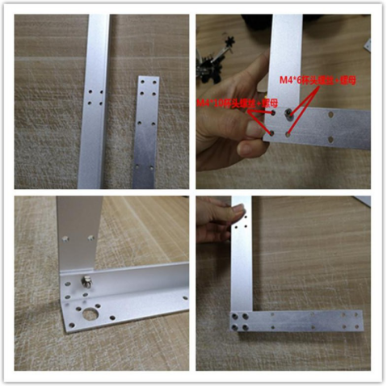
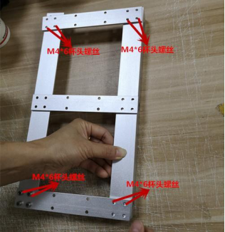
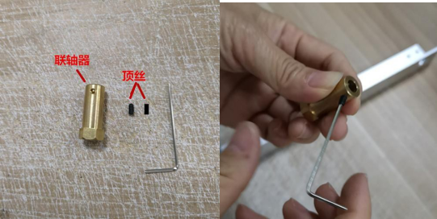
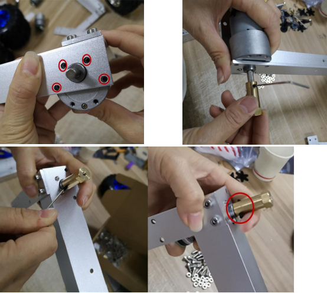
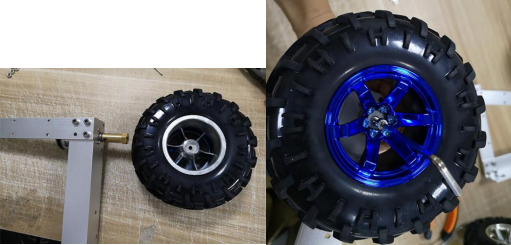

 
  C4 4WD智能小车底盘安装说明 

 from SZDOIT 

## 一、材料清单:

## 二、安装步骤 :

### 1、组装车架 :

1. 取一长一短两根支架。并将两根支架对孔固定，并用图中所示螺丝和螺母固定（内侧如果使用 M4*10 螺母固定，将无法安装电机）。

 

2. 依次将剩下的一长两短支架如图安装。注意螺丝。

 

### 2、安装电机 

1. 取联轴器和顶丝。将顶丝拧进联轴器两侧（不需要拧紧）

2. 将电机安装在支架的电机安装孔，用 M3*6 平头螺丝固定。并将安装了顶丝的联轴器安装到电机轴上。拧紧顶丝。

### 3、安装车轮 

取一个车轮。将车轮安装在联轴器上，并用 M4*10 杯头螺丝锁紧。其它四个轮子安装方法一样。

## 更多资源，请关注公众号！

