 
  MC_Series/MC300小车安装说明 

 from SZDOIT 

## 一、发货清单

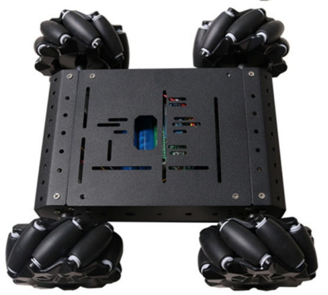

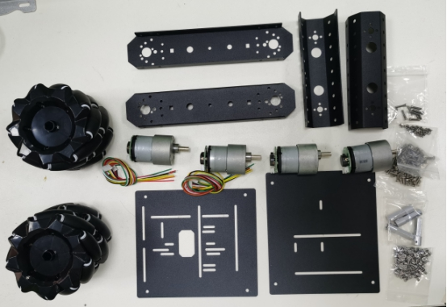 

支架清单：

| 名称 | 上底盘 | 下底盘 | 左右支架（相同） | 前后支架（相同） |
| ---- | ------ | ------ | ---------------- | ---------------- |
| 数量 | 1      | 1      | 各1个            | 各1个            |

螺丝包：

| 名称 | 6mm联轴器（带螺丝） | M3*8平头十字螺丝 | M3*6平头十字螺丝 |
| ---- | ------------------- | ---------------- | ---------------- |
| 数量 | 4                   | 16               | 16               |

轮子和电机：电机可选（37电机与12V300RPM 25电机）

| 名称 | 电机 | 左麦克纳姆轮 | 右麦克纳姆轮 | 6P 2.0电机线 | 4P 2.45电机线 |
| ---- | ---- | ------------ | ------------ | ------------ | ------------- |
| 数量 | 4    | 2            | 2            | 4            | 2             |

## 二、安装过程

### 1. 安装电机

①　取出左右支架，4个电机，以及16颗M3*8平头十字螺丝

②　使用螺丝将电机固定在支架上

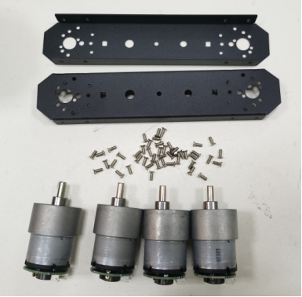 

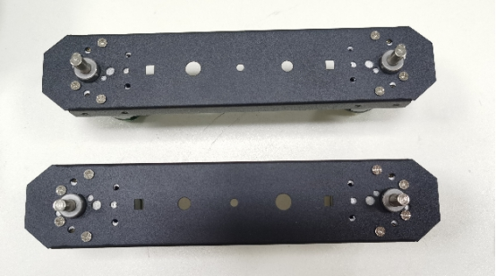 

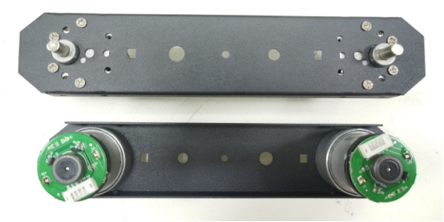 

### 2. 接线

①　取出前面安装好的电机以及4颗6P电机线

②　将6P线插入电机插座中（防止装好之后不好接）

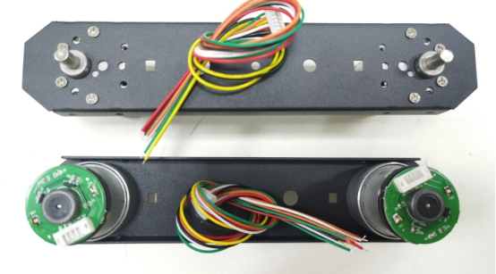 

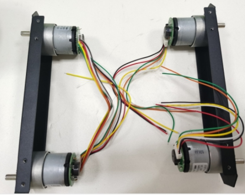 

### 3. 安装下底盘

①　取出前面装好的支架、下底盘和4颗M3*6平头十字螺丝

②　使用M3*6螺丝将下底盘固定在左右之间上，如下图：

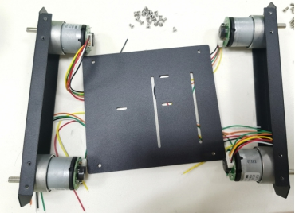 

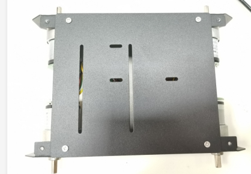 

### 4. 安装前后支架

①　取出前面安装好的底盘、前后支架和4颗M3*6的平头十字螺丝

②　使用M3*6螺丝将前后支架固定在左右支架上，如图：

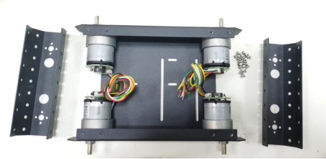 

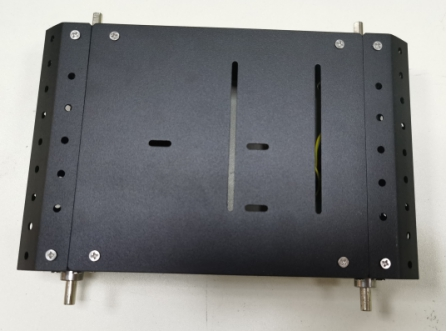 

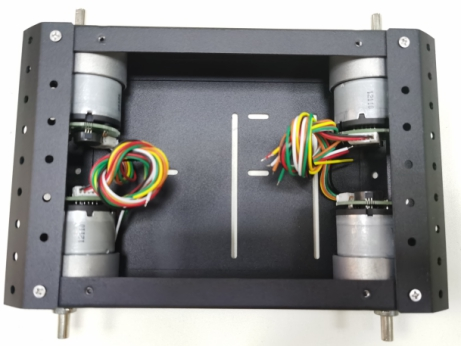 

### 5. 安装上底盘

①　取出前面安装好的底盘、上底盘和4颗M3*6螺丝

②　使用M3*6螺丝将上底盘固定在左右支架上，如图：

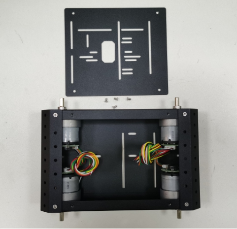

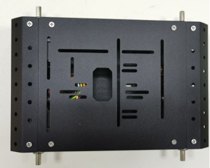 

### 6. 安装联轴器

①　取出联轴器以及锁电机螺丝、前面装好的底盘

②　将联轴器固定在电机轴上（注意：联轴器带孔的那侧对电机轴平整的那面）

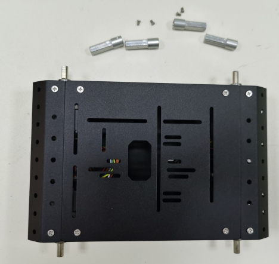 

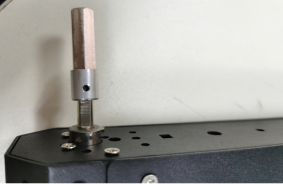 

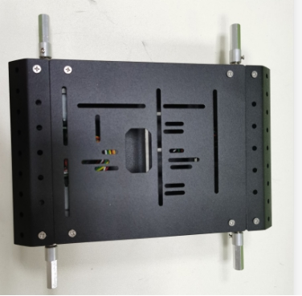 

### 7. 装轮子

①　取出4个麦克纳姆轮，4颗锁轮子的螺丝

②　将轮子固定在联轴器上

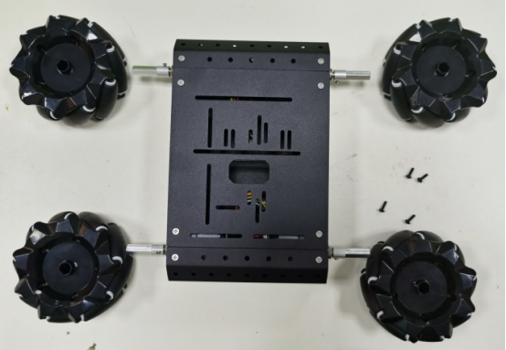 

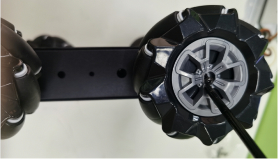 

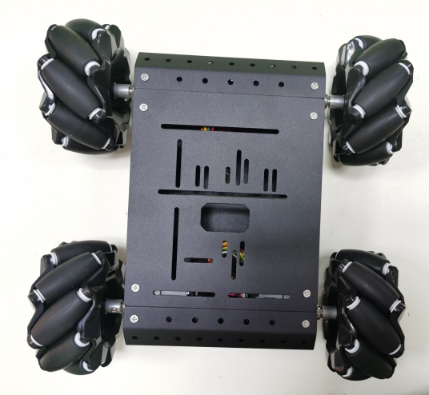 

特别注意：如果使用的是我们提供的程序，轮子的方向要和图中一直

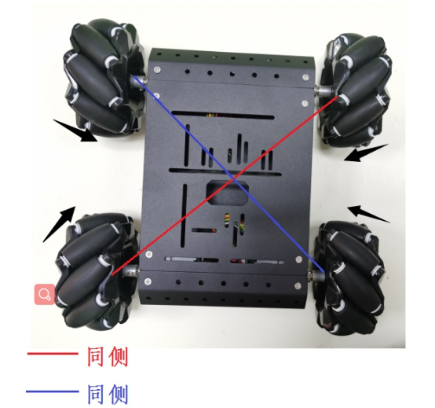 

 

安装完成！

祝你成功！

​    

## 更多资源，请关注公众号！

