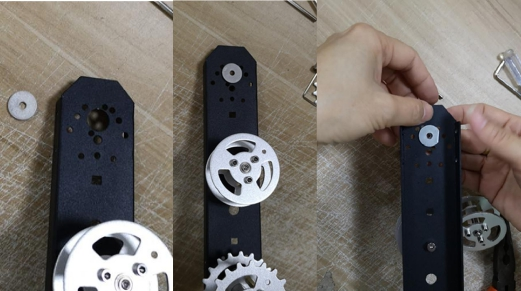

 
  TC_Series/TC100坦克底盘小车安装说明 

 from SZDOIT 

## 一、材料清单 （不包括螺丝配件）:

|      |                  |
| ---- | :--------------- |
|      |  |

## 二、安装步骤 

1. 安装支架。取长支架和电机，如图，对孔，并用 M38 平头螺丝锁紧。

 

 

2. 安装承重轮和驱动轮。（先不用安装轴承）（安装步骤补充）

3. 安装轴承和顶丝。将顶丝安装在轴承两侧（不用拧紧），然后将轴承安装到电机 轴 上 。

 

注意：安装时联轴器卡在电机轴的凸出处（如若全部卡进去电机将受阻无法转动） 

|      |                  |
| ---- | ---------------- |
|      |  |

将驱动轮装进联轴器中，并用 M412 杯头螺丝固定 

 

4. 安装承重轮。找到长支架中间的孔，用 M412 杯头螺丝安装承重轮。（可以借助钳子，用钳子夹住承重轮，然后用扳手把杯头螺丝拧紧） 

5. 取两片垫片。如图，放置于支架的内外两侧。

将 M412 杯头螺穿过两孔，并和承重轮拧紧。（可借助工具）

 

6. 另一边的长支架、电机和轮子安装方法一样。

7. 安装短支架。取两个短支架，分别安装在两个长支架的两端。如图，将长短支架对孔之后，用 M38 平头螺丝锁紧。

8. 安装底板（使用M38 平头螺丝）8. Use the M38 flat head screws to install the below bracket.

|      |                   |
| ---- | ----------------- |
|      |  |

另一面面板安装方法相同。

9. 安装履带 

注意：履带可拆卸。发货时履带长度长于小车底盘所需的长度，所以需要将履带拆卸成小车底盘需要的长度。借助万用表笔笔头或其他尖状类工具可以进行拆卸 。 

 

 

注意：安装履带式注意履带的内侧和外侧。如图，左图是错误的安装方法（这样安装的话履带会卡住车子，车子将无法行走），右图为正确的安装。

|      |                   |
| ---- | ----------------- |
|      |  |

 

|      |                   |
| ---- | ----------------- |
|      |  |

## 更多资源，请关注公众号！

