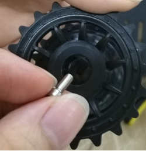

 
 TP101安装说明 

 from SZDOIT 
 

## 一、发货清单：

| 名称        | 数量 | 名称           | 数量 |
| ----------- | ---- | -------------- | ---- |
| 底盘        | 1    | M450内六角螺丝 | 2    |
| 电机        | 2    | M38内六角螺丝  | 2    |
| 履带        | 2    | M36 平头螺丝   | 8    |
| 承重轮      | 2    | M4螺母         | 4    |
| 驱动轮      | 2    | 垫片           | 4    |
| 18650电池盒 | 1    | 顶丝           | 2    |
| 联轴器      | 2    |                |      |

## 二、安装步骤：

1.安装承重轮（先将M450长螺丝装到承重轮里），

  

另一边用M4螺母锁住

 

2.将垫片放在支架上，将承重轮装入支架的孔里

 

另一端也装上垫片，同样用M4螺母锁住，注意不要将承重轮拧太紧。

 

3.将电机装入支架中，用3颗M36平头螺丝拧紧。

 

4.安装驱动轮：

 

先将联轴器套到驱动轮里，另一端用内六角扳手将M38内六角螺丝套到驱动轮中，与联轴器锁紧。

 

5.将驱动轮装到电机上，用顶丝拧紧。

 

请注意：联轴器上的孔一定要对准电机轴平的一端，联轴器卡到箭头指的位置

5.先拆履带，拆除多余的部分

 

测量所需履带长度

 

借助工具将履带针装入履带中

 

一边完成，再将另一半装好即可

 

## 更多资源，请关注公众号！

