
 TP200安装说明 

 From SZDOIT

## **1.** 简要介绍

控制套件：https://gitnova.com/#/Robot/Controller/app/AppforSmartCar

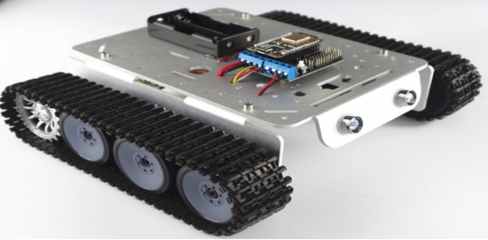 

发货清单

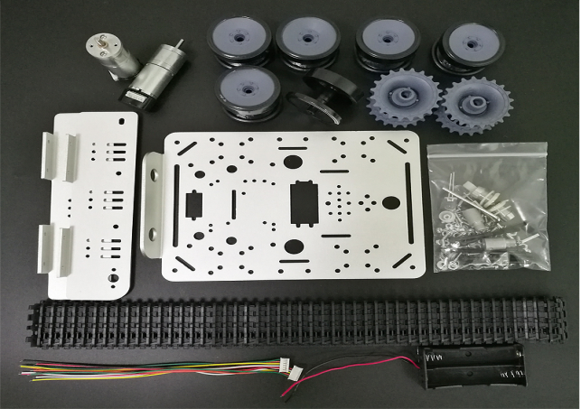 

## **2.** 安装步骤

1）安装支架和电机

取出M3*10螺丝和M3螺母各8颗，将两侧边支架固定在底盘上

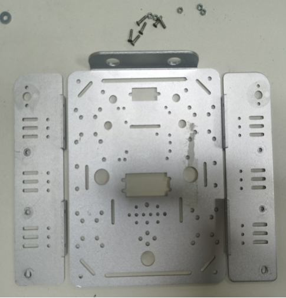 

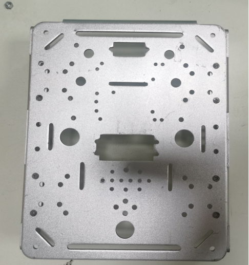 

取出4颗M3*8平头螺丝，将两个电机固定在侧边支架上

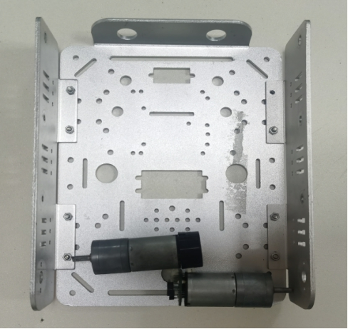 

 

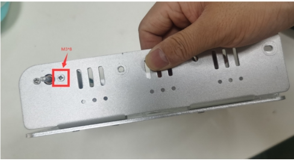 

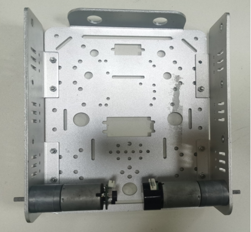 

2）安装驱动轮

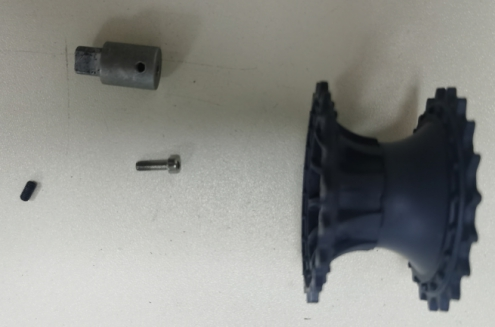 

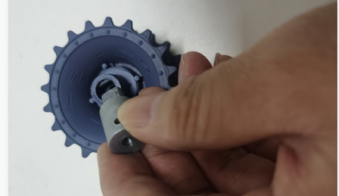 

 

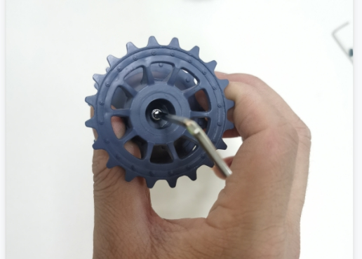 

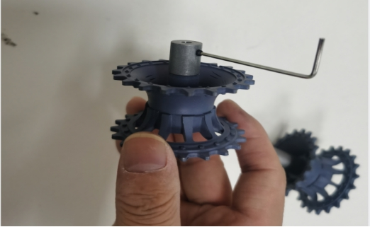 

3）安装承重轮

取出M4*45螺丝和M4螺母各1颗，按下图所示将轮子固定

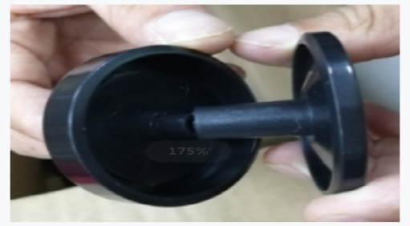 

 

 

4）将承重轮安装到支架上

取出16颗垫片和8颗M4螺母，按下图所示将轮子固定在侧边支架上

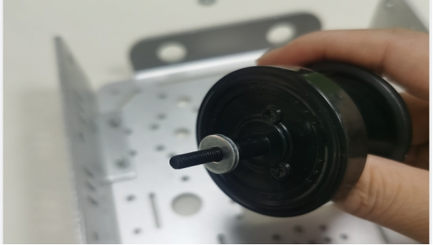 

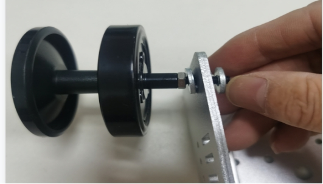 

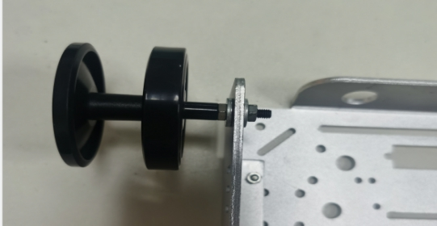 

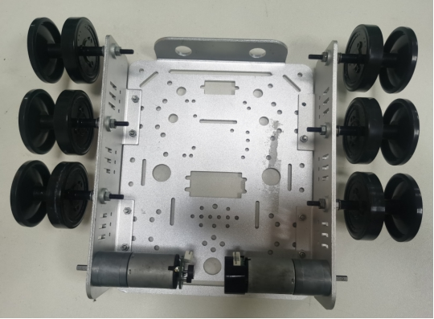 

5）将驱动轮安装到支架上

使用M2扳手将顶丝固定在支架上（顶丝对准电机轴承平整那侧）

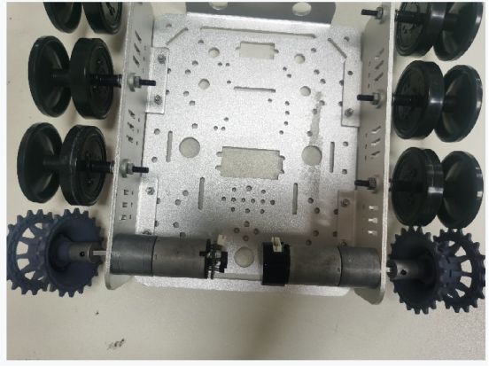 

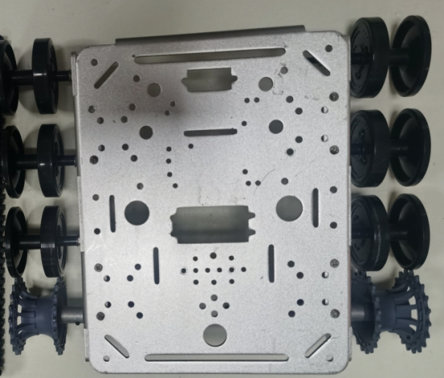 

6）装履带

使用工具将履带拆开，按下图所示将履带装上

履带拆卸视屏教程：https://github.com/SmartArduino/SmartArduino.github.io/blob/master/docs/Robot/FrameChassis/TP_Series/TP200/Caterpillar%20disassembly.rar

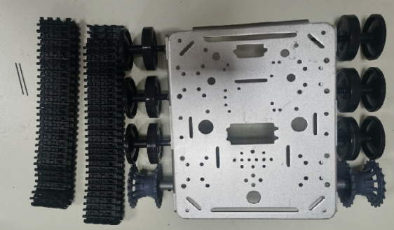 

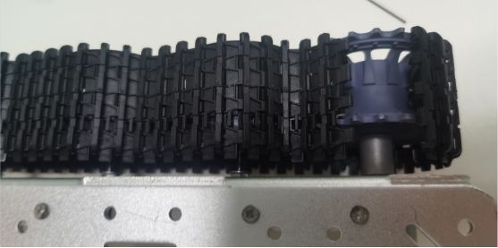 

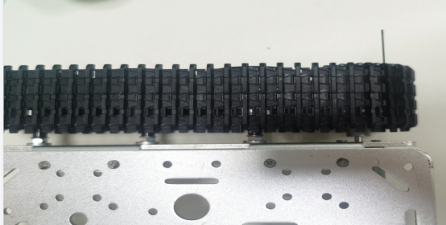 

7）安装LED灯

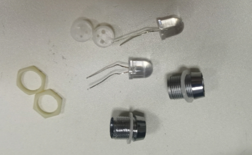 

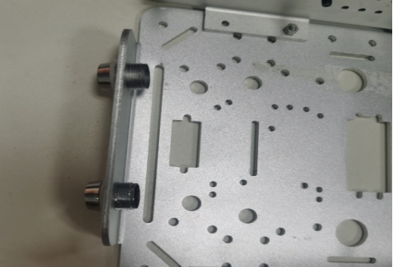 

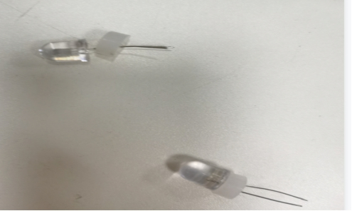 

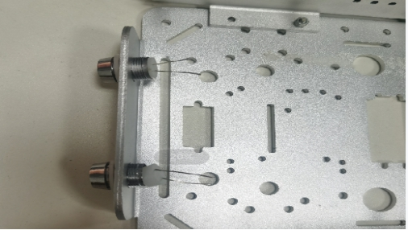 

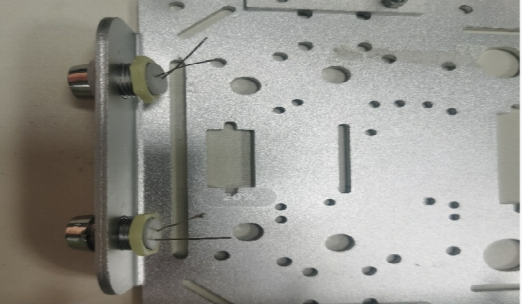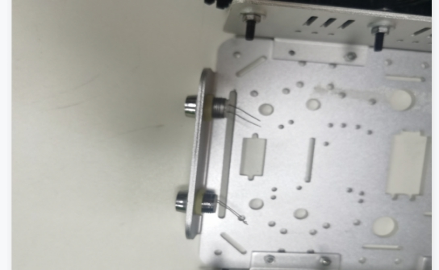 

## 更多资源，请关注公众号！

|      |      |
| ---- | ---- |
|      |      |
|      |      |
|      |      |
|      |      |
|      |      |
|      |      |
|      |      |
|      |      |
|      |      |
|      |      |
|      |      |
|      |      |
|      |      |
|      |      |