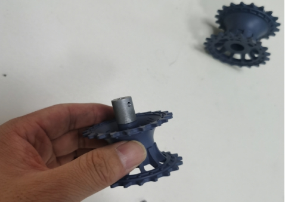
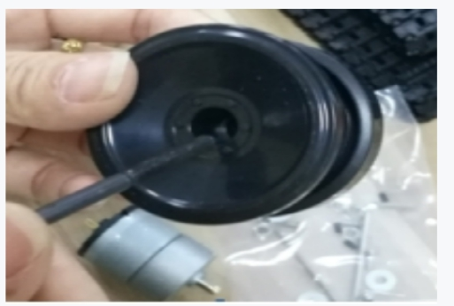
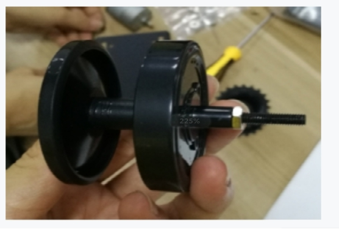

 TP200安装说明 

 From SZDOIT

## **1.** 简要介绍

控制套件：https://gitnova.com/#/Robot/Controller/app/AppforSmartCar

 

发货清单

 

## **2.** 安装步骤

1）安装支架和电机

取出M3*10螺丝和M3螺母各8颗，将两侧边支架固定在底盘上

 

 

取出4颗M3*8平头螺丝，将两个电机固定在侧边支架上

 

 

 

 

2）安装驱动轮

 

 

 

 

 

3）安装承重轮

取出M4*45螺丝和M4螺母各1颗，按下图所示将轮子固定

 

 

 

4）将承重轮安装到支架上

取出16颗垫片和8颗M4螺母，按下图所示将轮子固定在侧边支架上

 

 

 

 

5）将驱动轮安装到支架上

使用M2扳手将顶丝固定在支架上（顶丝对准电机轴承平整那侧）

 

 

6）装履带

使用工具将履带拆开，按下图所示将履带装上

履带拆卸视屏教程：https://github.com/SmartArduino/SmartArduino.github.io/blob/master/docs/Robot/FrameChassis/TP_Series/TP200/Caterpillar%20disassembly.rar

 

 

 

7）安装LED灯

 

 

 

 

 

# 支持与服务

| 四博智联资源                                        |                                                              |
| --------------------------------------------------- | ------------------------------------------------------------ |
| 官网                                                | [www.doit.am](http://www.doit.am/)                           |
| 教材                                                | [ESPDuino智慧物联开发宝典](https://item.taobao.com/item.htm?spm=a1z10.3-c.w4002-7420449993.9.Bgp1Ll&id=520583000610) |
| 购买                                                | [官方淘宝店](https://szdoit.taobao.com/)(szdoit.am)          |
| 讨论                                                | [技术论坛](http://bbs.doit.am/forum.php)(bbs.doit.am)        |
| 应用案例集锦                                        |                                                              |
| [Doit玩家云](http://wechat.doit.am)(wechat.doit.am) | [免费TCP公网调试服务](http://tcp.doit.am)(tcp.doit.am)       |
| 官方技术支持QQ群1/2/3群已满                         |                                                              |
| 技术支持群4                                         | 278888904                                                    |
| 技术支持群5                                         | 278888905                                                    |
| 术支持群6                                           | 278888906                                                    |
| 技术支持群7                                         | 278888907                                                    |
| 技术支持群8                                         | 278888908                                                    |
| 技术支持群9                                         | 278888909                                                    |
| 技术支持群10                                        | 278888900                                                    |