
 TP301坦克小车安装说明 

 From SZDOIT

## 1. 发货清单

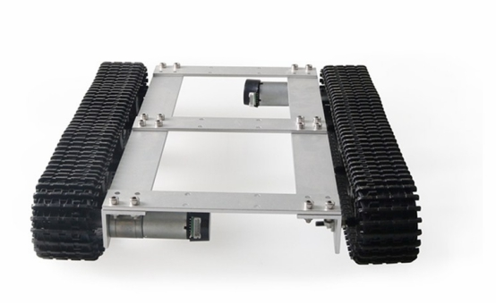 

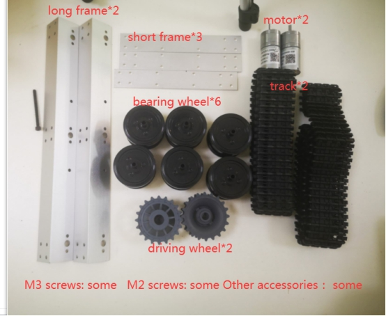 

## 2.安装步骤

### 2.1 用M4螺钉和螺母安装机架

请用M4扳手和钳子紧固，使车架稳定

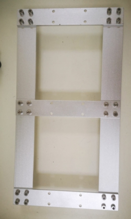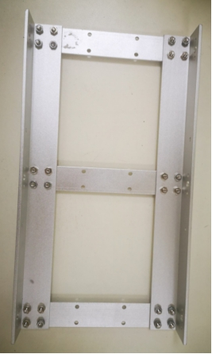 

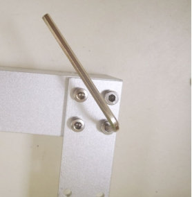 

### 2.2 安装电机

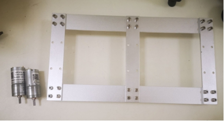 

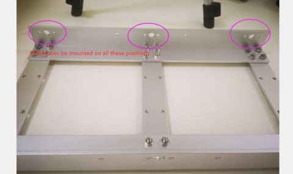 

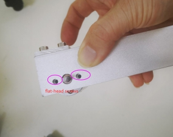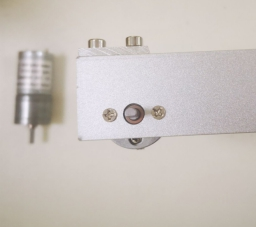 

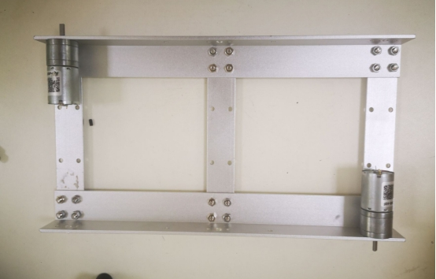 

### 2.3 安装联轴器

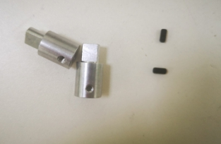 

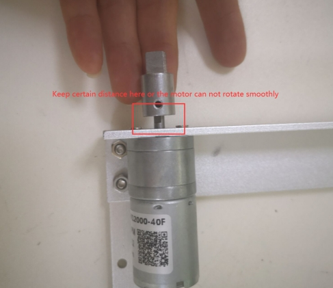 

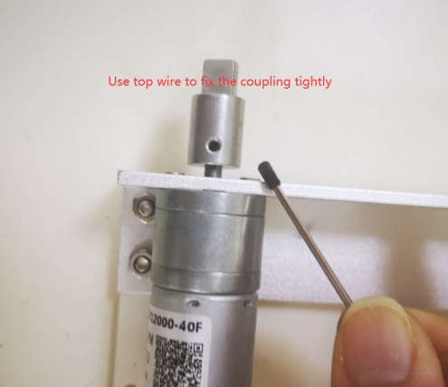 

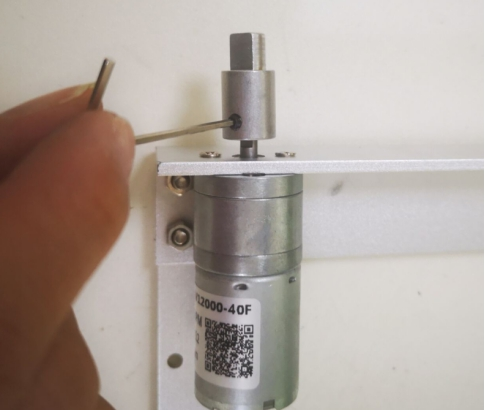 

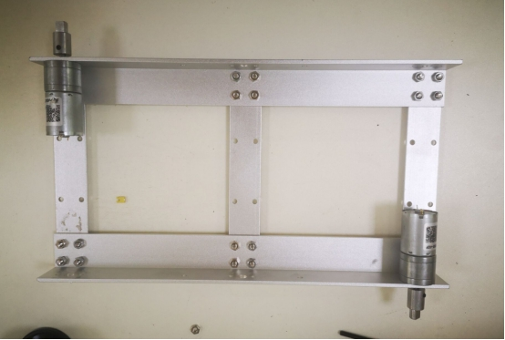 

### 2.4 安装承重轮

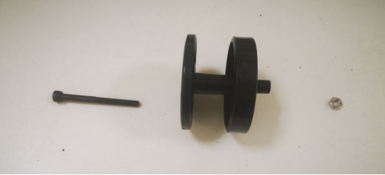 

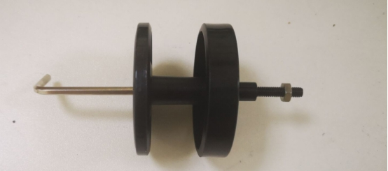 

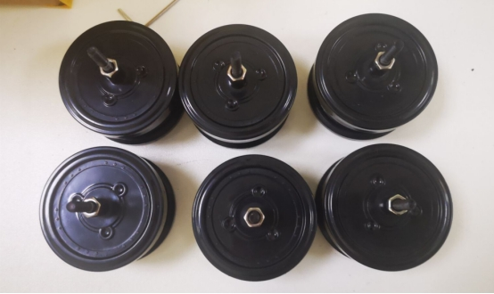 

### 2.5 安装驱动轮

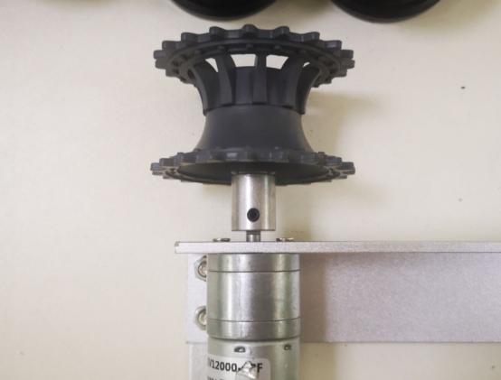 

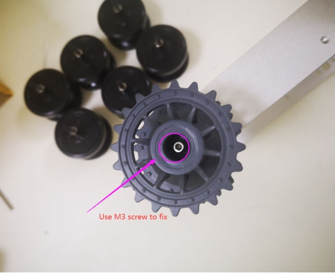 

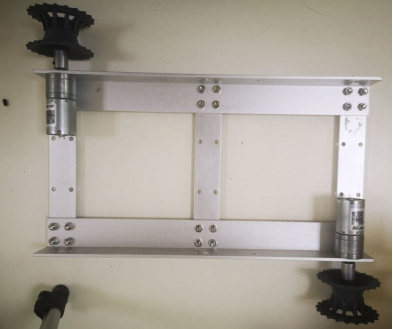 

###  2.6 将承重轮安装到支架上

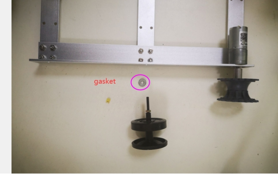 

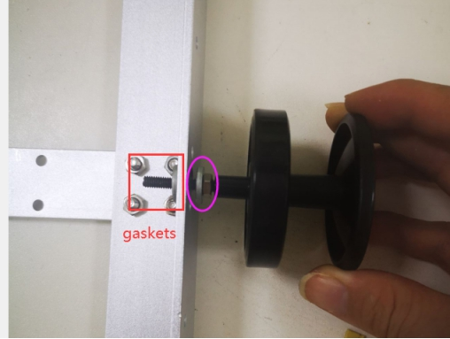 

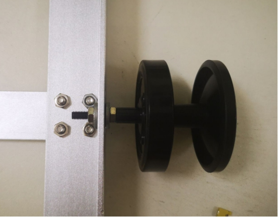 

注意:不要让轴承对框架太紧。确保轴承轮能平稳行走。

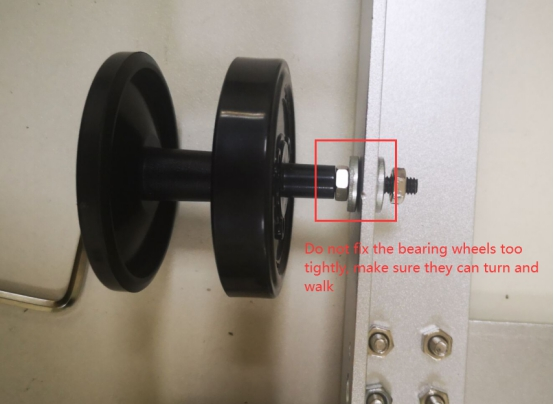 

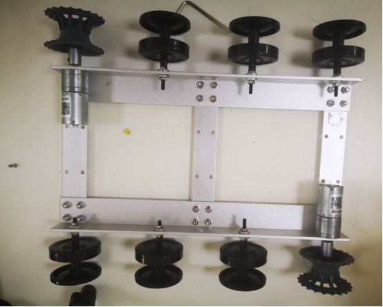 

###  2.7 安装履带

调整你需要的长度，然后删除额外的部分。然后重新连接轨道的头

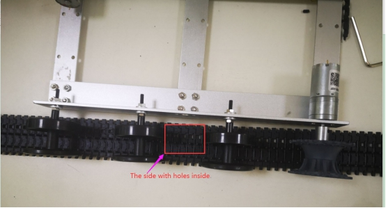 

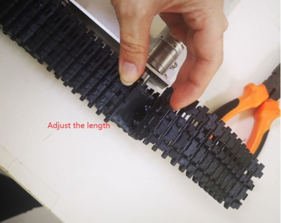 

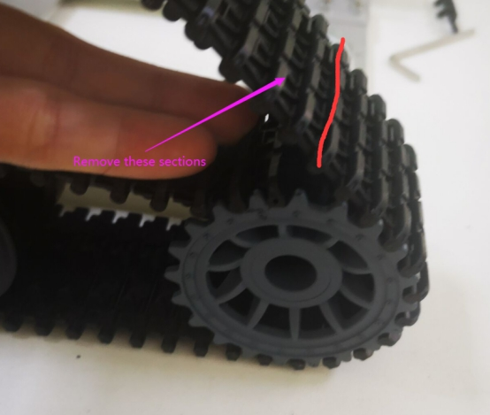 

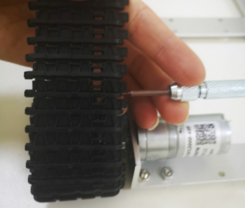 

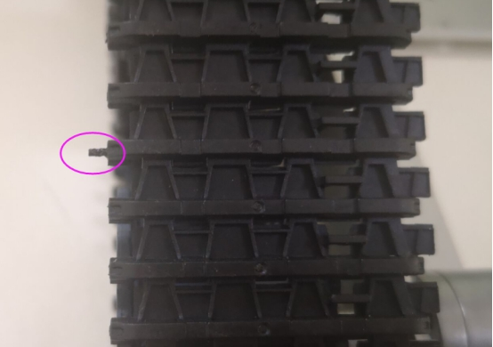 

 

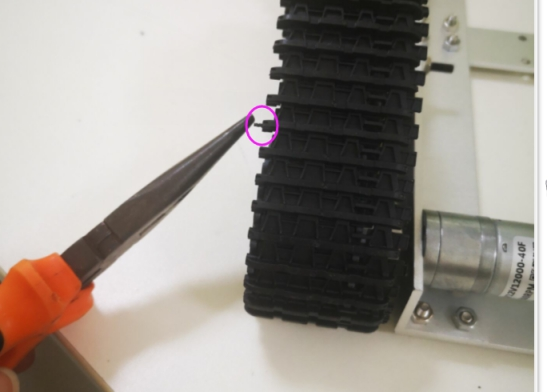 

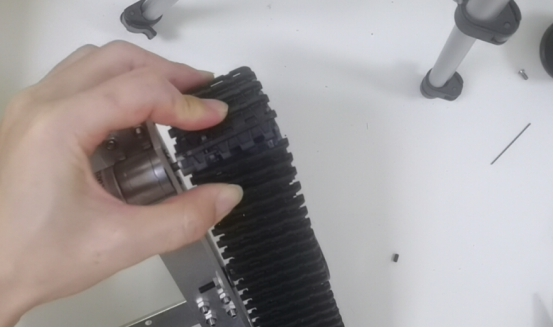 

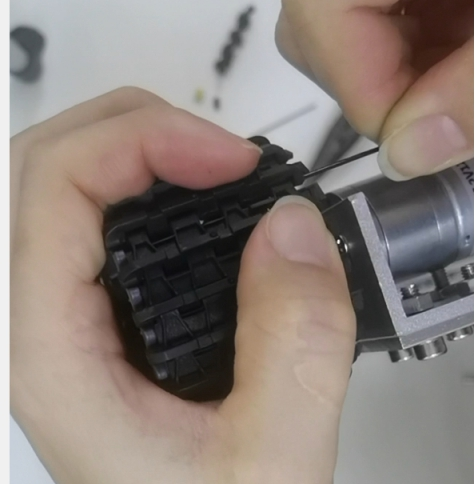 

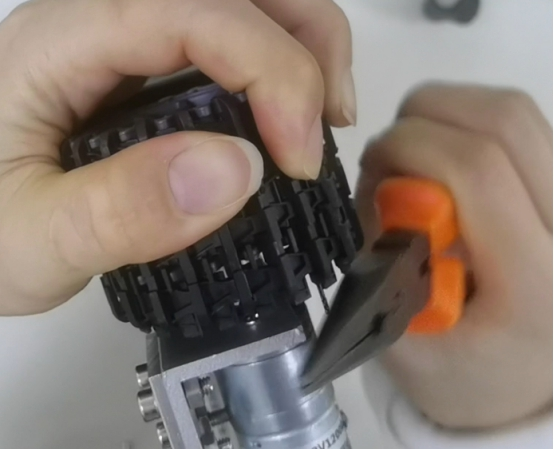 

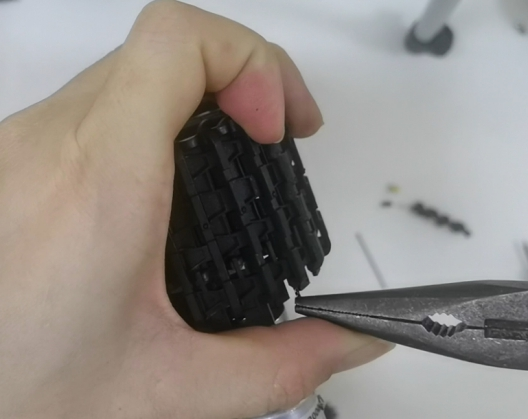 

完成！！

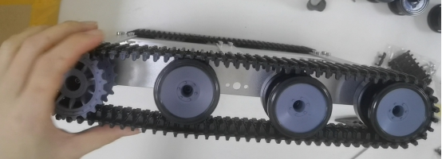 

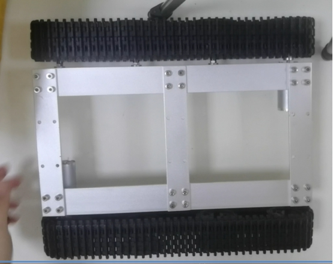 

## 更多资源，请关注公众号！

