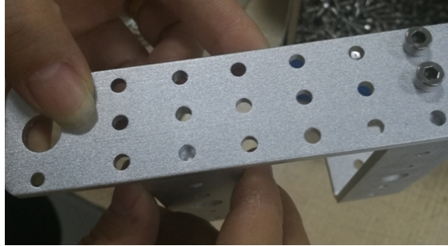

 miniTP100小车安装说明

 From SZDOIT

## 一、简介

此产品支持arduino、51、STM32等单片机控制，适合各种DIY制作

 

## 二、安装

1. 支架安装

 

用M4*10内六角螺丝（2颗）。另外一边用螺母锁上

 

 

另外一边也是同样的装法

 

2.安装承重轮（先将M4*50长螺丝装到承重轮里），

 

另一边用M4螺母锁住

 

套上垫片

 

另一边也装上垫片，用m4螺母锁住

 

3.装电机（注意： 12V电机只能装到支架的最大孔上）

 

 

锁上3颗M3*6平头螺丝

 

4.安装驱动轮：

 

先将联轴器套到驱动轮里，另一端用内六角扳手将M3*8内六角螺丝套到驱动轮中，与联轴器锁紧。

 

**装到电机上**

 

**可以先将顶丝拧一点到联轴器上**

 

**固定到电机轴径上（注意：驱动联轴器和支架留有一点缝隙）**

 

请注意：联轴器上的孔一定要对准电机轴平的一端，联轴器卡到箭头指的位置

5.装履带

取合适的长度。如果履带太长，请用螺丝刀拆卸掉多余的部分。

 

 

将拆出来的针装上去

 

另一边也用同样的方法安装。

 

## 更多资源，请关注公众号！

