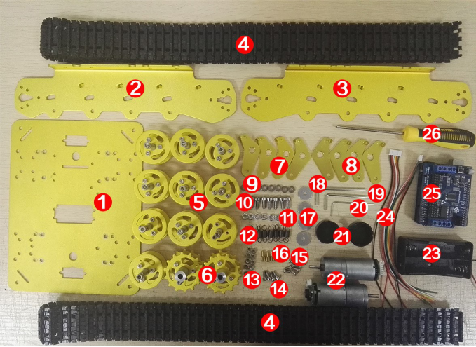
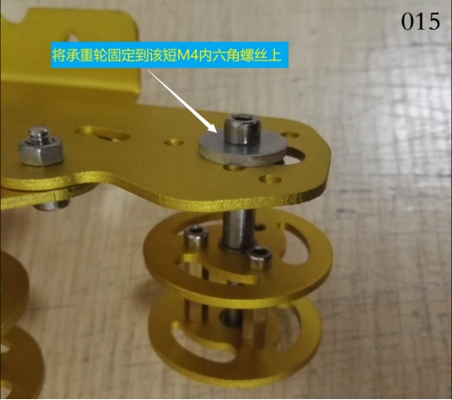
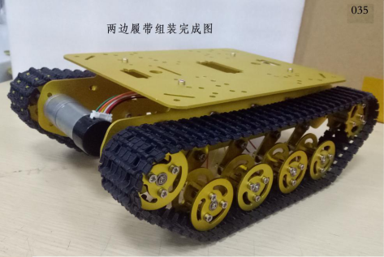
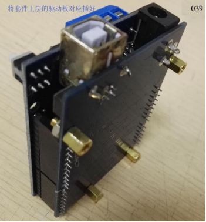
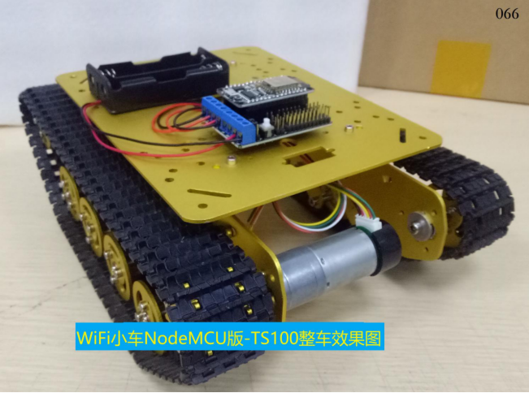

 
  TS100金属坦克底盘安装说明 

 from SZDOIT 
 

## 1 物料清单

WiFi小车ESPDuino版-TS100坦克小车                    WiFi小车NodeMCU版-TS100坦克小车

### A：---- ESPDuino版：

 

说明：

| 序号 | 名称             | 数量 |      | 序号 | 名称          | 数量 |
| ---- | ---------------- | ---- | ---- | ---- | ------------- | ---- |
| 1    | 底盘             | 1    |      | 14   | M38内六角螺丝 | 4    |
| 2    | 侧板（左）       | 1    |      | 15   | M38平头螺丝   | 10   |
| 3    | 侧板（右）       | 1    |      | 16   | 支撑柱        | 4    |
| 4    | 减震塑料履带     | 2    |      | 17   | （大）垫片    | 4    |
| 5    | （小）金属承重轮 | 10   |      | 18   | M4扳手        | 1    |
| 6    | （小）金属驱动轮 | 2    |      | 19   | M3扳手        | 1    |
| 7    | 悬挂件（左）     | 4    |      | 20   | M2扳手        | 1    |
| 8    | 悬挂件（右）     | 4    |      | 21   | 电机盖        | 2    |
| 9    | 轴承             | 8    |      | 22   | 9V带码盘电机  | 2    |
| 10   | 短M4内六角螺丝   | 8    |      | 23   | 18650电池盒   | 1    |
| 11   | M4螺母           | 8    |      | 24   | 电机线        | 2    |
| 12   | 弹簧             | 8    |      | 25   | ESPDuino套件  | 1    |
| 13   | M3螺母           | 10   |      | 26   | 螺丝刀        | 1    |

### B：---- NodeMCU版：

 

说明：

| 序号 | 名称             | 数量 |      | 序号 | 名称           | 数量 |
| ---- | ---------------- | ---- | ---- | ---- | -------------- | ---- |
| 1    | 底盘             | 1    |      | 14   | M3*8内六角螺丝 | 4    |
| 2    | 侧板（左）       | 1    |      | 15   | 支撑柱         | 4    |
| 3    | 侧板（右）       | 1    |      | 16   | M3*8平头螺丝   | 10   |
| 4    | 减震塑料履带     | 2    |      | 17   | （大）垫片     | 4    |
| 5    | （小）金属承重轮 | 10   |      | 18   | M4扳手         | 1    |
| 6    | （小）金属驱动轮 | 2    |      | 19   | M3扳手         | 1    |
| 7    | 悬挂件（左）     | 4    |      | 20   | M2扳手         | 1    |
| 8    | 悬挂件（右）     | 4    |      | 21   | 电机盖         | 2    |
| 9    | 轴承             | 8    |      | 22   | 9V带码盘电机   | 2    |
| 10   | 短M4内六角螺丝   | 8    |      | 23   | 18650电池盒    | 1    |
| 11   | M4螺母           | 8    |      | 24   | 电机线         | 2    |
| 12   | 弹簧             | 8    |      | 25   | NodeMCU套件    | 1    |
| 13   | M3螺母           | 10   |      | 26   | 螺丝刀         | 1    |

## 2 主控板介绍

### A：---- ESPDuino版

 

 

### B：---- NodeMCU版

 

## 3 组装

### 1)组装车子

#### 步骤1：轮子安装到侧板

① 装承重轮

a. 悬挂件安装到承重轮

清单：

 

组装：

 

 

b. 承重轮安装到侧板

清单：

 

组装：

 

 

 

 

 

 

 

 

 

 

② 装驱动轮

a． 组装电机线

清单：

 

组装：

 

b． 电机装到侧板

组装：

 

 

c． 装驱动轮

清单：

 

组装：

 

 

 

 

#### 步骤2：侧板安装到底盘

底盘装上两边侧板

a.清单

 

b.组装

 

 

 

#### 步骤3：安装履带

① 装上塑料履带

清单：

 

组装：

 

 

 

 

 

### 2)安装控制板和电路接线

#### A：----ESPDuino版

① 组装控制板

清单：

 

组装：

 

 

 

② 安装主控板和电池盒 

清单：

 

组装：

 

 

 

③ 电路接线

a接电源线

 

 

b接电机线

 

 

 

 

 

 

### B：----NodeMCU版

① 组装控制板

清单：

 

组装：

 

 

② 安装主控板和电池盒

清单：

 

组装：

 

 

 

③ 电路接线

a接电源线：

 

 

b接电机线：

 

 

 

 

 

 

## 更多资源，请关注公众号！

 