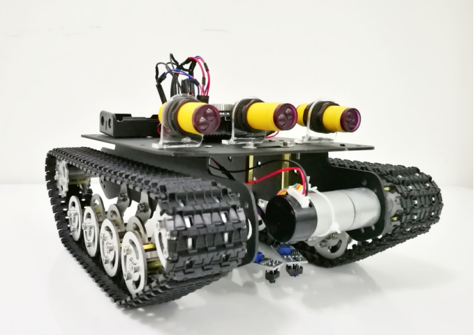
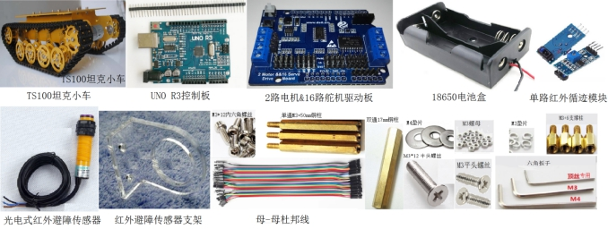
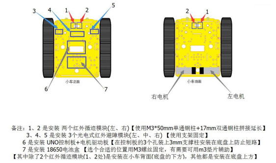
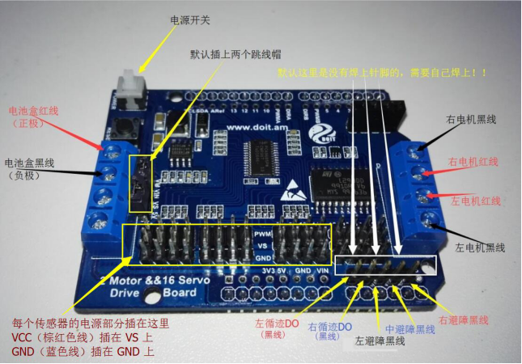
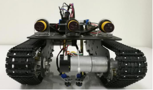
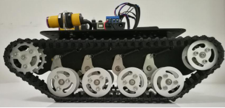
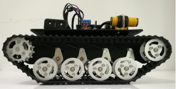
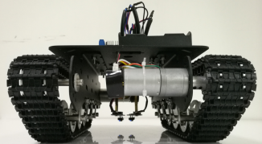
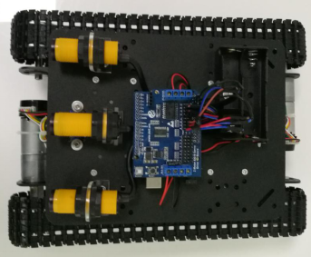

 TS100自动循迹避障小车使用说明 

 From SZDOIT

# 一.  物料准备

## 材料清单

| 名称                   | 数量 | 名称            | 数量  |
| ---------------------- | ---- | --------------- | ----- |
| Doit坦克小车           | 1    | 单通M3+50mm铜柱 | 2     |
| UNO R3控制板           | 1    | 双通17mm铜柱    | 2     |
| 2路电机&16路舵机驱动板 | 1    | M3平头螺丝      | 10    |
| 18650电池盒            | 1    | M3*12内六角螺丝 | 2     |
| 单路红外循迹模块       | 2    | M4垫片          | 4     |
| 光电式红外避障传感器   | 3    | M3螺母          | 9     |
| 红外避障传感器支架     | 3    | 单通 3mm支撑柱  | 3     |
| M3*12平头螺丝          | 1    | M3垫片          | 2     |
| 母-母杜邦线            | 15   | 扳手            | 3(种) |

## 实物图鉴

 

# 二．安装与接线

## 硬件安装

 

## 电路接线

  默认驱动板是直插到UNO控制板上。之后按图示连接；

 

【图示说明】

电源部分：电池盒的红线(正极)接驱动板的VM；电池盒的黑线(负极)接驱动板的GND；

电机部分：将电机线插到电机的接线槽里，注意这里每个电机线只使用到红黑两根线，其他颜色的线不需要用到（可以缠起来）；

左电机的红线  ----->  驱动板的A+   左电机的黑线  ----->  驱动板的A-；

右电机的红线  ----->  驱动板的 B-   右电机的黑线  ----->  驱动板的 B+；

传感器部分：每个传感器都有3根线，分别为电源线（VCC、GND）和信号线；

信号线：

左红外循迹模块 (安装在1处) 的信号线DO (黑线) ----->  驱动板的1

右红外循迹模块 (安装在2处) 的信号线DO (黑线) ----->  驱动板的2

左红外避障模块 (安装在3处) 的信号线DO (黑线) ----->  驱动板的3

中红外避障模块 (安装在4处) 的信号线DO (黑线) ----->  驱动板的4

右红外避障模块 (安装在5处) 的信号线DO (黑线) ----->  驱动板的5

电源线：

每个传感器的电源线部分，VCC(棕红色线) 插在VS 上，GND（蓝色线）插在 GND上；

# 三．功能与使用

## 功能说明

本小车为自动循迹小车，循迹传感器安装在车子底盘的底方，一上电小车即进入自动循迹，在白色地板上沿着指定的（黑色）路线运动，若是在车子底方的地板上探测不到黑色轨迹，这小车默认后退，直到探测到黑色轨迹为止；鉴于本车子底方两个循迹模块的横向距离大约为2.5cm，建议在地板上设置黑色轨迹的时候，所设置的轨迹宽度在3cm~3.5cm为宜，对于轨迹的要求是尽量平整不反光，拐弯之处尽可能圆滑而不是接近90度的小拐角，否则车子会走得太过别扭；黑色轨迹可以用黑色电工胶布贴在白色地板上。小车底盘的上方安装3路光电式红外避障传感器，相比普通红外避障传感器，这种光电式传感器的特点是探测距离远、探测灵敏度高。小车的控制逻辑是默认状态下是处于自动不断循迹状态，当车子只要至少有1个红外避障传感器探测到前方有障碍物，小车立即停止循迹并静止在原地，直到前方的障碍物消失小车才会继续启动进入循迹状态。

## 操作说明

将小车和控制板、驱动板、传感器按要求安装好之后，按下驱动板的电源开关，小车即进入循迹模式。

## 小车多角度视图

 

正视图                                               左视图

 

右视图                                         后视图

 

俯视图                                     底视图

# 附录. 设计资料

| 四博智联资源                                           |                                                              |
| ------------------------------------------------------ | ------------------------------------------------------------ |
| 官网                                                   | [www.doit.am](http://www.doit.am/)                           |
| 教材                                                   | [ESPDuino智慧物联开发宝典](https://item.taobao.com/item.htm?spm=a1z10.3-c.w4002-7420449993.9.Bgp1Ll&id=520583000610) |
| 购买                                                   | [官方淘宝店](https://szdoit.taobao.com/)(szdoit.am)          |
| 讨论                                                   | [技术论坛](http://bbs.doit.am/forum.php)(bbs.doit.am)        |
| 应用案例集锦                                           | [智能建筑云](http://building.doit.am)(building.doit.am)      |
| [光伏监控云](http://solar.doit.am)(solar.doit.am)      |                                                              |
| [Doit玩家云](http://wechat.doit.am)(wechat.doit.am)    |                                                              |
| [免费TCP公网调试服务](http://tcp.doit.am)(tcp.doit.am) |                                                              |
| 官方技术支持QQ群                                       |                                                              |
| 技术支持群1                                            | 278888901                                                    |
| 技术支持群2                                            | 278888902                                                    |
| 技术支持群3                                            | 278888903                                                    |
| 技术支持群4                                            | 278888904                                                    |
| 技术支持群5                                            | 278888905                                                    |
| 技术支持群6                                            | 278888906                                                    |
| 技术支持群7                                            | 278888907                                                    |
| 技术支持群8                                            | 278888908                                                    |
| 技术支持群9                                            | 278888909                                                    |
| 技术支持群10                                           | 278888900                                                    |

| 乐鑫ESP8266资源                                              |                                                              |
| ------------------------------------------------------------ | ------------------------------------------------------------ |
| 芯片基本资料                                                 | [ESP8266快速入门指南](http://espressif.com/sites/default/files/documentation/esp8266_quick_start_guide_cn.pdf) |
| 软件编程基本资料                                             | [ESP8266 SDK⼊⻔指南](http://espressif.com/sites/default/files/documentation/2a-esp8266-sdk_getting_started_guide_cn.pdf) |
| [ESP8266 SDK](http://www.espressif.com/zh-hans/support/download/sdks-demos?keys=&field_type_tid[]=14) |                                                              |
| 固件下载工具                                                 | [ESP8266下载⼯具](http://www.espressif.com/zh-hans/support/download/other-tools?keys=&field_type_tid[]=14) |
| 资源整合                                                     | [ESP8266官⽅论坛](http://bbs.espressif.com/)                 |
| [ESP8266资源合集](http://www.espressif.com/zh-hans/products/hardware/esp8266ex/resources) |                                                              |

# 免责申明和版权公告

本文中的信息，包括供参考的URL地址，如有变更，恕不另行通知。 

文档“按现状”提供，不负任何担保责任，包括对适销性、适用于特定用途或非侵权性的任何担保，和任何提案、规格或样品在他处提到的任何担保。本文档不负任何责任，包括使用本文档内信息产生的侵犯任何专利权行为的责任。本文档在此未以禁止反言或其他方式授予任何知识产权使用许可，不管是明示许可还是暗示许可。 

Wi-Fi联盟成员标志归Wi-Fi联盟所有。

文中提到的所有商标名称、商标和注册商标均属其各自所有者的财产，特此声明。 

# 注 意

由于产品升级或其他原因，本手册内容有可能变更。深圳四博智联科技有限公司保留在没有任何通知或者提示的情况下对本手册的内容进行修改的权利。本手册仅作为使用指导，深圳四博智联科技有限公司尽全力在本手册中提供准确的信息，但是并不确保手册内容完全没有错误，本手册中的所有陈述、信息和建议也不构成任何明示或暗示的担保。