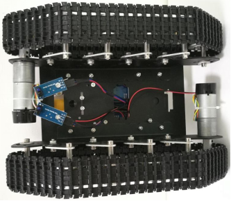

 TS100自动循迹避障小车使用说明 

 From SZDOIT

## 一.  物料准备

### 材料清单

| 名称                   | 数量 | 名称            | 数量  |
| ---------------------- | ---- | --------------- | ----- |
| Doit坦克小车           | 1    | 单通M3+50mm铜柱 | 2     |
| UNO R3控制板           | 1    | 双通17mm铜柱    | 2     |
| 2路电机&16路舵机驱动板 | 1    | M3平头螺丝      | 10    |
| 18650电池盒            | 1    | M3*12内六角螺丝 | 2     |
| 单路红外循迹模块       | 2    | M4垫片          | 4     |
| 光电式红外避障传感器   | 3    | M3螺母          | 9     |
| 红外避障传感器支架     | 3    | 单通 3mm支撑柱  | 3     |
| M3*12平头螺丝          | 1    | M3垫片          | 2     |
| 母-母杜邦线            | 15   | 扳手            | 3(种) |

### 实物图鉴

 

## 二．安装与接线

### 硬件安装

 

### 电路接线

  默认驱动板是直插到UNO控制板上。之后按图示连接；

 

【图示说明】

电源部分：电池盒的红线(正极)接驱动板的VM；电池盒的黑线(负极)接驱动板的GND；

电机部分：将电机线插到电机的接线槽里，注意这里每个电机线只使用到红黑两根线，其他颜色的线不需要用到（可以缠起来）；

左电机的红线  ----->  驱动板的A+   左电机的黑线  ----->  驱动板的A-；

右电机的红线  ----->  驱动板的 B-   右电机的黑线  ----->  驱动板的 B+；

传感器部分：每个传感器都有3根线，分别为电源线（VCC、GND）和信号线；

信号线：

左红外循迹模块 (安装在1处) 的信号线DO (黑线) ----->  驱动板的1

右红外循迹模块 (安装在2处) 的信号线DO (黑线) ----->  驱动板的2

左红外避障模块 (安装在3处) 的信号线DO (黑线) ----->  驱动板的3

中红外避障模块 (安装在4处) 的信号线DO (黑线) ----->  驱动板的4

右红外避障模块 (安装在5处) 的信号线DO (黑线) ----->  驱动板的5

电源线：

每个传感器的电源线部分，VCC(棕红色线) 插在VS 上，GND（蓝色线）插在 GND上；

## 三．功能与使用

### 功能说明

本小车为自动循迹小车，循迹传感器安装在车子底盘的底方，一上电小车即进入自动循迹，在白色地板上沿着指定的（黑色）路线运动，若是在车子底方的地板上探测不到黑色轨迹，这小车默认后退，直到探测到黑色轨迹为止；鉴于本车子底方两个循迹模块的横向距离大约为2.5cm，建议在地板上设置黑色轨迹的时候，所设置的轨迹宽度在3cm~3.5cm为宜，对于轨迹的要求是尽量平整不反光，拐弯之处尽可能圆滑而不是接近90度的小拐角，否则车子会走得太过别扭；黑色轨迹可以用黑色电工胶布贴在白色地板上。小车底盘的上方安装3路光电式红外避障传感器，相比普通红外避障传感器，这种光电式传感器的特点是探测距离远、探测灵敏度高。小车的控制逻辑是默认状态下是处于自动不断循迹状态，当车子只要至少有1个红外避障传感器探测到前方有障碍物，小车立即停止循迹并静止在原地，直到前方的障碍物消失小车才会继续启动进入循迹状态。

### 操作说明

将小车和控制板、驱动板、传感器按要求安装好之后，按下驱动板的电源开关，小车即进入循迹模式。

### 小车多角度视图

 

正视图                                               左视图

 

右视图                                         后视图

 

俯视图                                     底视图

## 更多资源，请关注公众号！

