 
  TS400驱金属坦克底盘安装说明 

 from SZDOIT 

## 一、材料清单 :

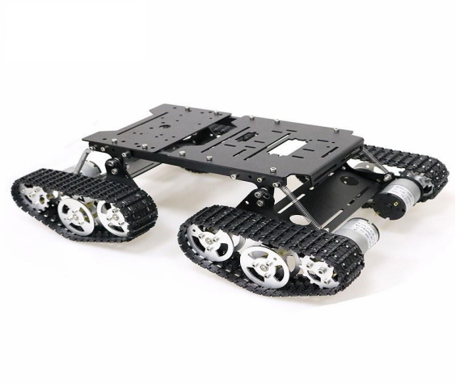

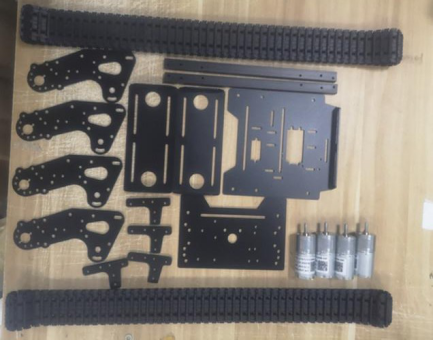

螺丝配件:

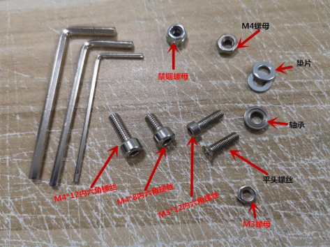

## 二、安装步骤 :

### 安装车轮和电机

1.取电机和支架，对孔，用 M38 平头螺丝锁紧。

 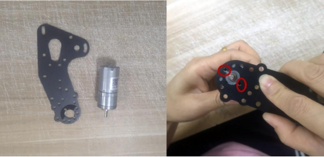

2. 安装轮子。将驱动轮承重轮安装完成。将联轴器上的顶丝拧紧在电机轴平的一端

|      |                   |
| ---- | ----------------- |
|      | 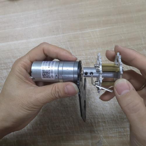 |

注意：安装时轮子联轴器卡在电机轴的凸出处（如若全部卡进去电机将受阻无法转动）

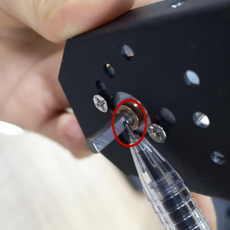 

3. 如图所示两个位置，安装承重轮，末端的孔位置内外侧要放置垫片。用 M412 螺丝固定。

|      |                   |
| ---- | ----------------- |
|      | 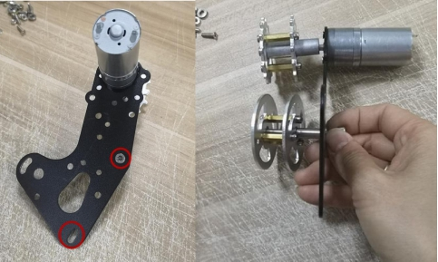 |

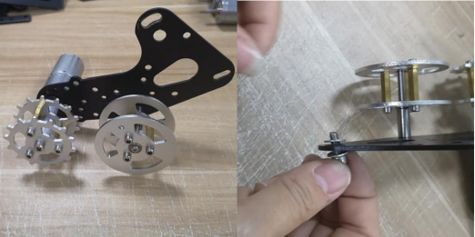 

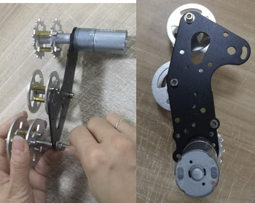

 

4，安装弹簧，用 M410 螺丝和螺母固定。

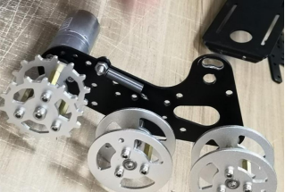 

5. 另外 3 组车轮安装方法一样。依次把 4 组车轮全部安装好。

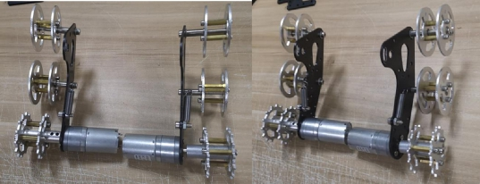 

 

### 安装支架和车轮

1. 取最小的面板，如图，对孔安装，用 M38 内六角螺丝螺母固定。

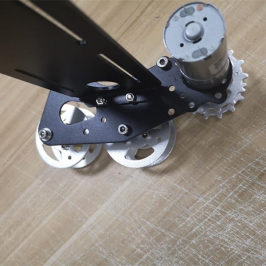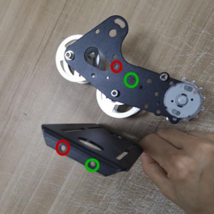

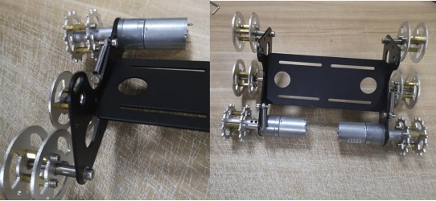

2. 安装支架。取图中所示配件长条支架和 T 型支架。对孔安装，用 M38 内六角螺丝锁紧。

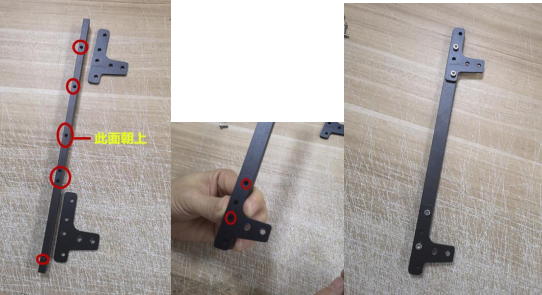

3. 将所得两条长支架和面板对孔安装，并用 M38 内六角螺丝固定。

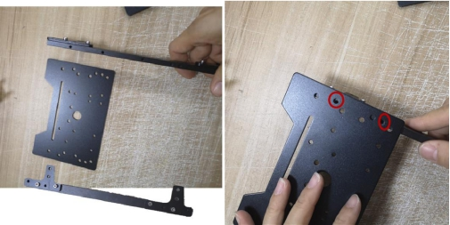 

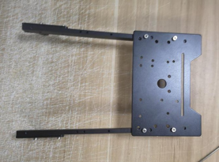 

4. 安装 4 组车轮。如图所示，将车轮和 T 型支架进行组装（两者之间放入垫片防止过度摩擦），M412 内六角螺丝分别穿过两配件的重合孔。

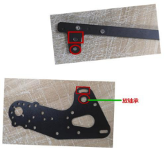	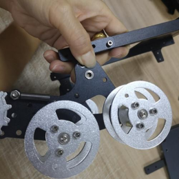

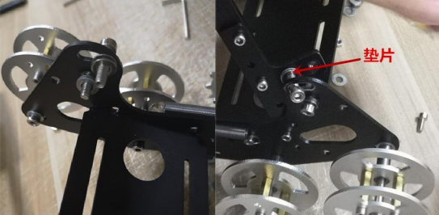 

用 M4 螺母和禁锢螺母锁住

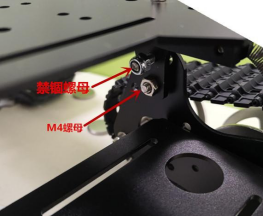

注意：此部分安装需要耐心。

5. 组装弹簧。用 M310 内六角螺丝固定。

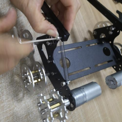

另外 3 组车轮安装步骤同上。依次将车轮安装完毕。

 6.安装大面板。如图，用 6 枚 M310 内六角螺丝固定。

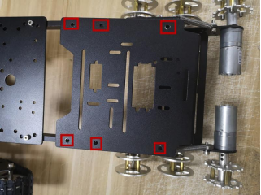 

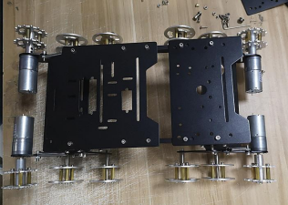 

### 安装履带

将两条履带一分为二，变成四条履带。截取合适车轮的长度，用万用表笔笔头或其他尖状类工具可进行拆卸。

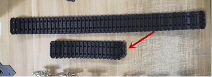 

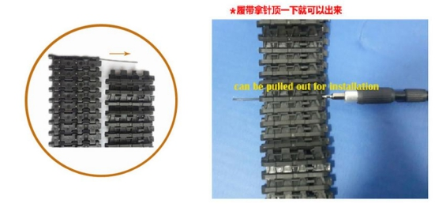 

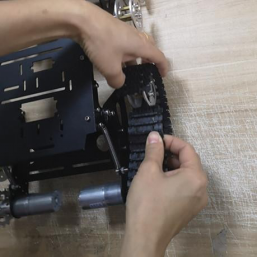	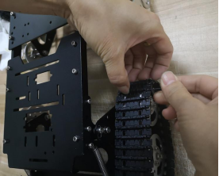

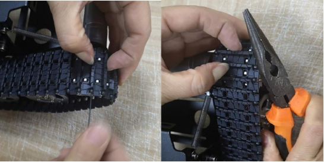 

## 更多资源，请关注公众号！

