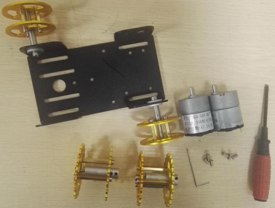
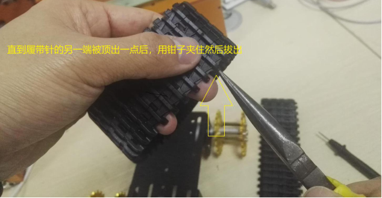

 T101安装说明

 From SZDOIT

## 一. 材料清单

 

| 名称           | 数量 |                | 名称 | 数量 |
| -------------- | ---- | -------------- | ---- | ---- |
| mini底盘       | 1    | 28mm双通铜柱   | 6    |      |
| 大驱动轮片     | 4    | 5mm联轴器      | 2    |      |
| 17mm双通铜柱   | 6    | 黑色顶丝       | 4    |      |
| M3*8内六角螺丝 | 24   | 长M4内六角螺丝 | 2    |      |
| 轴承           | 4    | 33电机         | 2    |      |
| 连接器         | 2    | M3*6平头螺丝   | 6    |      |
| M2螺丝         | 2    | 大履带         | 2    |      |
| 短M4内六角螺丝 | 2    | M2扳手         | 1    |      |
| 垫片           | 4    | M3扳手         | 1    |      |
| 大孔驱动轮片   | 2    | M4扳手         | 1    |      |
| 小孔驱动轮片   | 2    |                |      |      |

 

## 二. 安装过程

### 1. 组装承重轮和驱动轮

本小车共有2个承重轮和2个驱动轮，以下分别展示单个承重轮和驱动轮的组装过程，

#### a.承重轮

材料清单：

 

组装过程：

 

 

 

 

 

 

 

#### b.驱动轮

材料清单：

 

组装过程：

 

 

 

 

 

 

### 2. 安装承重轮

清单：

 

 

 

 

 

 

 

 

### 3. 安装电机和驱动轮

清单：

 

 

 

 

 

 

 

### 4. 安装履带

清单：

 

 

 

 

 

 

 

 

## 三. 实物图鉴

俯视图：

 

底视图：

 

侧视图：

 

## 四. 注意事项

①由于底盘窄小，同一端的两轮需要按顺序先固定好承重轮再装电机；

②由于底盘的2个安装承重轮的圆孔过大，在安装承重轮的时候需要在圆孔两侧垫上垫片，为了保持与对应位置的承重轮圆心轴线成直线，需要用目测的方式手动调节短M4内六角螺丝锁住的承重轮连接器的位置，保持其位于圆孔的中央位置； 

## 更多资源，请关注公众号！

