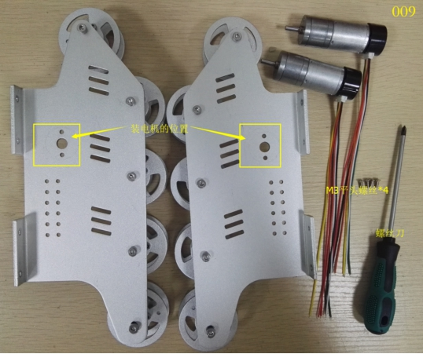
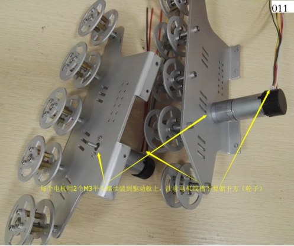
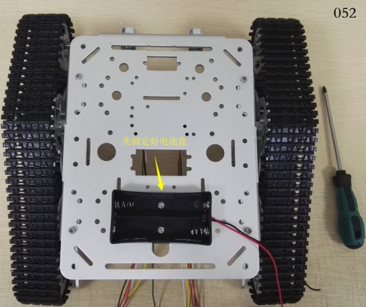

 
  T300坦克小车安装说明 

 from SZDOIT 
 

## 1 物料清单

 WiFi小车ESPDuino版-T300坦克小车                                    WiFi小车NodeMCU版-T300坦克小车

### A：---- ESPDuino版：

 

说明：

| 序号 | 名称             | 数量 |      | 序号                   | 名称        | 数量 |
| ---- | ---------------- | ---- | ---- | ---------------------- | ----------- | ---- |
| 1    | 侧板（右）       | 1    |      | 12                     | M2扳手      | 1    |
| 2    | 底盘             | 1    | 13   | M3扳手                 | 1           |      |
| 3    | 侧板（左）       | 1    | 14   | M4扳手                 | 1           |      |
| 4    | 大塑料履带       | 2    | 15   | 螺丝刀                 | 1           |      |
| 5    | （大）金属承重轮 | 6    | 16   | 电机线                 | 2           |      |
| 6    | （大）金属驱动轮 | 2    | 17   | M3*8平头螺丝           | 10          |      |
| 7    | 9V 带码盘电机    | 2    | 18   | M3螺母                 | 10          |      |
| 8    | 电机后盖         | 2    | 19   | M3 内六角螺丝          | 4           |      |
| 9    | 塞子             | 2    | 20   | 支撑柱                 | 4           |      |
| 10   | 灯罩             | 2    | 21   | 视频小车ESPDuino版套件 | 1           |      |
| 11   | 车LED灯          | 2    |      | 22                     | 18650电池盒 | 1    |

### B：---- NodeMCU版：

 

说明：

| 序号 | 名称             | 数量 |      | 序号                  | 名称        | 数量 |
| ---- | ---------------- | ---- | ---- | --------------------- | ----------- | ---- |
| 1    | 侧板（右）       | 1    |      | 12                    | M2扳手      | 1    |
| 2    | 底盘             | 1    | 13   | M3扳手                | 1           |      |
| 3    | 侧板（左）       | 1    | 14   | M4扳手                | 1           |      |
| 4    | 大塑料履带       | 2    | 15   | 螺丝刀                | 1           |      |
| 5    | （大）金属承重轮 | 6    | 16   | 电机线                | 2           |      |
| 6    | （大）金属驱动轮 | 2    | 17   | M3*8平头螺丝          | 9           |      |
| 7    | 9V 带码盘电机    | 2    | 18   | M3螺母                | 9           |      |
| 8    | 电机后盖         | 2    | 19   | M3 内六角螺丝         | 4           |      |
| 9    | 塞子             | 2    | 20   | 支撑柱                | 3           |      |
| 10   | 灯罩             | 2    | 21   | 视频小车NodeMCU版套件 | 1           |      |
| 11   | 车LED灯          | 2    |      | 22                    | 18650电池盒 | 1    |

 

## 2 主控板介绍

### A：---- ESPDuino版

 

 

### B：---- NodeMCU版

 

## 3 组装

### 1)组装车子

#### 步骤1：轮子安装到侧板

① 装承重轮

清单：

 

组装：

 

 

 

② 装驱动轮

a． 组装电机线

清单：

 

组装：

 

b． 电机装到侧板

清单：

 

组装：

 

 

c． 装驱动轮

清单：

 

组装：

 

 

 

#### 步骤2：侧板安装到底盘

① 底盘装上车头LED灯

a． 清单

 

b． 组装

 

 

② 底盘装上两边侧板

a． 清单

 

b． 组装

 

 

 

 

#### 步骤3：安装履带

① 装上塑料履带

清单：

 

组装：

 

 

 

 

 

 

 

 

### 2)安装控制板和电路接线

#### A：----ESPDuino版

① 组装控制板

清单：

 

组装：

 

 

 

② 安装主控板和电池盒 

清单：

 

组装：

 

 

 

 

③ 电路接线

a接电源线

 

 

b接电机线

 

 

 

 

 

 

#### B：----NodeMCU版

① 组装控制板

清单：

 

组装：

 

 

② 安装主控板和电池盒

清单：

 

组装：

 

 

 

 

③ 电路接线

a接电源线：

 

 

b接电机线：

 

 

 

 

 

 

## 更多资源，请关注公众号！

