
 ESPduinoT900_WiFi小车接线说明(V1.0)

 From SZDOIT

# 一、简介

本手册只是简单介绍ESPduino版T900_WiFi小车的电路接线。

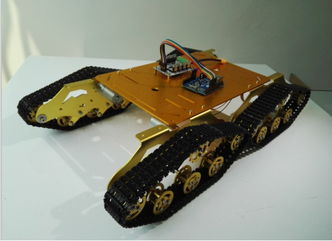 

# 二、材料准备

材料清单：

| 材料              | 数量 |
| ----------------- | ---- |
| T900四驱坦克小车  | 1    |
| ESPDuino开发板    | 1    |
| 大功率电机驱动板  | 1    |
| 11.1V大容量锂电池 | 1    |
| 小开关            | 1    |
| 杜邦线(公-母)     | 10   |

实物图鉴：

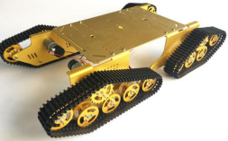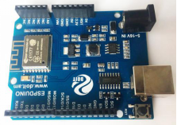

​       T900坦克小车        ESPDuino开发板      小开关

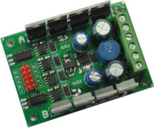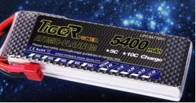

大功率电机驱动板        11.1V大容量锂电池          杜邦线

 

# 三、小车结构说明

安装ESPDuinoT900小车时，请参考下图：

l 小车的整体外观：

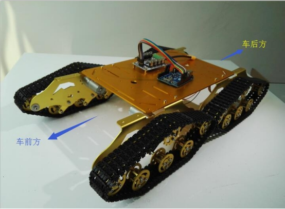 

l 电路部分结构图：

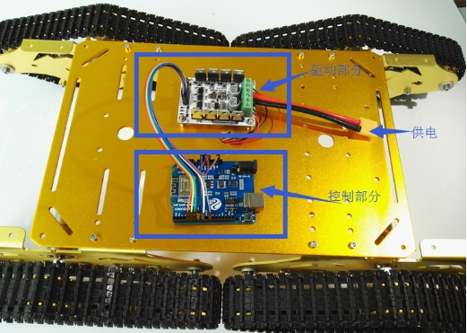 

# 四、硬件电路连接

l 供电部分

1） 电机驱动板的供电

11.1V锂电池的“正极”(红色线)连接小开关，之后连接电机驱动板的“电源 +”；锂电池的“负极”(黑色线)连接电机驱动板的“电源 -”。注：由于锂电池原配的电源接口线比较粗，为了连接方便建议用直径相对细小一点的电线连接后再接到对应端口，为了避免接触不良应该将电线连接处焊接牢固；

2） ESPDuino控制板的供电

电机驱动板的控制端(插针)的两对“5V/GND”同时用杜邦线连接到控制板ESPDuino的相应端口，实现电机驱动板给ESPDuino控制板的供电。

3） 左右电机的供电

先将小车左边前后两个电机的电源线根据“红-红”“黑-黑”的原则两两连接合二为一，右边同理，这样四驱小车就等同于变成左右两路电机的“二驱小车”；将左路电机的“红色线”接到电机驱动板的“电机A”左端、“黑色线”接到电机驱动板“电机A”右端，同理将右路电机的“红色线”接到电机驱动板的“电机B”左端、“黑色线”接到电机驱动板“电机B”右端。

以下是简图：

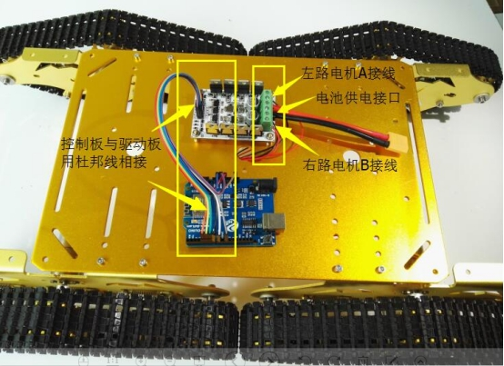 

l 控制部分

用杜邦线将ESPDuino控制板和电机驱动板的控制端(插针)分别按照下面的方式连接：

ESPDuino    <-------------------------->   电机驱动板

D4       <-------------------------->   PA

D5       <-------------------------->   A1

D12      <-------------------------->   A2

D13      <-------------------------->   PB

D14      <-------------------------->   B1

D15      <-------------------------->   B2

以下是实物连接说明图：

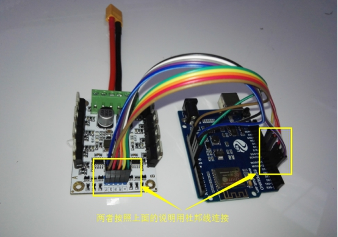 

# 五、实物效果图

1.三视图

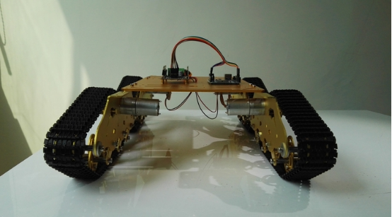 

正视图

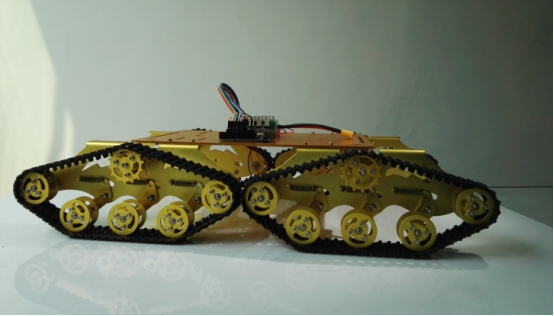 

左视图

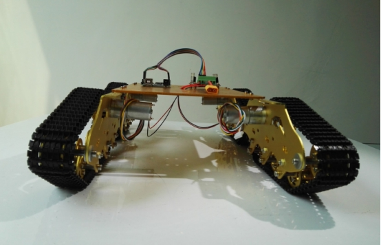 

后视图

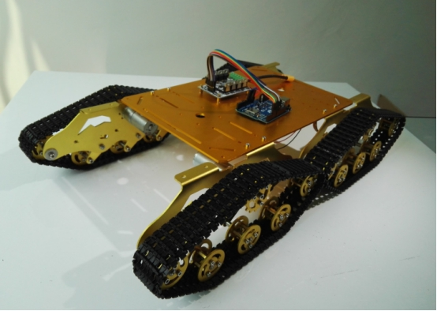 

3D立体图

 

# 六、要点

1）原配的电池连接线端口比较粗，很难直接插进电机驱动板的电源接口，因此建议用合适工具将端口削细小一点，直到能插进驱动板的接口为止（为了不因为导线过细导致电源供应不足，请注意不要把线削到太过细小，适可而止）。

2）因为控制板跟驱动板之间是用杜邦线连接，容易由于杜邦线端口的松动而出现接触不良的情况，所以请尽可能让杜邦线接口更紧凑，必要时可以用热熔胶覆其上粘紧固定。

3）正常安装车子后，按下小开关上电，打开手机的附近WiFi热点列表，点击连接名为“Doit_Car_XXXX”的热点，之后打开软件“Doit小车”，在首页中点击“本地模式”，之后就可以轻松控制小车的运动了。

# 七、支持与服务

ESPDuino版本T900视频小车固件下载链接：

http://bbs.doit.am/forum.php?mod=viewthread&tid=357&extra=

购买地址：	

https://item.taobao.com/item.htm?id=525057040876

| 四博智联资源                                        |                                                              |
| --------------------------------------------------- | ------------------------------------------------------------ |
| 官网                                                | [www.doit.am](http://www.doit.am/)                           |
| 教材                                                | [ESPDuino智慧物联开发宝典](https://item.taobao.com/item.htm?spm=a1z10.3-c.w4002-7420449993.9.Bgp1Ll&id=520583000610) |
| 购买                                                | [官方淘宝店](https://szdoit.taobao.com/)(szdoit.am)          |
| 讨论                                                | [技术论坛](http://bbs.doit.am/forum.php)(bbs.doit.am)        |
| 应用案例集锦                                        |                                                              |
| [Doit玩家云](http://wechat.doit.am)(wechat.doit.am) | [免费TCP公网调试服务](http://tcp.doit.am)(tcp.doit.am)       |
| 官方技术支持QQ群1/2/3群已满                         |                                                              |
| 技术支持群4                                         | 278888904                                                    |
| 技术支持群5                                         | 278888905                                                    |
| 术支持群6                                           | 278888906                                                    |
| 技术支持群7                                         | 278888907                                                    |
| 技术支持群8                                         | 278888908                                                    |
| 技术支持群9                                         | 278888909                                                    |
| 技术支持群10                                        | 278888900                                                    |

# 八、注 意

由于产品升级或其他原因，本手册内容有可能变更。深圳四博智联科技有限公司保留在没有任何通知或者提示的情况下对本手册的内容进行修改的权利。本手册仅作为使用指导，深圳四博智联科技有限公司尽全力在本手册中提供准确的信息，但是并不确保手册内容完全没有错误，本手册中的所有陈述、信息和建议也不构成任何明示或暗示的担保。