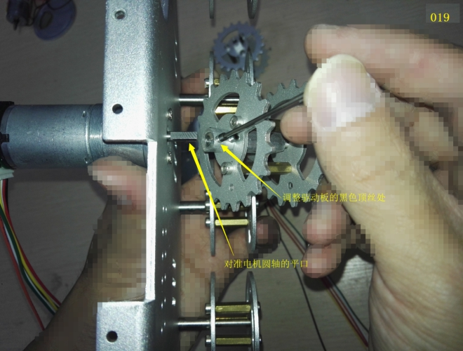
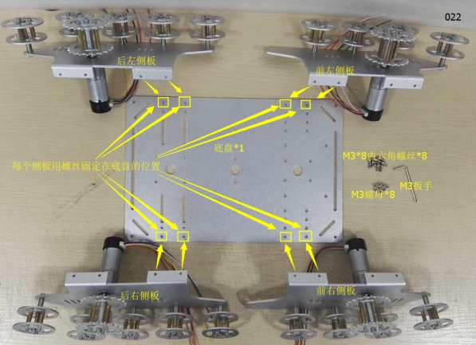
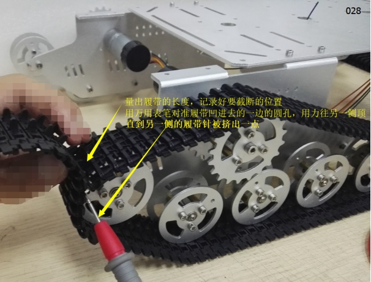
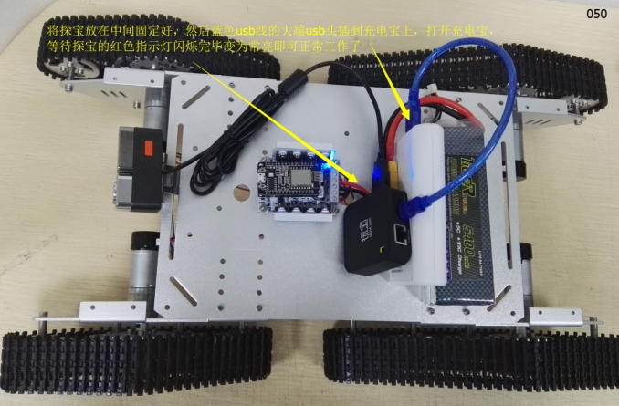

 T900坦克小车安装及使用说明

 From SZDOIT

## 一、物料清单

 

 

说明：

| 序号 | 名称                        | 数量 | 序号 | 名称         | 数量 |
| ---- | --------------------------- | ---- | ---- | ------------ | ---- |
| 1    | 侧板（右）                  | 2    | 13   | M3螺母       | 8    |
| 2    | 底盘                        | 1    | 14   | M3*8平头螺丝 | 9    |
| 3    | 侧板（左）                  | 2    | 15   | M3螺母       | 4    |
| 4    | （大）金属驱动轮            | 4    | 16   | 7mm支撑柱    | 4    |
| 5    | （大）金属承重轮            | 18   | 17   | 螺丝刀       | 1    |
| 6    | 9V 带码盘电机               | 4    | 18   | M2扳手       | 1    |
| 7    | 电机后盖                    | 4    | 19   | M3扳手       | 1    |
| 8    | 电机线                      | 4    | 20   | M4扳手       | 1    |
| 9    | 11.1V航模电池               | 1    | 21   | 大塑料履带   | 4    |
| 10   | 电池转接线                  | 1    | 22   | 网络摄像头   | 1    |
| 11   | 4路电机大功率驱动板控制套件 | 1    | 23   | 蓝色USB线    | 1    |
| 12   | M3 内六角螺丝               | 8    | 24   | 探宝         | 1    |

## 二、主控板介绍

整套：

 

控制板：

 

正面                                              背面

驱动板：

 

## 三、组装

### 1. 组装车子

#### 步骤1：车轮安装到侧板

① 装承重轮

清单：

 

组装：

 

 

 

 

 

 

 

 

 

② 装驱动轮

a． 组装电机线

清单：

 

组装：

 

b． 电机装到侧板

清单：

 

组装：

 

 

 

c． 装驱动轮

清单：

 

组装：

 

 

 

#### 步骤2：侧板安装到底盘

a． 清单

 

b． 组装

 

 

 

 

#### 步骤3：安装履带

① 装上塑料履带

清单：

 

组装：

 

 

 

 

 

 

### 2. 安装控制板和电路接线

① 组装控制板

清单：

 

组装：

 

 

② 安装主控板和电池盒 

清单：

 

组装：

 

 

③ 电路接线

a接电机线

 

 

 

 

 

b接电源线

 

 

 

 

 

c 接摄像头和探宝

 

 

 

 

## 更多资源，请关注公众号！

