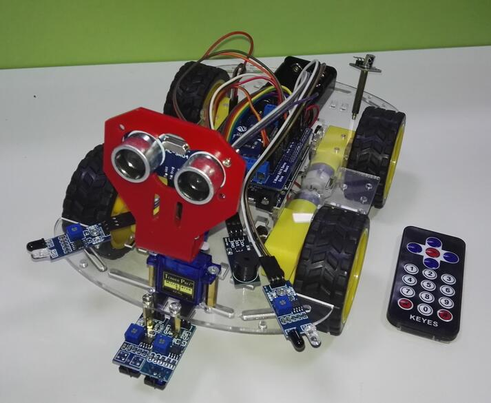
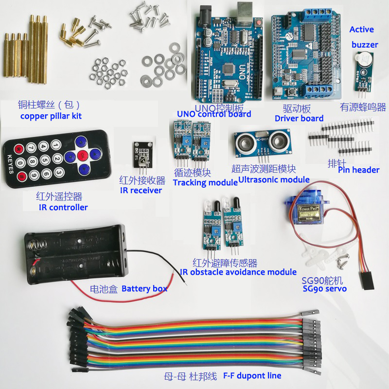
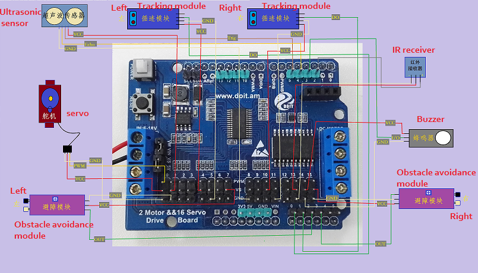
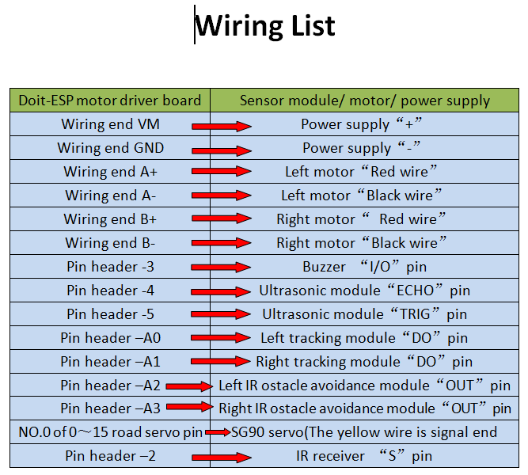

<center><font size=10> 红外遥控循迹避障小车 </center></font>
<center> From SZDOIT</center>

## 1 简介

​	UNODoit红外/蓝牙/WiFi多功能小车，是基于Arduino UNO R3开发板、使用Arduino IDE开发 的智能坦克小车，其中UNO开发板为主控板，使用完全兼容UNO的“2/4路电机&16路舵机驱动板”作为小车的驱动板，而信号传输方面，将DT-06无线WiFi串口透传模块直插到驱动板上右上角的插槽上作为控制信号传输与手机端连接，实现小车通过手机APP使用WiFi控制小车的功能；通过在开发板上接上各种传感器，小车还将分别有2路循迹、1路超声波摇头避障等等自动化功能。



## 2 材料清单



## 3 接线说明





## 4 示例程序

注意：该程序需要使用到一些库，请自行[下载](https://github.com/SmartArduino/Arduino-Third-party-Libraries)并解压到Arduino IDE软件安装目录下的libraries文件夹下

```
//材料：UNO开发板*1+2路电机&16路舵机驱动板*1+红外遥控套件*1+红外循迹模块*2+舵机*1+超声波传感器*1+红外避障模块*2+蜂鸣器*1
//红外控制+2路循迹+超声波红外避障
//IIC与A4、A5复用了，所以不能用到!!!
//避障参数   1--无障碍  0--障碍
//循迹参数   1--黑      0--白
#include "SR04.h"
#include <IRremote.h>
#include <Adafruit_PWMServoDriver.h>
/****************************IO引脚定义*****************************/
//电机引脚
#define PWMA 9 //左电机转速
#define DIRA 8 //左电机转向
#define DIRB 7 //右电机转向
#define PWMB 6 //右电机转速
//超声波引脚定义
#define ECHO_PIN 4
#define TRIG_PIN 5
//蜂鸣器引脚
#define BEEP_PIN 3 
//红外接收引脚
#define IR_PIN 2
//左右红外循迹
#define TRAKLEF A0 //红外循迹左
#define TRAKRIT A1 //红外循迹右
//前左右红外避障
#define AVOILEF_F A2 //红外避障前左
#define AVOIRIT_F A3 //红外避障前右
/*******************************************************************/
//调用超声波类库
SR04 sr04 = SR04(ECHO_PIN,TRIG_PIN);//读距离的时候: a=sr04.Distance();单位为 cm
// 定义 IRrecv 物件来接收红外线信号
IRrecv IR(IR_PIN);  
decode_results IRresults; 
//红外解码
#define IR_ADVANCE 		0x00FF629D       //前进码---"up"
#define IR_BACK 		0x00FFA857       //后退---"down"
#define IR_RIGHT 		0x00FFC23D  //右转---"right"
#define IR_LEFT  		0x00FF22DD   //左转---"left"
#define IR_STOP  		0x00FF02FD       //停止---"OK"
#define IR_AUTO_AG 		0xFF42BD      //循迹模式---"*"
#define IR_AUTO_UI  	0x00FF52AD    //避障模式---"#"
#define IR_turnsmallleft 0x00FF30CF//---"4"
//蜂鸣器响/熄
#define BEEP_ON    digitalWrite(BEEP_PIN, LOW)//蜂鸣器响
#define BEEP_OFF   digitalWrite(BEEP_PIN, HIGH)//蜂鸣器熄
//舵机引脚定义
#define SERVO_PINPin 0//舵机左右转动
Adafruit_PWMServoDriver pwm = Adafruit_PWMServoDriver();
uint8_t servopath1 = 175;//X方向初始值  正左方
uint8_t servopath2 = 85;//X方向初始值  正前方
uint8_t servopath3 = 0;//X方向初始值  正右方
uint8_t servopath4 = 130;//X方向初始值  右前方
uint8_t servopath5 = 30;//X方向初始值  左前方
//定义避障距离
uint8_t Mindistn=40;//正常避障距离
uint8_t LRindistn=25;//左右避障距离
//定义小车速度
uint8_t speedd=255;//小车正常速度
uint8_t speeddAG=250;//小车循迹速度

//小车控制标志量
enum DS
{
	MANUAL_DRIVE,//手动控制
	AutoTracking, //循迹模式
	AutoObstruct, //避障模式
}Drive_Status=MANUAL_DRIVE;
//电机控制标志量
enum DN
{ 
	GO_ADVANCE, 
	GO_LEFT, 
	GO_RIGHT,
	GO_BACK,
	STOP_STOP,
	DEF
}Drive_Num=DEF;
//电机控制相关
bool flag1=false;
bool stopFlag = true;
bool JogFlag = false;
uint16_t JogTimeCnt = 0;
uint32_t JogTime=0;

/******************************功能函数**********************************/
//电机控制
void Car_GO_FORWARD(uint8_t spel, uint8_t sper, int tim=0)//小车前进
{
	uint8_t speeddl=spel;
	uint8_t speeddr=sper;
	digitalWrite(DIRA,HIGH);
	analogWrite(PWMA,speeddl);
	digitalWrite(DIRB,HIGH);
	analogWrite(PWMB,speeddr);
	delay(tim);
}
void Car_GO_LEFT(uint8_t spel,uint8_t sper, int tim=0)//车体左转	  
{
	uint8_t speeddl=spel;
	uint8_t speeddr=sper;
	digitalWrite(DIRA,LOW);
	analogWrite(PWMA,speeddl);
	digitalWrite(DIRB,HIGH);
	analogWrite(PWMB,speeddr);
	delay(tim);
}  
void Car_GO_RIGHT(uint8_t spel,uint8_t sper, int tim=0)//车体右转
{
	uint8_t speeddl=spel;
	uint8_t speeddr=sper;
	digitalWrite(DIRA,HIGH);
	analogWrite(PWMA,speeddl);
	digitalWrite(DIRB,LOW);
	analogWrite(PWMB,speeddr);
	delay(tim);
}
void Car_GO_STOP(uint8_t spel,uint8_t sper, int tim=0)//车体停止
{
	uint8_t speeddl=spel;
	uint8_t speeddr=sper;
	digitalWrite(DIRA,LOW);
	analogWrite(PWMA,speeddl);
	digitalWrite(DIRB,LOW);
	analogWrite(PWMB,speeddr);
	delay(tim);
}
void Car_GO_BACK(uint8_t spel,uint8_t sper, int tim=0)//车体后退
{	
	uint8_t speeddl=spel;
	uint8_t speeddr=sper;
	digitalWrite(DIRA,LOW);
	analogWrite(PWMA,speeddl);
	digitalWrite(DIRB,LOW);
	analogWrite(PWMB,speeddr);
	delay(tim);
}
//读2路循迹传感器值
uint8_t readIRM_ab()
{
	uint8_t temp1=0, tem=0;
	uint8_t IRt_L = analogRead(TRAKLEF)>500?1:0;  //循迹左
	uint8_t IRt_R = analogRead(TRAKRIT)>500?1:0;  //循迹右
	temp1 |= IRt_L;
	tem    = (temp1<<1)|IRt_R; //循迹状态值
	return 0x03&tem;
}
//读前2路避障传感器值
uint8_t readAVOIRM()
{
	uint8_t AVOIR_FL  = analogRead(AVOILEF_F)>500?1:0;//避障前左
	uint8_t AVOIR_FR  = analogRead(AVOIRIT_F)>500?1:0;//避障前右
	uint8_t temp2=0, tem=0;
	temp2 |= AVOIR_FL;
	tem  = (temp2<<1)|AVOIR_FR;
	return 0x03&tem;
}
//控制舵机旋转(避免转速过快导致开发板电压被拉得过低而重启)
void servo_control(int angle)
{
  static int last_angle = servopath2;
  int i=0;
  int diff = angle - last_angle;
  if(diff > 0)
  {
    for(i=0; i<diff; i++)
    {
      pwm.setPWM(SERVO_PINPin, 0, map(last_angle + i,0,180,150,600));
      delay(2);
    }
  }
  else
  {
    diff = -diff;
    for(i=0; i<diff; i++)
    {
      pwm.setPWM(SERVO_PINPin, 0, map(last_angle - i,0,180,150,600));
      delay(2);
    }
  }
  last_angle = angle;
}

//超声波测距
uint16_t read_UIM()
{
	uint16_t val1=0, val2=0;
	val1=sr04.Distance();//单位为 cm   控制val不大于401
	val2=(val1>400)?401:val1;
	// Serial.println(String("val2= ")+val2);//测试用...
	return val2;
}

//软件滤波测超声波数据(冒泡排序法)
uint16_t read_FilterUIM(int angle)
{
	char N=5, count=0, i=0, j=0;
	uint16_t temp3=0;
	uint16_t value_buf[N];
	uint32_t sum=0;
	servo_control(angle);
	for(count=0; count<N; count++)
	{
		value_buf[count] =read_UIM();
		delay(70);
	}
	for(j=0; j<N-1;j++)
	{
		for(i=0; i<N-j; i++)
		{
			if(value_buf[i]>value_buf[i+1])
			{
				temp3 = value_buf[i];
				value_buf[i] = value_buf[i+1];
				value_buf[i+1] = temp3;
			}
		}
	}
	for(count =1; count<N-1; count++)
	{
		sum += value_buf[count];
	}
	return (uint16_t)(sum/(N-2));

}
//避障模式
void ObstruCar()
{
	uint16_t Ldistance=0, Rdistance=0;
	uint16_t Fdistance=read_FilterUIM(servopath2);//超声波检测正前方障碍物距离
	Serial.println(String("Fdistance= ")+Fdistance);
	uint8_t temavir=readAVOIRM();
	if((Fdistance<Mindistn)||(temavir!=0x03))
	{
		BEEP_ON;
		Car_GO_STOP(0,0);
		Ldistance=read_FilterUIM(servopath1);//检测正左方障碍物距离
		Serial.println(String("Ldistance= ")+Ldistance);
		servo_control(servopath2);//让舵机转回到正前方
		Rdistance=read_FilterUIM(servopath3);//检测正右方障碍物距离
		Serial.println(String("Rdistance= ")+Rdistance);
		servo_control(servopath2);//让舵机转回到正前方
		if((Ldistance < LRindistn) && (Rdistance < LRindistn))
		{
			uint8_t cnt = 0;
			for(cnt=0;cnt<3;cnt++)
			{
				Car_GO_BACK(speedd,speedd,300);
				{
					Ldistance=read_FilterUIM(servopath1);//检测正左方障碍物距离
					Serial.println(String("Ldistance= ")+Ldistance);
					servo_control(servopath2);//让舵机转回到正前方
					Rdistance=read_FilterUIM(servopath3);//检测正右方障碍物距离
					Serial.println(String("Rdistance= ")+Rdistance);
					servo_control(servopath2);//让舵机转回到正前方
				}
				if(!((Ldistance < LRindistn) && (Rdistance < LRindistn)))
				{
					break;
				}
			}
			if(cnt<3)
			{
				if(Ldistance < Rdistance)
				{
					Car_GO_RIGHT(speedd,speedd);
					JogFlag = true;JogTimeCnt = 1;JogTime=millis();
					BEEP_OFF;
				}
				else if(Ldistance > Rdistance)
				{
					Car_GO_LEFT(speedd,speedd);
					JogFlag = true;JogTimeCnt = 1;JogTime=millis();
					BEEP_OFF;
				}
			}
			else
			{
				Drive_Status=MANUAL_DRIVE;
				Drive_Num=STOP_STOP;					
			}
			// JogFlag = true;JogTimeCnt = 1;JogTime=millis();
		}
		else if(Ldistance < Rdistance)
		{
			Car_GO_RIGHT(speedd,speedd);
			JogFlag = true;JogTimeCnt = 1;JogTime=millis();
			BEEP_OFF;
		}
		else if(Ldistance > Rdistance)
		{
			Car_GO_LEFT(speedd,speedd);
			JogFlag = true;JogTimeCnt = 1;JogTime=millis();
			BEEP_OFF;
		}
		if(millis()-JogTime>=700)
	    {
			JogTime=millis();
			if(JogFlag == true) 
			{
				stopFlag = false;
				if(JogTimeCnt <= 0) 
				{
				  JogFlag = false; stopFlag = true;
				}
				JogTimeCnt--;
			}
			if(stopFlag == true) 
			{
				JogTimeCnt=0;
				Car_GO_STOP(0,0);
			}
	    }
	}
	else
	{
		BEEP_OFF;//关闭蜂鸣器
		Car_GO_FORWARD(speedd,speedd);
	}
}
//循迹模式
void TrakCar()//2路循迹函数
{
	uint8_t temabir=readIRM_ab();
	switch(temabir)
	{
	    case 0://左白右白
	      Car_GO_BACK(speeddAG,speeddAG);// 后退
	      break;
	    case 1://左白右黑
	      Car_GO_RIGHT(speeddAG,speeddAG);// 右拐
	      break;
	    case 2://左黑右白
	      Car_GO_LEFT(speeddAG,speeddAG);// 左拐
	      break;
	    case 3://左黑右黑
	      Car_GO_FORWARD(speeddAG,speeddAG);// 前进
	      break;
	    default://皆不是
	      Car_GO_STOP(0,0);//静止
	}
}

//红外接收处理
void IR_Control()
{
  if(IR.decode(&IRresults))
  {
    if(IRresults.value==IR_ADVANCE)
    {
      Drive_Status=MANUAL_DRIVE;
      Drive_Num=GO_ADVANCE;
      Serial.println("car GO_ADVANCE !");
    }
    else if(IRresults.value==IR_RIGHT)
    {
      Drive_Status=MANUAL_DRIVE;
      Drive_Num=GO_RIGHT;
      Serial.println("car GO_RIGHT !");
    }
    else if(IRresults.value==IR_LEFT)
    {
      Drive_Status=MANUAL_DRIVE;
      Drive_Num=GO_LEFT;
      Serial.println("car GO_LEFT !");
    }
    else if(IRresults.value==IR_BACK)
    {
      Drive_Status=MANUAL_DRIVE;
      Drive_Num=GO_BACK;
      Serial.println("car GO_BACK !");
    }
    else if(IRresults.value==IR_STOP)
    {
      Drive_Status=MANUAL_DRIVE;
      Drive_Num=STOP_STOP;
      Serial.println("car STOP !");
    }
    else if(IRresults.value==IR_AUTO_AG)//循迹
    {
      Drive_Status=AutoTracking;
      Serial.println("AutoTracking...");
    }
    else if(IRresults.value==IR_AUTO_UI)//避障
    {
      Drive_Status=AutoObstruct;
      Serial.println("AutoObstruct...");
    }
    IRresults.value = 0;
    IR.resume();
  }
}
//小车控制
void CAR_Control()
{
  if(Drive_Status == MANUAL_DRIVE)
  {
    switch (Drive_Num) 
    {
      case GO_ADVANCE:Car_GO_FORWARD(speedd,speedd);JogFlag = true;JogTimeCnt = 1;JogTime=millis();break;
      case GO_LEFT: Car_GO_LEFT(speedd,speedd);JogFlag = true;JogTimeCnt = 1;JogTime=millis();break;
      case GO_RIGHT:Car_GO_RIGHT(speedd,speedd);JogFlag = true;JogTimeCnt = 1;JogTime=millis();break;
      case GO_BACK:Car_GO_BACK(speedd,speedd);JogFlag = true;JogTimeCnt = 1;JogTime=millis();break;
      case STOP_STOP: Car_GO_STOP(0,0);JogTime = 0;JogFlag=false;stopFlag=true;break;
      default:break;
    }
    Drive_Num=DEF;
    //小车保持姿态300ms
    if(millis()-JogTime>=500)
    {
      JogTime=millis();
      if(JogFlag == true) 
      {
        stopFlag = false;
        if(JogTimeCnt <= 0) 
        {
          JogFlag = false; stopFlag = true;
        }
        JogTimeCnt--;
      }
      if(stopFlag == true) 
      {
        JogTimeCnt=0;
        Car_GO_STOP(0,0);
      }
    }
  }
  else if(Drive_Status==AutoTracking)
  {
    TrakCar();//循迹
  }
  else if(Drive_Status==AutoObstruct)
  {
    ObstruCar();//避障
  }
}
//IO初始化
void GPIO_init()
{
	//电机
	pinMode(PWMA, OUTPUT);
	pinMode(DIRA, OUTPUT);
	pinMode(PWMB, OUTPUT);
	pinMode(DIRB, OUTPUT);
	//循迹
	pinMode(TRAKLEF, INPUT);
	pinMode(TRAKRIT, INPUT);
	//避障
	pinMode(AVOILEF_F, INPUT);
	pinMode(AVOIRIT_F, INPUT);
	//超声波
	pinMode(ECHO_PIN, INPUT); 
	pinMode(TRIG_PIN, OUTPUT); 
    //蜂鸣器
	pinMode(BEEP_PIN, OUTPUT);
}

/**********************************************************************************************/
void setup()
{
	Serial.begin(9600);
	GPIO_init();
	//通过IIC控制芯片控制16路舵机
	pwm.begin();
    pwm.setPWMFreq(60);
    pwm.setPWM(SERVO_PINPin, 0, map(servopath2,0,180,150,600));
    //红外遥控专用
	digitalWrite(IR_PIN, HIGH);
	IR.enableIRIn();// 启动红外线解码
	Car_GO_STOP(0,0);
	BEEP_OFF;//蜂鸣器熄
}

void loop()
{
	IR_Control();//红外接收
	CAR_Control();//小车控制
}
/**********************************************************************************************/
```


## 支持与服务

| 四博智联资源                                        |                                                              |
| --------------------------------------------------- | ------------------------------------------------------------ |
| 官网                                                | [www.doit.am](http://www.doit.am/)                           |
| 教材                                                | [ESPDuino智慧物联开发宝典](https://item.taobao.com/item.htm?spm=a1z10.3-c.w4002-7420449993.9.Bgp1Ll&id=520583000610) |
| 购买                                                | [官方淘宝店](https://szdoit.taobao.com/)(szdoit.am)          |
| 讨论                                                | [技术论坛](http://bbs.doit.am/forum.php)(bbs.doit.am)        |
| 应用案例集锦                                        |                                                              |
| [Doit玩家云](http://wechat.doit.am)(wechat.doit.am) | [免费TCP公网调试服务](http://tcp.doit.am)(tcp.doit.am)       |
| 官方技术支持QQ群1/2/3群已满                         |                                                              |
| 技术支持群4                                         | 278888904                                                    |
| 技术支持群5                                         | 278888905                                                    |
| 术支持群6                                           | 278888906                                                    |
| 技术支持群7                                         | 278888907                                                    |
| 技术支持群8                                         | 278888908                                                    |
| 技术支持群9                                         | 278888909                                                    |
| 技术支持群10                                        | 278888900                                                    |