
 50mm麦克纳姆轮小车安装说明 

 From SZDOIT

## 1. 清单

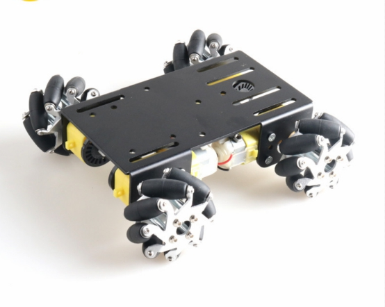 

| 名称          | 数量 | 名称   | 数量 |
| ------------- | ---- | ------ | ---- |
| 底盘          | 1    | TT电机 | 4    |
| TT电机码盘    | 4    | 麦轮   | 4    |
| M3*30十字螺丝 | 8    | M3螺母 | 8    |

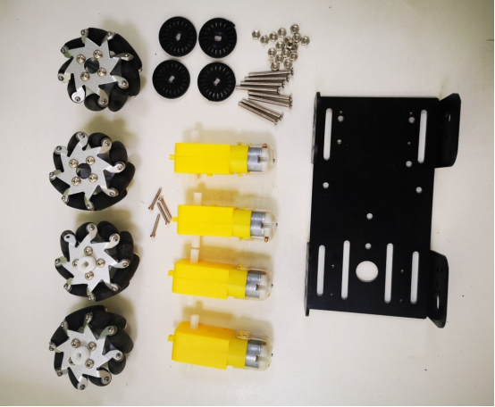 

## 2. 安装步骤

### 2.1 安装码盘

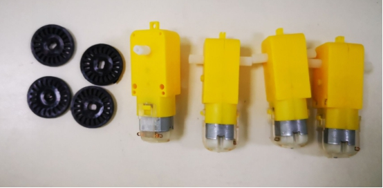 

注意:TT电机有2个不同的侧面，一面有凸起点，一面是光滑的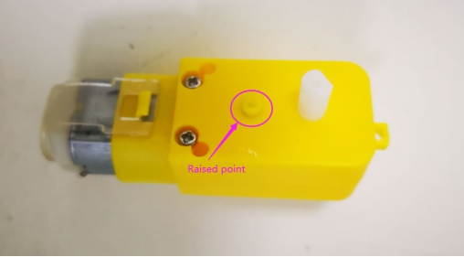

 

1) TT轮盘安装在光滑侧(无凸点侧)

 

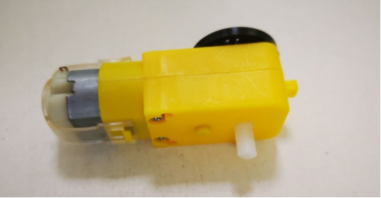 

2) 其他三个码盘安装方式一样

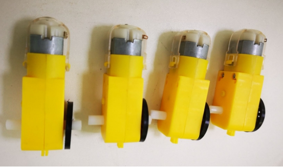 

### 2.2 安装TT电机和底盘

 

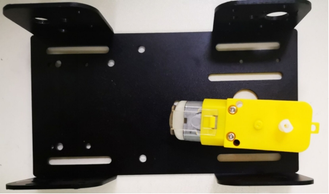 

 

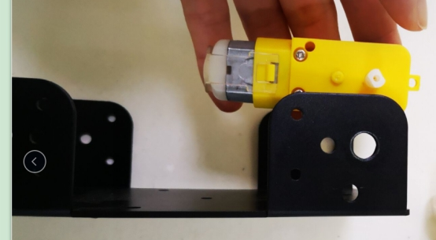 

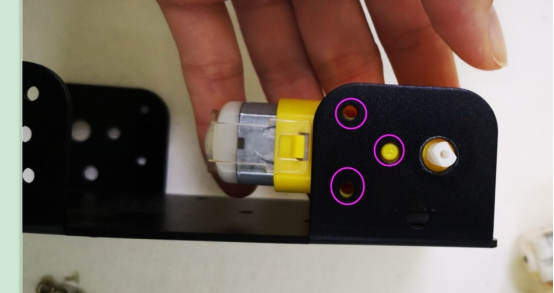 

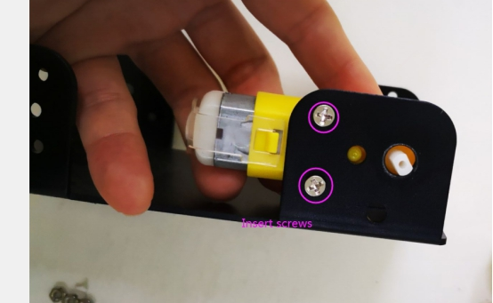 

 

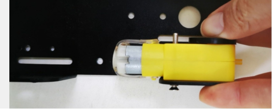 

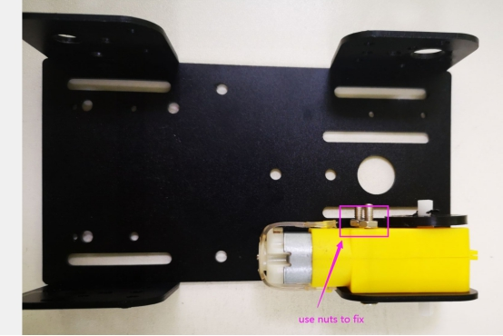 

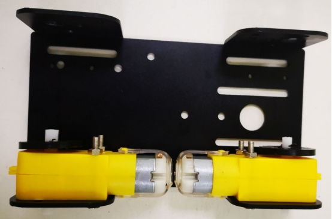 

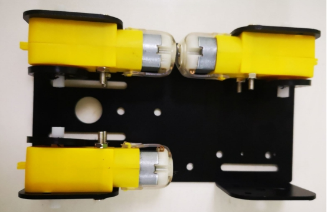 

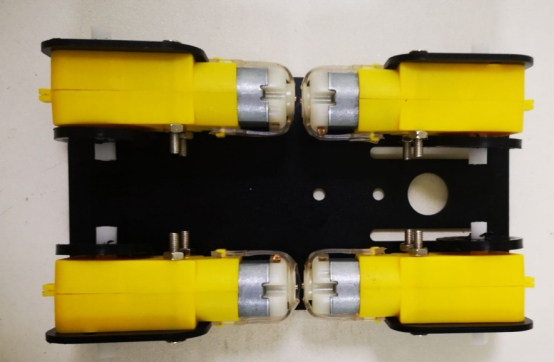 

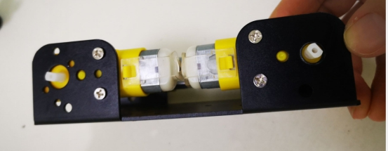 

注:请使用工具将螺母和螺钉拧紧

### 2.3 安装麦轮

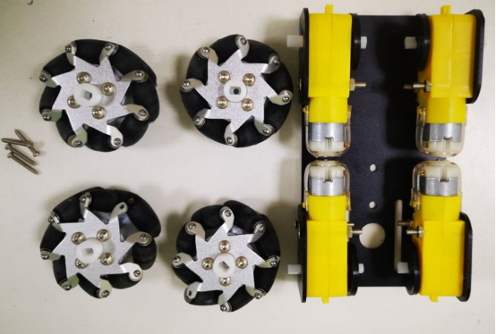 

 

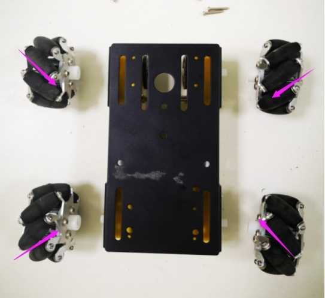 

注意：注意轮子的方向

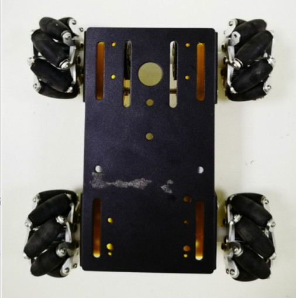 

用尖螺丝把轮子拧紧

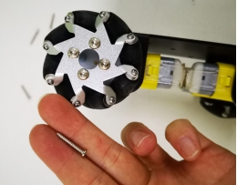 

 

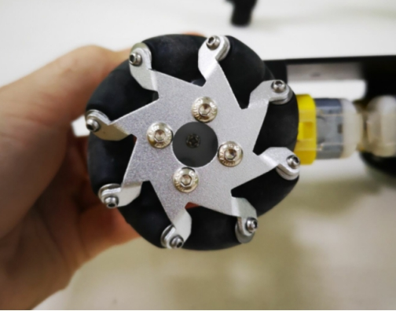 

完成!

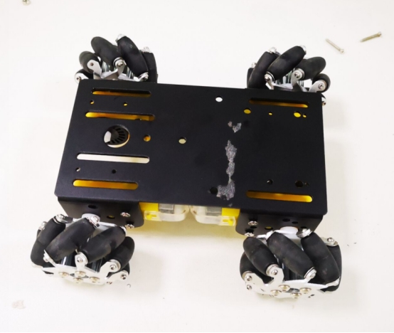 

## 支持与服务

| 四博智联资源                                        |                                                              |
| --------------------------------------------------- | ------------------------------------------------------------ |
| 官网                                                | [www.doit.am](http://www.doit.am/)                           |
| 教材                                                | [ESPDuino智慧物联开发宝典](https://item.taobao.com/item.htm?spm=a1z10.3-c.w4002-7420449993.9.Bgp1Ll&id=520583000610) |
| 购买                                                | [官方淘宝店](https://szdoit.taobao.com/)(szdoit.am)          |
| 讨论                                                | [技术论坛](http://bbs.doit.am/forum.php)(bbs.doit.am)        |
| 应用案例集锦                                        |                                                              |
| [Doit玩家云](http://wechat.doit.am)(wechat.doit.am) | [免费TCP公网调试服务](http://tcp.doit.am)(tcp.doit.am)       |
| 官方技术支持QQ群1/2/3群已满                         |                                                              |
| 技术支持群4                                         | 278888904                                                    |
| 技术支持群5                                         | 278888905                                                    |
| 术支持群6                                           | 278888906                                                    |
| 技术支持群7                                         | 278888907                                                    |
| 技术支持群8                                         | 278888908                                                    |
| 技术支持群9                                         | 278888909                                                    |
| 技术支持群10                                        | 278888900                                                    |