
 65mm麦克纳姆轮小车安装说明 

 From SZDOIT

## 1. 清单

 

 

| 名称          | 数量 | 名称   | 数量 |
| ------------- | ---- | ------ | ---- |
| 底盘          | 1    | TT电机 | 4    |
| TT电机码盘    | 4    | 麦轮   | 4    |
| M3*30十字螺丝 | 8    | M3螺母 | 8    |

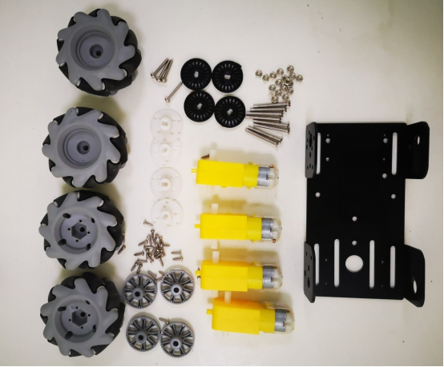 

## 2. 安装步骤

### 2.1 安装码盘

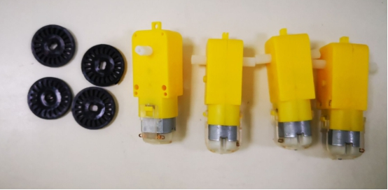 

注意:TT电机有2个不同的侧面，一面有凸起点，一面是光滑的

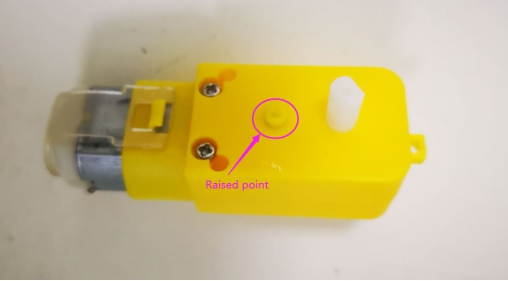 

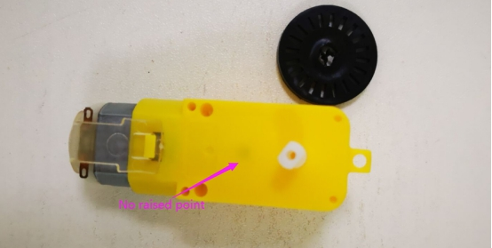 

1) TT轮盘安装在光滑侧(无凸点侧)

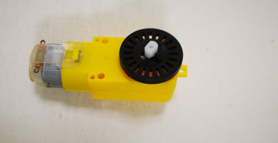 

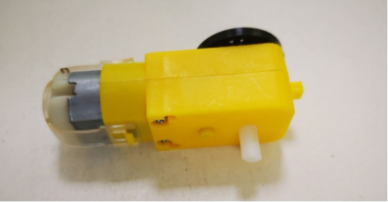 

2) 其他三个码盘安装方式一样

 

### 2.2 安装TT电机和底盘

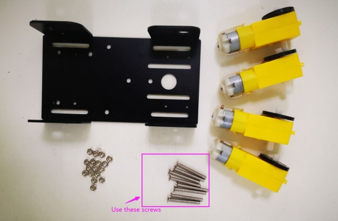 

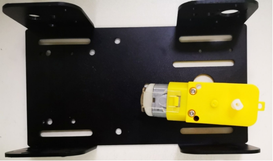 

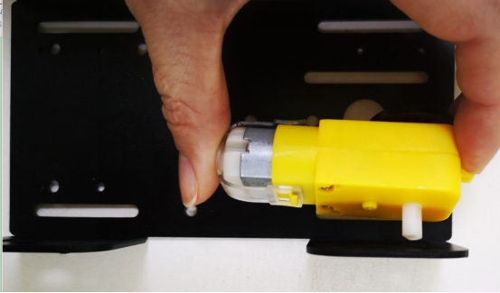 

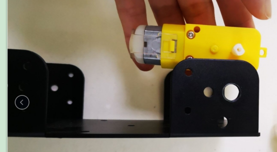 

 

 

 

 

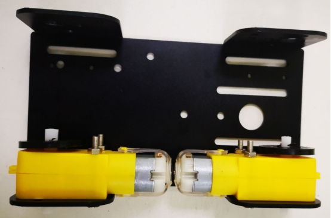 

 

 

 

注:请使用工具将螺母和螺钉拧紧

### 2.3 在车架上安装轮子

1) 安装车轮

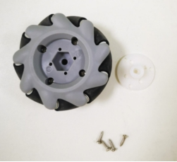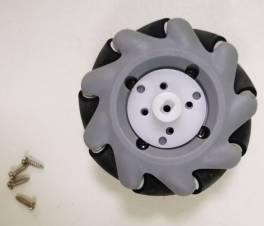 

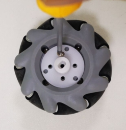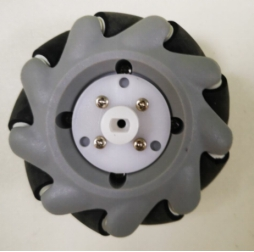 

1) 安装轮子到支架上

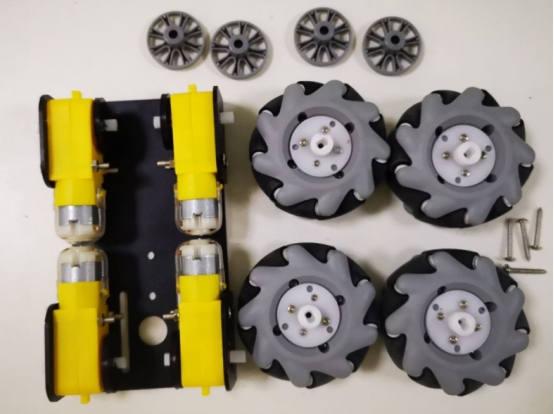 

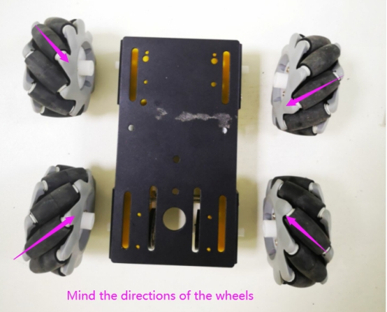 

注意:注意轮子的方向

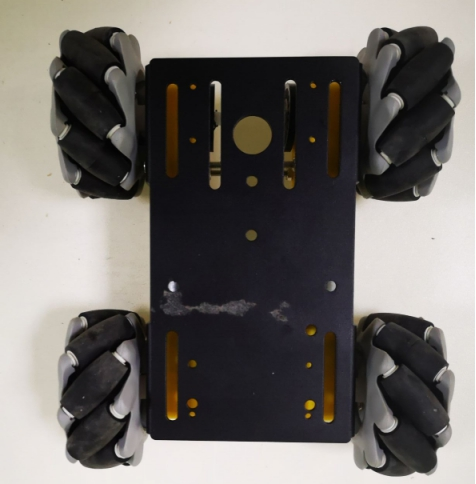 

 

2) 用尖头螺丝把轮子拧紧

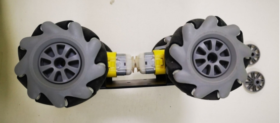 

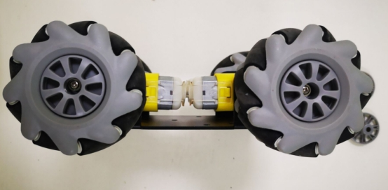 

完成!

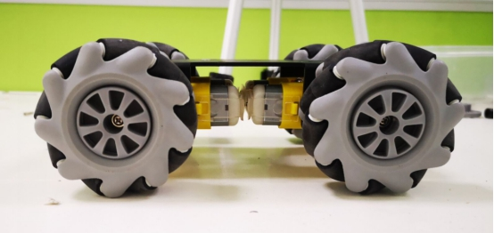 

## 更多资源，请关注公众号！

