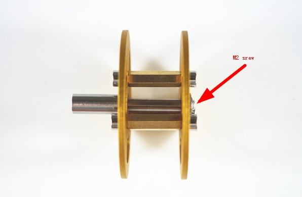
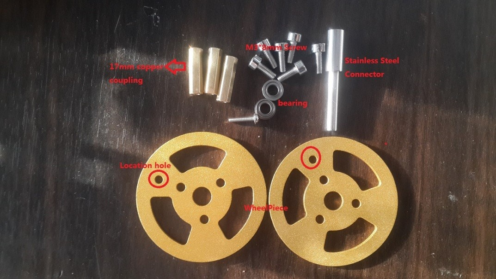
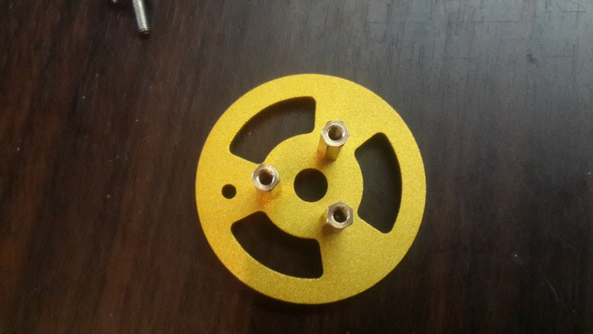
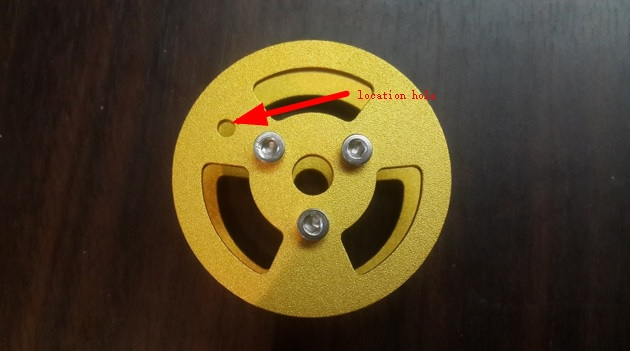
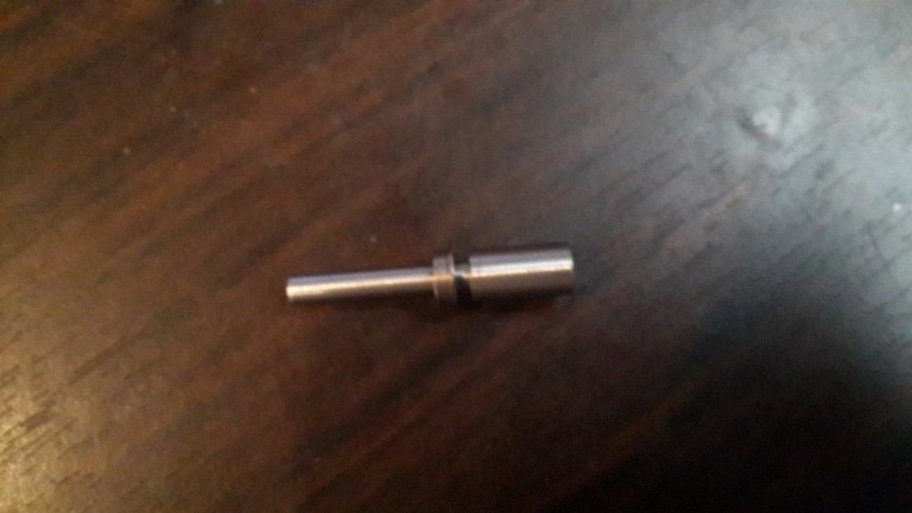

  坦克小车金属承重轮安装说明 

 from SZDOIT 

## 1. 介绍

 在本文档中，我们仅介绍T300坦克机箱的安装步骤，包括以下步骤，以及将电机连接到doit版本NodeMCU工具包。在这里，我们只是以T300为例来展示步骤，但是这个手册也适用于其他类型的坦克底盘。

## 2. 安装承重轮

### 2.1 材料清单

1)   17mm 铜柱: 3pcs; 

2)   M3*8 内六角螺丝: 6pcs;

3)   不锈钢联轴器: 1pcs;

4)   M2 螺丝: 1pcs;

5)   轴承: 2pcs;

6)   承重轮轮片: 2pcs. (安装时请对准定位孔).

如下图所示：

### 2.2 安装铜柱，连接两个轮片

首先，如图所示安装三个铜联轴器：

### 2.3  连接另一个承重轮

连接两个轮片时，请安装另一个轮片时对准定位孔。

### 2.4 在不锈钢连接器上安装一个轴承

### 2.5 完成轴承轮的安装

 用M2螺丝连接完成车轮安装。

### 2.6 轴承轮安装注意事项

1. 对准两轮片的定位孔;
2. M2螺丝要锁好不锈钢联轴器。
3. 当让轴承插入不锈钢连接器，也许你应该努力。

## 更多资源，请关注公众号！

